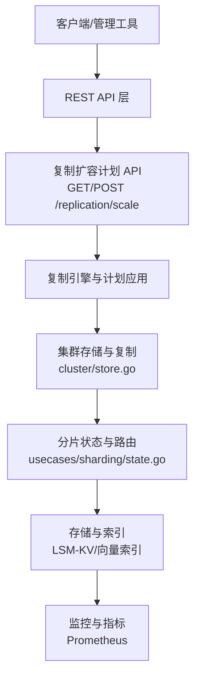
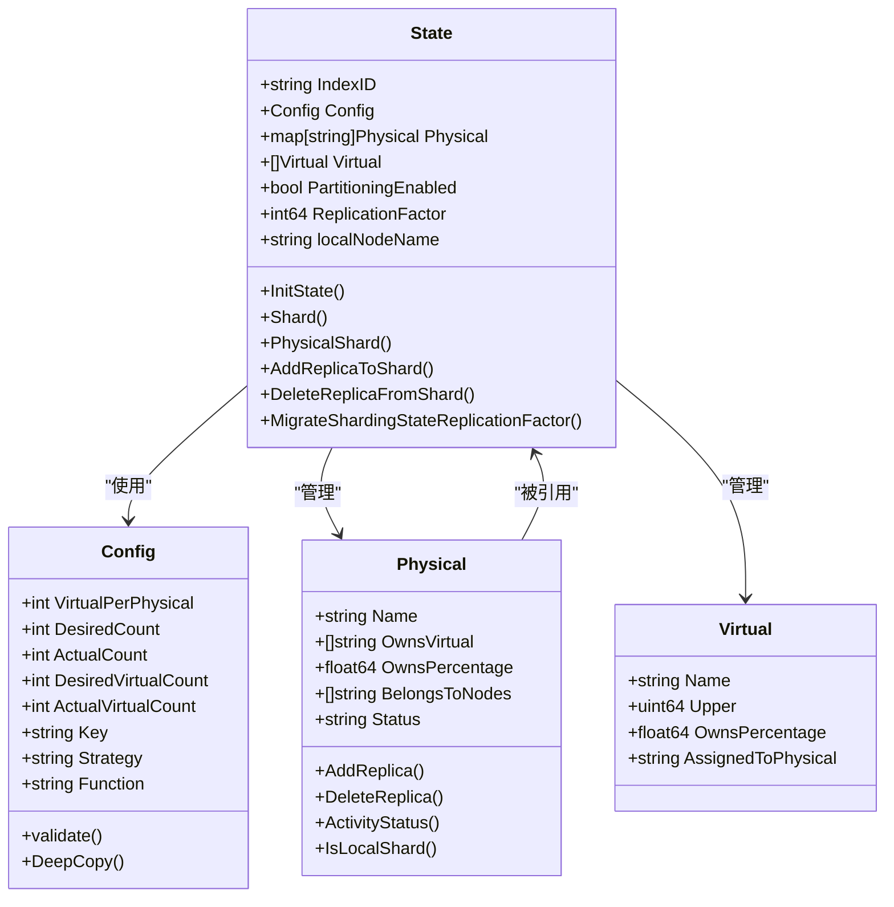
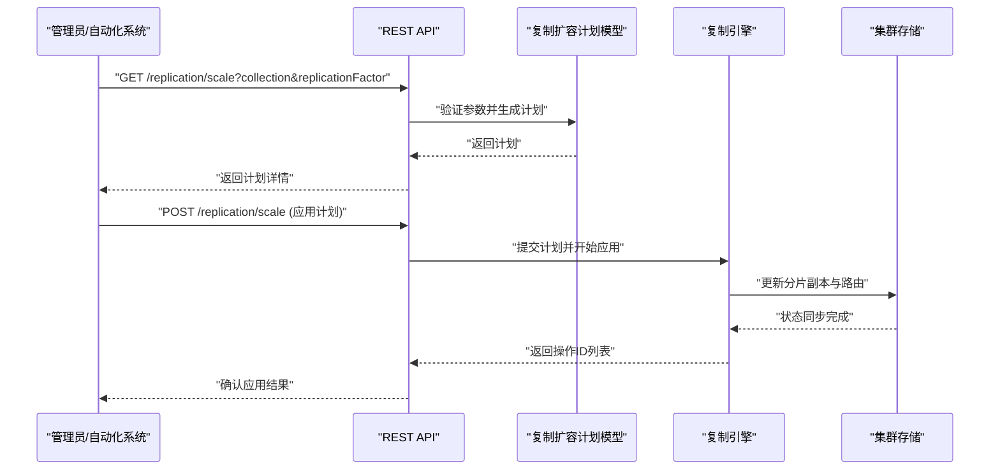
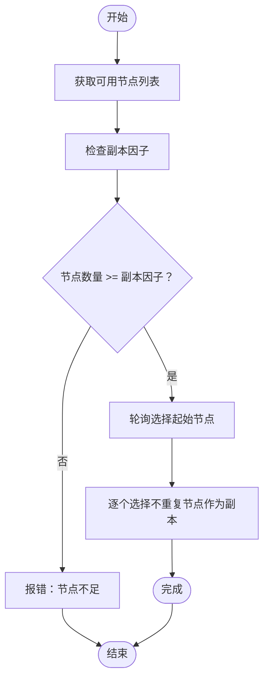
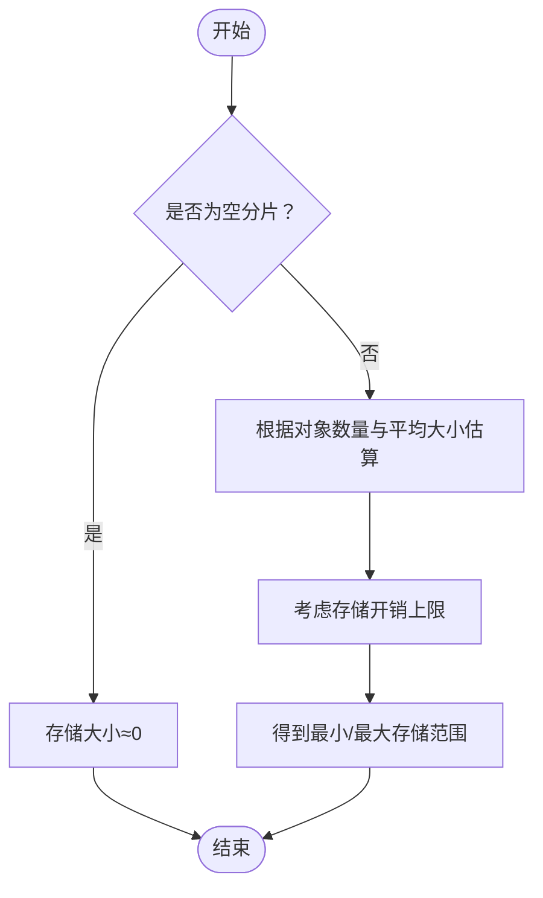
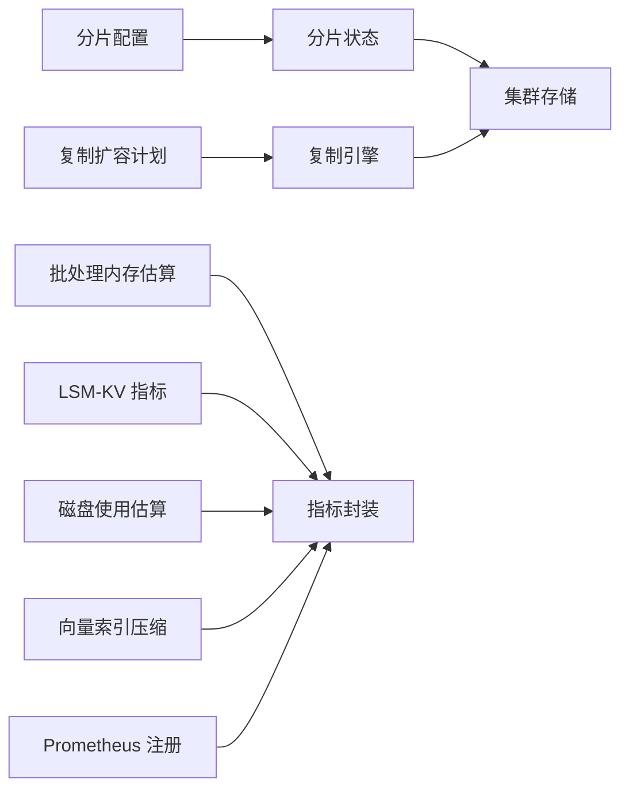

# 容量规划与扩容

<cite>
**本文引用的文件**
- [README.md](file://README.md)
- [usecases/sharding/config/config.go](file://usecases/sharding/config/config.go)
- [usecases/sharding/state.go](file://usecases/sharding/state.go)
- [adapters/repos/db/fakes_for_tests.go](file://adapters/repos/db/fakes_for_tests.go)
- [usecases/sharding/state_test.go](file://usecases/sharding/state_test.go)
- [entities/models/replication_scale_plan.go](file://entities/models/replication_scale_plan.go)
- [client/replication/get_replication_scale_plan_parameters.go](file://client/replication/get_replication_scale_plan_parameters.go)
- [client/replication/apply_replication_scale_plan_parameters.go](file://client/replication/apply_replication_scale_plan_parameters.go)
- [client/replication/apply_replication_scale_plan_responses.go](file://client/replication/apply_replication_scale_plan_responses.go)
- [adapters/handlers/rest/operations/replication/get_replication_scale_plan_parameters.go](file://adapters/handlers/rest/operations/replication/get_replication_scale_plan_parameters.go)
- [cluster/store.go](file://cluster/store.go)
- [adapters/repos/db/index_object_storage_test.go](file://adapters/repos/db/index_object_storage_test.go)
- [adapters/repos/db/batch.go](file://adapters/repos/db/batch.go)
- [adapters/repos/db/metrics.go](file://adapters/repos/db/metrics.go)
- [adapters/repos/db/lsmkv/metrics.go](file://adapters/repos/db/lsmkv/metrics.go)
- [usecases/monitoring/prometheus.go](file://usecases/monitoring/prometheus.go)
- [adapters/repos/db/resource_use.go](file://adapters/repos/db/resource_use.go)
- [adapters/repos/db/roaringset/buf_pool_test.go](file://adapters/repos/db/roaringset/buf_pool_test.go)
- [adapters/repos/db/vector/hnsw/index.go](file://adapters/repos/db/vector/hnsw/index.go)
- [adapters/repos/db/vector/hnsw/config_update_test.go](file://adapters/repos/db/vector/hnsw/config_update_test.go)
- [entities/vectorindex/hnsw/rq_config_test.go](file://entities/vectorindex/hnsw/rq_config_test.go)
</cite>

## 目录
1. [简介](#简介)
2. [项目结构](#项目结构)
3. [核心组件](#核心组件)
4. [架构总览](#架构总览)
5. [详细组件分析](#详细组件分析)
6. [依赖关系分析](#依赖关系分析)
7. [性能考量](#性能考量)
8. [故障排查指南](#故障排查指南)
9. [结论](#结论)
10. [附录](#附录)

## 简介
本文件面向系统架构师与运维经理，围绕 Weaviate 的容量规划与扩容提供专业级技术文档。内容覆盖数据增长预测、存储需求评估、计算资源规划；水平扩容策略（分片策略、负载均衡、数据分布算法）；垂直扩容方案（硬件升级、资源配置、性能优化）；集群规模规划（节点数量、网络带宽、存储容量）；弹性伸缩配置（自动扩缩容策略、触发条件、执行机制）；性能基准测试与容量测试工具；以及扩容风险评估与迁移策略。

## 项目结构
Weaviate 采用模块化与分层架构，核心扩容能力由“分片与复制”“集群与复制引擎”“指标与监控”等模块协同实现。与容量规划直接相关的模块包括：
- 分片与复制：负责逻辑分片、虚拟分片、物理分片、副本分配与一致性校验
- 集群与复制引擎：负责跨节点复制、复制计划生成与应用、复制状态管理
- 存储与对象：负责 LSM-KV 存储、向量索引、批处理与内存估算
- 指标与监控：负责 Prometheus 指标注册、查询耗时、LSM 操作统计

```mermaid
graph TB
subgraph "分片与复制"
SHCfg["分片配置<br/>usecases/sharding/config/config.go"]
SHState["分片状态<br/>usecases/sharding/state.go"]
FakeTenants["多租户分区示例<br/>adapters/repos/db/fakes_for_tests.go"]
end
subgraph "集群与复制引擎"
Store["集群存储与配置<br/>cluster/store.go"]
Plan["复制扩容计划模型<br/>entities/models/replication_scale_plan.go"]
ClientGet["获取扩容计划参数<br/>client/replication/get_replication_scale_plan_parameters.go"]
ClientApply["应用扩容计划参数/响应<br/>client/replication/apply_replication_scale_plan_parameters.go<br/>client/replication/apply_replication_scale_plan_responses.go"]
RESTGet["REST 参数绑定<br/>adapters/handlers/rest/operations/replication/get_replication_scale_plan_parameters.go"]
end
subgraph "存储与对象"
Batch["批处理内存估算<br/>adapters/repos/db/batch.go"]
LSMKV["LSM-KV 指标<br/>adapters/repos/db/lsmkv/metrics.go"]
Metrics["通用指标封装<br/>adapters/repos/db/metrics.go"]
ResUse["磁盘使用估算<br/>adapters/repos/db/resource_use.go"]
ObjTest["对象存储容量测试<br/>adapters/repos/db/index_object_storage_test.go"]
BufPool["缓冲区范围计算<br/>adapters/repos/db/roaringset/buf_pool_test.go"]
HNSW["向量索引压缩与升级<br/>adapters/repos/db/vector/hnsw/index.go"]
end
subgraph "监控"
Prom["Prometheus 初始化与注册<br/>usecases/monitoring/prometheus.go"]
end
SHCfg --> SHState
SHState --> Store
FakeTenants --> SHState
Plan --> ClientApply
ClientGet --> RESTGet
RESTGet --> Store
Batch --> Metrics
LSMKV --> Metrics
ResUse --> Metrics
HNSW --> Metrics
Prom --> Metrics
```

**图表来源**
- [usecases/sharding/config/config.go](file://usecases/sharding/config/config.go#L28-L51)
- [usecases/sharding/state.go](file://usecases/sharding/state.go#L34-L44)
- [adapters/repos/db/fakes_for_tests.go](file://adapters/repos/db/fakes_for_tests.go#L273-L290)
- [cluster/store.go](file://cluster/store.go#L68-L189)
- [entities/models/replication_scale_plan.go](file://entities/models/replication_scale_plan.go#L75-L130)
- [client/replication/get_replication_scale_plan_parameters.go](file://client/replication/get_replication_scale_plan_parameters.go#L82-L123)
- [client/replication/apply_replication_scale_plan_parameters.go](file://client/replication/apply_replication_scale_plan_parameters.go#L83-L123)
- [client/replication/apply_replication_scale_plan_responses.go](file://client/replication/apply_replication_scale_plan_responses.go#L123-L429)
- [adapters/handlers/rest/operations/replication/get_replication_scale_plan_parameters.go](file://adapters/handlers/rest/operations/replication/get_replication_scale_plan_parameters.go#L86-L145)
- [adapters/repos/db/batch.go](file://adapters/repos/db/batch.go#L300-L322)
- [adapters/repos/db/lsmkv/metrics.go](file://adapters/repos/db/lsmkv/metrics.go#L630-L658)
- [adapters/repos/db/metrics.go](file://adapters/repos/db/metrics.go#L76-L130)
- [adapters/repos/db/resource_use.go](file://adapters/repos/db/resource_use.go#L24-L43)
- [adapters/repos/db/index_object_storage_test.go](file://adapters/repos/db/index_object_storage_test.go#L49-L84)
- [adapters/repos/db/roaringset/buf_pool_test.go](file://adapters/repos/db/roaringset/buf_pool_test.go#L665-L728)
- [adapters/repos/db/vector/hnsw/index.go](file://adapters/repos/db/vector/hnsw/index.go#L890-L943)
- [usecases/monitoring/prometheus.go](file://usecases/monitoring/prometheus.go#L385-L424)

**章节来源**
- [README.md](file://README.md#L10-L128)

## 核心组件
- 分片配置与状态
  - 分片配置包含虚拟分片数、物理分片数、哈希策略与函数等关键参数，并提供默认值与校验逻辑
  - 分片状态负责初始化物理/虚拟分片映射、副本分配、一致性迁移与查询路由
- 复制扩容计划
  - 复制扩容计划模型定义了扩容动作、分片级别副本变更与计划 ID 校验
  - 客户端与 REST 层提供参数绑定与响应类型，支撑扩容计划的生成与应用
- 集群与复制引擎
  - 集群存储配置包含选举超时、快照阈值、消息大小限制、复制引擎工作线程等关键参数
- 存储与对象
  - 批处理内存估算、LSM-KV 指标、磁盘使用估算、对象存储容量测试、缓冲区范围计算、向量索引压缩与升级
- 监控
  - Prometheus 指标注册、查询耗时与 LSM 操作统计，便于容量与性能观测

**章节来源**
- [usecases/sharding/config/config.go](file://usecases/sharding/config/config.go#L28-L70)
- [usecases/sharding/state.go](file://usecases/sharding/state.go#L34-L44)
- [entities/models/replication_scale_plan.go](file://entities/models/replication_scale_plan.go#L75-L130)
- [client/replication/get_replication_scale_plan_parameters.go](file://client/replication/get_replication_scale_plan_parameters.go#L82-L123)
- [client/replication/apply_replication_scale_plan_parameters.go](file://client/replication/apply_replication_scale_plan_parameters.go#L83-L123)
- [client/replication/apply_replication_scale_plan_responses.go](file://client/replication/apply_replication_scale_plan_responses.go#L123-L429)
- [adapters/handlers/rest/operations/replication/get_replication_scale_plan_parameters.go](file://adapters/handlers/rest/operations/replication/get_replication_scale_plan_parameters.go#L86-L145)
- [cluster/store.go](file://cluster/store.go#L68-L189)
- [adapters/repos/db/batch.go](file://adapters/repos/db/batch.go#L300-L322)
- [adapters/repos/db/lsmkv/metrics.go](file://adapters/repos/db/lsmkv/metrics.go#L630-L658)
- [adapters/repos/db/metrics.go](file://adapters/repos/db/metrics.go#L76-L130)
- [adapters/repos/db/resource_use.go](file://adapters/repos/db/resource_use.go#L24-L43)
- [adapters/repos/db/index_object_storage_test.go](file://adapters/repos/db/index_object_storage_test.go#L49-L84)
- [adapters/repos/db/roaringset/buf_pool_test.go](file://adapters/repos/db/roaringset/buf_pool_test.go#L665-L728)
- [adapters/repos/db/vector/hnsw/index.go](file://adapters/repos/db/vector/hnsw/index.go#L890-L943)
- [usecases/monitoring/prometheus.go](file://usecases/monitoring/prometheus.go#L385-L424)

## 架构总览
Weaviate 的容量规划与扩容以“分片与复制”为核心，配合“集群与复制引擎”进行跨节点复制与状态同步，同时通过“存储与对象”模块承载数据与索引，最终由“监控”模块输出容量与性能指标。

**图表来源**
- [client/replication/apply_replication_scale_plan_parameters.go](file://client/replication/apply_replication_scale_plan_parameters.go#L83-L123)
- [client/replication/apply_replication_scale_plan_responses.go](file://client/replication/apply_replication_scale_plan_responses.go#L123-L429)
- [adapters/handlers/rest/operations/replication/get_replication_scale_plan_parameters.go](file://adapters/handlers/rest/operations/replication/get_replication_scale_plan_parameters.go#L86-L145)
- [cluster/store.go](file://cluster/store.go#L68-L189)
- [usecases/sharding/state.go](file://usecases/sharding/state.go#L34-L44)
- [adapters/repos/db/lsmkv/metrics.go](file://adapters/repos/db/lsmkv/metrics.go#L630-L658)
- [usecases/monitoring/prometheus.go](file://usecases/monitoring/prometheus.go#L385-L424)

## 详细组件分析

### 分片与复制配置
- 分片配置
  - 默认虚拟分片数、默认哈希策略与函数固定，确保一致性与可移植性
  - 支持解析 desiredCount、virtualPerPhysical、key、strategy、function 等字段
  - 校验仅支持 key="_id"、strategy="hash"、function="murmur3"
- 分片状态
  - 初始化物理分片与虚拟分片环，使用 Murmur3 令牌映射到物理分片
  - 支持副本增删、一致性迁移、分区模式下的租户分片管理
  - 提供路由函数 Shard/PhysicalShard 用于定位对象所在分片

**图表来源**
- [usecases/sharding/config/config.go](file://usecases/sharding/config/config.go#L28-L83)
- [usecases/sharding/state.go](file://usecases/sharding/state.go#L34-L147)
- [usecases/sharding/state.go](file://usecases/sharding/state.go#L286-L314)
- [usecases/sharding/state.go](file://usecases/sharding/state.go#L317-L343)

**章节来源**
- [usecases/sharding/config/config.go](file://usecases/sharding/config/config.go#L28-L70)
- [usecases/sharding/config/config.go](file://usecases/sharding/config/config.go#L85-L146)
- [usecases/sharding/state.go](file://usecases/sharding/state.go#L286-L343)
- [usecases/sharding/state.go](file://usecases/sharding/state.go#L421-L460)
- [usecases/sharding/state.go](file://usecases/sharding/state.go#L565-L620)

### 复制扩容计划与应用
- 计划模型
  - 包含 planId、shardScaleActions 等字段，并进行格式与必填校验
- 客户端与 REST
  - GET /replication/scale 支持 collection 与 replicationFactor 查询参数
  - POST /replication/scale 支持应用扩容计划，返回操作 ID 列表与集合名
- 错误响应
  - 400/404/500 等错误响应类型，便于上层处理

**图表来源**
- [client/replication/get_replication_scale_plan_parameters.go](file://client/replication/get_replication_scale_plan_parameters.go#L82-L123)
- [adapters/handlers/rest/operations/replication/get_replication_scale_plan_parameters.go](file://adapters/handlers/rest/operations/replication/get_replication_scale_plan_parameters.go#L86-L145)
- [entities/models/replication_scale_plan.go](file://entities/models/replication_scale_plan.go#L75-L130)
- [client/replication/apply_replication_scale_plan_parameters.go](file://client/replication/apply_replication_scale_plan_parameters.go#L83-L123)
- [client/replication/apply_replication_scale_plan_responses.go](file://client/replication/apply_replication_scale_plan_responses.go#L123-L429)

**章节来源**
- [entities/models/replication_scale_plan.go](file://entities/models/replication_scale_plan.go#L75-L130)
- [client/replication/get_replication_scale_plan_parameters.go](file://client/replication/get_replication_scale_plan_parameters.go#L82-L123)
- [adapters/handlers/rest/operations/replication/get_replication_scale_plan_parameters.go](file://adapters/handlers/rest/operations/replication/get_replication_scale_plan_parameters.go#L86-L145)
- [client/replication/apply_replication_scale_plan_parameters.go](file://client/replication/apply_replication_scale_plan_parameters.go#L83-L123)
- [client/replication/apply_replication_scale_plan_responses.go](file://client/replication/apply_replication_scale_plan_responses.go#L123-L429)

### 多租户分区与副本分配
- 多租户场景下，分区启用后按租户键进行分片，副本分配遵循轮询策略以保证均匀分布
- 测试用例验证了不同副本因子与节点数量下的分区分配行为

**图表来源**
- [adapters/repos/db/fakes_for_tests.go](file://adapters/repos/db/fakes_for_tests.go#L273-L290)
- [usecases/sharding/state_test.go](file://usecases/sharding/state_test.go#L194-L240)

**章节来源**
- [adapters/repos/db/fakes_for_tests.go](file://adapters/repos/db/fakes_for_tests.go#L273-L290)
- [usecases/sharding/state_test.go](file://usecases/sharding/state_test.go#L194-L240)

### 存储容量与对象大小估算
- 对象存储容量测试提供了空分片、小对象、中对象等场景的预期存储范围，可用于容量规划
- 批处理内存估算函数用于评估批量写入的内存占用，辅助垂直扩容规划

**图表来源**
- [adapters/repos/db/index_object_storage_test.go](file://adapters/repos/db/index_object_storage_test.go#L49-L84)
- [adapters/repos/db/batch.go](file://adapters/repos/db/batch.go#L300-L322)

**章节来源**
- [adapters/repos/db/index_object_storage_test.go](file://adapters/repos/db/index_object_storage_test.go#L49-L84)
- [adapters/repos/db/batch.go](file://adapters/repos/db/batch.go#L300-L322)

### 监控与指标
- Prometheus 指标注册与分组、查询耗时与 LSM 操作统计，支持容量与性能观测
- 指标封装在存储层与 LSM-KV 层，便于按类名与分片维度聚合

**章节来源**
- [usecases/monitoring/prometheus.go](file://usecases/monitoring/prometheus.go#L385-L424)
- [adapters/repos/db/metrics.go](file://adapters/repos/db/metrics.go#L76-L130)
- [adapters/repos/db/lsmkv/metrics.go](file://adapters/repos/db/lsmkv/metrics.go#L630-L658)

## 依赖关系分析
- 分片配置与状态
  - 分片配置提供默认值与校验，分片状态依赖配置进行初始化与路由
- 复制扩容计划
  - 客户端与 REST 层将请求转换为计划模型，复制引擎与集群存储负责应用与同步
- 存储与对象
  - 批处理与对象存储容量测试为容量规划提供数据依据，LSM-KV 指标与监控为性能观测提供支撑
- 监控
  - Prometheus 初始化与注册贯穿各层，统一指标口径

**图表来源**
- [usecases/sharding/config/config.go](file://usecases/sharding/config/config.go#L28-L83)
- [usecases/sharding/state.go](file://usecases/sharding/state.go#L34-L44)
- [cluster/store.go](file://cluster/store.go#L68-L189)
- [entities/models/replication_scale_plan.go](file://entities/models/replication_scale_plan.go#L75-L130)
- [adapters/repos/db/batch.go](file://adapters/repos/db/batch.go#L300-L322)
- [adapters/repos/db/lsmkv/metrics.go](file://adapters/repos/db/lsmkv/metrics.go#L630-L658)
- [adapters/repos/db/resource_use.go](file://adapters/repos/db/resource_use.go#L24-L43)
- [adapters/repos/db/vector/hnsw/index.go](file://adapters/repos/db/vector/hnsw/index.go#L890-L943)
- [usecases/monitoring/prometheus.go](file://usecases/monitoring/prometheus.go#L385-L424)

**章节来源**
- [usecases/sharding/config/config.go](file://usecases/sharding/config/config.go#L28-L83)
- [usecases/sharding/state.go](file://usecases/sharding/state.go#L34-L44)
- [cluster/store.go](file://cluster/store.go#L68-L189)
- [entities/models/replication_scale_plan.go](file://entities/models/replication_scale_plan.go#L75-L130)
- [adapters/repos/db/batch.go](file://adapters/repos/db/batch.go#L300-L322)
- [adapters/repos/db/lsmkv/metrics.go](file://adapters/repos/db/lsmkv/metrics.go#L630-L658)
- [adapters/repos/db/resource_use.go](file://adapters/repos/db/resource_use.go#L24-L43)
- [adapters/repos/db/vector/hnsw/index.go](file://adapters/repos/db/vector/hnsw/index.go#L890-L943)
- [usecases/monitoring/prometheus.go](file://usecases/monitoring/prometheus.go#L385-L424)

## 性能考量
- 分片与路由
  - 使用 Murmur3 哈希令牌映射，虚拟分片环保证均匀分布；副本因子越大，读取吞吐越高但写放大增加
- 存储与索引
  - LSM-KV 写放大与合并策略影响写入延迟；向量索引压缩（SQ/RQ/PQ）降低内存与存储占用，适度提升查询延迟
- 批处理与内存
  - 批处理内存估算有助于避免 OOM；缓冲区范围计算影响同步与刷盘节奏
- 监控与观测
  - 指标分组与关键桶位设置有助于识别瓶颈；查询耗时与 LSM 操作统计为容量与性能优化提供依据

**章节来源**
- [usecases/sharding/state.go](file://usecases/sharding/state.go#L565-L620)
- [adapters/repos/db/vector/hnsw/index.go](file://adapters/repos/db/vector/hnsw/index.go#L890-L943)
- [adapters/repos/db/batch.go](file://adapters/repos/db/batch.go#L300-L322)
- [adapters/repos/db/roaringset/buf_pool_test.go](file://adapters/repos/db/roaringset/buf_pool_test.go#L665-L728)
- [adapters/repos/db/lsmkv/metrics.go](file://adapters/repos/db/lsmkv/metrics.go#L630-L658)
- [usecases/monitoring/prometheus.go](file://usecases/monitoring/prometheus.go#L385-L424)

## 故障排查指南
- 分片状态一致性
  - 若副本因子不一致或缺少副本，会触发一致性校验错误；需检查分片状态迁移与副本分配
- 节点不足
  - 副本因子大于可用节点数时，初始化或调整副本会失败；需先扩容节点再调整副本
- 复制扩容计划
  - 应用失败可能返回 400/404/500 错误；需核对计划参数与集群状态
- 存储容量
  - 磁盘使用率过高或对象存储容量异常，需结合对象存储容量测试与批处理估算进行排查

**章节来源**
- [usecases/sharding/state.go](file://usecases/sharding/state.go#L61-L109)
- [usecases/sharding/state.go](file://usecases/sharding/state.go#L286-L314)
- [client/replication/apply_replication_scale_plan_responses.go](file://client/replication/apply_replication_scale_plan_responses.go#L123-L429)
- [adapters/repos/db/resource_use.go](file://adapters/repos/db/resource_use.go#L24-L43)
- [adapters/repos/db/index_object_storage_test.go](file://adapters/repos/db/index_object_storage_test.go#L49-L84)

## 结论
Weaviate 的容量规划与扩容以“分片与复制”为核心，结合“集群与复制引擎”“存储与对象”“监控”三大支柱，形成从数据分布、副本管理到性能观测的完整闭环。通过合理的分片配置、副本因子与节点规模规划，辅以容量测试与监控指标，可有效支撑大规模向量检索场景的稳定运行与弹性伸缩。

## 附录
- 参考资料与部署说明可参考项目自述文件中的部署与功能介绍。

**章节来源**
- [README.md](file://README.md#L10-L128)