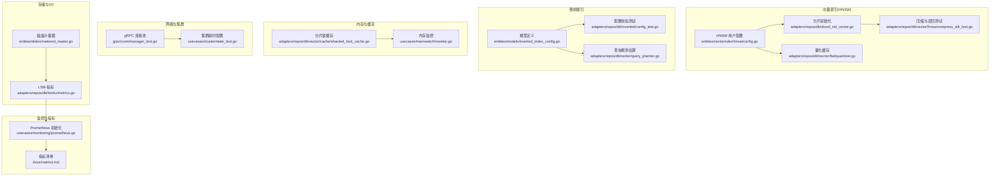
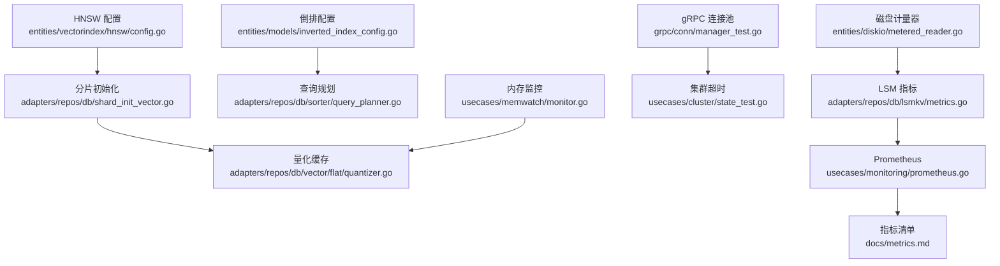
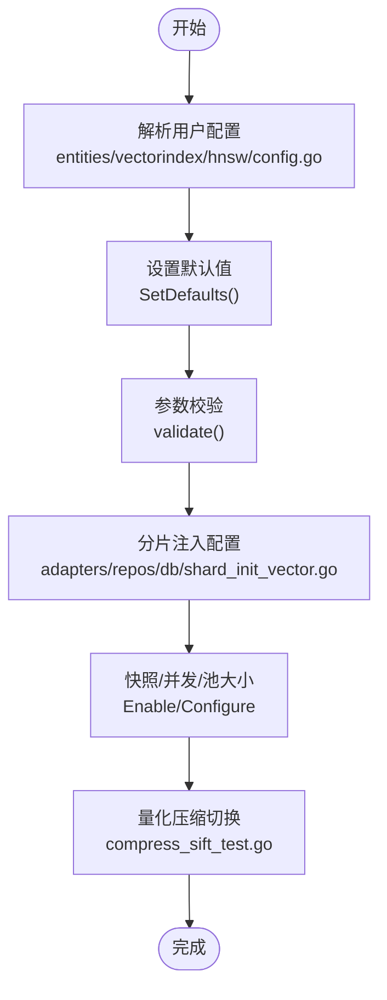
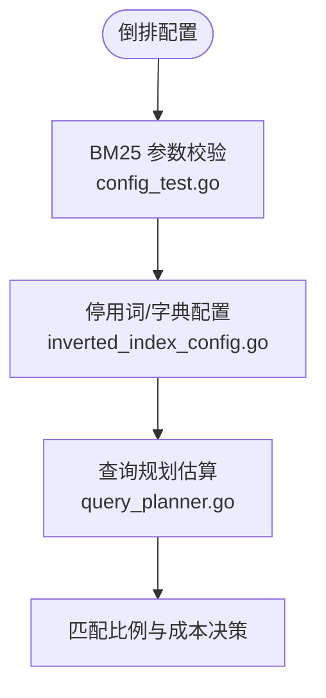
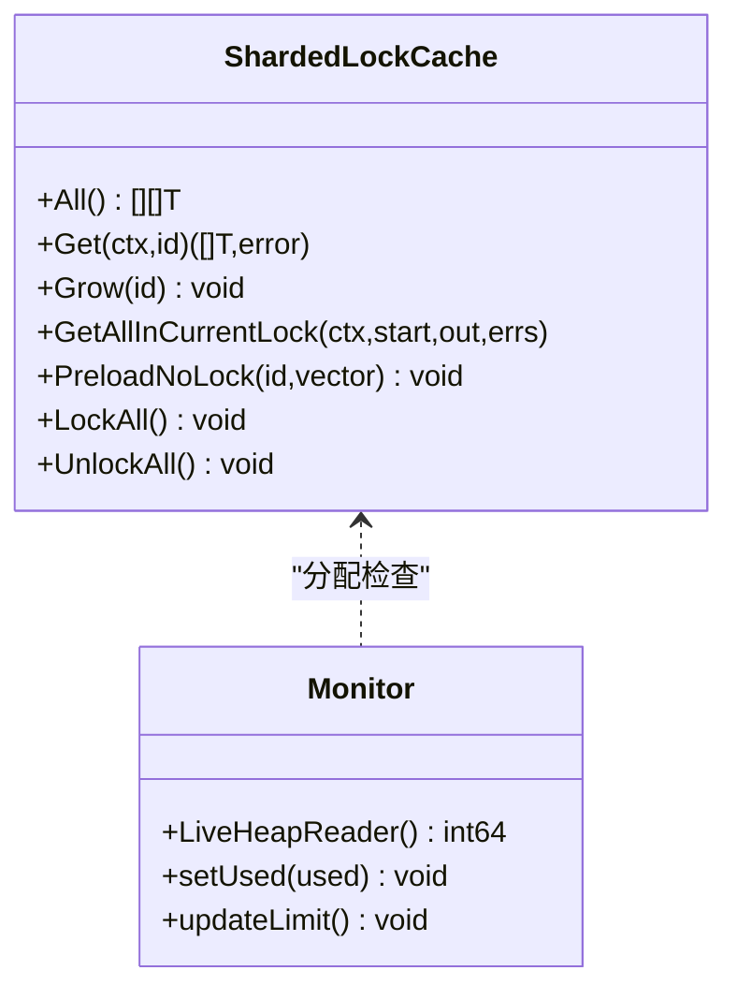
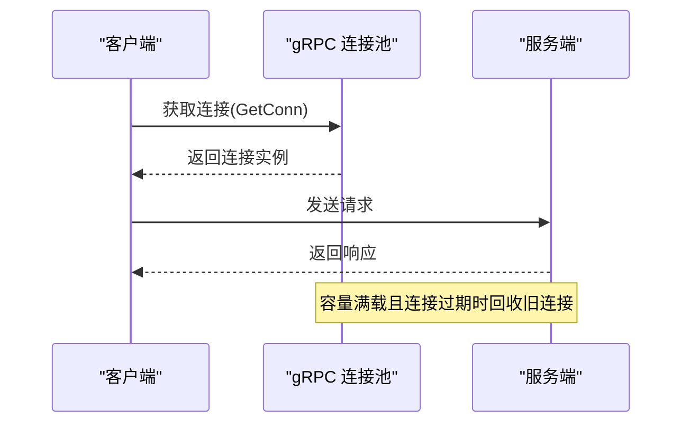
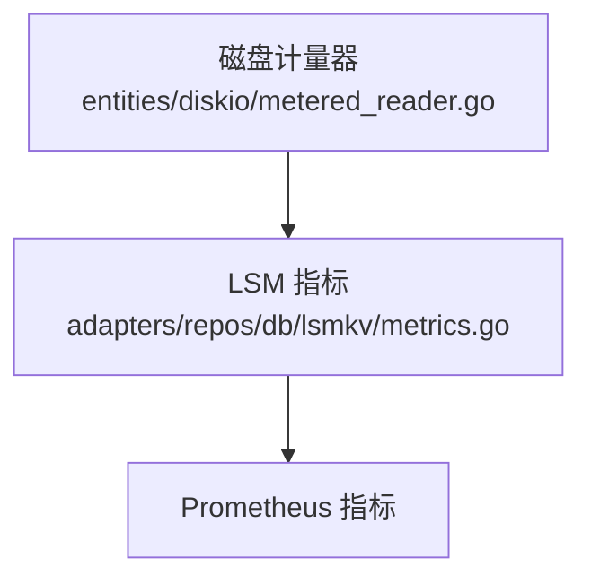
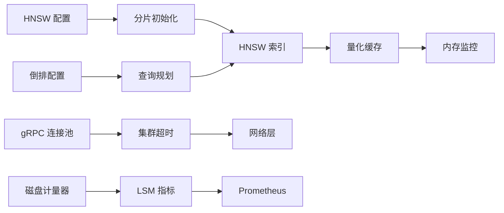

# 性能调优

<cite>
**本文引用的文件**   
- [entities/vectorindex/hnsw/config.go](file://entities/vectorindex/hnsw/config.go)
- [adapters/repos/db/vector/hnsw/config.go](file://adapters/repos/db/vector/hnsw/config.go)
- [adapters/repos/db/shard_init_vector.go](file://adapters/repos/db/shard_init_vector.go)
- [adapters/repos/db/vector/hnsw/compress_sift_test.go](file://adapters/repos/db/vector/hnsw/compress_sift_test.go)
- [adapters/repos/db/vector/flat/quantizer.go](file://adapters/repos/db/vector/flat/quantizer.go)
- [adapters/repos/db/vector/cache/sharded_lock_cache.go](file://adapters/repos/db/vector/cache/sharded_lock_cache.go)
- [usecases/memwatch/monitor.go](file://usecases/memwatch/monitor.go)
- [adapters/repos/db/inverted/config_test.go](file://adapters/repos/db/inverted/config_test.go)
- [entities/models/inverted_index_config.go](file://entities/models/inverted_index_config.go)
- [adapters/repos/db/sorter/query_planner.go](file://adapters/repos/db/sorter/query_planner.go)
- [usecases/monitoring/prometheus.go](file://usecases/monitoring/prometheus.go)
- [adapters/repos/db/lsmkv/metrics.go](file://adapters/repos/db/lsmkv/metrics.go)
- [grpc/conn/manager_test.go](file://grpc/conn/manager_test.go)
- [usecases/cluster/state_test.go](file://usecases/cluster/state_test.go)
- [docs/metrics.md](file://docs/metrics.md)
- [adapters/handlers/rest/configure_api.go](file://adapters/handlers/rest/configure_api.go)
- [adapters/repos/db/vector/hnsw/insert_test.go](file://adapters/repos/db/vector/hnsw/insert_test.go)
- [adapters/repos/db/vector/hnsw/packedconn/connections_test.go](file://adapters/repos/db/vector/hnsw/packedconn/connections_test.go)
- [entities/diskio/metered_reader.go](file://entities/diskio/metered_reader.go)
- [usecases/modulecomponents/usage/base_module.go](file://usecases/modulecomponents/usage/base_module.go)
</cite>

## 目录
1. 引言
2. 项目结构
3. 核心组件
4. 架构总览
5. 详细组件分析
6. 依赖关系分析
7. 性能考量
8. 故障排查指南
9. 结论
10. 附录

## 引言
本技术文档面向性能工程师与系统管理员，围绕 Weaviate 在向量检索、倒排索引、内存管理、网络与存储等方面的性能调优提供系统化指南。内容覆盖参数调优策略、量化压缩技术、缓存与内存泄漏防护、连接池与超时配置、磁盘 I/O 优化、查询性能优化、监控指标分析与瓶颈定位、基准测试与自动化测试工具等。

## 项目结构
Weaviate 的性能相关能力主要分布在以下模块：
- 向量索引（HNSW）：用户配置解析、默认值、校验、量化压缩、并发与快照策略
- 倒排索引（BM25/WAND）：配置校验、清理间隔、停用词与分词字典
- 内存与缓存：向量缓存、分配监控、最大映射数限制
- 网络与集群：gRPC 连接池、超时与集群配置
- 存储与 I/O：LSM 指标、磁盘计量器
- 监控与指标：Prometheus 指标注册、分类与使用建议
- 查询规划：匹配率估算与排序成本评估

**图表来源**
- [entities/vectorindex/hnsw/config.go](file://entities/vectorindex/hnsw/config.go#L47-L136)
- [adapters/repos/db/shard_init_vector.go](file://adapters/repos/db/shard_init_vector.go#L122-L141)
- [adapters/repos/db/vector/hnsw/compress_sift_test.go](file://adapters/repos/db/vector/hnsw/compress_sift_test.go#L444-L483)
- [adapters/repos/db/vector/flat/quantizer.go](file://adapters/repos/db/vector/flat/quantizer.go#L212-L224)
- [entities/models/inverted_index_config.go](file://entities/models/inverted_index_config.go#L31-L56)
- [adapters/repos/db/inverted/config_test.go](file://adapters/repos/db/inverted/config_test.go#L35-L58)
- [adapters/repos/db/sorter/query_planner.go](file://adapters/repos/db/sorter/query_planner.go#L102-L122)
- [adapters/repos/db/vector/cache/sharded_lock_cache.go](file://adapters/repos/db/vector/cache/sharded_lock_cache.go#L88-L130)
- [usecases/memwatch/monitor.go](file://usecases/memwatch/monitor.go#L236-L282)
- [grpc/conn/manager_test.go](file://grpc/conn/manager_test.go#L295-L354)
- [usecases/cluster/state_test.go](file://usecases/cluster/state_test.go#L376-L419)
- [adapters/repos/db/lsmkv/metrics.go](file://adapters/repos/db/lsmkv/metrics.go#L103-L126)
- [entities/diskio/metered_reader.go](file://entities/diskio/metered_reader.go#L1-L68)
- [usecases/monitoring/prometheus.go](file://usecases/monitoring/prometheus.go#L385-L424)
- [docs/metrics.md](file://docs/metrics.md#L40-L125)

**章节来源**
- [entities/vectorindex/hnsw/config.go](file://entities/vectorindex/hnsw/config.go#L24-L136)
- [adapters/repos/db/shard_init_vector.go](file://adapters/repos/db/shard_init_vector.go#L122-L141)
- [adapters/repos/db/vector/hnsw/compress_sift_test.go](file://adapters/repos/db/vector/hnsw/compress_sift_test.go#L444-L483)
- [adapters/repos/db/vector/flat/quantizer.go](file://adapters/repos/db/vector/flat/quantizer.go#L212-L224)
- [entities/models/inverted_index_config.go](file://entities/models/inverted_index_config.go#L31-L56)
- [adapters/repos/db/inverted/config_test.go](file://adapters/repos/db/inverted/config_test.go#L35-L58)
- [adapters/repos/db/sorter/query_planner.go](file://adapters/repos/db/sorter/query_planner.go#L102-L122)
- [adapters/repos/db/vector/cache/sharded_lock_cache.go](file://adapters/repos/db/vector/cache/sharded_lock_cache.go#L88-L130)
- [usecases/memwatch/monitor.go](file://usecases/memwatch/monitor.go#L236-L282)
- [grpc/conn/manager_test.go](file://grpc/conn/manager_test.go#L295-L354)
- [usecases/cluster/state_test.go](file://usecases/cluster/state_test.go#L376-L419)
- [adapters/repos/db/lsmkv/metrics.go](file://adapters/repos/db/lsmkv/metrics.go#L103-L126)
- [entities/diskio/metered_reader.go](file://entities/diskio/metered_reader.go#L1-L68)
- [usecases/monitoring/prometheus.go](file://usecases/monitoring/prometheus.go#L385-L424)
- [docs/metrics.md](file://docs/metrics.md#L40-L125)

## 核心组件
- HNSW 用户配置与默认值：包含最大连接数、构造与查询参数、动态 EF、过滤策略、多向量聚合、量化开关与段数等
- 分片初始化中的 HNSW 配置注入：将全局配置映射到分片级 HNSW 实例，启用快照、并发搜索、访问列表池大小等
- 压缩与召回测试：演示在不同阶段开启 PQ/SQ/RQ/BQ 的构建与增量插入流程
- 量化缓存：按数据类型（uint64/byte）提供分片锁缓存，支持预加载与全量迭代
- 倒排索引配置：BM25 参数校验、清理间隔、停用词与自定义分词字典、WAND 开关
- 查询规划：基于对象总数与允许集合估算匹配比例，辅助成本决策
- 内存监控：最大映射数读取、实时堆内存读取、限制更新
- gRPC 连接池：最大连接数、过期回收、并发获取一致性
- 集群超时配置：LAN/WAN/LOCAL 默认超时、怀疑倍数、死节点回收时间
- LSM 指标：段数量、memtable 大小、读写延迟与失败计数
- 磁盘计量器：读写回调统计，便于观测 I/O 负载
- Prometheus 指标：指标注册、分组与关键桶配置
- 指标清单：Dashboard/Operational/Alerting/Analytical 分类与标签基数指导

**章节来源**
- [entities/vectorindex/hnsw/config.go](file://entities/vectorindex/hnsw/config.go#L47-L136)
- [adapters/repos/db/shard_init_vector.go](file://adapters/repos/db/shard_init_vector.go#L122-L141)
- [adapters/repos/db/vector/hnsw/compress_sift_test.go](file://adapters/repos/db/vector/hnsw/compress_sift_test.go#L444-L483)
- [adapters/repos/db/vector/flat/quantizer.go](file://adapters/repos/db/vector/flat/quantizer.go#L212-L224)
- [entities/models/inverted_index_config.go](file://entities/models/inverted_index_config.go#L31-L56)
- [adapters/repos/db/inverted/config_test.go](file://adapters/repos/db/inverted/config_test.go#L35-L58)
- [adapters/repos/db/sorter/query_planner.go](file://adapters/repos/db/sorter/query_planner.go#L102-L122)
- [usecases/memwatch/monitor.go](file://usecases/memwatch/monitor.go#L236-L282)
- [grpc/conn/manager_test.go](file://grpc/conn/manager_test.go#L295-L354)
- [usecases/cluster/state_test.go](file://usecases/cluster/state_test.go#L376-L419)
- [adapters/repos/db/lsmkv/metrics.go](file://adapters/repos/db/lsmkv/metrics.go#L103-L126)
- [entities/diskio/metered_reader.go](file://entities/diskio/metered_reader.go#L1-L68)
- [usecases/monitoring/prometheus.go](file://usecases/monitoring/prometheus.go#L385-L424)
- [docs/metrics.md](file://docs/metrics.md#L40-L125)

## 架构总览
下图展示性能相关子系统的交互关系：配置层（HNSW/倒排）驱动索引与查询路径，缓存与内存监控保障运行稳定性，网络层负责跨节点通信，存储层提供 LSM 指标与 I/O 观测，监控层统一暴露指标。

**图表来源**
- [entities/vectorindex/hnsw/config.go](file://entities/vectorindex/hnsw/config.go#L47-L136)
- [adapters/repos/db/shard_init_vector.go](file://adapters/repos/db/shard_init_vector.go#L122-L141)
- [adapters/repos/db/vector/flat/quantizer.go](file://adapters/repos/db/vector/flat/quantizer.go#L212-L224)
- [entities/models/inverted_index_config.go](file://entities/models/inverted_index_config.go#L31-L56)
- [adapters/repos/db/sorter/query_planner.go](file://adapters/repos/db/sorter/query_planner.go#L102-L122)
- [usecases/memwatch/monitor.go](file://usecases/memwatch/monitor.go#L236-L282)
- [grpc/conn/manager_test.go](file://grpc/conn/manager_test.go#L295-L354)
- [usecases/cluster/state_test.go](file://usecases/cluster/state_test.go#L376-L419)
- [adapters/repos/db/lsmkv/metrics.go](file://adapters/repos/db/lsmkv/metrics.go#L103-L126)
- [entities/diskio/metered_reader.go](file://entities/diskio/metered_reader.go#L1-L68)
- [usecases/monitoring/prometheus.go](file://usecases/monitoring/prometheus.go#L385-L424)
- [docs/metrics.md](file://docs/metrics.md#L40-L125)

## 详细组件分析

### HNSW 参数与量化调优
- 关键参数
  - 最大连接数、构造与查询参数、动态 EF 范围与因子、过滤策略（Acorn/Sweeping）、扁平搜索阈值、向量缓存上限、多向量聚合与 MUVERA 配置
  - 量化压缩：PQ（段数、编码器类型与分布、训练上限）、SQ（训练与重打分上限）、RQ（位宽与重打分上限）、BQ（二进制量化）
- 默认量化策略与环境变量
  - 支持根据压缩类型自动启用默认量化，并可跳过默认量化与跟踪标记
  - 可通过环境变量选择过滤策略
- 分片初始化注入
  - 将全局配置映射到分片级 HNSW，启用快照、并发搜索、访问列表池大小、异步索引等
- 压缩与召回测试
  - 展示在不同阶段开启 PQ/SQ/RQ/BQ 的构建与增量插入流程，便于评估压缩带来的吞吐与延迟变化

**图表来源**
- [entities/vectorindex/hnsw/config.go](file://entities/vectorindex/hnsw/config.go#L84-L136)
- [entities/vectorindex/hnsw/config.go](file://entities/vectorindex/hnsw/config.go#L260-L319)
- [adapters/repos/db/shard_init_vector.go](file://adapters/repos/db/shard_init_vector.go#L122-L141)
- [adapters/repos/db/vector/hnsw/compress_sift_test.go](file://adapters/repos/db/vector/hnsw/compress_sift_test.go#L444-L483)

**章节来源**
- [entities/vectorindex/hnsw/config.go](file://entities/vectorindex/hnsw/config.go#L47-L136)
- [entities/vectorindex/hnsw/config.go](file://entities/vectorindex/hnsw/config.go#L334-L365)
- [adapters/repos/db/shard_init_vector.go](file://adapters/repos/db/shard_init_vector.go#L122-L141)
- [adapters/repos/db/vector/hnsw/compress_sift_test.go](file://adapters/repos/db/vector/hnsw/compress_sift_test.go#L444-L483)

### 倒排索引配置与查询规划
- 配置项
  - BM25.k1、BM25.b 边界校验、清理间隔、空值/属性长度/时间戳索引、停用词、自定义分词字典、BlockMax WAND 开关
- 查询规划
  - 基于对象总数与允许集合估算匹配比例，辅助成本决策与排序策略选择

**图表来源**
- [adapters/repos/db/inverted/config_test.go](file://adapters/repos/db/inverted/config_test.go#L35-L58)
- [entities/models/inverted_index_config.go](file://entities/models/inverted_index_config.go#L31-L56)
- [adapters/repos/db/sorter/query_planner.go](file://adapters/repos/db/sorter/query_planner.go#L102-L122)

**章节来源**
- [adapters/repos/db/inverted/config_test.go](file://adapters/repos/db/inverted/config_test.go#L35-L58)
- [entities/models/inverted_index_config.go](file://entities/models/inverted_index_config.go#L31-L56)
- [adapters/repos/db/sorter/query_planner.go](file://adapters/repos/db/sorter/query_planner.go#L102-L122)

### 内存管理与缓存优化
- 向量缓存
  - 分片锁缓存支持 uint64/byte 两种数据类型，提供全量遍历、预加载、分页迭代与加锁/解锁操作
- 内存监控
  - 读取最大映射数、实时堆内存、限制更新，Linux 下按比例留余量
- 缓存策略建议
  - 根据向量维度与对象规模设置缓存上限，结合并发搜索与访问列表池大小平衡内存占用与查询延迟

**图表来源**
- [adapters/repos/db/vector/cache/sharded_lock_cache.go](file://adapters/repos/db/vector/cache/sharded_lock_cache.go#L88-L130)
- [adapters/repos/db/vector/flat/quantizer.go](file://adapters/repos/db/vector/flat/quantizer.go#L212-L224)
- [usecases/memwatch/monitor.go](file://usecases/memwatch/monitor.go#L236-L282)

**章节来源**
- [adapters/repos/db/vector/cache/sharded_lock_cache.go](file://adapters/repos/db/vector/cache/sharded_lock_cache.go#L88-L130)
- [adapters/repos/db/vector/flat/quantizer.go](file://adapters/repos/db/vector/flat/quantizer.go#L212-L224)
- [usecases/memwatch/monitor.go](file://usecases/memwatch/monitor.go#L236-L282)

### 网络与集群配置优化
- gRPC 连接池
  - 并发获取连接实例一致性、容量满载时过期连接回收、超时后关闭旧连接
- 集群超时配置
  - LAN/WAN/LOCAL 默认 TCP 超时、怀疑倍数、死节点回收时间，依据部署场景调整

**图表来源**
- [grpc/conn/manager_test.go](file://grpc/conn/manager_test.go#L295-L354)
- [usecases/cluster/state_test.go](file://usecases/cluster/state_test.go#L376-L419)

**章节来源**
- [grpc/conn/manager_test.go](file://grpc/conn/manager_test.go#L295-L354)
- [usecases/cluster/state_test.go](file://usecases/cluster/state_test.go#L376-L419)

### 存储与 I/O 优化
- LSM 指标
  - 段数量、memtable 大小、读写延迟与失败计数、游标打开/持续/失败/耗时
- 磁盘计量器
  - 读写回调统计，便于观测吞吐与延迟

**图表来源**
- [adapters/repos/db/lsmkv/metrics.go](file://adapters/repos/db/lsmkv/metrics.go#L103-L126)
- [entities/diskio/metered_reader.go](file://entities/diskio/metered_reader.go#L1-L68)
- [usecases/monitoring/prometheus.go](file://usecases/monitoring/prometheus.go#L385-L424)

**章节来源**
- [adapters/repos/db/lsmkv/metrics.go](file://adapters/repos/db/lsmkv/metrics.go#L103-L126)
- [entities/diskio/metered_reader.go](file://entities/diskio/metered_reader.go#L1-L68)
- [usecases/monitoring/prometheus.go](file://usecases/monitoring/prometheus.go#L385-L424)

## 依赖关系分析
- HNSW 配置与分片初始化强耦合：分片初始化负责将全局配置映射到具体实例
- 量化缓存依赖内存监控进行分配检查，防止缓存膨胀导致 OOM
- 倒排配置与查询规划相互作用：配置决定查询执行策略，规划估算影响成本
- gRPC 连接池与集群超时共同决定网络层稳定性与延迟
- LSM 指标与磁盘计量器共同构成存储层可观测性基础

**图表来源**
- [entities/vectorindex/hnsw/config.go](file://entities/vectorindex/hnsw/config.go#L47-L136)
- [adapters/repos/db/shard_init_vector.go](file://adapters/repos/db/shard_init_vector.go#L122-L141)
- [adapters/repos/db/vector/flat/quantizer.go](file://adapters/repos/db/vector/flat/quantizer.go#L212-L224)
- [usecases/memwatch/monitor.go](file://usecases/memwatch/monitor.go#L236-L282)
- [entities/models/inverted_index_config.go](file://entities/models/inverted_index_config.go#L31-L56)
- [adapters/repos/db/sorter/query_planner.go](file://adapters/repos/db/sorter/query_planner.go#L102-L122)
- [grpc/conn/manager_test.go](file://grpc/conn/manager_test.go#L295-L354)
- [usecases/cluster/state_test.go](file://usecases/cluster/state_test.go#L376-L419)
- [adapters/repos/db/lsmkv/metrics.go](file://adapters/repos/db/lsmkv/metrics.go#L103-L126)
- [entities/diskio/metered_reader.go](file://entities/diskio/metered_reader.go#L1-L68)
- [usecases/monitoring/prometheus.go](file://usecases/monitoring/prometheus.go#L385-L424)

**章节来源**
- [entities/vectorindex/hnsw/config.go](file://entities/vectorindex/hnsw/config.go#L47-L136)
- [adapters/repos/db/shard_init_vector.go](file://adapters/repos/db/shard_init_vector.go#L122-L141)
- [adapters/repos/db/vector/flat/quantizer.go](file://adapters/repos/db/vector/flat/quantizer.go#L212-L224)
- [usecases/memwatch/monitor.go](file://usecases/memwatch/monitor.go#L236-L282)
- [entities/models/inverted_index_config.go](file://entities/models/inverted_index_config.go#L31-L56)
- [adapters/repos/db/sorter/query_planner.go](file://adapters/repos/db/sorter/query_planner.go#L102-L122)
- [grpc/conn/manager_test.go](file://grpc/conn/manager_test.go#L295-L354)
- [usecases/cluster/state_test.go](file://usecases/cluster/state_test.go#L376-L419)
- [adapters/repos/db/lsmkv/metrics.go](file://adapters/repos/db/lsmkv/metrics.go#L103-L126)
- [entities/diskio/metered_reader.go](file://entities/diskio/metered_reader.go#L1-L68)
- [usecases/monitoring/prometheus.go](file://usecases/monitoring/prometheus.go#L385-L424)

## 性能考量
- HNSW 参数调优
  - 构造参数：增大最大连接数与构造参数可提升召回但增加构建成本；动态 EF 的最小/最大与因子需结合查询规模与延迟目标调参
  - 过滤策略：Acorn 在大规模数据上通常更高效；Sweeping 适合小规模或特定场景
  - 扁平搜索阈值：当候选集小于阈值时走扁平搜索，减少图遍历开销
  - 量化压缩：PQ/SQ/RQ/BQ 各有适用场景，建议先评估压缩比与召回损失再启用
- 倒排索引
  - BM25.k1、b 的范围校验与合理取值；WAND 开启可加速查询，新集合默认开启
  - 清理间隔与停用词/字典配置影响写入与查询性能
- 内存与缓存
  - 向量缓存上限与并发搜索需平衡内存占用与查询延迟；访问列表池大小影响并发下的竞争
  - Linux 上最大映射数按比例留余量，避免 mmap 操作失败
- 网络与集群
  - gRPC 连接池容量与过期回收策略需结合并发与延迟目标；集群超时配置随网络环境调整
- 存储与 I/O
  - LSM 指标用于识别段过多、memtable 过大、读写延迟异常；磁盘计量器用于观测吞吐与延迟
- 查询性能
  - 匹配比例估算与排序成本评估有助于选择合适策略；批量查询与并行处理需结合队列与限流

[本节为通用性能讨论，无需列出具体文件来源]

## 故障排查指南
- 内存相关
  - 检查实时堆内存与最大映射数，确认是否接近阈值；必要时降低缓存上限或启用量化压缩
- 网络相关
  - 观察 gRPC 连接池容量与过期回收行为，确保连接复用有效；集群超时配置与网络质量匹配
- 存储相关
  - 关注 LSM 指标异常（段数量、memtable 大小、读写延迟），结合磁盘计量器定位热点
- 指标与告警
  - 参考指标清单进行 Dashboard/Operational/Alerting 分类，避免高基数标签导致成本上升

**章节来源**
- [usecases/memwatch/monitor.go](file://usecases/memwatch/monitor.go#L236-L282)
- [grpc/conn/manager_test.go](file://grpc/conn/manager_test.go#L295-L354)
- [usecases/cluster/state_test.go](file://usecases/cluster/state_test.go#L376-L419)
- [adapters/repos/db/lsmkv/metrics.go](file://adapters/repos/db/lsmkv/metrics.go#L103-L126)
- [entities/diskio/metered_reader.go](file://entities/diskio/metered_reader.go#L1-L68)
- [docs/metrics.md](file://docs/metrics.md#L40-L125)

## 结论
通过系统化的参数调优、量化压缩、缓存与内存监控、网络与集群配置、存储与 I/O 优化以及查询规划，Weaviate 可在不同规模与场景下实现稳定的高性能表现。建议以指标为导向，结合基准测试与自动化工具持续验证与迭代调优策略。

[本节为总结性内容，无需列出具体文件来源]

## 附录
- 自动化测试与基准
  - 压缩与召回测试：用于评估不同量化策略在构建与增量插入阶段的性能表现
  - gRPC 连接池测试：验证并发获取连接的一致性与过期回收机制
  - 查询规划估算：辅助成本决策与策略选择
- 监控与指标
  - Prometheus 指标注册与分类，结合指标清单进行仪表板与告警建设

**章节来源**
- [adapters/repos/db/vector/hnsw/compress_sift_test.go](file://adapters/repos/db/vector/hnsw/compress_sift_test.go#L444-L483)
- [grpc/conn/manager_test.go](file://grpc/conn/manager_test.go#L295-L354)
- [adapters/repos/db/sorter/query_planner.go](file://adapters/repos/db/sorter/query_planner.go#L102-L122)
- [usecases/monitoring/prometheus.go](file://usecases/monitoring/prometheus.go#L385-L424)
- [docs/metrics.md](file://docs/metrics.md#L40-L125)