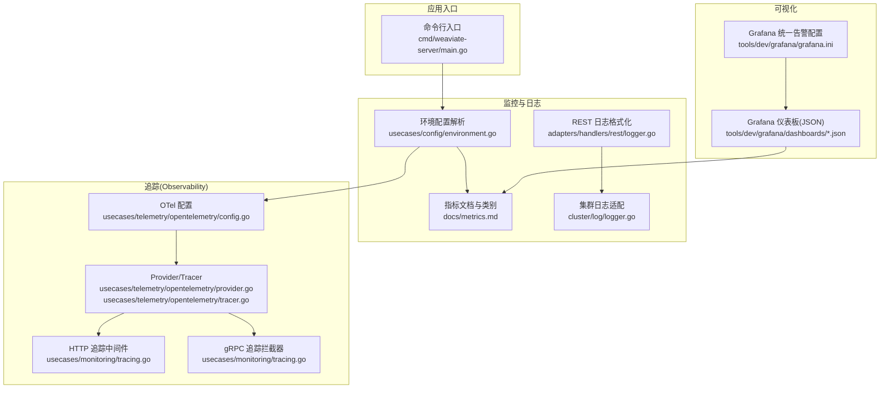
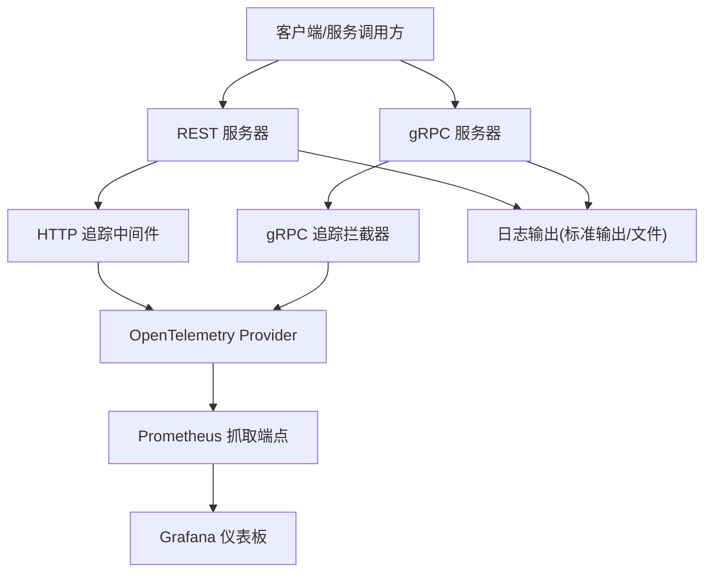
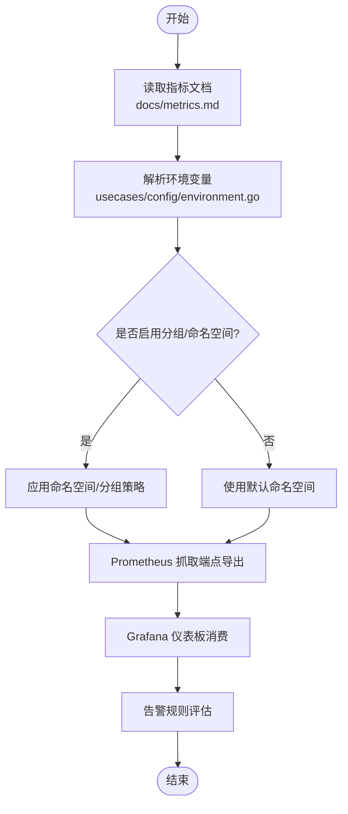
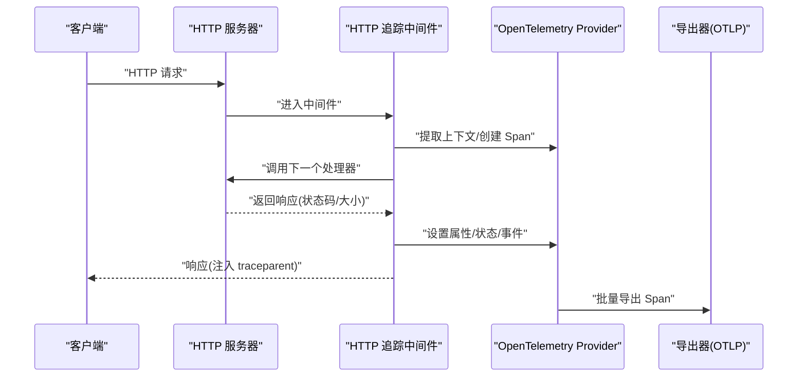
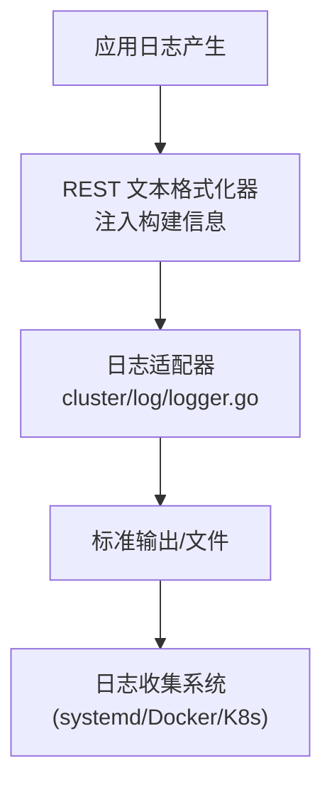
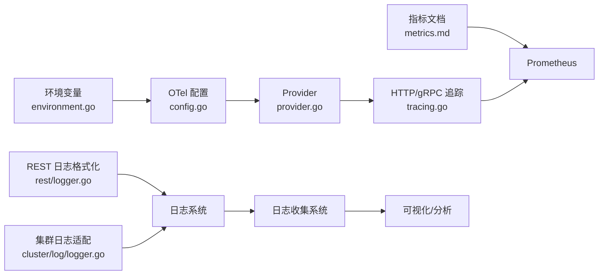

# 监控与日志

<cite>
**本文引用的文件**   
- [metrics.md](file://docs/metrics.md)
- [tracing.go](file://usecases/monitoring/tracing.go)
- [tracing_test.go](file://usecases/monitoring/tracing_test.go)
- [tracer.go](file://usecases/telemetry/opentelemetry/tracer.go)
- [provider.go](file://usecases/telemetry/opentelemetry/provider.go)
- [config.go](file://usecases/telemetry/opentelemetry/config.go)
- [environment.go](file://usecases/config/environment.go)
- [logger.go](file://cluster/log/logger.go)
- [logger.go](file://adapters/handlers/rest/logger.go)
- [startup.json](file://tools/dev/grafana/dashboards/startup.json)
- [backup.json](file://tools/dev/grafana/dashboards/backup.json)
- [db_shards.json](file://tools/dev/grafana/dashboards/db_shards.json)
- [importing.json](file://tools/dev/grafana/dashboards/importing.json)
- [tombstones.json](file://tools/dev/grafana/dashboards/tombstones.json)
- [kubernetes.json](file://tools/dev/grafana/dashboards/kubernetes.json)
- [objects.json](file://tools/dev/grafana/dashboards/objects.json)
- [auto_tenant.json](file://tools/dev/grafana/dashboards/auto_tenant.json)
- [vectorindex.json](file://tools/dev/grafana/dashboards/vectorindex.json)
- [grafana.ini](file://tools/dev/grafana/grafana.ini)
- [main.go](file://cmd/weaviate-server/main.go)
</cite>

## 目录
1. [简介](#简介)
2. [项目结构](#项目结构)
3. [核心组件](#核心组件)
4. [架构总览](#架构总览)
5. [详细组件分析](#详细组件分析)
6. [依赖关系分析](#依赖关系分析)
7. [性能考量](#性能考量)
8. [故障排查指南](#故障排查指南)
9. [结论](#结论)
10. [附录](#附录)

## 简介
本文件面向运维工程师与 SRE 团队，系统化梳理 Weaviate 的监控与日志体系，覆盖以下主题：
- Prometheus 指标采集与管理：指标分类、标签基数控制、命名空间与分组策略、关键告警指标
- 分布式追踪：OpenTelemetry 集成、HTTP/gRPC 追踪中间件与拦截器、链路传播与采样
- 日志管理：结构化日志格式、日志级别配置、日志轮转与输出策略
- Grafana 仪表板：内置仪表板清单与关键指标面板说明
- 告警与通知：阈值设定建议、静默期与统一告警配置、通知渠道
- 日志聚合与分析：与外部系统对接思路
- 监控数据可视化与报表：基于指标与追踪的综合视图

## 项目结构
Weaviate 的监控与日志能力由多个子模块协同实现：
- 指标与成本治理：集中于文档与配置解析，明确指标类别、标签基数与变更流程
- 追踪：OpenTelemetry Provider、Tracer 全局入口、HTTP/gRPC 中间件与拦截器
- 日志：统一使用 logrus，REST 文本格式化器注入构建信息，集群日志适配器
- 可视化：Grafana 仪表板 JSON 定义，配合 Prometheus 数据源
- 配置：环境变量驱动的监控与追踪开关、命名空间、采样率等

**图表来源**
- [main.go](file://cmd/weaviate-server/main.go#L30-L69)
- [environment.go](file://usecases/config/environment.go#L72-L107)
- [metrics.md](file://docs/metrics.md#L1-L395)
- [logger.go](file://adapters/handlers/rest/logger.go#L60-L91)
- [logger.go](file://cluster/log/logger.go#L1-L182)
- [config.go](file://usecases/telemetry/opentelemetry/config.go#L1-L141)
- [provider.go](file://usecases/telemetry/opentelemetry/provider.go#L1-L165)
- [tracer.go](file://usecases/telemetry/opentelemetry/tracer.go#L1-L72)
- [tracing.go](file://usecases/monitoring/tracing.go#L1-L347)
- [grafana.ini](file://tools/dev/grafana/grafana.ini#L716-L806)

**章节来源**
- [main.go](file://cmd/weaviate-server/main.go#L30-L69)
- [environment.go](file://usecases/config/environment.go#L72-L107)
- [metrics.md](file://docs/metrics.md#L1-L395)
- [logger.go](file://adapters/handlers/rest/logger.go#L60-L91)
- [logger.go](file://cluster/log/logger.go#L1-L182)
- [config.go](file://usecases/telemetry/opentelemetry/config.go#L1-L141)
- [provider.go](file://usecases/telemetry/opentelemetry/provider.go#L1-L165)
- [tracer.go](file://usecases/telemetry/opentelemetry/tracer.go#L1-L72)
- [tracing.go](file://usecases/monitoring/tracing.go#L1-L347)
- [grafana.ini](file://tools/dev/grafana/grafana.ini#L716-L806)

## 核心组件
- 指标与成本治理
  - 指标分类：活跃仪表板、活跃运营、告警、分析、可废弃、已废弃
  - 标签基数控制：优先稳定、有界标签集；避免每租户/每类/每路由标签爆炸
  - 变更管理：新增/变更/废弃均需在指标文档中同步
- 追踪
  - OpenTelemetry Provider：按环境变量初始化，支持 HTTP/gRPC 导出器
  - 全局 Tracer：提供全局入口与优雅关闭
  - HTTP/gRPC 中间件/拦截器：自动提取/注入上下文、记录属性与事件
- 日志
  - REST 文本格式化器：注入构建信息（Git 提交、镜像标签、版本、Go 版本）
  - 集群日志适配：将 logrus 适配为 hclog 接口，统一字段与级别映射
- 可视化
  - 内置仪表板：启动、备份、分片、导入、墓碑、Kubernetes、对象、自动租户、向量索引等
  - 统一告警：Grafana 统一告警子系统与执行策略配置

**章节来源**
- [metrics.md](file://docs/metrics.md#L16-L395)
- [config.go](file://usecases/telemetry/opentelemetry/config.go#L23-L141)
- [provider.go](file://usecases/telemetry/opentelemetry/provider.go#L33-L165)
- [tracer.go](file://usecases/telemetry/opentelemetry/tracer.go#L22-L72)
- [tracing.go](file://usecases/monitoring/tracing.go#L32-L347)
- [logger.go](file://adapters/handlers/rest/logger.go#L60-L91)
- [logger.go](file://cluster/log/logger.go#L25-L182)
- [startup.json](file://tools/dev/grafana/dashboards/startup.json#L1-L57)
- [backup.json](file://tools/dev/grafana/dashboards/backup.json#L1-L63)
- [db_shards.json](file://tools/dev/grafana/dashboards/db_shards.json#L1-L56)
- [importing.json](file://tools/dev/grafana/dashboards/importing.json#L1-L57)
- [tombstones.json](file://tools/dev/grafana/dashboards/tombstones.json#L1-L53)
- [kubernetes.json](file://tools/dev/grafana/dashboards/kubernetes.json#L1-L68)
- [objects.json](file://tools/dev/grafana/dashboards/objects.json#L1-L50)
- [auto_tenant.json](file://tools/dev/grafana/dashboards/auto_tenant.json#L1-L56)
- [vectorindex.json](file://tools/dev/grafana/dashboards/vectorindex.json#L1-L57)
- [grafana.ini](file://tools/dev/grafana/grafana.ini#L716-L806)

## 架构总览
Weaviate 的监控与日志架构围绕“指标 + 追踪 + 日志”的三位一体展开，结合 Grafana 与 Prometheus 实现观测闭环。

**图表来源**
- [tracing.go](file://usecases/monitoring/tracing.go#L32-L156)
- [provider.go](file://usecases/telemetry/opentelemetry/provider.go#L41-L103)
- [startup.json](file://tools/dev/grafana/dashboards/startup.json#L26-L57)
- [logger.go](file://adapters/handlers/rest/logger.go#L60-L91)

## 详细组件分析

### Prometheus 指标体系与配置
- 指标分类与用途
  - 活跃仪表板：用于仪表板展示的核心指标，标签集稳定且有界
  - 活跃运营：健康/运行状态与后台进程，建议采样
  - 告警：最小化、基于症状的告警，标签基数低
  - 分析：调试/分析场景，避免长期保留在 Prometheus
  - 可废弃/已废弃：逐步迁移与清理
- 关键指标类别与标签
  - 批处理与对象操作：批处理时延、对象数量、并发查询数、请求总量与状态
  - 查询与向量：查询时延、维度统计、过滤向量时延
  - LSM/向量索引：段数量、内存表大小、墓碑、索引大小、维护时延
  - 启动与墓碑：启动进度、磁盘吞吐、墓碑查找与清理
  - 文本到向量：并发批次、队列时延、请求时延、令牌统计、速率限制
  - 索引分片与自动租户：分片总数、更新时延、自动租户操作
  - 模块使用与运行时：模块操作延迟、上传文件大小、运行时配置加载与哈希
  - 复制引擎与分布式任务：待处理/进行中/完成/失败/取消操作数、运行状态
  - HTTP/gRPC 服务器：请求时延、请求/响应大小、飞行中请求数
  - 集群存储与模式管理：FSM 应用时延/失败、Raft 最后应用索引、集合/分片数量
- 标签基数控制与命名空间
  - 通过环境变量启用/禁用分组、设置指标命名空间、仅监控关键桶
  - 优先使用少量有界标签，避免每租户/每类/每路由标签爆炸
- 指标变更流程
  - 新增/变更/废弃均需在指标文档中同步，并标注迁移步骤与版本

**图表来源**
- [metrics.md](file://docs/metrics.md#L16-L395)
- [environment.go](file://usecases/config/environment.go#L72-L107)

**章节来源**
- [metrics.md](file://docs/metrics.md#L16-L395)
- [environment.go](file://usecases/config/environment.go#L72-L107)

### 分布式追踪：OpenTelemetry 集成
- 配置来源
  - 通过环境变量启用/配置 OpenTelemetry：服务名、环境、导出端点协议（HTTP/gRPC）、采样率、批量导出超时与批次大小
  - 协议与端点格式自动校正：gRPC 移除 http/https 前缀，HTTP 自动补全前缀
- Provider 生命周期
  - 初始化：创建资源（服务名、版本、环境），选择导出器（HTTP 或 gRPC），配置批量处理器与全局 TracerProvider
  - 关闭：带超时优雅关闭，确保未导出数据被处理
- 全局 Tracer
  - 提供全局 Tracer 获取与启用状态判断，禁用时返回空实现
- HTTP 追踪中间件
  - 提取/注入 W3C TraceContext，记录方法、URL、用户代理、请求 ID、状态码、响应大小与时延
  - 基于状态码设置 Span 状态，记录完成事件
- gRPC 追踪拦截器
  - 支持 Unary 与 Stream，记录系统、方法、时延、状态码，注入追踪上下文与调试追踪 ID
- 测试验证
  - 开启/关闭追踪时的行为测试，确保无侵入与正确传播

**图表来源**
- [tracing.go](file://usecases/monitoring/tracing.go#L32-L89)
- [provider.go](file://usecases/telemetry/opentelemetry/provider.go#L41-L103)
- [tracer.go](file://usecases/telemetry/opentelemetry/tracer.go#L26-L72)

**章节来源**
- [config.go](file://usecases/telemetry/opentelemetry/config.go#L49-L111)
- [provider.go](file://usecases/telemetry/opentelemetry/provider.go#L41-L165)
- [tracer.go](file://usecases/telemetry/opentelemetry/tracer.go#L26-L72)
- [tracing.go](file://usecases/monitoring/tracing.go#L32-L347)
- [tracing_test.go](file://usecases/monitoring/tracing_test.go#L33-L234)

### 日志管理系统
- 结构化日志格式
  - REST 文本格式化器：在每条日志中注入构建信息（Git 提交、镜像标签、服务版本、Go 版本），便于定位版本与构建来源
- 日志级别与配置
  - 支持 Panic/Fatal/Error/Warn/Info/Debug/Trace 级别转换与识别
  - 环境变量驱动的日志开关与目标（标准输出/文件），结合集群日志适配器
- 日志轮转与输出
  - 采用标准输出作为默认输出，结合容器/平台日志收集（如 systemd、Docker、Kubernetes）
  - 集群日志适配器将 logrus 字段与级别映射为 hclog，统一行为

**图表来源**
- [logger.go](file://adapters/handlers/rest/logger.go#L60-L91)
- [logger.go](file://cluster/log/logger.go#L25-L182)

**章节来源**
- [logger.go](file://adapters/handlers/rest/logger.go#L60-L91)
- [logger.go](file://cluster/log/logger.go#L25-L182)

### Grafana 仪表板与关键指标面板
- 内置仪表板清单
  - 启动：启动进度、磁盘吞吐
  - 备份：时间阶段、传输字节
  - 分片：分片总数、状态更新时延
  - 导入：批处理时延、对象处理
  - 墓碑：查找/全局入口调用次数
  - Kubernetes：概览与资源使用
  - 对象：查询时延、批处理时延
  - 自动租户：处理总数、耗时
  - 向量索引：墓碑、尺寸、段数、维护时延
- 面板数据源
  - Prometheus 数据源 UID 与查询语句在各面板 JSON 中定义，直接与指标文档中的指标名称对应
- 建议
  - 依据指标文档中的“活跃仪表板”与“活跃运营”类别选择面板组合，关注高基数标签的聚合与下钻

**章节来源**
- [startup.json](file://tools/dev/grafana/dashboards/startup.json#L26-L57)
- [backup.json](file://tools/dev/grafana/dashboards/backup.json#L30-L63)
- [db_shards.json](file://tools/dev/grafana/dashboards/db_shards.json#L24-L56)
- [importing.json](file://tools/dev/grafana/dashboards/importing.json#L30-L57)
- [tombstones.json](file://tools/dev/grafana/dashboards/tombstones.json#L25-L53)
- [kubernetes.json](file://tools/dev/grafana/dashboards/kubernetes.json#L43-L68)
- [objects.json](file://tools/dev/grafana/dashboards/objects.json#L30-L50)
- [auto_tenant.json](file://tools/dev/grafana/dashboards/auto_tenant.json#L24-L56)
- [vectorindex.json](file://tools/dev/grafana/dashboards/vectorindex.json#L30-L57)

### 告警配置与通知机制
- 告警类别
  - “告警”类指标：最小化、基于症状的告警，标签基数低，适合 Prometheus 规则与 Grafana 告警
- 阈值与静默期
  - 基于查询时延、队列长度、复制失败数、分片加载异常等关键指标设置阈值
  - 静默期：结合业务高峰与维护窗口，避免误报与噪声
- 统一告警与通知
  - Grafana 统一告警子系统开启与执行策略配置，支持规则评估间隔、超时、最小评估间隔
  - 通知渠道：邮件、Webhook、PagerDuty 等，结合 Alertmanager 或 Grafana 通知通道

**章节来源**
- [metrics.md](file://docs/metrics.md#L208-L215)
- [grafana.ini](file://tools/dev/grafana/grafana.ini#L716-L806)

### 日志聚合与分析工具集成
- 建议集成方式
  - 使用 OpenSearch/ELK(Elasticsearch, Logstash, Kibana)/Loki/Grafana Loki 收集标准输出日志
  - 通过日志管道进行结构化解析（提取构建信息、请求 ID、级别、消息体）
  - 与追踪 ID 关联，实现端到端问题定位
- 注意事项
  - 控制日志体量与保留周期，避免日志风暴
  - 对敏感字段脱敏，遵循合规要求

[本节为通用实践建议，无需特定文件引用]

### 监控数据可视化与报表
- 仪表板组合
  - 以“活跃仪表板”指标为主，结合“活跃运营”进行补充
  - 使用“分析”类指标进行离线分析与趋势回溯
- 报表生成
  - 基于 Grafana 的 Dashboard 与数据源，定期导出报表或通过快照分享
  - 结合追踪与日志，形成根因分析报告

[本节为通用实践建议，无需特定文件引用]

## 依赖关系分析
- 组件耦合
  - 追踪中间件/拦截器依赖 OpenTelemetry Provider；Provider 依赖配置模块
  - 指标文档与环境变量共同决定抓取范围与标签基数
  - 日志格式化器与日志适配器解耦，便于替换与扩展
- 外部依赖
  - Prometheus：指标抓取与存储
  - Grafana：仪表板与告警
  - OpenTelemetry Collector/OTLP：遥测导出
  - 日志收集系统：标准输出接入

**图表来源**
- [environment.go](file://usecases/config/environment.go#L72-L107)
- [config.go](file://usecases/telemetry/opentelemetry/config.go#L49-L111)
- [provider.go](file://usecases/telemetry/opentelemetry/provider.go#L41-L103)
- [tracing.go](file://usecases/monitoring/tracing.go#L32-L156)
- [metrics.md](file://docs/metrics.md#L16-L395)
- [logger.go](file://adapters/handlers/rest/logger.go#L60-L91)
- [logger.go](file://cluster/log/logger.go#L25-L182)

**章节来源**
- [environment.go](file://usecases/config/environment.go#L72-L107)
- [config.go](file://usecases/telemetry/opentelemetry/config.go#L49-L111)
- [provider.go](file://usecases/telemetry/opentelemetry/provider.go#L41-L103)
- [tracing.go](file://usecases/monitoring/tracing.go#L32-L156)
- [metrics.md](file://docs/metrics.md#L16-L395)
- [logger.go](file://adapters/handlers/rest/logger.go#L60-L91)
- [logger.go](file://cluster/log/logger.go#L25-L182)

## 性能考量
- 指标成本控制
  - 严格控制标签基数，避免高基数标签导致存储与查询开销激增
  - 使用“活跃运营”类指标进行采样，降低抓取频率
- 追踪采样与导出
  - 合理设置采样率，避免追踪数据成为性能瓶颈
  - 批量导出超时与批次大小需根据网络与下游系统能力调整
- 日志体积与保留
  - 控制日志级别与保留周期，结合日志轮转策略
  - 在容器环境中优先使用标准输出，由平台负责轮转与归档

[本节为通用性能建议，无需特定文件引用]

## 故障排查指南
- 追踪无法导出
  - 检查 OTel 配置：服务名、环境、导出端点协议与地址、采样率、批量参数
  - 确认 Provider 是否启用与全局 Tracer 是否可用
- HTTP/gRPC 追踪缺失
  - 确认中间件/拦截器是否正确注入
  - 检查请求头/元数据中 traceparent 是否存在与传播
- 指标缺失或异常
  - 核对指标文档类别与标签，确认抓取范围与命名空间
  - 检查环境变量是否正确设置（分组、命名空间、关键桶）
- 日志格式异常
  - 检查 REST 文本格式化器是否生效，确认构建信息字段是否存在
  - 核对日志适配器级别映射与输出目标

**章节来源**
- [config.go](file://usecases/telemetry/opentelemetry/config.go#L49-L111)
- [provider.go](file://usecases/telemetry/opentelemetry/provider.go#L144-L160)
- [tracing.go](file://usecases/monitoring/tracing.go#L32-L156)
- [metrics.md](file://docs/metrics.md#L16-L395)
- [logger.go](file://adapters/handlers/rest/logger.go#L60-L91)

## 结论
Weaviate 的监控与日志体系以“指标治理 + OpenTelemetry 追踪 + 结构化日志”为核心，辅以丰富的 Grafana 仪表板与统一告警配置，能够满足生产级可观测性需求。通过严格的标签基数控制与采样策略，可在保证洞察力的同时控制成本。建议在生产环境中结合业务场景持续优化阈值、静默期与通知策略，并完善日志聚合与分析流程，形成闭环的运维保障体系。

[本节为总结性内容，无需特定文件引用]

## 附录
- 关键环境变量参考
  - 追踪：EXPERIMENTAL_OTEL_ENABLED、EXPERIMENTAL_OTEL_SERVICE_NAME、EXPERIMENTAL_OTEL_ENVIRONMENT、EXPERIMENTAL_OTEL_EXPORTER_OTLP_ENDPOINT、EXPERIMENTAL_OTEL_EXPORTER_OTLP_PROTOCOL、EXPERIMENTAL_OTEL_TRACES_SAMPLER_ARG、EXPERIMENTAL_OTEL_BSP_EXPORT_TIMEOUT、EXPERIMENTAL_OTEL_BSP_MAX_EXPORT_BATCH_SIZE
  - 指标：PROMETHEUS_MONITORING_GROUP_CLASSES、PROMETHEUS_MONITORING_GROUP、PROMETHEUS_MONITORING_METRIC_NAMESPACE、PROMETHEUS_MONITOR_CRITICAL_BUCKETS_ONLY
- 建议的监控与告警实践
  - 以“活跃仪表板”指标为主建立日常监控
  - 以“告警”类指标建立故障预警
  - 以“活跃运营”指标进行容量与负载分析
  - 以“分析”类指标进行根因分析与趋势回溯

**章节来源**
- [config.go](file://usecases/telemetry/opentelemetry/config.go#L49-L111)
- [environment.go](file://usecases/config/environment.go#L72-L107)
- [metrics.md](file://docs/metrics.md#L16-L395)