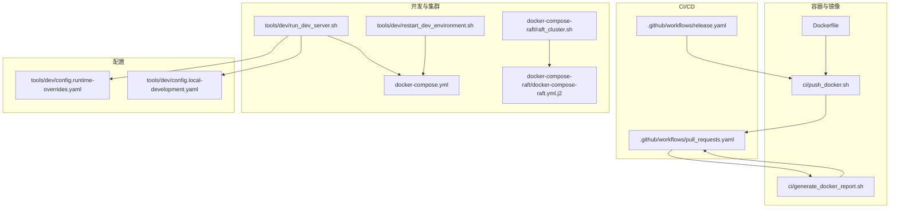
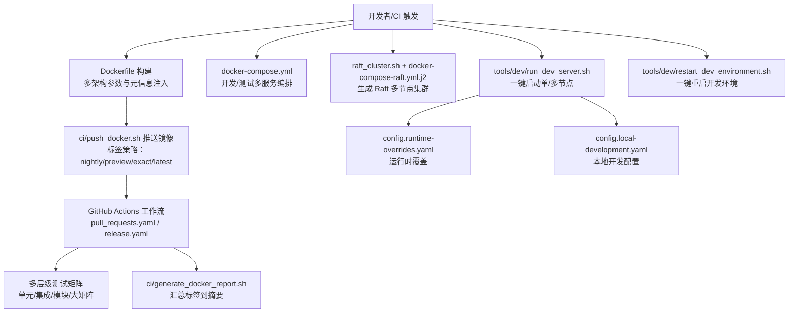
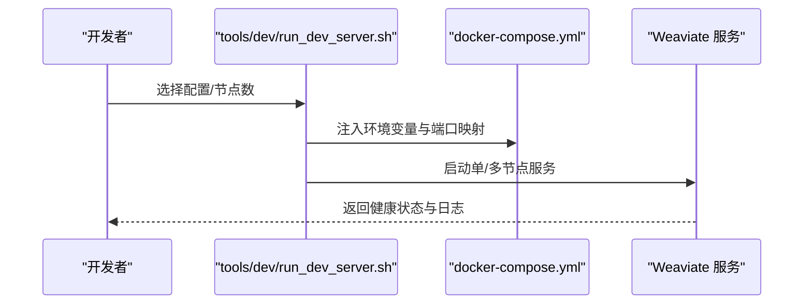
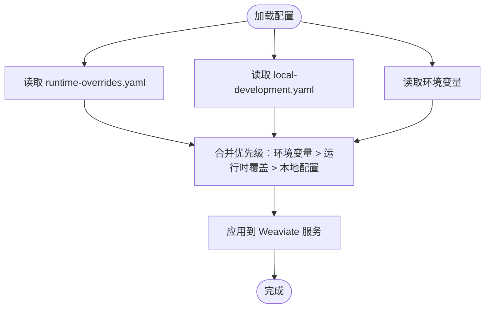
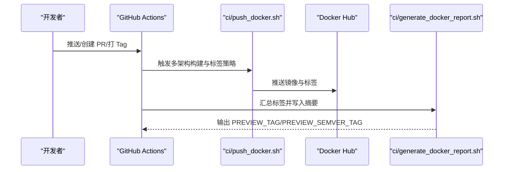
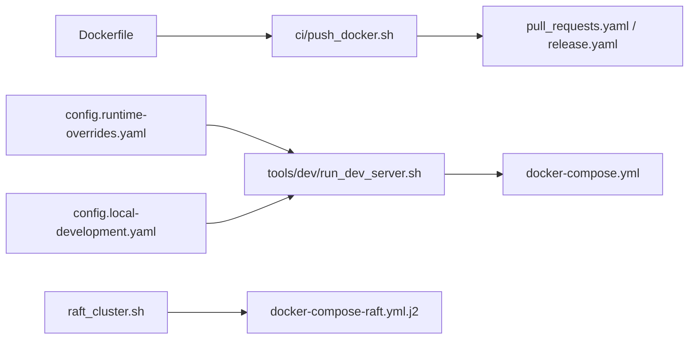

# 运维自动化

<cite>
**本文引用的文件**
- [README.md](file://README.md)
- [Dockerfile](file://Dockerfile)
- [docker-compose.yml](file://docker-compose.yml)
- [.github/workflows/pull_requests.yaml](file://.github/workflows/pull_requests.yaml)
- [.github/workflows/release.yaml](file://.github/workflows/release.yaml)
- [ci/generate_docker_report.sh](file://ci/generate_docker_report.sh)
- [ci/push_docker.sh](file://ci/push_docker.sh)
- [tools/dev/run_dev_server.sh](file://tools/dev/run_dev_server.sh)
- [tools/dev/restart_dev_environment.sh](file://tools/dev/restart_dev_environment.sh)
- [docker-compose-raft/raft_cluster.sh](file://docker-compose-raft/raft_cluster.sh)
- [docker-compose-raft/docker-compose-raft.yml.j2](file://docker-compose-raft/docker-compose-raft.yml.j2)
- [tools/dev/config.runtime-overrides.yaml](file://tools/dev/config.runtime-overrides.yaml)
- [tools/dev/config.local-development.yaml](file://tools/dev/config.local-development.yaml)
</cite>

## 目录
1. [简介](#简介)
2. [项目结构](#项目结构)
3. [核心组件](#核心组件)
4. [架构总览](#架构总览)
5. [详细组件分析](#详细组件分析)
6. [依赖关系分析](#依赖关系分析)
7. [性能考量](#性能考量)
8. [故障排查指南](#故障排查指南)
9. [结论](#结论)
10. [附录](#附录)

## 简介
本文件面向 DevOps 工程师与自动化团队，围绕 Weaviate 的运维自动化进行系统化技术文档编制，覆盖一键部署、滚动更新与回滚、配置管理自动化、备份自动化、监控自动化、CI/CD 集成、以及运维任务自动化（日志清理、索引重建、数据迁移等），并提供可操作的工具与脚本使用指南。

## 项目结构
Weaviate 仓库提供了丰富的开发与运维自动化能力：
- 容器镜像构建与发布：Dockerfile、CI 脚本与 GitHub Actions 工作流
- 开发与本地集群：多模块 docker-compose、Raft 多节点集群模板
- 运行时配置：本地配置文件与运行时覆盖配置
- 自动化脚本：开发服务器启动、环境重启、集群生成等

图表来源
- [Dockerfile](file://Dockerfile#L1-L57)
- [ci/push_docker.sh](file://ci/push_docker.sh#L1-L140)
- [ci/generate_docker_report.sh](file://ci/generate_docker_report.sh#L1-L28)
- [.github/workflows/pull_requests.yaml](file://.github/workflows/pull_requests.yaml#L1-L829)
- [.github/workflows/release.yaml](file://.github/workflows/release.yaml#L1-L33)
- [docker-compose.yml](file://docker-compose.yml#L1-L140)
- [tools/dev/run_dev_server.sh](file://tools/dev/run_dev_server.sh#L1-L1223)
- [tools/dev/restart_dev_environment.sh](file://tools/dev/restart_dev_environment.sh#L1-L124)
- [docker-compose-raft/raft_cluster.sh](file://docker-compose-raft/raft_cluster.sh#L1-L52)
- [docker-compose-raft/docker-compose-raft.yml.j2](file://docker-compose-raft/docker-compose-raft.yml.j2#L1-L85)
- [tools/dev/config.runtime-overrides.yaml](file://tools/dev/config.runtime-overrides.yaml#L1-L24)
- [tools/dev/config.local-development.yaml](file://tools/dev/config.local-development.yaml#L1-L31)

章节来源
- [README.md](file://README.md#L1-L181)
- [Dockerfile](file://Dockerfile#L1-L57)
- [docker-compose.yml](file://docker-compose.yml#L1-L140)
- [.github/workflows/pull_requests.yaml](file://.github/workflows/pull_requests.yaml#L1-L829)
- [.github/workflows/release.yaml](file://.github/workflows/release.yaml#L1-L33)
- [ci/push_docker.sh](file://ci/push_docker.sh#L1-L140)
- [ci/generate_docker_report.sh](file://ci/generate_docker_report.sh#L1-L28)
- [tools/dev/run_dev_server.sh](file://tools/dev/run_dev_server.sh#L1-L1223)
- [tools/dev/restart_dev_environment.sh](file://tools/dev/restart_dev_environment.sh#L1-L124)
- [docker-compose-raft/raft_cluster.sh](file://docker-compose-raft/raft_cluster.sh#L1-L52)
- [docker-compose-raft/docker-compose-raft.yml.j2](file://docker-compose-raft/docker-compose-raft.yml.j2#L1-L85)
- [tools/dev/config.runtime-overrides.yaml](file://tools/dev/config.runtime-overrides.yaml#L1-L24)
- [tools/dev/config.local-development.yaml](file://tools/dev/config.local-development.yaml#L1-L31)

## 核心组件
- 容器镜像与发布
  - Dockerfile 定义多阶段构建与最终运行镜像，支持多架构构建参数与构建元信息注入。
  - ci/push_docker.sh 负责多平台镜像构建、标签策略与推送，支持 PR 预览标签、nightly 标签与精确版本标签。
  - generate_docker_report.sh 将构建产物标签汇总并写入工作流摘要。
- CI/CD 流水线
  - pull_requests.yaml：单元测试、集成测试、模块验收测试、安全扫描、报告生成与二进制打包。
  - release.yaml：发布制品的预编译二进制生成与上传。
- 开发与集群
  - docker-compose.yml：开发与测试所需的多服务组合（Prometheus/Grafana、Keycloak、向量化服务等）。
  - tools/dev/run_dev_server.sh：一键启动单节点或多节点开发服务，支持多种认证与模块组合。
  - tools/dev/restart_dev_environment.sh：一键清理并重启开发环境，支持按需启用各类服务。
  - docker-compose-raft/raft_cluster.sh 与 docker-compose-raft.yml.j2：通过 Jinja2 模板生成 Raft 多节点集群编排。
- 配置管理
  - tools/dev/config.runtime-overrides.yaml：运行时覆盖项（如慢查询日志、异步复制开关等）。
  - tools/dev/config.local-development.yaml：本地开发配置示例（认证、向量化、日志、遥测等）。

章节来源
- [Dockerfile](file://Dockerfile#L1-L57)
- [ci/push_docker.sh](file://ci/push_docker.sh#L1-L140)
- [ci/generate_docker_report.sh](file://ci/generate_docker_report.sh#L1-L28)
- [.github/workflows/pull_requests.yaml](file://.github/workflows/pull_requests.yaml#L1-L829)
- [.github/workflows/release.yaml](file://.github/workflows/release.yaml#L1-L33)
- [docker-compose.yml](file://docker-compose.yml#L1-L140)
- [tools/dev/run_dev_server.sh](file://tools/dev/run_dev_server.sh#L1-L1223)
- [tools/dev/restart_dev_environment.sh](file://tools/dev/restart_dev_environment.sh#L1-L124)
- [docker-compose-raft/raft_cluster.sh](file://docker-compose-raft/raft_cluster.sh#L1-L52)
- [docker-compose-raft/docker-compose-raft.yml.j2](file://docker-compose-raft/docker-compose-raft.yml.j2#L1-L85)
- [tools/dev/config.runtime-overrides.yaml](file://tools/dev/config.runtime-overrides.yaml#L1-L24)
- [tools/dev/config.local-development.yaml](file://tools/dev/config.local-development.yaml#L1-L31)

## 架构总览
Weaviate 的运维自动化以“容器化 + CI/CD + 配置即代码”为核心，形成从开发到生产的闭环。

图表来源
- [Dockerfile](file://Dockerfile#L1-L57)
- [ci/push_docker.sh](file://ci/push_docker.sh#L1-L140)
- [.github/workflows/pull_requests.yaml](file://.github/workflows/pull_requests.yaml#L1-L829)
- [.github/workflows/release.yaml](file://.github/workflows/release.yaml#L1-L33)
- [ci/generate_docker_report.sh](file://ci/generate_docker_report.sh#L1-L28)
- [docker-compose.yml](file://docker-compose.yml#L1-L140)
- [docker-compose-raft/raft_cluster.sh](file://docker-compose-raft/raft_cluster.sh#L1-L52)
- [docker-compose-raft/docker-compose-raft.yml.j2](file://docker-compose-raft/docker-compose-raft.yml.j2#L1-L85)
- [tools/dev/run_dev_server.sh](file://tools/dev/run_dev_server.sh#L1-L1223)
- [tools/dev/restart_dev_environment.sh](file://tools/dev/restart_dev_environment.sh#L1-L124)
- [tools/dev/config.runtime-overrides.yaml](file://tools/dev/config.runtime-overrides.yaml#L1-L24)
- [tools/dev/config.local-development.yaml](file://tools/dev/config.local-development.yaml#L1-L31)

## 详细组件分析

### 一键部署与滚动更新
- 单节点开发一键启动
  - 使用 tools/dev/run_dev_server.sh，通过环境变量组合不同认证方式与模块，快速启动单节点服务。
  - 支持 Prometheus 监控端口、持久化路径、默认向量化模块等参数化配置。
- 多节点开发一键启动
  - 通过 tools/dev/run_dev_server.sh 的多节点分支，设置 gossip/data/raft 端口、集群加入地址与期望投票者数量，实现多节点启动。
- Raft 集群一键生成
  - docker-compose-raft/raft_cluster.sh 读取 NUMBER_VOTERS 参数，调用 jinja2 渲染 docker-compose-raft.yml.j2，输出多节点编排文件，并提示 scale 与 down 操作。
- 滚动更新与回滚建议
  - 基于 docker-compose 的服务替换与 scale 控制，可实现逐节点替换与回滚。
  - 建议配合备份策略与健康检查，在更新前创建备份并在更新后验证可用性。

图表来源
- [tools/dev/run_dev_server.sh](file://tools/dev/run_dev_server.sh#L1-L1223)
- [docker-compose.yml](file://docker-compose.yml#L1-L140)

章节来源
- [tools/dev/run_dev_server.sh](file://tools/dev/run_dev_server.sh#L1-L1223)
- [docker-compose-raft/raft_cluster.sh](file://docker-compose-raft/raft_cluster.sh#L1-L52)
- [docker-compose-raft/docker-compose-raft.yml.j2](file://docker-compose-raft/docker-compose-raft.yml.j2#L1-L85)
- [docker-compose.yml](file://docker-compose.yml#L1-L140)

### 配置管理自动化
- 运行时覆盖
  - tools/dev/config.runtime-overrides.yaml 提供运行时可动态调整的参数（如慢查询阈值、异步复制开关、租户活动日志级别等）。
  - tools/dev/run_dev_server.sh 中通过 RUNTIME_OVERRIDES_ENABLED/RUNTIME_OVERRIDES_PATH/RUNTIME_OVERRIDES_LOAD_INTERVAL 加载与轮询刷新。
- 本地开发配置
  - tools/dev/config.local-development.yaml 提供认证、向量化、日志、遥测等本地开发示例配置，便于快速验证。
- 环境变量管理
  - tools/dev/run_dev_server.sh 统一注入日志级别、监控端口、查询限制、持久化路径、模块启用等环境变量，便于在不同场景间切换。

图表来源
- [tools/dev/config.runtime-overrides.yaml](file://tools/dev/config.runtime-overrides.yaml#L1-L24)
- [tools/dev/config.local-development.yaml](file://tools/dev/config.local-development.yaml#L1-L31)
- [tools/dev/run_dev_server.sh](file://tools/dev/run_dev_server.sh#L1-L1223)

章节来源
- [tools/dev/config.runtime-overrides.yaml](file://tools/dev/config.runtime-overrides.yaml#L1-L24)
- [tools/dev/config.local-development.yaml](file://tools/dev/config.local-development.yaml#L1-L31)
- [tools/dev/run_dev_server.sh](file://tools/dev/run_dev_server.sh#L1-L1223)

### 备份自动化策略
- 备份模块与本地服务
  - docker-compose.yml 提供 backup-s3、backup-gcs、backup-azure 本地模拟服务，便于在开发环境中验证备份流程。
- 备份触发与状态查询
  - 仓库包含备份相关的客户端与处理器文件，表明系统具备备份创建、状态查询、列表与恢复等能力（具体 API 参见备份相关 handlers 与 clients）。
- 定时备份与恢复测试建议
  - 建议在 CI/CD 中增加定时任务，定期触发备份创建与恢复验证；结合 docker-compose 的持久化卷与备份模块，实现自动化恢复测试。

章节来源
- [docker-compose.yml](file://docker-compose.yml#L104-L128)
- [README.md](file://README.md#L1-L181)

### 监控自动化方案
- Prometheus 与 Grafana
  - docker-compose.yml 提供 Prometheus 与 Grafana 服务，便于采集与可视化 Weaviate 指标。
- 慢查询与租户活动日志
  - tools/dev/config.runtime-overrides.yaml 提供慢查询日志开关与阈值、租户活动日志级别等配置项，可用于问题定位与容量规划。
- 健康检查与自动扩容/自愈
  - 建议在 Kubernetes 或容器编排平台中结合健康检查端点与 HPA/HPA 扩容策略，实现自动扩容；结合备份与恢复流程，实现故障自愈。

章节来源
- [docker-compose.yml](file://docker-compose.yml#L21-L41)
- [tools/dev/config.runtime-overrides.yaml](file://tools/dev/config.runtime-overrides.yaml#L1-L24)

### CI/CD 集成配置
- 多架构镜像构建与推送
  - ci/push_docker.sh 支持 linux/amd64、linux/arm64 平台，根据事件类型（PR/Tag/Branch）生成不同标签（preview/nightly/exact/latest），并通过 docker buildx 缓存优化。
- 工作流矩阵与测试
  - pull_requests.yaml 包含单元测试、集成测试、模块验收测试、大矩阵测试、安全扫描（Orca）与报告生成，确保质量与可追溯性。
- 发布制品
  - release.yaml 生成预编译二进制并附带校验和，便于分发与审计。

图表来源
- [.github/workflows/pull_requests.yaml](file://.github/workflows/pull_requests.yaml#L1-L829)
- [.github/workflows/release.yaml](file://.github/workflows/release.yaml#L1-L33)
- [ci/push_docker.sh](file://ci/push_docker.sh#L1-L140)
- [ci/generate_docker_report.sh](file://ci/generate_docker_report.sh#L1-L28)

章节来源
- [.github/workflows/pull_requests.yaml](file://.github/workflows/pull_requests.yaml#L1-L829)
- [.github/workflows/release.yaml](file://.github/workflows/release.yaml#L1-L33)
- [ci/push_docker.sh](file://ci/push_docker.sh#L1-L140)
- [ci/generate_docker_report.sh](file://ci/generate_docker_report.sh#L1-L28)

### 运维任务自动化
- 日志清理
  - 建议结合容器日志驱动与外部日志系统（如 Loki/ELK），在 CI/CD 中定义日志保留策略与归档任务。
- 索引重建
  - 在 docker-compose.yml 中提供 Prometheus/Grafana 与多种向量化服务，便于在重建前后对比指标与性能。
- 数据迁移
  - 结合备份模块与恢复流程，制定离线/在线迁移方案；在 CI/CD 中加入迁移演练与回滚预案。

章节来源
- [docker-compose.yml](file://docker-compose.yml#L1-L140)

## 依赖关系分析
- 构建与发布链路
  - Dockerfile -> ci/push_docker.sh -> GitHub Actions 工作流 -> 镜像仓库
- 开发与测试链路
  - tools/dev/run_dev_server.sh -> docker-compose.yml -> 多模块服务
  - docker-compose-raft/raft_cluster.sh -> docker-compose-raft.yml.j2 -> Raft 集群
- 配置链路
  - tools/dev/config.runtime-overrides.yaml + tools/dev/config.local-development.yaml + 环境变量 -> Weaviate 服务

图表来源
- [Dockerfile](file://Dockerfile#L1-L57)
- [ci/push_docker.sh](file://ci/push_docker.sh#L1-L140)
- [.github/workflows/pull_requests.yaml](file://.github/workflows/pull_requests.yaml#L1-L829)
- [.github/workflows/release.yaml](file://.github/workflows/release.yaml#L1-L33)
- [tools/dev/run_dev_server.sh](file://tools/dev/run_dev_server.sh#L1-L1223)
- [docker-compose.yml](file://docker-compose.yml#L1-L140)
- [docker-compose-raft/raft_cluster.sh](file://docker-compose-raft/raft_cluster.sh#L1-L52)
- [docker-compose-raft/docker-compose-raft.yml.j2](file://docker-compose-raft/docker-compose-raft.yml.j2#L1-L85)
- [tools/dev/config.runtime-overrides.yaml](file://tools/dev/config.runtime-overrides.yaml#L1-L24)
- [tools/dev/config.local-development.yaml](file://tools/dev/config.local-development.yaml#L1-L31)

章节来源
- [Dockerfile](file://Dockerfile#L1-L57)
- [ci/push_docker.sh](file://ci/push_docker.sh#L1-L140)
- [.github/workflows/pull_requests.yaml](file://.github/workflows/pull_requests.yaml#L1-L829)
- [.github/workflows/release.yaml](file://.github/workflows/release.yaml#L1-L33)
- [tools/dev/run_dev_server.sh](file://tools/dev/run_dev_server.sh#L1-L1223)
- [docker-compose.yml](file://docker-compose.yml#L1-L140)
- [docker-compose-raft/raft_cluster.sh](file://docker-compose-raft/raft_cluster.sh#L1-L52)
- [docker-compose-raft/docker-compose-raft.yml.j2](file://docker-compose-raft/docker-compose-raft.yml.j2#L1-L85)
- [tools/dev/config.runtime-overrides.yaml](file://tools/dev/config.runtime-overrides.yaml#L1-L24)
- [tools/dev/config.local-development.yaml](file://tools/dev/config.local-development.yaml#L1-L31)

## 性能考量
- 构建缓存与多架构
  - ci/push_docker.sh 使用 BuildKit 缓存作用域（weaviate-multi / weaviate-amd64 / weaviate-arm64）提升复用率，减少重复构建时间。
- 查询与日志
  - tools/dev/config.runtime-overrides.yaml 提供慢查询阈值与日志级别配置，有助于在高负载场景下定位瓶颈。
- Raft 集群与持久化
  - docker-compose-raft.yml.j2 提供 flush 等参数，有助于在测试场景下稳定指标差异，便于性能回归。

章节来源
- [ci/push_docker.sh](file://ci/push_docker.sh#L92-L103)
- [tools/dev/config.runtime-overrides.yaml](file://tools/dev/config.runtime-overrides.yaml#L1-L24)
- [docker-compose-raft/docker-compose-raft.yml.j2](file://docker-compose-raft/docker-compose-raft.yml.j2#L35-L42)

## 故障排查指南
- 开发环境重启
  - tools/dev/restart_dev_environment.sh 支持删除持久化目录、按需启用服务并等待 Keycloak 就绪，便于快速复现问题。
- 健康检查
  - 结合 docker-compose.yml 中的 Prometheus/Grafana 与 Weaviate 内部健康端点，定位异常节点与指标波动。
- 回滚策略
  - 基于镜像标签（nightly/preview/exact/latest）与 docker-compose 服务替换，实现快速回滚；建议在更新前创建备份。

章节来源
- [tools/dev/restart_dev_environment.sh](file://tools/dev/restart_dev_environment.sh#L1-L124)
- [docker-compose.yml](file://docker-compose.yml#L21-L41)
- [ci/push_docker.sh](file://ci/push_docker.sh#L34-L90)

## 结论
Weaviate 的运维自动化以容器化为基础，结合 CI/CD 工作流、配置即代码与多样的开发/集群工具，形成了从开发到生产的高效闭环。通过统一的标签策略、运行时覆盖与多模块编排，团队可以实现一键部署、滚动更新与回滚、配置热更新、备份与恢复测试、监控与自愈等运维自动化目标。

## 附录
- 使用指南要点
  - 一键部署：使用 tools/dev/run_dev_server.sh 选择配置与节点数；或使用 docker-compose-raft/raft_cluster.sh 生成 Raft 集群。
  - 配置管理：通过 tools/dev/config.runtime-overrides.yaml 与 tools/dev/config.local-development.yaml，结合环境变量实现灵活切换。
  - CI/CD：遵循 pull_requests.yaml 与 release.yaml 的流程，确保构建、测试、报告与发布的一致性。
  - 备份与恢复：在 docker-compose.yml 中启用备份模块服务，结合备份 API 与恢复流程进行自动化演练。
  - 监控：使用 Prometheus/Grafana 采集指标，结合慢查询与租户活动日志进行问题定位。