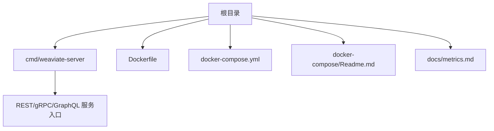
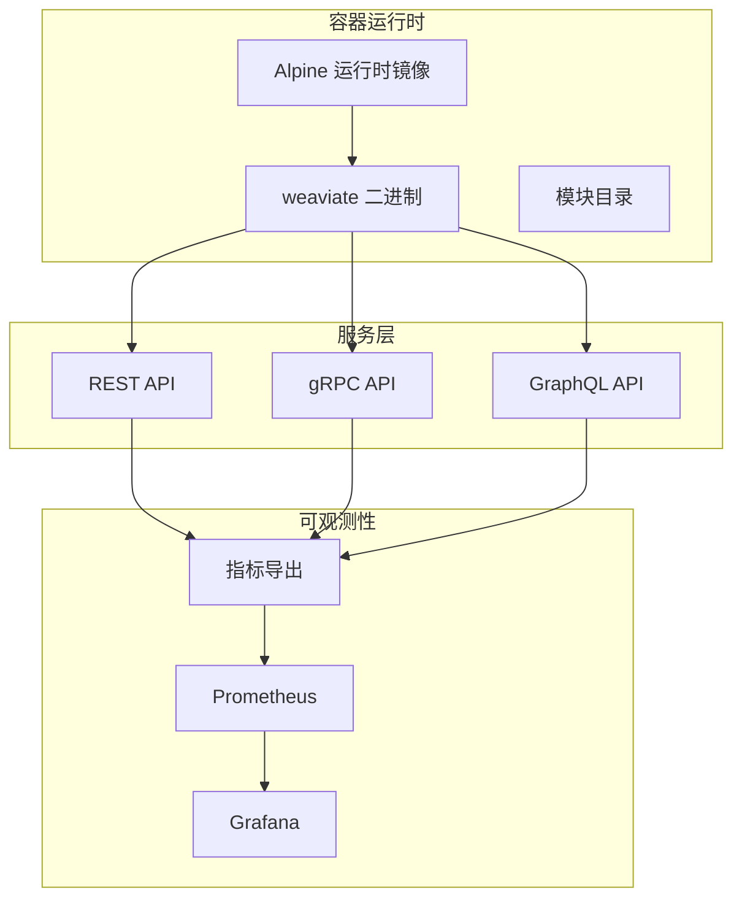
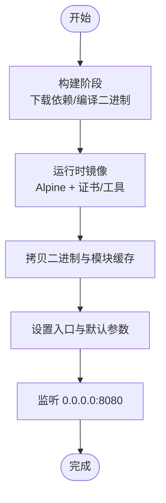
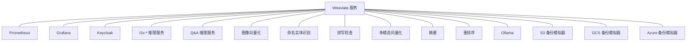
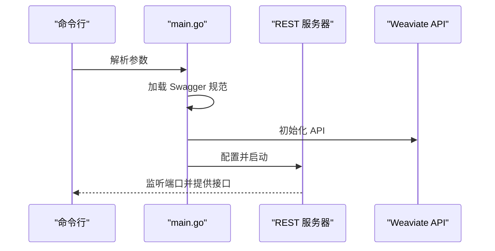
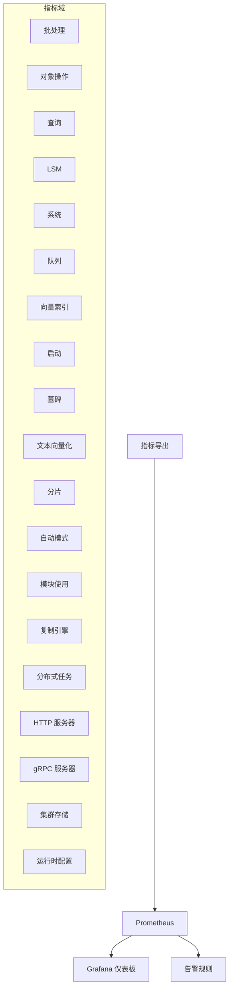
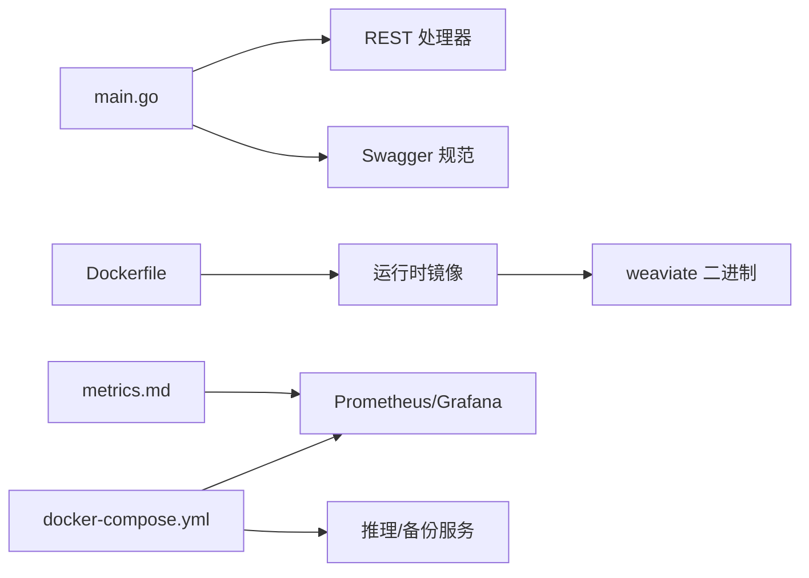

# 部署与运维

<cite>
**本文引用的文件**
- [README.md](file://README.md)
- [Dockerfile](file://Dockerfile)
- [docker-compose.yml](file://docker-compose.yml)
- [docker-compose/Readme.md](file://docker-compose/Readme.md)
- [cmd/weaviate-server/main.go](file://cmd/weaviate-server/main.go)
- [docs/metrics.md](file://docs/metrics.md)
</cite>

## 目录
1. [简介](#简介)
2. [项目结构](#项目结构)
3. [核心组件](#核心组件)
4. [架构总览](#架构总览)
5. [详细组件分析](#详细组件分析)
6. [依赖关系分析](#依赖关系分析)
7. [性能考量](#性能考量)
8. [故障排除指南](#故障排除指南)
9. [结论](#结论)
10. [附录](#附录)

## 简介
本文件面向 DevOps 工程师与系统管理员，提供 Weaviate 在容器化与云原生环境下的部署与运维参考。内容覆盖：
- 容器化部署：Docker 镜像构建、参数配置与运行方式
- 编排部署：基于 docker-compose 的开发与演示环境
- 云平台集成：AWS、GCP 等主流云服务的部署策略与注意事项
- 性能调优：索引优化、内存管理、网络配置与并发控制
- 监控与日志：指标采集、日志配置与告警设置
- 运维自动化：备份、灾难恢复、高可用与扩容策略
- 容量规划与基准测试：数据规模与查询负载的评估方法
- 故障排除与最佳实践：常见问题定位与运维建议

## 项目结构
仓库采用模块化与分层组织，核心入口为命令行服务，容器化与编排相关文件位于根目录与 docker-compose 目录，监控与指标文档位于 docs 子目录。

图表来源
- [cmd/weaviate-server/main.go](file://cmd/weaviate-server/main.go#L30-L67)
- [Dockerfile](file://Dockerfile#L50-L57)
- [docker-compose.yml](file://docker-compose.yml#L1-L140)
- [docker-compose/Readme.md](file://docker-compose/Readme.md#L1-L9)
- [docs/metrics.md](file://docs/metrics.md#L1-L395)

章节来源
- [README.md](file://README.md#L19-L28)
- [Dockerfile](file://Dockerfile#L1-L57)
- [docker-compose.yml](file://docker-compose.yml#L1-L140)
- [docker-compose/Readme.md](file://docker-compose/Readme.md#L1-L9)
- [cmd/weaviate-server/main.go](file://cmd/weaviate-server/main.go#L30-L67)
- [docs/metrics.md](file://docs/metrics.md#L1-L395)

## 核心组件
- 服务入口与命令行参数解析：通过命令行参数配置主机、端口、协议等基础运行参数，并加载 Swagger 规范启动 REST 服务。
- 容器镜像：基于 Alpine 的精简运行时，内置模块目录，支持静态链接二进制运行。
- 开发编排：提供 Prometheus、Grafana、Keycloak、向量化推理服务、备份后端模拟器等组件的组合式开发环境。
- 指标体系：统一的 Prometheus 指标清单，覆盖批处理、对象操作、查询、LSM、系统、队列、向量索引、启动、墓碑、文本向量化、分片、自动模式、模块使用、复制引擎、分布式任务、HTTP/gRPC 服务器、集群存储、运行时配置等维度。

章节来源
- [cmd/weaviate-server/main.go](file://cmd/weaviate-server/main.go#L30-L67)
- [Dockerfile](file://Dockerfile#L50-L57)
- [docker-compose.yml](file://docker-compose.yml#L21-L139)
- [docs/metrics.md](file://docs/metrics.md#L40-L395)

## 架构总览
Weaviate 服务通过命令行入口启动，对外提供 REST、gRPC、GraphQL 接口；容器镜像以最小化运行时为基础，支持模块扩展；开发编排提供可观测性与周边服务；指标体系用于运行时观测与告警。

图表来源
- [Dockerfile](file://Dockerfile#L50-L57)
- [cmd/weaviate-server/main.go](file://cmd/weaviate-server/main.go#L30-L67)
- [docs/metrics.md](file://docs/metrics.md#L1-L395)
- [docker-compose.yml](file://docker-compose.yml#L21-L41)

## 详细组件分析

### 容器化部署（Docker）
- 镜像构建阶段：使用 golang 基础镜像进行模块下载与二进制构建，支持多架构与构建元信息注入。
- 运行时镜像：基于 Alpine，安装必要证书与工具，拷贝构建产物与模块缓存，设置默认入口与 CMD 参数。
- 默认监听：容器默认监听 0.0.0.0:8080，可通过环境变量或命令行参数调整。
- 模块目录：运行时挂载模块目录，便于启用向量化器与第三方模块。

图表来源
- [Dockerfile](file://Dockerfile#L18-L37)
- [Dockerfile](file://Dockerfile#L50-L57)

章节来源
- [Dockerfile](file://Dockerfile#L1-L57)

### docker-compose 开发环境
- 组件构成：Prometheus、Grafana、Keycloak、多类向量化推理服务、NER、拼写检查、多模态向量化、摘要、重排序、Ollama、S3/GCS/Azure 备份后端模拟器等。
- 端口映射：各组件暴露不同端口，便于本地联调与演示。
- 数据持久化：Prometheus TSDB、MinIO/GCS/Azure 模拟器的数据卷挂载。
- 使用说明：开发环境示例，非最终用户生产配置；生成配置请参考官方文档。

图表来源
- [docker-compose.yml](file://docker-compose.yml#L11-L139)

章节来源
- [docker-compose.yml](file://docker-compose.yml#L1-L140)
- [docker-compose/Readme.md](file://docker-compose/Readme.md#L1-L9)

### 服务启动与参数
- 命令行解析：加载 Swagger 规范，注册 REST 服务，解析命令行参数组，配置并启动服务。
- 参数来源：支持通过命令行传入主机、端口、协议等基础参数；也可通过环境变量传递模块与推理服务地址等。

图表来源
- [cmd/weaviate-server/main.go](file://cmd/weaviate-server/main.go#L30-L67)

章节来源
- [cmd/weaviate-server/main.go](file://cmd/weaviate-server/main.go#L30-L67)

### 指标体系与可观测性
- 指标分类：活跃仪表板、活跃运营、告警、分析、可废弃、已废弃，明确使用场景与生命周期。
- 关键指标域：批处理、对象操作、查询、LSM、系统、队列、向量索引、启动、墓碑、文本向量化、分片、自动模式、模块使用、复制引擎、分布式任务、HTTP/gRPC 服务器、集群存储、运行时配置等。
- 成本与基数：优先使用少量有界标签的计数器/仪表，避免高基数标签；将探索性分析移至日志/追踪/外部存储。

图表来源
- [docs/metrics.md](file://docs/metrics.md#L40-L395)

章节来源
- [docs/metrics.md](file://docs/metrics.md#L1-L395)

## 依赖关系分析
- 服务入口依赖 REST 处理器与 Swagger 规范，参数解析后启动服务。
- 容器镜像依赖 Go 构建链与 Alpine 运行时，模块目录作为可插拔扩展。
- 开发编排依赖 Prometheus/Grafana 与各类推理服务镜像，形成端到端演示链路。
- 指标体系为监控与告警提供统一数据源，支撑运营与分析两类需求。

图表来源
- [cmd/weaviate-server/main.go](file://cmd/weaviate-server/main.go#L30-L67)
- [Dockerfile](file://Dockerfile#L50-L57)
- [docker-compose.yml](file://docker-compose.yml#L21-L139)
- [docs/metrics.md](file://docs/metrics.md#L1-L395)

章节来源
- [cmd/weaviate-server/main.go](file://cmd/weaviate-server/main.go#L30-L67)
- [Dockerfile](file://Dockerfile#L50-L57)
- [docker-compose.yml](file://docker-compose.yml#L1-L140)
- [docs/metrics.md](file://docs/metrics.md#L1-L395)

## 性能考量
- 索引优化
  - 向量索引与压缩：通过向量压缩与量化降低内存占用，同时关注维度与段数量指标，平衡检索精度与资源消耗。
  - 分片与副本：合理设置分片数量与副本策略，结合查询并发与队列长度指标评估负载。
- 内存管理
  - LSM 内存表大小与段数量：监控 memtable 尺寸与活动段数量，避免内存峰值过高导致 GC 压力。
  - 并发与 goroutine：关注并发查询与批处理指标，避免过载引发延迟抖动。
- 网络配置
  - HTTP/gRPC 请求时延与吞吐：通过请求时长、请求体/响应体大小与在途请求数指标评估网络与服务端处理能力。
  - 模块外部调用：监控外部 API 调用次数、错误率与单批请求数，避免成为瓶颈。
- 并发与限流
  - 批处理与队列：观察批处理持续时间、队列长度与异步操作数量，结合负载限制器指标进行动态调节。
- 查询优化
  - 查询类型分布与过滤向量耗时：区分不同查询类型，结合过滤向量耗时指标定位热点路径。

章节来源
- [docs/metrics.md](file://docs/metrics.md#L40-L395)

## 故障排除指南
- 启动与健康
  - 服务未监听端口：检查命令行参数与默认监听地址，确认容器端口映射与防火墙策略。
  - 模块加载失败：确认模块目录与镜像内模块缓存一致，检查模块初始化与外部依赖可达性。
- 指标异常
  - 查询延迟升高：结合查询持续时间直方图与并发查询计数，排查热点类与查询类型。
  - 队列堆积：查看队列长度与分区处理时延，评估批处理速率与下游处理能力。
  - 复制/分布式任务异常：关注复制引擎与分布式任务运行状态与失败计数，核对节点连通性与磁盘空间。
- 备份与恢复
  - 备份/恢复耗时：关注备份/恢复阶段时长与传输字节数，评估网络带宽与后端性能。
- 日志与追踪
  - 将探索性分析与高基数标签移出 Prometheus，沉淀至日志/追踪系统，降低存储成本与查询压力。

章节来源
- [cmd/weaviate-server/main.go](file://cmd/weaviate-server/main.go#L30-L67)
- [docs/metrics.md](file://docs/metrics.md#L1-L395)

## 结论
本文提供了 Weaviate 在容器化与云原生环境下的部署与运维全景视图，涵盖镜像构建、服务启动、开发编排、指标体系与故障排除。建议在生产环境中结合官方文档与企业监控体系，制定容量规划、备份与高可用策略，并持续通过指标与日志进行性能优化与风险预警。

## 附录
- 安装与部署入口：参考项目自述文件中的安装与部署指引，包含 Docker、Kubernetes、Weaviate Cloud、AWS、GCP 等多种部署方式。
- 生成 docker-compose：开发示例文件已迁移至官方文档生成器，按需生成定制化配置。

章节来源
- [README.md](file://README.md#L19-L28)
- [docker-compose/Readme.md](file://docker-compose/Readme.md#L1-L9)