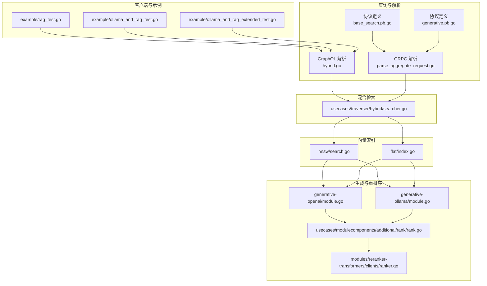
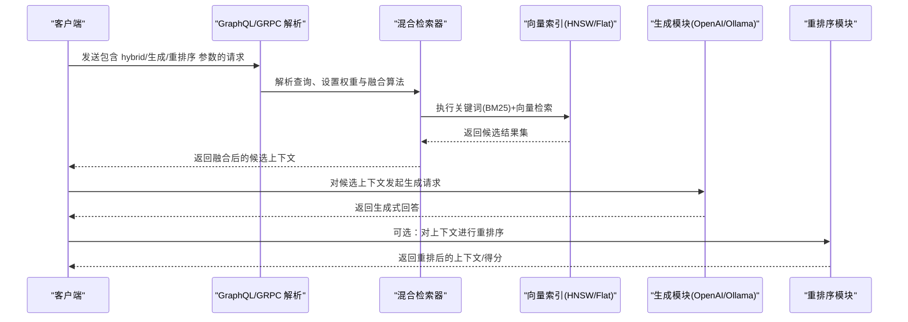
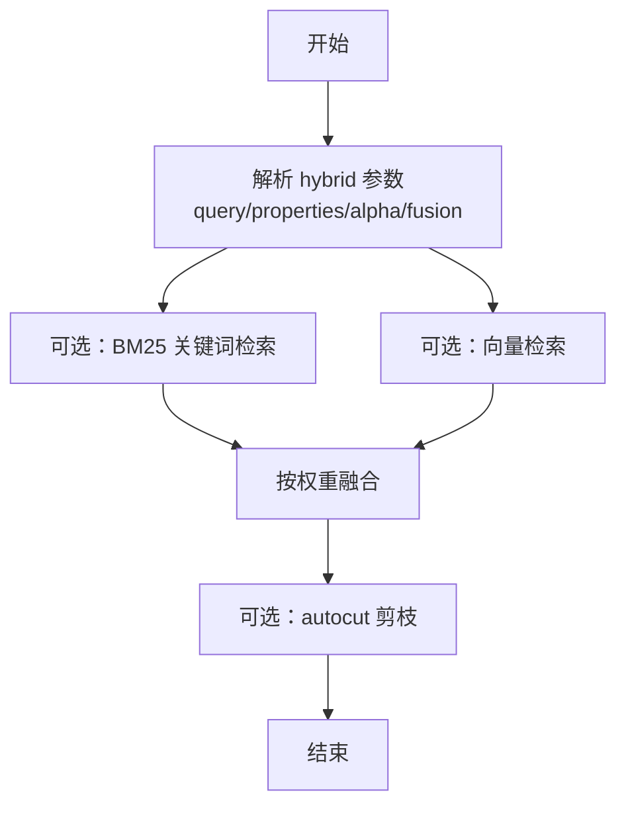
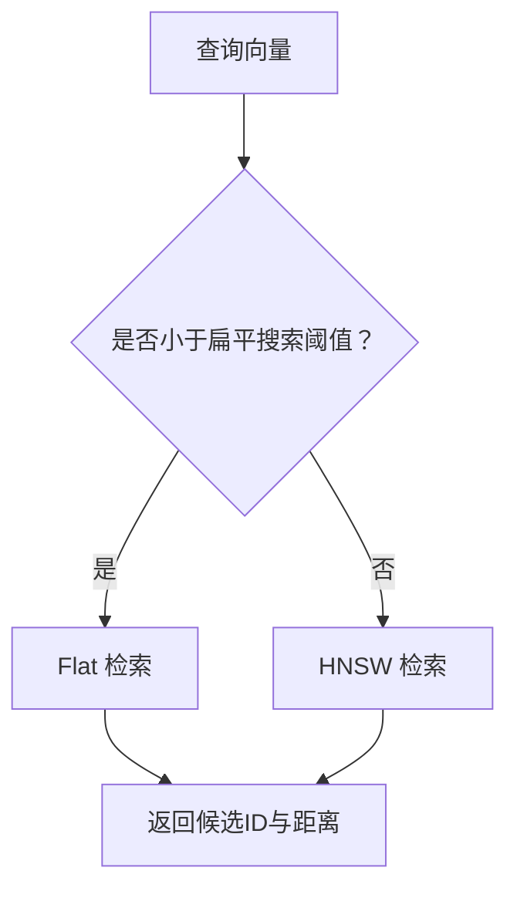
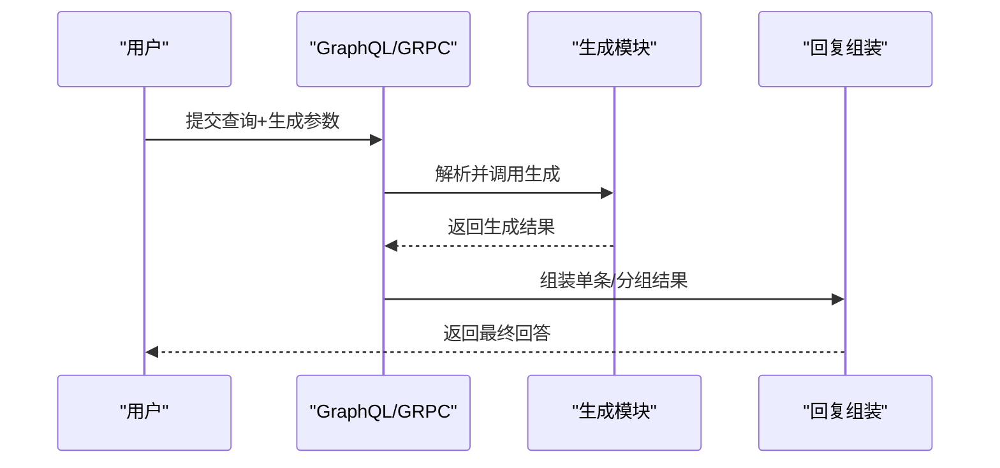
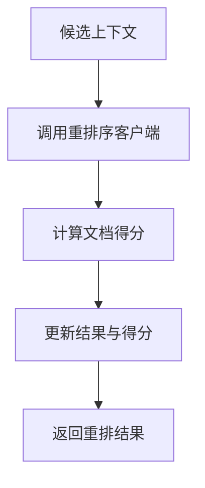
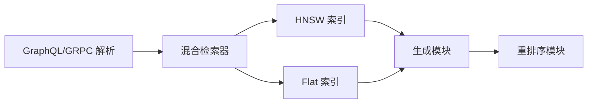

# RAG 系统

<cite>
**本文引用的文件**
- [example/rag_test.go](file://example/rag_test.go)
- [example/ollama_and_rag_test.go](file://example/ollama_and_rag_test.go)
- [example/ollama_and_rag_extended_test.go](file://example/ollama_and_rag_extended_test.go)
- [usecases/traverser/hybrid/searcher.go](file://usecases/traverser/hybrid/searcher.go)
- [adapters/handlers/graphql/local/common_filters/hybrid.go](file://adapters/handlers/graphql/local/common_filters/hybrid.go)
- [adapters/handlers/grpc/v1/parse_aggregate_request.go](file://adapters/handlers/grpc/v1/parse_aggregate_request.go)
- [grpc/generated/protocol/v1/base_search.pb.go](file://grpc/generated/protocol/v1/base_search.pb.go)
- [grpc/generated/protocol/v1/generative.pb.go](file://grpc/generated/protocol/v1/generative.pb.go)
- [adapters/handlers/grpc/v1/generative/replier.go](file://adapters/handlers/grpc/v1/generative/replier.go)
- [adapters/handlers/grpc/v1/prepare_reply.go](file://adapters/handlers/grpc/v1/prepare_reply.go)
- [usecases/modulecomponents/additional/rank/rank.go](file://usecases/modulecomponents/additional/rank/rank.go)
- [usecases/modulecomponents/additional/rank/rank_result.go](file://usecases/modulecomponents/additional/rank/rank_result.go)
- [modules/reranker-transformers/clients/ranker.go](file://modules/reranker-transformers/clients/ranker.go)
- [modules/reranker-contextualai/clients/ranker_test.go](file://modules/reranker-contextualai/clients/ranker_test.go)
- [modules/generative-ollama/module.go](file://modules/generative-ollama/module.go)
- [modules/generative-openai/module.go](file://modules/generative-openai/module.go)
- [adapters/repos/db/vector/hnsw/search.go](file://adapters/repos/db/vector/hnsw/search.go)
- [adapters/repos/db/vector/hnsw/flat_search.go](file://adapters/repos/db/vector/hnsw/flat_search.go)
- [adapters/repos/db/vector/flat/index.go](file://adapters/repos/db/vector/flat/index.go)
- [test/acceptance_with_go_client/search_test.go](file://test/acceptance_with_go_client/search_test.go)
- [test/acceptance_with_go_client/generative_test.go](file://test/acceptance_with_go_client/generative_test.go)
</cite>

## 目录
1. [简介](#简介)
2. [项目结构](#项目结构)
3. [核心组件](#核心组件)
4. [架构总览](#架构总览)
5. [详细组件分析](#详细组件分析)
6. [依赖关系分析](#依赖关系分析)
7. [性能考量](#性能考量)
8. [故障排查指南](#故障排查指南)
9. [结论](#结论)
10. [附录](#附录)

## 简介
本文件面向希望在 Weaviate 上构建端到端 RAG（检索增强生成）应用的工程师与技术文档读者。内容覆盖从数据预处理、向量化与索引构建，到混合检索、上下文获取、生成式回答与重排序的完整工作流，并结合语义搜索与关键词过滤（BM25）提升检索质量。同时提供多生成式模型（OpenAI、Claude/Ollama、本地 Ollama）集成方式与最佳实践，包括错误处理、性能优化与成本控制策略。

## 项目结构
Weaviate 的 RAG 能力由“查询层（GraphQL/GRPC）—混合检索—向量索引—生成与重排序模块”构成。示例测试展示了如何通过 Go 客户端连接 Weaviate、创建集合、导入数据、执行检索与生成式查询；核心检索逻辑位于混合检索模块，向量检索由 HNSW/Flat 索引提供支持；生成与重排序分别由各模块提供能力。

图表来源
- [example/rag_test.go](file://example/rag_test.go#L1-L69)
- [example/ollama_and_rag_test.go](file://example/ollama_and_rag_test.go#L1-L112)
- [example/ollama_and_rag_extended_test.go](file://example/ollama_and_rag_extended_test.go#L1-L153)
- [adapters/handlers/graphql/local/common_filters/hybrid.go](file://adapters/handlers/graphql/local/common_filters/hybrid.go#L131-L188)
- [adapters/handlers/grpc/v1/parse_aggregate_request.go](file://adapters/handlers/grpc/v1/parse_aggregate_request.go#L263-L307)
- [grpc/generated/protocol/v1/base_search.pb.go](file://grpc/generated/protocol/v1/base_search.pb.go#L506-L573)
- [grpc/generated/protocol/v1/generative.pb.go](file://grpc/generated/protocol/v1/generative.pb.go#L128-L2990)
- [usecases/traverser/hybrid/searcher.go](file://usecases/traverser/hybrid/searcher.go#L74-L153)
- [adapters/repos/db/vector/hnsw/search.go](file://adapters/repos/db/vector/hnsw/search.go#L78-L146)
- [adapters/repos/db/vector/flat/index.go](file://adapters/repos/db/vector/flat/index.go#L423-L458)
- [modules/generative-openai/module.go](file://modules/generative-openai/module.go#L27-L88)
- [modules/generative-ollama/module.go](file://modules/generative-ollama/module.go#L26-L83)
- [usecases/modulecomponents/additional/rank/rank.go](file://usecases/modulecomponents/additional/rank/rank.go#L27-L60)
- [modules/reranker-transformers/clients/ranker.go](file://modules/reranker-transformers/clients/ranker.go#L113-L182)

章节来源
- [example/rag_test.go](file://example/rag_test.go#L1-L69)
- [example/ollama_and_rag_test.go](file://example/ollama_and_rag_test.go#L1-L112)
- [example/ollama_and_rag_extended_test.go](file://example/ollama_and_rag_extended_test.go#L1-L153)

## 核心组件
- 混合检索（语义+关键词）
  - GraphQL/GRPC 层解析 hybrid 查询参数，设置融合算法、权重与阈值。
  - 混合检索器组合 BM25（关键词）与向量（语义），支持相对分数融合与自动剪枝（autocut）。
- 向量索引
  - HNSW 与 Flat 索引提供 KNN 检索，支持单/多向量查询与距离阈值过滤。
- 生成式回答
  - 多生成模块（OpenAI、Ollama 等）通过额外属性接口注入到查询结果中。
- 重排序
  - 基于 rerank 模块对候选上下文进行重排序，提升最终答案质量。

章节来源
- [usecases/traverser/hybrid/searcher.go](file://usecases/traverser/hybrid/searcher.go#L74-L153)
- [adapters/handlers/grpc/v1/parse_aggregate_request.go](file://adapters/handlers/grpc/v1/parse_aggregate_request.go#L263-L307)
- [adapters/repos/db/vector/hnsw/search.go](file://adapters/repos/db/vector/hnsw/search.go#L78-L146)
- [adapters/repos/db/vector/flat/index.go](file://adapters/repos/db/vector/flat/index.go#L423-L458)
- [modules/generative-openai/module.go](file://modules/generative-openai/module.go#L27-L88)
- [modules/generative-ollama/module.go](file://modules/generative-ollama/module.go#L26-L83)
- [usecases/modulecomponents/additional/rank/rank.go](file://usecases/modulecomponents/additional/rank/rank.go#L27-L60)

## 架构总览
下图展示一次典型 RAG 请求从客户端到生成与重排序的端到端流程。

图表来源
- [adapters/handlers/graphql/local/common_filters/hybrid.go](file://adapters/handlers/graphql/local/common_filters/hybrid.go#L131-L188)
- [adapters/handlers/grpc/v1/parse_aggregate_request.go](file://adapters/handlers/grpc/v1/parse_aggregate_request.go#L263-L307)
- [usecases/traverser/hybrid/searcher.go](file://usecases/traverser/hybrid/searcher.go#L74-L153)
- [adapters/repos/db/vector/hnsw/search.go](file://adapters/repos/db/vector/hnsw/search.go#L78-L146)
- [adapters/repos/db/vector/flat/index.go](file://adapters/repos/db/vector/flat/index.go#L423-L458)
- [adapters/handlers/grpc/v1/generative/replier.go](file://adapters/handlers/grpc/v1/generative/replier.go#L333-L362)
- [adapters/handlers/grpc/v1/prepare_reply.go](file://adapters/handlers/grpc/v1/prepare_reply.go#L417-L454)

## 详细组件分析

### 混合检索（语义+关键词）
- 关键点
  - 支持设置 alpha 权重，平衡 BM25 与向量检索贡献。
  - 支持融合算法（相对分数融合等）与自动剪枝（autocut）。
  - 可配置 BM25 搜索算子与最小 OR 匹配数。
- 流程
  - 解析 hybrid 参数（查询、属性、向量、alpha、融合类型、BM25 算子等）。
  - 分别执行关键词与向量检索，按权重融合，必要时应用后处理与剪枝。

图表来源
- [adapters/handlers/graphql/local/common_filters/hybrid.go](file://adapters/handlers/graphql/local/common_filters/hybrid.go#L131-L188)
- [adapters/handlers/grpc/v1/parse_aggregate_request.go](file://adapters/handlers/grpc/v1/parse_aggregate_request.go#L263-L307)
- [usecases/traverser/hybrid/searcher.go](file://usecases/traverser/hybrid/searcher.go#L74-L153)

章节来源
- [usecases/traverser/hybrid/searcher.go](file://usecases/traverser/hybrid/searcher.go#L74-L153)
- [adapters/handlers/graphql/local/common_filters/hybrid.go](file://adapters/handlers/graphql/local/common_filters/hybrid.go#L131-L188)
- [adapters/handlers/grpc/v1/parse_aggregate_request.go](file://adapters/handlers/grpc/v1/parse_aggregate_request.go#L263-L307)
- [grpc/generated/protocol/v1/base_search.pb.go](file://grpc/generated/protocol/v1/base_search.pb.go#L506-L573)
- [test/acceptance_with_go_client/search_test.go](file://test/acceptance_with_go_client/search_test.go#L219-L250)

### 向量检索与索引
- 关键点
  - HNSW 支持 KNN 与多向量查询，具备自适应 ef 计算与扁平搜索切换。
  - Flat 索引支持量化与常规向量检索。
  - 支持基于目标距离的过滤（SearchByVectorDistance）。
- 流程
  - 根据允许列表与配置选择 HNSW 或 Flat。
  - 执行 KNN 检索并返回 ID 与距离。

图表来源
- [adapters/repos/db/vector/hnsw/search.go](file://adapters/repos/db/vector/hnsw/search.go#L78-L146)
- [adapters/repos/db/vector/hnsw/flat_search.go](file://adapters/repos/db/vector/hnsw/flat_search.go#L28-L179)
- [adapters/repos/db/vector/flat/index.go](file://adapters/repos/db/vector/flat/index.go#L423-L458)

章节来源
- [adapters/repos/db/vector/hnsw/search.go](file://adapters/repos/db/vector/hnsw/search.go#L78-L146)
- [adapters/repos/db/vector/hnsw/flat_search.go](file://adapters/repos/db/vector/hnsw/flat_search.go#L28-L179)
- [adapters/repos/db/vector/flat/index.go](file://adapters/repos/db/vector/flat/index.go#L423-L458)

### 生成式回答（OpenAI、Ollama、本地 Ollama）
- 关键点
  - 生成模块通过额外属性接口注入到查询结果中，支持单条与分组生成。
  - GRPC/GraphQL 层负责参数解析与结果回填。
- 流程
  - 客户端发送包含生成参数的请求。
  - 解析层提取提示词与生成配置。
  - 调用对应生成模块，返回结果并写入响应。

图表来源
- [grpc/generated/protocol/v1/generative.pb.go](file://grpc/generated/protocol/v1/generative.pb.go#L128-L2990)
- [adapters/handlers/grpc/v1/generative/replier.go](file://adapters/handlers/grpc/v1/generative/replier.go#L333-L362)
- [adapters/handlers/grpc/v1/prepare_reply.go](file://adapters/handlers/grpc/v1/prepare_reply.go#L417-L454)
- [modules/generative-openai/module.go](file://modules/generative-openai/module.go#L27-L88)
- [modules/generative-ollama/module.go](file://modules/generative-ollama/module.go#L26-L83)
- [test/acceptance_with_go_client/generative_test.go](file://test/acceptance_with_go_client/generative_test.go#L69-L89)

章节来源
- [modules/generative-openai/module.go](file://modules/generative-openai/module.go#L27-L88)
- [modules/generative-ollama/module.go](file://modules/generative-ollama/module.go#L26-L83)
- [adapters/handlers/grpc/v1/generative/replier.go](file://adapters/handlers/grpc/v1/generative/replier.go#L333-L362)
- [adapters/handlers/grpc/v1/prepare_reply.go](file://adapters/handlers/grpc/v1/prepare_reply.go#L417-L454)
- [test/acceptance_with_go_client/generative_test.go](file://test/acceptance_with_go_client/generative_test.go#L69-L89)

### 重排序（Rerank）
- 关键点
  - 通过额外属性接口启用 rerank，对候选上下文打分。
  - 支持 Transformers 与 ContextualAI 等实现。
- 流程
  - 在查询中启用 rerank，传入查询与候选文本列表。
  - 调用重排序客户端，返回每个文档的得分并更新结果。

图表来源
- [usecases/modulecomponents/additional/rank/rank.go](file://usecases/modulecomponents/additional/rank/rank.go#L27-L60)
- [usecases/modulecomponents/additional/rank/rank_result.go](file://usecases/modulecomponents/additional/rank/rank_result.go#L26-L42)
- [modules/reranker-transformers/clients/ranker.go](file://modules/reranker-transformers/clients/ranker.go#L113-L182)
- [modules/reranker-contextualai/clients/ranker_test.go](file://modules/reranker-contextualai/clients/ranker_test.go#L99-L154)

章节来源
- [usecases/modulecomponents/additional/rank/rank.go](file://usecases/modulecomponents/additional/rank/rank.go#L27-L60)
- [usecases/modulecomponents/additional/rank/rank_result.go](file://usecases/modulecomponents/additional/rank/rank_result.go#L26-L42)
- [modules/reranker-transformers/clients/ranker.go](file://modules/reranker-transformers/clients/ranker.go#L113-L182)
- [modules/reranker-contextualai/clients/ranker_test.go](file://modules/reranker-contextualai/clients/ranker_test.go#L99-L154)

### 示例与最佳实践
- 连接与基本操作
  - 使用 Go 客户端连接 Weaviate，检查连接与模式。
  - 清理/创建集合，插入对象，批量导入并校验成功数量。
- 混合检索与 BM25
  - 通过 GraphQL 指定 hybrid 查询，设置 alpha、融合类型与 autocut。
- 生成式回答
  - 配置生成模块（OpenAI/Ollama），在查询中启用生成，读取单条或分组结果。
- 错误处理
  - 对不存在类名、非法参数等情况进行断言与错误捕获。

章节来源
- [example/rag_test.go](file://example/rag_test.go#L12-L69)
- [example/ollama_and_rag_test.go](file://example/ollama_and_rag_test.go#L14-L112)
- [example/ollama_and_rag_extended_test.go](file://example/ollama_and_rag_extended_test.go#L14-L153)
- [test/acceptance_with_go_client/search_test.go](file://test/acceptance_with_go_client/search_test.go#L219-L250)
- [test/acceptance_with_go_client/generative_test.go](file://test/acceptance_with_go_client/generative_test.go#L69-L89)

## 依赖关系分析
- 查询层依赖混合检索器与向量索引，生成与重排序作为可选附加属性参与结果扩展。
- 协议层（GRPC/GraphQL）定义了 hybrid、near 等查询参数与生成/重排序的返回格式。
- 生成模块与重排序模块通过统一接口接入，便于替换与扩展。

图表来源
- [adapters/handlers/graphql/local/common_filters/hybrid.go](file://adapters/handlers/graphql/local/common_filters/hybrid.go#L131-L188)
- [adapters/handlers/grpc/v1/parse_aggregate_request.go](file://adapters/handlers/grpc/v1/parse_aggregate_request.go#L263-L307)
- [usecases/traverser/hybrid/searcher.go](file://usecases/traverser/hybrid/searcher.go#L74-L153)
- [adapters/repos/db/vector/hnsw/search.go](file://adapters/repos/db/vector/hnsw/search.go#L78-L146)
- [adapters/repos/db/vector/flat/index.go](file://adapters/repos/db/vector/flat/index.go#L423-L458)
- [modules/generative-openai/module.go](file://modules/generative-openai/module.go#L27-L88)
- [modules/generative-ollama/module.go](file://modules/generative-ollama/module.go#L26-L83)
- [usecases/modulecomponents/additional/rank/rank.go](file://usecases/modulecomponents/additional/rank/rank.go#L27-L60)

## 性能考量
- 混合检索
  - 合理设置 alpha 与融合算法，避免过度偏向关键词或向量。
  - 使用 autocut 剪枝减少下游生成负担。
- 向量检索
  - HNSW 自适应 ef 设置与扁平搜索阈值切换，确保在不同规模数据下的稳定性能。
  - 多向量查询时注意 overfetch 与候选集去重。
- 生成与重排序
  - 控制上下文长度与数量，避免过长输入导致延迟与成本上升。
  - 对重排序进行批处理与限流，避免峰值抖动。

## 故障排查指南
- 连接与模式
  - 若连接失败或模式为空，检查主机地址与服务状态。
- 类创建与删除
  - 创建前先检查是否存在并清理，避免重复或冲突。
- 查询参数
  - hybrid 参数冲突（如同时设置 nearText 与 nearVector）会导致错误，需按规范配置。
  - 生成模块未启用时，单条生成结果可能为空，需确认模块配置与环境变量。
- 重排序
  - 重排序客户端返回非 200 状态码时，检查网络与服务端日志，关注错误消息字段。

章节来源
- [example/ollama_and_rag_extended_test.go](file://example/ollama_and_rag_extended_test.go#L135-L153)
- [adapters/handlers/grpc/v1/parse_aggregate_request.go](file://adapters/handlers/grpc/v1/parse_aggregate_request.go#L263-L307)
- [adapters/handlers/grpc/v1/generative/replier.go](file://adapters/handlers/grpc/v1/generative/replier.go#L333-L362)
- [modules/reranker-contextualai/clients/ranker_test.go](file://modules/reranker-contextualai/clients/ranker_test.go#L99-L154)

## 结论
Weaviate 的 RAG 能力通过“混合检索 + 向量索引 + 生成 + 重排序”的分层设计，实现了从检索到生成的完整闭环。结合语义与关键词的优势，配合多生成模型与重排序模块，可在准确性与效率之间取得良好平衡。建议在生产环境中合理配置混合权重、autocut 与生成上下文长度，并对重排序进行批处理与限流，以获得更优的成本与性能表现。

## 附录
- 快速上手步骤
  - 连接 Weaviate 并创建集合（可选：指定向量化与生成模块）。
  - 导入数据并等待向量化完成。
  - 使用 GraphQL/GRPC 发起 hybrid 查询，启用生成与重排序。
  - 观察结果并根据业务反馈调整参数。