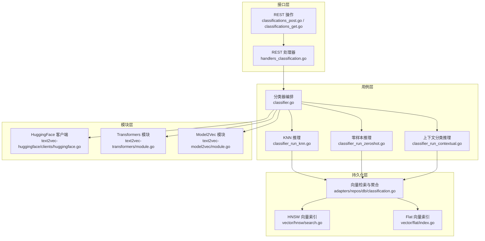
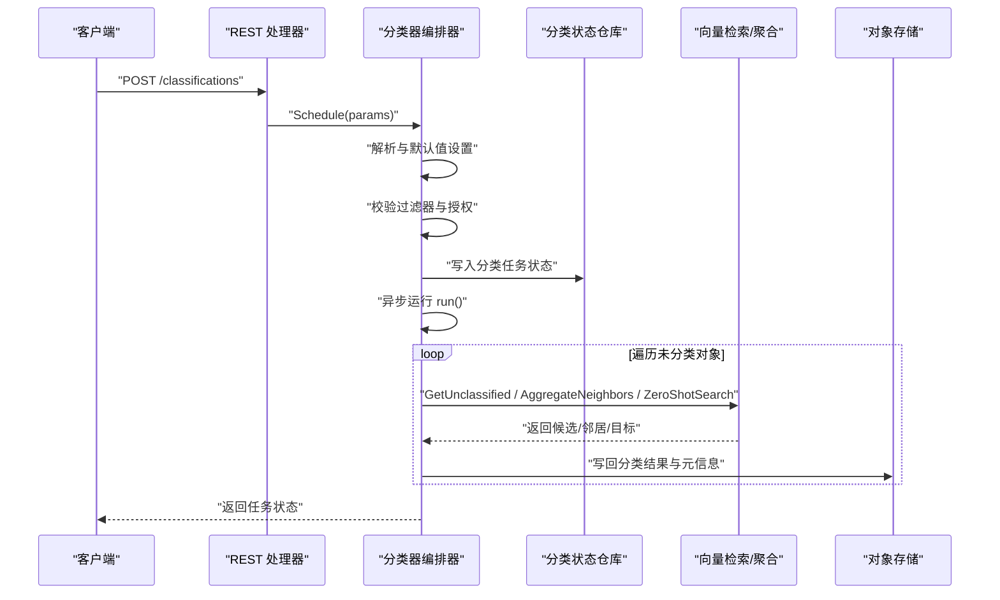
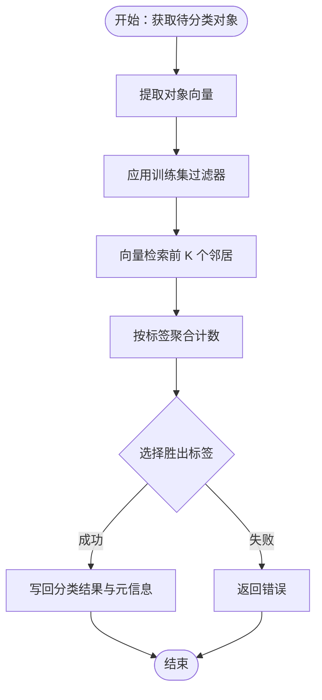
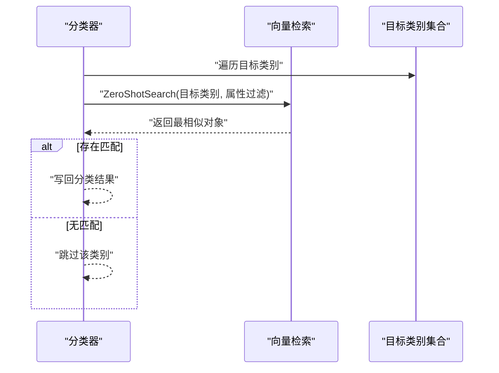
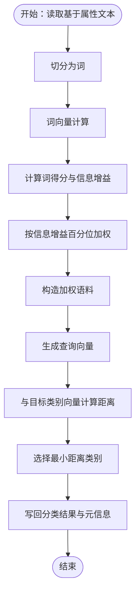
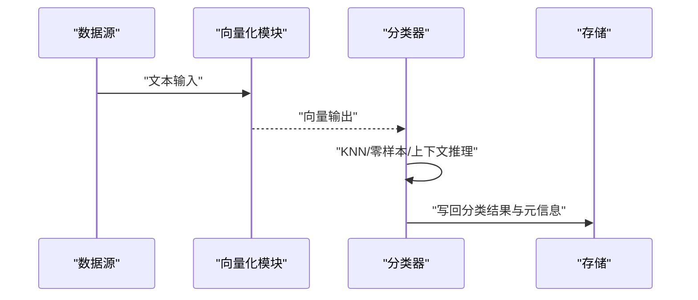
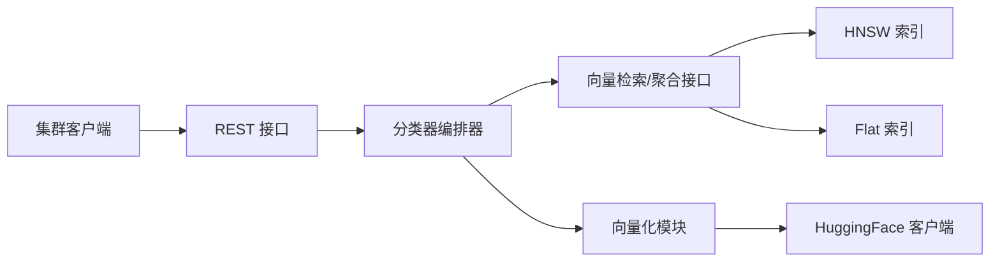

# 内容分类和标记

<cite>
**本文引用的文件**
- [usecases/classification/classifier.go](file://usecases/classification/classifier.go)
- [usecases/classification/classifier_run_knn.go](file://usecases/classification/classifier_run_knn.go)
- [usecases/classification/classifier_run_zeroshot.go](file://usecases/classification/classifier_run_zeroshot.go)
- [adapters/repos/db/classification.go](file://adapters/repos/db/classification.go)
- [modules/text2vec-contextionary/classification/classifier_run_contextual.go](file://modules/text2vec-contextionary/classification/classifier_run_contextual.go)
- [entities/models/classification.go](file://entities/models/classification.go)
- [adapters/handlers/rest/operations/classifications/classifications_post.go](file://adapters/handlers/rest/operations/classifications/classifications_post.go)
- [adapters/handlers/rest/operations/classifications/classifications_get.go](file://adapters/handlers/rest/operations/classifications/classifications_get.go)
- [adapters/handlers/rest/handlers_classification.go](file://adapters/handlers/rest/handlers_classification.go)
- [adapters/clients/cluster_classifications.go](file://adapters/clients/cluster_classifications.go)
- [adapters/repos/db/vector/hnsw/search.go](file://adapters/repos/db/vector/hnsw/search.go)
- [adapters/repos/db/vector/flat/index.go](file://adapters/repos/db/vector/flat/index.go)
- [modules/text2vec-huggingface/clients/huggingface.go](file://modules/text2vec-huggingface/clients/huggingface.go)
- [modules/text2vec-transformers/module.go](file://modules/text2vec-transformers/module.go)
- [modules/text2vec-model2vec/module.go](file://modules/text2vec-model2vec/module.go)
- [test/acceptance/classifications/setup_test.go](file://test/acceptance/classifications/setup_test.go)
</cite>

## 目录
1. [简介](#简介)
2. [项目结构](#项目结构)
3. [核心组件](#核心组件)
4. [架构总览](#架构总览)
5. [详细组件分析](#详细组件分析)
6. [依赖关系分析](#依赖关系分析)
7. [性能考量](#性能考量)
8. [故障排查指南](#故障排查指南)
9. [结论](#结论)
10. [附录](#附录)

## 简介
本文件面向在 Weaviate 中使用向量数据库进行自动化内容分类与标记的应用场景，系统性阐述如何基于 KNN 分类器、零样本（Zero-Shot）分类器以及上下文分类器构建完整的分类流水线。内容覆盖从数据预处理、向量化、训练与推理，到不平衡数据与类别边界模糊问题的处理策略，并给出金融文档、医疗报告、社交媒体审核等多行业落地建议。同时提供性能评估指标与优化路径，帮助读者在真实业务中稳定落地。

## 项目结构
Weaviate 的分类能力由“用例层”（usecases/classification）统一编排，结合“持久化层”（adapters/repos/db）的向量检索与聚合逻辑，以及“模块层”（modules）提供的文本向量化能力共同完成。REST 接口负责调度，集群客户端支持分布式执行。

图示来源
- [usecases/classification/classifier.go](file://usecases/classification/classifier.go#L151-L189)
- [usecases/classification/classifier_run_knn.go](file://usecases/classification/classifier_run_knn.go#L22-L62)
- [usecases/classification/classifier_run_zeroshot.go](file://usecases/classification/classifier_run_zeroshot.go#L24-L75)
- [adapters/repos/db/classification.go](file://adapters/repos/db/classification.go#L31-L116)
- [adapters/repos/db/vector/hnsw/search.go](file://adapters/repos/db/vector/hnsw/search.go#L1020-L1043)
- [adapters/repos/db/vector/flat/index.go](file://adapters/repos/db/vector/flat/index.go#L423-L458)
- [modules/text2vec-huggingface/clients/huggingface.go](file://modules/text2vec-huggingface/clients/huggingface.go#L150-L189)
- [modules/text2vec-transformers/module.go](file://modules/text2vec-transformers/module.go#L1-L36)
- [modules/text2vec-model2vec/module.go](file://modules/text2vec-model2vec/module.go#L1-L36)

章节来源
- [usecases/classification/classifier.go](file://usecases/classification/classifier.go#L151-L189)
- [adapters/handlers/rest/operations/classifications/classifications_post.go](file://adapters/handlers/rest/operations/classifications/classifications_post.go)
- [adapters/handlers/rest/operations/classifications/classifications_get.go](file://adapters/handlers/rest/operations/classifications/classifications_get.go)
- [adapters/handlers/rest/handlers_classification.go](file://adapters/handlers/rest/handlers_classification.go)

## 核心组件
- 分类器编排器（Classifier）
  - 负责参数解析、过滤器校验、调度与运行；支持 KNN、零样本、上下文三类算法。
  - 提供统一入口 Schedule 与运行时验证、授权与元信息管理。
- KNN 分类器
  - 基于邻居聚合（AggregateNeighbors）选择最常见标签，适合有明确训练集的场景。
- 零样本分类器
  - 基于目标类别向量与候选对象相似度匹配，无需显式训练集，适合开放域分类。
- 上下文分类器（Contextual）
  - 基于词级向量与 TF-IDF/信息增益打分，构建加权语义向量后与目标类别最近邻匹配。
- 向量检索与聚合（VectorRepo 实现）
  - 提供 GetUnclassified、AggregateNeighbors、ZeroShotSearch、VectorSearch 等接口，封装底层索引查询与统计。
- REST 接口与集群客户端
  - 提供分类任务提交、状态查询与分布式执行支持。

章节来源
- [usecases/classification/classifier.go](file://usecases/classification/classifier.go#L59-L149)
- [usecases/classification/classifier_run_knn.go](file://usecases/classification/classifier_run_knn.go#L22-L62)
- [usecases/classification/classifier_run_zeroshot.go](file://usecases/classification/classifier_run_zeroshot.go#L24-L75)
- [adapters/repos/db/classification.go](file://adapters/repos/db/classification.go#L31-L116)
- [adapters/clients/cluster_classifications.go](file://adapters/clients/cluster_classifications.go)

## 架构总览
以下序列图展示一次分类任务从提交到完成的关键调用链，涵盖参数解析、过滤器校验、调度运行与存储更新。

图示来源
- [adapters/handlers/rest/handlers_classification.go](file://adapters/handlers/rest/handlers_classification.go)
- [usecases/classification/classifier.go](file://usecases/classification/classifier.go#L151-L189)
- [adapters/repos/db/classification.go](file://adapters/repos/db/classification.go#L31-L116)

## 详细组件分析

### KNN 分类器工作原理与适用场景
- 工作原理
  - 使用训练集过滤条件筛选已标注对象，对每个待分类对象的向量执行邻居搜索，统计各候选标签的出现频次，选择胜出标签作为预测结果。
  - 距离度量采用归一化距离，聚合统计包含总体计数、胜出计数、失败计数及各类距离统计。
- 适用场景
  - 有明确标注数据且类别边界清晰的任务，如新闻文章细粒度分类、产品内容标注等。
- 关键实现要点
  - 参数解析与默认 K 值设置。
  - 运行时超时控制与错误传播。
  - 将分类元信息写回到对象附加属性。

图示来源
- [usecases/classification/classifier_run_knn.go](file://usecases/classification/classifier_run_knn.go#L22-L62)
- [adapters/repos/db/classification.go](file://adapters/repos/db/classification.go#L90-L116)

章节来源
- [usecases/classification/classifier_run_knn.go](file://usecases/classification/classifier_run_knn.go#L22-L62)
- [adapters/repos/db/classification.go](file://adapters/repos/db/classification.go#L90-L116)
- [usecases/classification/classifier.go](file://usecases/classification/classifier.go#L311-L346)

### 零样本（Zero-Shot）分类器工作原理与适用场景
- 工作原理
  - 对每个目标类别，执行向量检索以找到最相似的对象，若存在则将该类别作为预测标签。
  - 适用于无显式训练集但具备类别描述或示例对象的场景。
- 适用场景
  - 开放域分类、新类别快速上线、跨领域迁移等。
- 关键实现要点
  - 针对每个目标属性与类别组合执行检索，满足条件即写回分类结果。

图示来源
- [usecases/classification/classifier_run_zeroshot.go](file://usecases/classification/classifier_run_zeroshot.go#L24-L75)
- [adapters/repos/db/classification.go](file://adapters/repos/db/classification.go#L64-L86)

章节来源
- [usecases/classification/classifier_run_zeroshot.go](file://usecases/classification/classifier_run_zeroshot.go#L24-L75)
- [adapters/repos/db/classification.go](file://adapters/repos/db/classification.go#L64-L86)

### 上下文（Contextual）分类器工作原理与适用场景
- 工作原理
  - 基于词级向量与 TF-IDF/信息增益评分，构建加权语义向量，再与目标类别最近邻比较，选择最小距离类别。
  - 适合基于关键词与语义权重的细粒度分类。
- 适用场景
  - 文本描述丰富、需要强调关键词重要性的标注任务。
- 关键实现要点
  - 词级向量化、TF-IDF 百分位截断、信息增益加权、最近邻查找与元信息写回。

图示来源
- [modules/text2vec-contextionary/classification/classifier_run_contextual.go](file://modules/text2vec-contextionary/classification/classifier_run_contextual.go#L113-L183)

章节来源
- [modules/text2vec-contextionary/classification/classifier_run_contextual.go](file://modules/text2vec-contextionary/classification/classifier_run_contextual.go#L113-L183)

### 分类流水线实现（数据预处理 → 向量化 → 训练/推理 → 结果写回）
- 数据预处理
  - 确保目标分类类别的 Schema 正确，属性类型与引用关系符合预期。
  - 准备训练集（KNN）与目标类别集合（零样本/上下文）。
- 向量化
  - 通过模块层的向量化客户端生成文本向量，支持多种模型（如 Transformers、HuggingFace、Model2Vec）。
- 训练与推理
  - KNN：邻居聚合；零样本：目标检索；上下文：词级向量与加权。
- 结果写回
  - 将分类结果写入对象引用属性，并补充分类元信息（时间、字段、统计等）。

图示来源
- [modules/text2vec-transformers/module.go](file://modules/text2vec-transformers/module.go#L1-L36)
- [modules/text2vec-huggingface/clients/huggingface.go](file://modules/text2vec-huggingface/clients/huggingface.go#L150-L189)
- [usecases/classification/classifier.go](file://usecases/classification/classifier.go#L151-L189)
- [adapters/repos/db/classification.go](file://adapters/repos/db/classification.go#L31-L116)

章节来源
- [modules/text2vec-transformers/module.go](file://modules/text2vec-transformers/module.go#L1-L36)
- [modules/text2vec-huggingface/clients/huggingface.go](file://modules/text2vec-huggingface/clients/huggingface.go#L150-L189)
- [usecases/classification/classifier.go](file://usecases/classification/classifier.go#L151-L189)

### 不平衡数据集与类别边界模糊的处理策略
- 不平衡数据
  - KNN：调整 K 值或引入加权投票；对少数类可扩大训练集或使用合成采样。
  - 零样本：确保目标类别示例质量与数量均衡，必要时引入多类别示例。
  - 上下文：通过 TF-IDF 百分位与信息增益阈值控制噪声词影响。
- 类别边界模糊
  - 引入距离统计（胜出/失败距离均值、最近距离）辅助阈值决策与二次校验。
  - 结合业务规则对置信度低的结果进行人工复核或二次标注。

章节来源
- [adapters/repos/db/classification.go](file://adapters/repos/db/classification.go#L180-L238)

### 行业应用案例
- 金融文档分类
  - 场景：合同条款分类、风险等级标注、监管报告归档。
  - 方案：KNN（基于历史标注合同）+ 零样本（新法规条目）。
- 医疗报告标注
  - 场景：检查报告分组、诊断标签生成、随访提醒。
  - 方案：上下文（强调关键词）+ 零样本（新病种/术语）。
- 社交媒体内容审核
  - 场景：违规内容识别、敏感话题标注、平台风控。
  - 方案：零样本（新违禁词/变体）+ KNN（历史违规样本）。

（本节为概念性说明，不直接分析具体文件）

## 依赖关系分析
- 组件耦合
  - 分类器编排器依赖向量检索与聚合接口，解耦具体索引实现。
  - 向量化模块通过客户端抽象与外部服务交互，便于替换与扩展。
- 外部依赖
  - HNSW/Flat 向量索引提供高效近邻检索。
  - REST 与集群客户端提供任务提交与分布式执行。

图示来源
- [usecases/classification/classifier.go](file://usecases/classification/classifier.go#L77-L89)
- [adapters/repos/db/vector/hnsw/search.go](file://adapters/repos/db/vector/hnsw/search.go#L1020-L1043)
- [adapters/repos/db/vector/flat/index.go](file://adapters/repos/db/vector/flat/index.go#L423-L458)
- [adapters/handlers/rest/handlers_classification.go](file://adapters/handlers/rest/handlers_classification.go)
- [adapters/clients/cluster_classifications.go](file://adapters/clients/cluster_classifications.go)

章节来源
- [usecases/classification/classifier.go](file://usecases/classification/classifier.go#L77-L89)
- [adapters/repos/db/vector/hnsw/search.go](file://adapters/repos/db/vector/hnsw/search.go#L1020-L1043)
- [adapters/repos/db/vector/flat/index.go](file://adapters/repos/db/vector/flat/index.go#L423-L458)

## 性能考量
- 向量检索性能
  - HNSW 支持压缩与查询向量归一化，减少距离计算开销；Flat 索引在小规模数据上具有简单高效的特性。
- 距离计算与聚合
  - 归一化距离与批量优先队列有助于提升检索稳定性与吞吐。
- 批处理与并发
  - REST 层异步触发分类任务，避免阻塞请求；模块层支持批量化向量化。
- 指标与监控
  - 建议关注检索耗时、邻居聚合耗时、分类任务吞吐与错误率，结合日志与指标系统持续优化。

章节来源
- [adapters/repos/db/vector/hnsw/search.go](file://adapters/repos/db/vector/hnsw/search.go#L1020-L1043)
- [adapters/repos/db/vector/flat/index.go](file://adapters/repos/db/vector/flat/index.go#L423-L458)
- [usecases/classification/classifier.go](file://usecases/classification/classifier.go#L186-L187)

## 故障排查指南
- 常见错误与定位
  - 参数解析失败：检查 settings 类型与字段是否正确。
  - 过滤器无效：确认过滤器语法与授权范围。
  - 向量检索异常：检查向量化模块可用性与网络连通性。
  - 聚合统计异常：确认训练集对象的引用属性格式与数量。
- 日志与状态
  - 通过分类任务状态与元信息定位失败节点，结合附加属性中的分类元数据进行回溯。

章节来源
- [usecases/classification/classifier.go](file://usecases/classification/classifier.go#L151-L189)
- [adapters/handlers/rest/operations/classifications/classifications_get.go](file://adapters/handlers/rest/operations/classifications/classifications_get.go)
- [adapters/handlers/rest/handlers_classification.go](file://adapters/handlers/rest/handlers_classification.go)

## 结论
Weaviate 的分类体系以统一的编排器为核心，结合 KNN、零样本与上下文三种策略，覆盖从传统监督到开放域分类的广泛需求。通过向量化模块与高效向量索引的配合，可在大规模数据上实现稳定、可扩展的内容分类与自动标记。针对不平衡与边界模糊问题，建议结合距离统计、阈值策略与业务规则进行综合优化。

## 附录

### REST 接口与任务状态
- 提交分类任务
  - POST /classifications：提交分类参数（类型、属性、过滤器、设置）。
- 查询任务状态
  - GET /classifications/{id}：获取任务状态与元信息。
- 集群支持
  - 通过集群客户端支持分布式执行与状态同步。

章节来源
- [adapters/handlers/rest/operations/classifications/classifications_post.go](file://adapters/handlers/rest/operations/classifications/classifications_post.go)
- [adapters/handlers/rest/operations/classifications/classifications_get.go](file://adapters/handlers/rest/operations/classifications/classifications_get.go)
- [adapters/clients/cluster_classifications.go](file://adapters/clients/cluster_classifications.go)

### 模型与向量化配置
- Transformers/HuggingFace/Model2Vec 等模块提供多种向量化选项，可根据数据特征与性能要求选择。
- 向量化结果包含维度与错误信息，便于质量控制与重试。

章节来源
- [modules/text2vec-transformers/module.go](file://modules/text2vec-transformers/module.go#L1-L36)
- [modules/text2vec-huggingface/clients/huggingface.go](file://modules/text2vec-huggingface/clients/huggingface.go#L150-L189)
- [modules/text2vec-model2vec/module.go](file://modules/text2vec-model2vec/module.go#L1-L36)

### 测试与验收场景
- 提供 KNN、零样本与上下文分类的验收测试，覆盖数据准备、执行与断言流程。

章节来源
- [test/acceptance/classifications/setup_test.go](file://test/acceptance/classifications/setup_test.go#L45-L62)