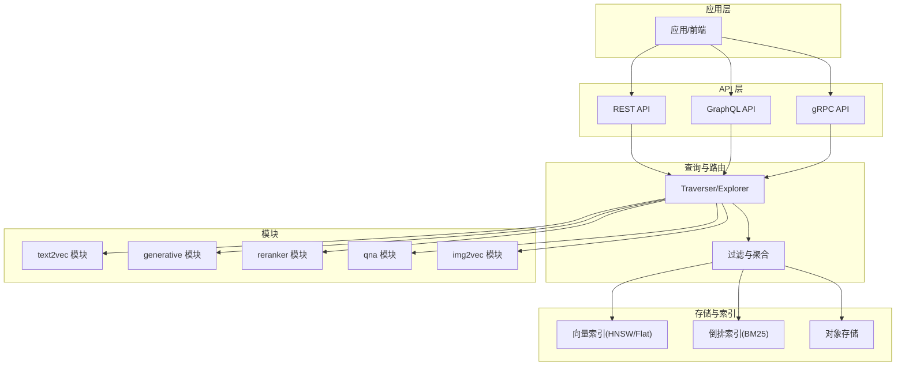
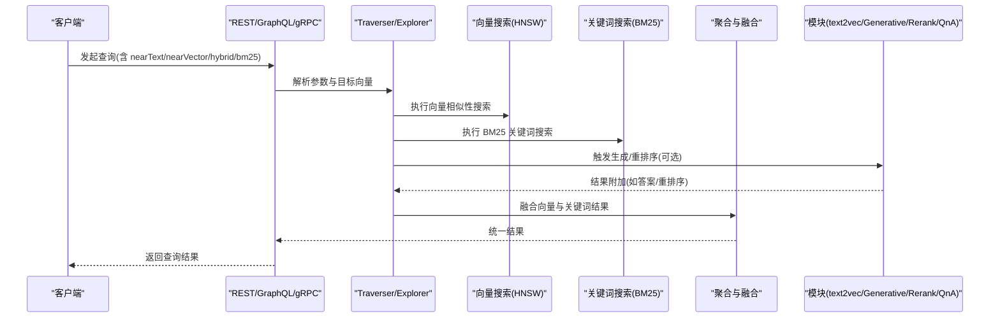
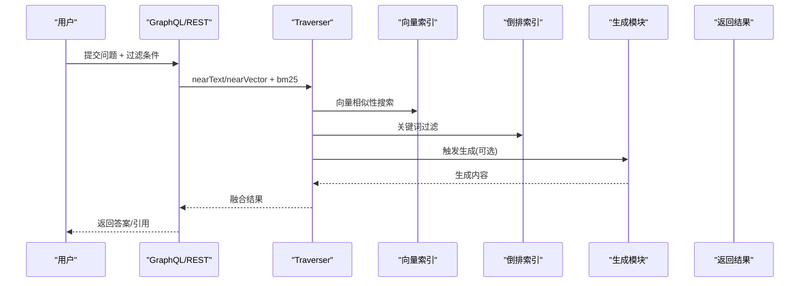
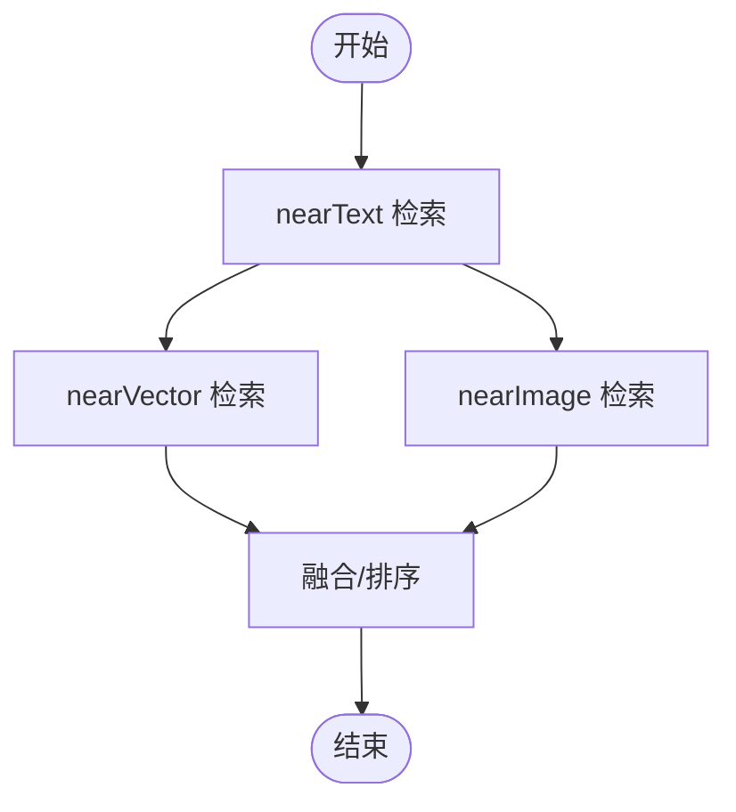
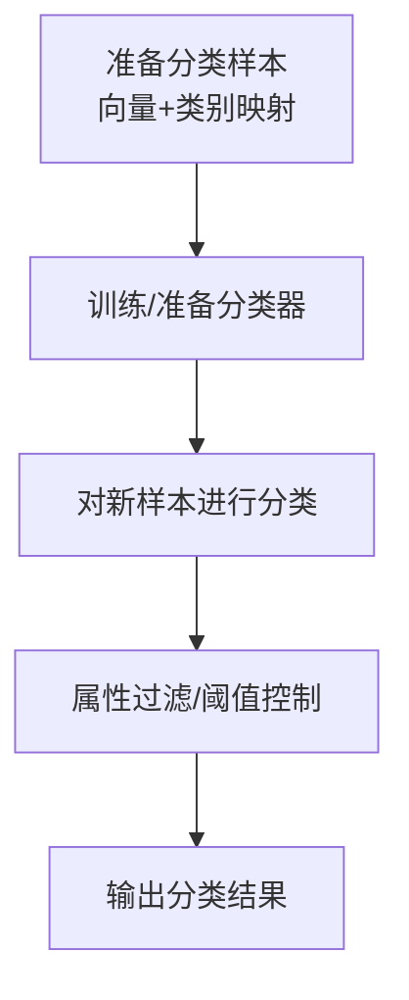
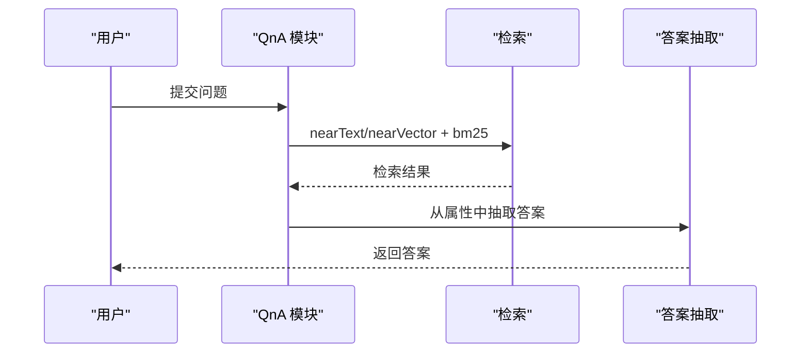
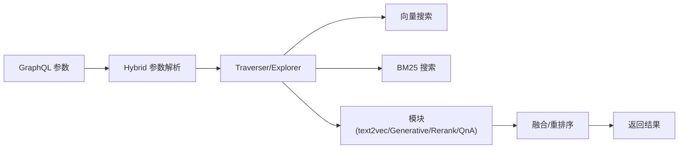

# 应用场景

<cite>
**本文引用的文件**
- [README.md](file://README.md)
- [semantic_search_test.go](file://example/semantic_search_test.go)
- [rag_test.go](file://example/rag_test.go)
- [explorer_hybrid.go](file://usecases/traverser/explorer_hybrid.go)
- [hybrid.go](file://adapters/handlers/graphql/local/common_filters/hybrid.go)
- [retrieval.go](file://entities/searchparams/retrieval.go)
- [filtered.go](file://adapters/repos/db/aggregator/filtered.go)
- [search_get.pb.go](file://grpc/generated/protocol/v1/search_get.pb.go)
- [class.go](file://entities/models/class.go)
- [config.go](file://entities/vectorindex/hnsw/config.go)
- [config.go](file://entities/vectorindex/flat/config.go)
- [classification_integration_test.go](file://adapters/repos/db/classification_integration_test.go)
- [schema_for_test.go](file://usecases/classification/schema_for_test.go)
- [schema_for_test.go](file://modules/text2vec-contextionary/classification/schema_for_test.go)
- [ask.go](file://modules/qna-transformers/ask.go)
- [grapqhl_extract.go](file://modules/qna-transformers/ask/grapqhl_extract.go)
- [answer.go](file://modules/qna-transformers/additional/answer/answer.go)
- [answer_result.go](file://modules/qna-transformers/additional/answer/answer_result.go)
- [ask.go](file://modules/qna-openai/ask.go)
- [config.go](file://modules/text2vec-openai/config.go)
- [config.go](file://modules/generative-openai/config.go)
- [migrator.go](file://adapters/repos/db/migrator.go)
- [index_integration_test.go](file://adapters/repos/db/index_integration_test.go)
- [validation_test.go](file://usecases/schema/validation_test.go)
</cite>

## 目录
1. [简介](#简介)
2. [项目结构](#项目结构)
3. [核心组件](#核心组件)
4. [架构总览](#架构总览)
5. [详细组件分析](#详细组件分析)
6. [依赖关系分析](#依赖关系分析)
7. [性能考量](#性能考量)
8. [故障排查指南](#故障排查指南)
9. [结论](#结论)
10. [附录](#附录)

## 简介
Weaviate 是一个开源、云原生的向量数据库，支持对象与向量的统一存储，并提供大规模语义搜索能力。它将向量相似性搜索与关键词过滤、检索增强生成（RAG）和重排序整合到单一查询接口中，广泛适用于 RAG 系统、语义与图像搜索、推荐引擎、聊天机器人、内容分类、知识图谱、智能问答与文档检索等场景。Weaviate 支持灵活的向量化方式（集成模型或自定义向量），并提供混合搜索、高级过滤、生成式搜索与重排序等能力，适合从原型到生产的各类 AI 应用。

## 项目结构
Weaviate 采用模块化架构，核心由以下部分组成：
- 数据模型与配置：类（Collection）定义、属性、向量索引类型与配置、倒排索引配置等。
- 查询与搜索：GraphQL/REST/gRPC 接口，支持 nearText、nearVector、hybrid、bm25、rerank、generative 等。
- 模块系统：text2vec、generative、reranker、qna、img2vec 等模块提供向量化、生成、重排序与问答能力。
- 存储与索引：HNSW、Flat 等向量索引，支持压缩与量化；倒排索引支持 BM25 与过滤。
- 分布式与运维：分片、复制、多租户、集群状态管理与迁移。

图表来源
- [explorer_hybrid.go](file://usecases/traverser/explorer_hybrid.go#L46-L370)
- [filtered.go](file://adapters/repos/db/aggregator/filtered.go#L46-L97)
- [search_get.pb.go](file://grpc/generated/protocol/v1/search_get.pb.go#L212-L289)

章节来源
- [README.md](file://README.md#L10-L128)

## 核心组件
- 数据模型与集合配置
  - Collection 定义包含名称、描述、属性、向量化器、向量索引类型与配置、倒排索引配置、复制与分片配置等。
  - 参考路径：[class.go](file://entities/models/class.go#L32-L72)
- 查询参数与混合搜索
  - HybridSearch 参数支持 alpha 权重、融合算法、距离阈值、最小 OR 令牌匹配、NearText/NearVector 等子查询。
  - 参考路径：[retrieval.go](file://entities/searchparams/retrieval.go#L102-L117)
- GraphQL 解析与默认参数
  - GraphQL 中的 hybrid 参数解析与默认 fusion 算法、alpha 默认值等。
  - 参考路径：[hybrid.go](file://adapters/handlers/graphql/local/common_filters/hybrid.go#L23-L45)
- 查询执行与聚合
  - Traverser 对 hybrid、dense、sparse 搜索的组合与权重融合，以及聚合阶段的混合搜索处理。
  - 参考路径：[explorer_hybrid.go](file://usecases/traverser/explorer_hybrid.go#L46-L370)、[filtered.go](file://adapters/repos/db/aggregator/filtered.go#L46-L97)
- gRPC 搜索请求
  - gRPC 请求体包含 nearText、nearVector、nearImage、generative、rerank 等字段，便于在微服务场景中集成。
  - 参考路径：[search_get.pb.go](file://grpc/generated/protocol/v1/search_get.pb.go#L212-L289)

章节来源
- [class.go](file://entities/models/class.go#L32-L72)
- [retrieval.go](file://entities/searchparams/retrieval.go#L102-L117)
- [hybrid.go](file://adapters/handlers/graphql/local/common_filters/hybrid.go#L23-L45)
- [explorer_hybrid.go](file://usecases/traverser/explorer_hybrid.go#L46-L370)
- [filtered.go](file://adapters/repos/db/aggregator/filtered.go#L46-L97)
- [search_get.pb.go](file://grpc/generated/protocol/v1/search_get.pb.go#L212-L289)

## 架构总览
Weaviate 的查询链路从 API 层进入，经过 GraphQL/REST/gRPC 解析，进入 Traverser/Explorer 执行混合搜索（向量 + 关键词），随后在聚合阶段进行融合与重排序，最终返回结果。模块系统提供向量化、生成与重排序能力，支持多模态与多向量场景。

图表来源
- [explorer_hybrid.go](file://usecases/traverser/explorer_hybrid.go#L46-L370)
- [filtered.go](file://adapters/repos/db/aggregator/filtered.go#L46-L97)
- [search_get.pb.go](file://grpc/generated/protocol/v1/search_get.pb.go#L212-L289)

## 详细组件分析

### 场景一：RAG 系统
- 方案概述
  - 使用 nearText/nearVector 检索相关文档，结合生成模块（generative）进行上下文增强回答，必要时使用 rerank 模块提升相关性。
  - GraphQL 示例可直接使用 where 过滤与 nearText/nearVector 组合，也可通过 gRPC 的 Generative 字段触发生成。
- 技术要点
  - nearText/nearVector：语义相似度搜索，支持 certainty/distance 阈值。
  - Generative：在查询阶段直接返回生成内容，减少二次调用。
  - Rerank：对检索结果进行重排序，提高下游 LLM 的输入质量。
- 性能与实施建议
  - 合理设置向量索引参数（如 HNSW 的 efConstruction、ef），并启用压缩以降低内存占用。
  - 使用多向量或多属性向量化，提升跨属性检索召回。
  - 对大文本分段后向量化，结合 bm25 过滤减少无关结果。
- 业务案例
  - 企业知识库问答：基于文档集合进行语义检索，再由生成模块输出结构化答案。
  - 法律/医疗咨询：结合领域术语与上下文，提供准确检索与生成。

图表来源
- [rag_test.go](file://example/rag_test.go#L23-L67)
- [search_get.pb.go](file://grpc/generated/protocol/v1/search_get.pb.go#L254-L259)

章节来源
- [rag_test.go](file://example/rag_test.go#L23-L67)
- [search_get.pb.go](file://grpc/generated/protocol/v1/search_get.pb.go#L254-L259)

### 场景二：语义与图像搜索
- 方案概述
  - 语义搜索：nearText/nearVector，支持 certainty/distance 阈值与负向搜索。
  - 图像搜索：nearImage 按图像特征检索相似图片。
- 技术要点
  - nearText：多概念检索，支持 negative 概念。
  - nearVector：基于已有向量的近邻搜索。
  - nearImage：多模态向量化器（如 img2vec）生成图像嵌入。
- 性能与实施建议
  - 为图像与文本分别配置独立向量索引，避免跨模态干扰。
  - 使用向量压缩与量化，平衡精度与性能。
- 业务案例
  - 电商商品检索：支持“按风格/颜色”语义搜索与“按图片相似”检索。
  - 内容平台：根据描述与封面图进行联合检索。

图表来源
- [semantic_search_test.go](file://example/semantic_search_test.go#L19-L108)
- [search_get.pb.go](file://grpc/generated/protocol/v1/search_get.pb.go#L212-L231)

章节来源
- [semantic_search_test.go](file://example/semantic_search_test.go#L19-L108)
- [search_get.pb.go](file://grpc/generated/protocol/v1/search_get.pb.go#L212-L231)

### 场景三：推荐引擎
- 方案概述
  - 基于用户画像与物品向量的协同检索，结合关键词过滤（如类别、价格区间）与重排序。
- 技术要点
  - nearVector：基于用户/物品向量的相似度。
  - bm25：对类别、标签等属性进行关键词过滤。
  - hybrid：alpha 权衡向量与关键词权重。
- 性能与实施建议
  - 将用户与物品向量分别索引，支持多向量检索。
  - 使用过滤策略（allow-list）缩小候选集，提升吞吐。
- 业务案例
  - 电商个性化推荐：结合用户历史行为与商品向量，过滤价格/品牌等属性。

章节来源
- [explorer_hybrid.go](file://usecases/traverser/explorer_hybrid.go#L316-L370)
- [retrieval.go](file://entities/searchparams/retrieval.go#L102-L117)

### 场景四：聊天机器人
- 方案概述
  - nearText 语义检索 + 生成模块 + 可选重排序，形成“检索-生成-反馈”的闭环。
- 技术要点
  - nearText：理解用户意图，召回相关对话/知识片段。
  - Generative：直接生成回复，减少往返。
  - Rerank：提升回复质量与一致性。
- 性能与实施建议
  - 对长对话进行分段向量化，结合时间/主题过滤。
  - 使用缓存与向量压缩，降低延迟。
- 业务案例
  - 客服机器人：基于 FAQ 与工单数据进行语义检索与生成。

章节来源
- [search_get.pb.go](file://grpc/generated/protocol/v1/search_get.pb.go#L254-L259)

### 场景五：内容分类
- 方案概述
  - 使用分类模块对未标注样本进行上下文/零样本分类，结合向量相似性与属性过滤。
- 技术要点
  - 分类数据准备：向量位置与类别映射（如 politics/society/food&drink）。
  - KNN/上下文分类：基于向量相似度或上下文规则进行分类。
- 性能与实施建议
  - 为类别构建代表性样本，确保向量分布清晰。
  - 使用过滤与阈值控制误分类。
- 业务案例
  - 新闻/博客内容自动打标：按政治/社会/美食等类别分类。

图表来源
- [classification_integration_test.go](file://adapters/repos/db/classification_integration_test.go#L371-L405)
- [schema_for_test.go](file://usecases/classification/schema_for_test.go#L72-L124)
- [schema_for_test.go](file://modules/text2vec-contextionary/classification/schema_for_test.go#L68-L120)

章节来源
- [classification_integration_test.go](file://adapters/repos/db/classification_integration_test.go#L371-L405)
- [schema_for_test.go](file://usecases/classification/schema_for_test.go#L72-L124)
- [schema_for_test.go](file://modules/text2vec-contextionary/classification/schema_for_test.go#L68-L120)

### 场景六：知识图谱
- 方案概述
  - 通过实体属性与关系向量化，结合 nearText/nearVector 与 bm25 进行实体/关系检索。
- 技术要点
  - 多向量：实体与关系分别向量化。
  - 过滤：基于实体类型、关系方向等属性过滤。
- 性能与实施建议
  - 使用分片与复制，保证大规模图谱的查询性能。
  - 对高频实体建立缓存与索引。
- 业务案例
  - 企业知识图谱：基于员工、部门、项目的关系检索。

章节来源
- [retrieval.go](file://entities/searchparams/retrieval.go#L102-L117)

### 场景七：智能问答（Q&A）
- 方案概述
  - 使用 qna 模块（transformers/openai）对问题进行理解与答案抽取，结合检索结果进行精炼。
- 技术要点
  - ask 参数：question、certainty、distance、properties、rerank 等。
  - AnswerProvider：从检索结果中抽取答案，支持多属性拼接。
- 性能与实施建议
  - 对问题进行自动纠错与向量化，提升召回。
  - 使用 rerank 提升答案相关性。
- 业务案例
  - 教育问答：基于教材与讲义进行问题-答案检索。

图表来源
- [ask.go](file://modules/qna-transformers/ask.go#L19-L35)
- [grapqhl_extract.go](file://modules/qna-transformers/ask/grapqhl_extract.go#L16-L63)
- [answer.go](file://modules/qna-transformers/additional/answer/answer.go#L29-L61)
- [answer_result.go](file://modules/qna-transformers/additional/answer/answer_result.go#L26-L46)

章节来源
- [ask.go](file://modules/qna-transformers/ask.go#L19-L35)
- [grapqhl_extract.go](file://modules/qna-transformers/ask/grapqhl_extract.go#L16-L63)
- [answer.go](file://modules/qna-transformers/additional/answer/answer.go#L29-L61)
- [answer_result.go](file://modules/qna-transformers/additional/answer/answer_result.go#L26-L46)

### 场景八：文档检索
- 方案概述
  - nearText + bm25 + 生成/重排序，实现全文检索与语义检索的结合。
- 技术要点
  - nearText：理解查询意图。
  - bm25：关键词精确匹配与过滤。
  - 生成：对检索结果进行摘要或改写。
- 性能与实施建议
  - 对长文档进行分段向量化，提升检索粒度。
  - 使用压缩与缓存，降低延迟。
- 业务案例
  - 法律/合规文档检索：结合条款关键词与语义相似度。

章节来源
- [semantic_search_test.go](file://example/semantic_search_test.go#L110-L157)

## 依赖关系分析
- 查询参数与解析
  - HybridSearch 参数在 GraphQL 中被解析并传递给 Traverser/Explorer，随后在聚合阶段进行融合。
- 模块依赖
  - text2vec 模块负责向量化；generative/rerank/qna 模块在查询阶段提供增强能力。
- gRPC 接口
  - gRPC 请求体包含 nearText、nearVector、nearImage、generative、rerank 等字段，便于微服务集成。

图表来源
- [hybrid.go](file://adapters/handlers/graphql/local/common_filters/hybrid.go#L30-L45)
- [explorer_hybrid.go](file://usecases/traverser/explorer_hybrid.go#L316-L370)
- [filtered.go](file://adapters/repos/db/aggregator/filtered.go#L91-L97)

章节来源
- [hybrid.go](file://adapters/handlers/graphql/local/common_filters/hybrid.go#L30-L45)
- [explorer_hybrid.go](file://usecases/traverser/explorer_hybrid.go#L316-L370)
- [filtered.go](file://adapters/repos/db/aggregator/filtered.go#L91-L97)

## 性能考量
- 向量索引配置
  - HNSW：最大连接数、EF 构建、EF 查询、过滤策略（sweeping/acorn）等参数影响召回与吞吐。
  - Flat：适合小规模或需要精确检索的场景。
  - 参考路径：[config.go](file://entities/vectorindex/hnsw/config.go#L260-L290)、[config.go](file://entities/vectorindex/flat/config.go#L68-L130)
- 压缩与量化
  - 支持 PQ/BQ/SQ/RQ 等压缩策略，降低内存占用，同时可配置 rescore 限制以平衡精度。
  - 参考路径：[config.go](file://entities/vectorindex/flat/config.go#L132-L154)
- 查询优化
  - 使用 allow-list 过滤、最小 OR 令牌匹配、距离阈值与 alpha 权重，减少无效扫描。
  - 参考路径：[explorer_hybrid.go](file://usecases/traverser/explorer_hybrid.go#L316-L370)、[retrieval.go](file://entities/searchparams/retrieval.go#L102-L117)
- 数据模型与索引策略
  - 合理设置属性的倒排索引、过滤与搜索标志，避免不必要的索引开销。
  - 参考路径：[validation_test.go](file://usecases/schema/validation_test.go#L626-L659)

章节来源
- [config.go](file://entities/vectorindex/hnsw/config.go#L260-L290)
- [config.go](file://entities/vectorindex/flat/config.go#L68-L154)
- [explorer_hybrid.go](file://usecases/traverser/explorer_hybrid.go#L316-L370)
- [retrieval.go](file://entities/searchparams/retrieval.go#L102-L117)
- [validation_test.go](file://usecases/schema/validation_test.go#L626-L659)

## 故障排查指南
- GraphQL 参数解析
  - 确认 hybrid 参数的 alpha、fusion 算法、properties 是否正确传递至 Traverser。
  - 参考路径：[hybrid.go](file://adapters/handlers/graphql/local/common_filters/hybrid.go#L30-L45)
- 查询执行
  - 若混合搜索结果异常，检查向量索引配置与过滤策略，确认 allow-list 与距离阈值设置。
  - 参考路径：[explorer_hybrid.go](file://usecases/traverser/explorer_hybrid.go#L316-L370)
- 生成与重排序
  - 确认生成模块与重排序模块的启用与参数配置，避免重复或遗漏。
  - 参考路径：[search_get.pb.go](file://grpc/generated/protocol/v1/search_get.pb.go#L254-L266)
- 分类与属性验证
  - 检查属性的索引标志与数据类型，确保分类与过滤正常工作。
  - 参考路径：[validation_test.go](file://usecases/schema/validation_test.go#L626-L659)

章节来源
- [hybrid.go](file://adapters/handlers/graphql/local/common_filters/hybrid.go#L30-L45)
- [explorer_hybrid.go](file://usecases/traverser/explorer_hybrid.go#L316-L370)
- [search_get.pb.go](file://grpc/generated/protocol/v1/search_get.pb.go#L254-L266)
- [validation_test.go](file://usecases/schema/validation_test.go#L626-L659)

## 结论
Weaviate 通过统一的向量与对象存储、灵活的模块化能力与强大的查询接口，为 RAG、语义/图像搜索、推荐、聊天机器人、内容分类、知识图谱与智能问答等场景提供了完整的解决方案。结合合理的数据模型设计、索引策略与性能调优，可在不同规模与复杂度的业务中稳定落地。

## 附录
- 模块配置参考
  - text2vec-openai/generative-openai 的类配置默认值与校验逻辑。
  - 参考路径：[config.go](file://modules/text2vec-openai/config.go#L25-L47)、[config.go](file://modules/generative-openai/config.go#L24-L39)
- 集合与索引初始化
  - 集合创建时的索引配置与向量索引类型选择。
  - 参考路径：[migrator.go](file://adapters/repos/db/migrator.go#L117-L140)、[index_integration_test.go](file://adapters/repos/db/index_integration_test.go#L162-L169)

章节来源
- [config.go](file://modules/text2vec-openai/config.go#L25-L47)
- [config.go](file://modules/generative-openai/config.go#L24-L39)
- [migrator.go](file://adapters/repos/db/migrator.go#L117-L140)
- [index_integration_test.go](file://adapters/repos/db/index_integration_test.go#L162-L169)