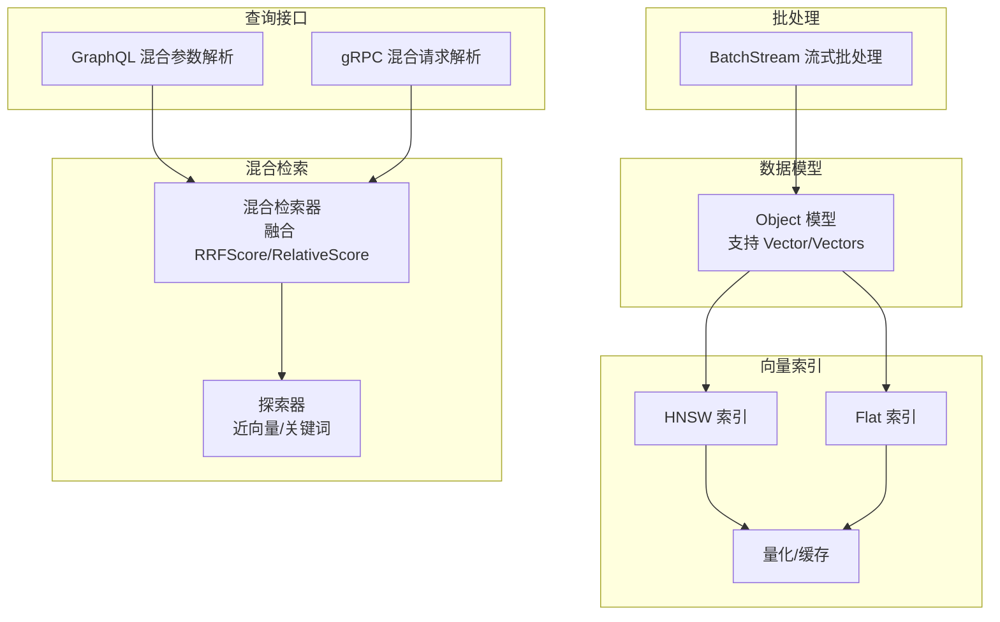
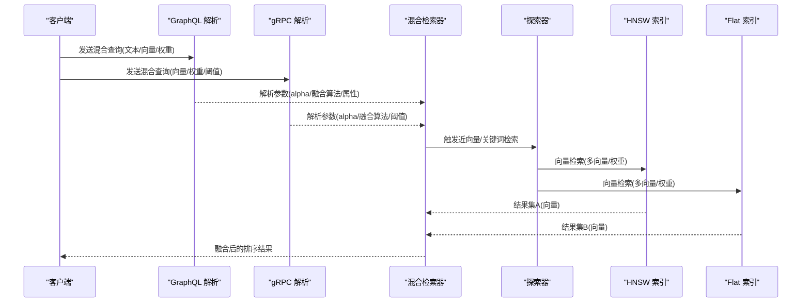
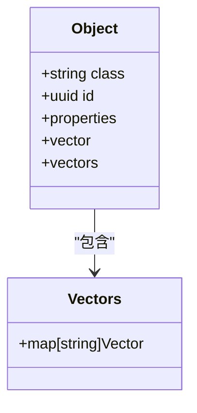
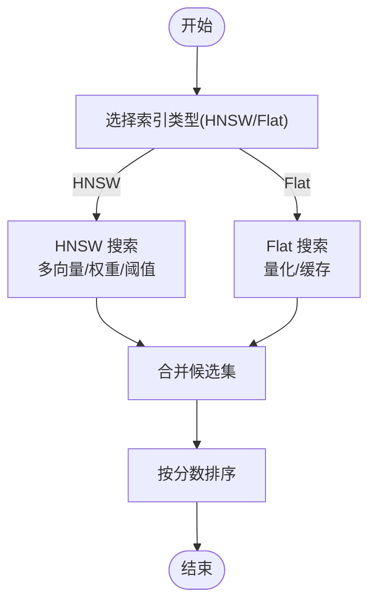
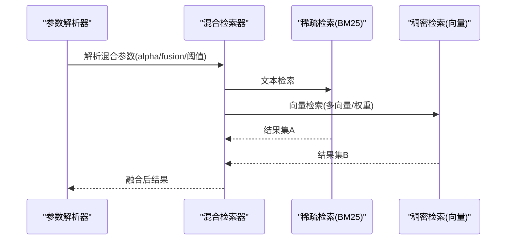
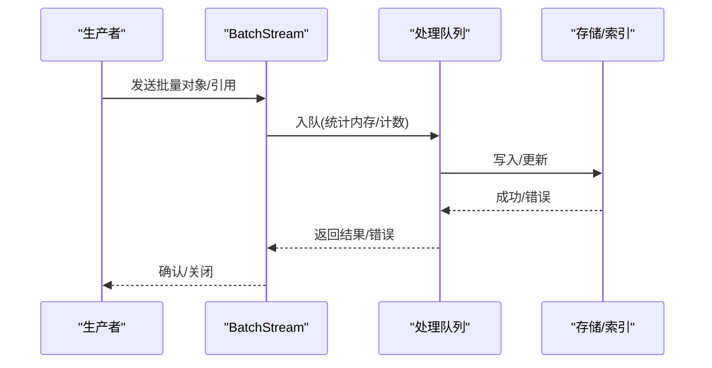
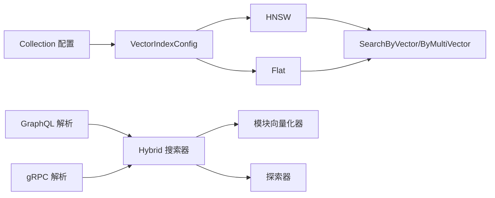

# 推荐引擎

<cite>
**本文引用的文件**
- [entities/models/object.go](file://entities/models/object.go)
- [entities/models/vectors.go](file://entities/models/vectors.go)
- [entities/schema/collection.go](file://entities/schema/collection.go)
- [entities/vectorindex/config.go](file://entities/vectorindex/config.go)
- [usecases/traverser/hybrid/searcher.go](file://usecases/traverser/hybrid/searcher.go)
- [usecases/traverser/explorer_hybrid.go](file://usecases/traverser/explorer_hybrid.go)
- [adapters/handlers/graphql/local/common_filters/hybrid.go](file://adapters/handlers/graphql/local/common_filters/hybrid.go)
- [adapters/handlers/grpc/v1/parse_aggregate_request.go](file://adapters/handlers/grpc/v1/parse_aggregate_request.go)
- [grpc/generated/protocol/v1/base_search.pb.go](file://grpc/generated/protocol/v1/base_search.pb.go)
- [adapters/handlers/rest/clusterapi/indices_payloads_test.go](file://adapters/handlers/rest/clusterapi/indices_payloads_test.go)
- [adapters/repos/db/vector/hnsw/search.go](file://adapters/repos/db/vector/hnsw/search.go)
- [adapters/repos/db/vector/hnsw/flat_search.go](file://adapters/repos/db/vector/hnsw/flat_search.go)
- [adapters/repos/db/vector/flat/index.go](file://adapters/repos/db/vector/flat/index.go)
- [adapters/repos/db/vector/flat/quantizer.go](file://adapters/repos/db/vector/flat/quantizer.go)
- [adapters/repos/db/vector/multivector/muvera.go](file://adapters/repos/db/vector/multivector/muvera.go)
- [adapters/handlers/grpc/v1/service.go](file://adapters/handlers/grpc/v1/service.go)
- [adapters/handlers/grpc/v1/batch/stream.go](file://adapters/handlers/grpc/v1/batch/stream.go)
- [grpc/generated/protocol/v1/batch.pb.go](file://grpc/generated/protocol/v1/batch.pb.go)
- [test/acceptance_with_go_client/search_test.go](file://test/acceptance_with_go_client/search_test.go)
- [test/acceptance_with_python/test_hybrid.py](file://test/acceptance_with_python/test_hybrid.py)
- [test/acceptance/grpc/grpc_search_test.go](file://test/acceptance/grpc/grpc_search_test.go)
- [test/acceptance_with_go_client/named_vectors_tests/test_suits/named_vectors_hybrid.go](file://test/acceptance_with_go_client/named_vectors_tests/test_suits/named_vectors_hybrid.go)
- [test/acceptance_with_go_client/named_vectors_tests/test_suits/named_vectors_objects_none_vectorizer.go](file://test/acceptance_with_go_client/named_vectors_tests/test_suits/named_vectors_objects_none_vectorizer.go)
- [test/acceptance_with_go_client/named_vectors_tests/test_suits/mixed_vectors_add_vectors.go](file://test/acceptance_with_go_client/named_vectors_tests/test_suits/mixed_vectors_add_vectors.go)
- [usecases/classification/fakes_for_test.go](file://usecases/classification/fakes_for_test.go)
- [usecases/traverser/fakes_for_test.go](file://usecases/traverser/fakes_for_test.go)
- [entities/modulecapabilities/vectorizer.go](file://entities/modulecapabilities/vectorizer.go)
</cite>

## 目录
1. [简介](#简介)
2. [项目结构](#项目结构)
3. [核心组件](#核心组件)
4. [架构总览](#架构总览)
5. [组件详解](#组件详解)
6. [依赖关系分析](#依赖关系分析)
7. [性能考量](#性能考量)
8. [故障排查指南](#故障排查指南)
9. [结论](#结论)
10. [附录](#附录)

## 简介
本文件面向在 Weaviate 中构建推荐系统（尤其是基于向量相似性搜索的个性化推荐）的工程实践，围绕以下目标展开：
- 利用向量相似性搜索构建个性化推荐引擎：用户画像向量化、物品特征向量化、相似度计算与推荐排序。
- 处理稀疏数据与冷启动问题：结合显式反馈与隐式行为，采用混合检索融合策略。
- 融合协同过滤与内容过滤：通过多目标向量与多路检索结果融合实现。
- 实时与批量两种模式：支持流式批处理与增量更新，满足在线推荐与离线重排需求。
- 混合搜索能力：结合 BM25 关键词检索与向量检索，使用融合算法（RRF、相对评分等）输出最终排序。
- 场景化落地：电商商品推荐、内容推荐、广告投放等。

## 项目结构
Weaviate 提供了从数据模型、向量索引、混合检索到 gRPC/GraphQL 查询接口的完整链路，推荐系统可直接复用这些能力：
- 数据模型层：对象模型支持单/多向量字段，便于存储多来源、多粒度的向量表示。
- 向量索引层：HNSW、Flat、动态索引等，支持压缩与缓存优化。
- 混合检索层：将 BM25 文本检索与向量检索融合，支持多种融合策略。
- 查询接口层：GraphQL 与 gRPC 均支持混合检索、近邻向量检索、多向量权重组合等。
- 批处理层：支持流式批处理，适配大规模数据导入与增量更新。

图表来源
- [entities/models/object.go](file://entities/models/object.go#L31-L63)
- [entities/models/vectors.go](file://entities/models/vectors.go#L27-L72)
- [adapters/repos/db/vector/hnsw/search.go](file://adapters/repos/db/vector/hnsw/search.go#L78-L92)
- [adapters/repos/db/vector/flat/index.go](file://adapters/repos/db/vector/flat/index.go#L423-L448)
- [adapters/repos/db/vector/flat/quantizer.go](file://adapters/repos/db/vector/flat/quantizer.go#L205-L224)
- [usecases/traverser/hybrid/searcher.go](file://usecases/traverser/hybrid/searcher.go#L74-L95)
- [usecases/traverser/explorer_hybrid.go](file://usecases/traverser/explorer_hybrid.go#L84-L116)
- [adapters/handlers/graphql/local/common_filters/hybrid.go](file://adapters/handlers/graphql/local/common_filters/hybrid.go#L131-L188)
- [adapters/handlers/grpc/v1/parse_aggregate_request.go](file://adapters/handlers/grpc/v1/parse_aggregate_request.go#L263-L307)
- [adapters/handlers/grpc/v1/batch/stream.go](file://adapters/handlers/grpc/v1/batch/stream.go#L515-L551)

章节来源
- [entities/models/object.go](file://entities/models/object.go#L31-L63)
- [entities/models/vectors.go](file://entities/models/vectors.go#L27-L72)
- [entities/schema/collection.go](file://entities/schema/collection.go#L26-L61)
- [entities/vectorindex/config.go](file://entities/vectorindex/config.go#L24-L51)

## 核心组件
- 对象与向量模型
  - 单向量/多向量：支持单个或多个命名向量，便于融合多源特征。
  - 字段定义：对象包含 class、id、properties、vector、vectors 等。
- 向量索引与搜索
  - HNSW/Flat/HFresh/Dynamic：根据数据规模与查询延迟选择合适索引类型。
  - 多向量与多路融合：支持多目标向量与多路检索结果融合。
- 混合检索与融合
  - 支持 Reciprocal Rank Fusion 与 Relative Score Fusion。
  - 可设置 alpha 权衡文本与向量权重。
- 查询接口
  - GraphQL 与 gRPC 均支持混合检索、近邻向量检索、多向量权重组合。
- 批处理
  - 流式批处理支持大规模导入与增量更新，具备内存与队列监控指标。

章节来源
- [entities/models/object.go](file://entities/models/object.go#L31-L63)
- [entities/models/vectors.go](file://entities/models/vectors.go#L27-L72)
- [usecases/traverser/hybrid/searcher.go](file://usecases/traverser/hybrid/searcher.go#L74-L95)
- [adapters/handlers/grpc/v1/batch/stream.go](file://adapters/handlers/grpc/v1/batch/stream.go#L515-L551)

## 架构总览
推荐系统在 Weaviate 中的端到端流程如下：
- 数据准备：用户与物品对象入库，每个对象携带一个或多个命名向量。
- 索引构建：根据配置选择 HNSW/Flat 等索引类型，并启用压缩与缓存优化。
- 查询阶段：混合检索将 BM25 与向量检索结果融合，按 alpha 权重输出。
- 排序与返回：对候选集进行二次排序（如热度、时效、去重），输出最终推荐列表。
- 更新机制：支持流式批处理增量写入，保障实时性与一致性。

图表来源
- [adapters/handlers/graphql/local/common_filters/hybrid.go](file://adapters/handlers/graphql/local/common_filters/hybrid.go#L131-L188)
- [adapters/handlers/grpc/v1/parse_aggregate_request.go](file://adapters/handlers/grpc/v1/parse_aggregate_request.go#L263-L307)
- [usecases/traverser/hybrid/searcher.go](file://usecases/traverser/hybrid/searcher.go#L74-L95)
- [usecases/traverser/explorer_hybrid.go](file://usecases/traverser/explorer_hybrid.go#L84-L116)
- [adapters/repos/db/vector/hnsw/search.go](file://adapters/repos/db/vector/hnsw/search.go#L78-L92)
- [adapters/repos/db/vector/flat/index.go](file://adapters/repos/db/vector/flat/index.go#L423-L448)

## 组件详解

### 数据模型与多向量
- Object 支持单向量与多向量映射，便于为同一对象注入来自不同来源/任务的向量表示（如内容向量、用户画像向量、广告特征向量）。
- Vectors 支持 []float32 与 [][]float32，满足单向量与多片段向量的场景。

图表来源
- [entities/models/object.go](file://entities/models/object.go#L31-L63)
- [entities/models/vectors.go](file://entities/models/vectors.go#L27-L72)

章节来源
- [entities/models/object.go](file://entities/models/object.go#L31-L63)
- [entities/models/vectors.go](file://entities/models/vectors.go#L27-L72)

### 向量索引与搜索
- HNSW 与 Flat 搜索路径：
  - HNSW.SearchByVector/ByMultiVector 支持自动 ef 计算、扁平搜索回退、多向量编码与后期交互。
  - Flat.SearchByVector 支持量化与距离计算封装。
- 多向量与多路融合：
  - 支持多目标向量与多路检索结果融合，适合推荐系统中“内容+协同”双通道。

图表来源
- [adapters/repos/db/vector/hnsw/search.go](file://adapters/repos/db/vector/hnsw/search.go#L78-L92)
- [adapters/repos/db/vector/hnsw/flat_search.go](file://adapters/repos/db/vector/hnsw/flat_search.go#L28-L141)
- [adapters/repos/db/vector/flat/index.go](file://adapters/repos/db/vector/flat/index.go#L423-L448)

章节来源
- [adapters/repos/db/vector/hnsw/search.go](file://adapters/repos/db/vector/hnsw/search.go#L78-L92)
- [adapters/repos/db/vector/hnsw/flat_search.go](file://adapters/repos/db/vector/hnsw/flat_search.go#L28-L141)
- [adapters/repos/db/vector/flat/index.go](file://adapters/repos/db/vector/flat/index.go#L423-L448)

### 混合检索与融合
- 参数解析：
  - GraphQL 与 gRPC 均支持混合查询参数解析，包括 query、alpha、fusionType、properties、bm25SearchOperator、阈值等。
- 融合策略：
  - Reciprocal Rank Fusion 与 Relative Score Fusion；支持向量距离阈值过滤。
- 探索器：
  - 近向量检索用于向量通道，关键词检索用于文本通道，两者结果按 alpha 融合。

图表来源
- [adapters/handlers/graphql/local/common_filters/hybrid.go](file://adapters/handlers/graphql/local/common_filters/hybrid.go#L131-L188)
- [adapters/handlers/grpc/v1/parse_aggregate_request.go](file://adapters/handlers/grpc/v1/parse_aggregate_request.go#L263-L307)
- [usecases/traverser/hybrid/searcher.go](file://usecases/traverser/hybrid/searcher.go#L74-L95)
- [usecases/traverser/explorer_hybrid.go](file://usecases/traverser/explorer_hybrid.go#L84-L116)

章节来源
- [adapters/handlers/graphql/local/common_filters/hybrid.go](file://adapters/handlers/graphql/local/common_filters/hybrid.go#L131-L188)
- [adapters/handlers/grpc/v1/parse_aggregate_request.go](file://adapters/handlers/grpc/v1/parse_aggregate_request.go#L263-L307)
- [usecases/traverser/hybrid/searcher.go](file://usecases/traverser/hybrid/searcher.go#L74-L95)
- [usecases/traverser/explorer_hybrid.go](file://usecases/traverser/explorer_hybrid.go#L84-L116)

### 批处理与实时更新
- BatchStream 支持流式批处理，具备内存与队列监控指标，适合大规模导入与增量更新。
- gRPC 定义了混合查询的阈值字段与目标向量集合，便于在流式场景下控制召回质量。

图表来源
- [adapters/handlers/grpc/v1/batch/stream.go](file://adapters/handlers/grpc/v1/batch/stream.go#L515-L551)
- [grpc/generated/protocol/v1/batch.pb.go](file://grpc/generated/protocol/v1/batch.pb.go#L976-L1018)
- [adapters/handlers/grpc/v1/service.go](file://adapters/handlers/grpc/v1/service.go#L248-L266)

章节来源
- [adapters/handlers/grpc/v1/batch/stream.go](file://adapters/handlers/grpc/v1/batch/stream.go#L515-L551)
- [grpc/generated/protocol/v1/batch.pb.go](file://grpc/generated/protocol/v1/batch.pb.go#L976-L1018)
- [adapters/handlers/grpc/v1/service.go](file://adapters/handlers/grpc/v1/service.go#L248-L266)

### 多向量与命名向量
- 支持为同一类配置多个命名向量，分别由不同向量化器生成，便于内容过滤与协同过滤的特征解耦。
- 支持在运行时为已有类添加新的命名向量，实现渐进式特征扩展。

章节来源
- [test/acceptance_with_go_client/named_vectors_tests/test_suits/named_vectors_hybrid.go](file://test/acceptance_with_go_client/named_vectors_tests/test_suits/named_vectors_hybrid.go#L35-L79)
- [test/acceptance_with_go_client/named_vectors_tests/test_suits/named_vectors_objects_none_vectorizer.go](file://test/acceptance_with_go_client/named_vectors_tests/test_suits/named_vectors_objects_none_vectorizer.go#L36-L86)
- [test/acceptance_with_go_client/named_vectors_tests/test_suits/mixed_vectors_add_vectors.go](file://test/acceptance_with_go_client/named_vectors_tests/test_suits/mixed_vectors_add_vectors.go#L120-L169)

### 向量化器与模块能力
- Vectorizer 接口定义了对象向量化、批处理向量化与输入向量化的能力，支持内容过滤与显式反馈特征抽取。
- ReferenceVectorizer 支持基于引用关系的向量聚合，适合协同过滤场景。

章节来源
- [entities/modulecapabilities/vectorizer.go](file://entities/modulecapabilities/vectorizer.go#L25-L53)

## 依赖关系分析
- 类型与索引
  - Collection 定义了类级别的向量化器与向量索引配置，支持 HNSW/Flat/HFresh/Dynamic。
- 混合检索依赖
  - Hybrid 搜索器依赖模块提供向量输入与多向量能力，依赖探索器执行近向量/关键词检索。
- gRPC/GraphQL
  - 二者均解析混合查询参数，支持向量距离阈值、目标向量集合与权重组合。

图表来源
- [entities/schema/collection.go](file://entities/schema/collection.go#L26-L61)
- [entities/vectorindex/config.go](file://entities/vectorindex/config.go#L24-L51)
- [adapters/repos/db/vector/hnsw/search.go](file://adapters/repos/db/vector/hnsw/search.go#L78-L92)
- [adapters/repos/db/vector/flat/index.go](file://adapters/repos/db/vector/flat/index.go#L423-L448)
- [usecases/traverser/hybrid/searcher.go](file://usecases/traverser/hybrid/searcher.go#L74-L95)
- [usecases/traverser/explorer_hybrid.go](file://usecases/traverser/explorer_hybrid.go#L84-L116)
- [adapters/handlers/graphql/local/common_filters/hybrid.go](file://adapters/handlers/graphql/local/common_filters/hybrid.go#L131-L188)
- [adapters/handlers/grpc/v1/parse_aggregate_request.go](file://adapters/handlers/grpc/v1/parse_aggregate_request.go#L263-L307)

章节来源
- [entities/schema/collection.go](file://entities/schema/collection.go#L26-L61)
- [entities/vectorindex/config.go](file://entities/vectorindex/config.go#L24-L51)

## 性能考量
- 向量索引优化
  - HNSW：适合大规模高维向量，支持自动 ef 计算与扁平搜索回退；可启用压缩与缓存以降低内存占用。
  - Flat：适合中小规模或需要精确检索的场景，支持量化与缓存。
- 缓存策略
  - 量化缓存与分片缓存可显著提升检索吞吐；预热与增长策略需结合数据分布与访问模式。
- 实时更新机制
  - 使用 BatchStream 流式批处理，合理设置一致性级别与内存阈值，避免 OOM。
- 融合与阈值
  - 通过向量距离阈值限制召回范围，减少无效计算；alpha 控制文本与向量权重平衡。

章节来源
- [adapters/repos/db/vector/hnsw/search.go](file://adapters/repos/db/vector/hnsw/search.go#L60-L76)
- [adapters/repos/db/vector/flat/quantizer.go](file://adapters/repos/db/vector/flat/quantizer.go#L205-L224)
- [adapters/handlers/grpc/v1/batch/stream.go](file://adapters/handlers/grpc/v1/batch/stream.go#L515-L551)
- [adapters/handlers/grpc/v1/parse_aggregate_request.go](file://adapters/handlers/grpc/v1/parse_aggregate_request.go#L263-L307)

## 故障排查指南
- 混合查询参数冲突
  - GraphQL/gRPC 不允许同时传入 vector 与 nearText/nearVector 参数，需检查参数互斥逻辑。
- 融合异常
  - 确认 fusionType 与权重配置正确；若出现空结果，检查 alpha 设置与阈值过滤。
- 向量距离阈值
  - Python/Go 客户端测试覆盖了 max_vector_distance 的行为，确保阈值设置符合预期。
- 批处理错误
  - 关注 BatchStream 的错误消息与关闭通知，及时处理权限不足或内存不足等问题。

章节来源
- [adapters/handlers/graphql/local/common_filters/hybrid.go](file://adapters/handlers/graphql/local/common_filters/hybrid.go#L177-L185)
- [test/acceptance_with_python/test_hybrid.py](file://test/acceptance_with_python/test_hybrid.py#L182-L215)
- [test/acceptance_with_go_client/search_test.go](file://test/acceptance_with_go_client/search_test.go#L219-L250)
- [grpc/generated/protocol/v1/batch.pb.go](file://grpc/generated/protocol/v1/batch.pb.go#L976-L1018)

## 结论
Weaviate 提供了从数据建模、向量索引、混合检索到批处理的完整能力，能够高效支撑推荐系统的关键环节。通过多向量与多路融合，结合显式反馈与隐式行为，可灵活实现内容过滤与协同过滤的统一建模；借助 HNSW/Flat 索引与缓存优化，可在大规模场景下兼顾精度与性能；通过 GraphQL/gRPC 与 BatchStream，可覆盖实时与批量两类推荐模式。

## 附录

### 推荐系统实现要点清单
- 数据建模
  - 为用户与物品对象建立多向量字段，分别承载内容特征与协同特征。
- 索引与向量
  - 根据数据规模选择 HNSW/Flat；启用压缩与缓存；必要时使用多向量融合。
- 混合检索
  - 设置 alpha 平衡文本与向量；选择合适的融合算法；使用向量距离阈值控制召回。
- 实时与批量
  - 使用 BatchStream 进行增量更新；在查询端控制最大结果数量与去重策略。
- 场景化建议
  - 电商：内容向量 + 行为向量 + 商品属性向量；BM25 做关键词召回补充。
  - 内容：标题/正文向量 + 用户画像向量；相对评分融合。
  - 广告：素材向量 + 候选集向量 + 出价/预算约束；阈值过滤与预算控制。

### 参考测试与示例
- GraphQL 混合查询与 autocut 行为验证
- Python 客户端混合查询与 max_vector_distance
- gRPC 多向量与权重组合
- 命名向量与 none 向量化器配置

章节来源
- [test/acceptance_with_go_client/search_test.go](file://test/acceptance_with_go_client/search_test.go#L219-L250)
- [test/acceptance_with_python/test_hybrid.py](file://test/acceptance_with_python/test_hybrid.py#L182-L215)
- [test/acceptance/grpc/grpc_search_test.go](file://test/acceptance/grpc/grpc_search_test.go#L451-L684)
- [test/acceptance_with_go_client/named_vectors_tests/test_suits/named_vectors_hybrid.go](file://test/acceptance_with_go_client/named_vectors_tests/test_suits/named_vectors_hybrid.go#L35-L79)
- [test/acceptance_with_go_client/named_vectors_tests/test_suits/named_vectors_objects_none_vectorizer.go](file://test/acceptance_with_go_client/named_vectors_tests/test_suits/named_vectors_objects_none_vectorizer.go#L36-L86)
- [test/acceptance_with_go_client/named_vectors_tests/test_suits/mixed_vectors_add_vectors.go](file://test/acceptance_with_go_client/named_vectors_tests/test_suits/mixed_vectors_add_vectors.go#L120-L169)