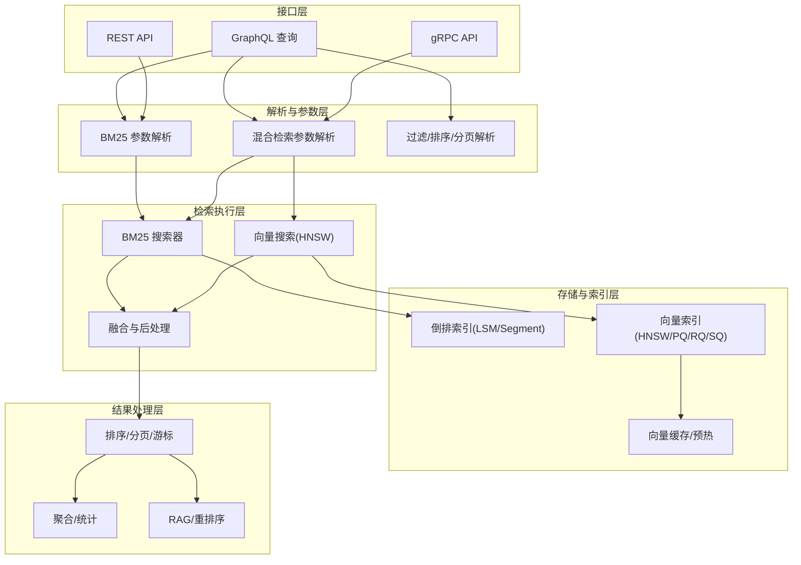
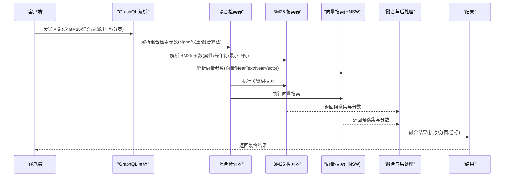
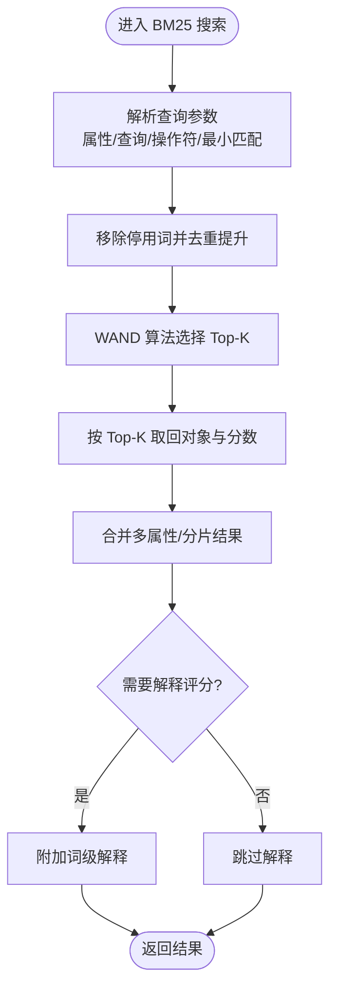
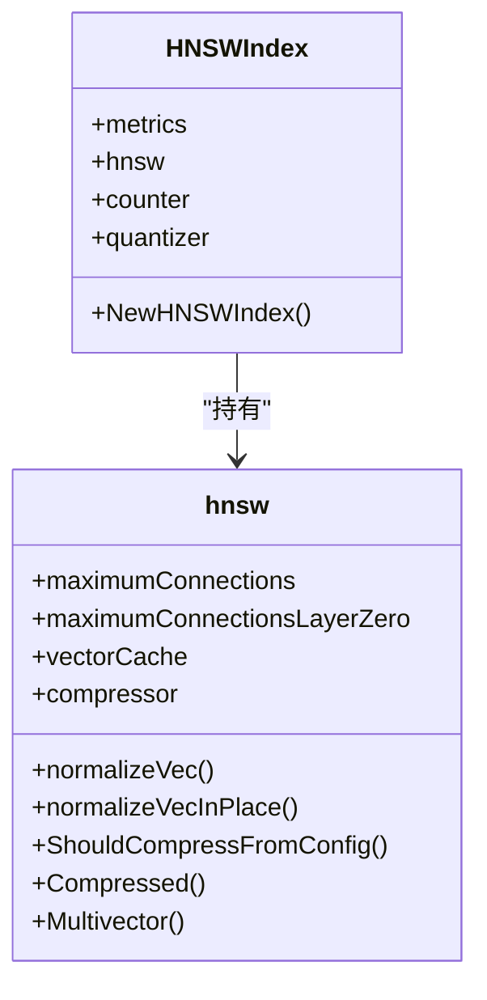
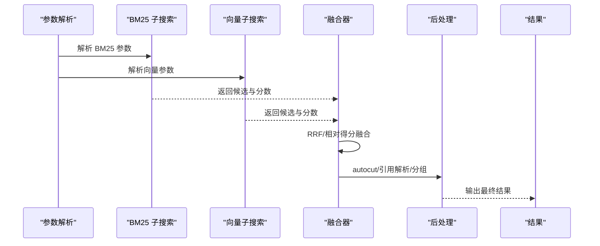
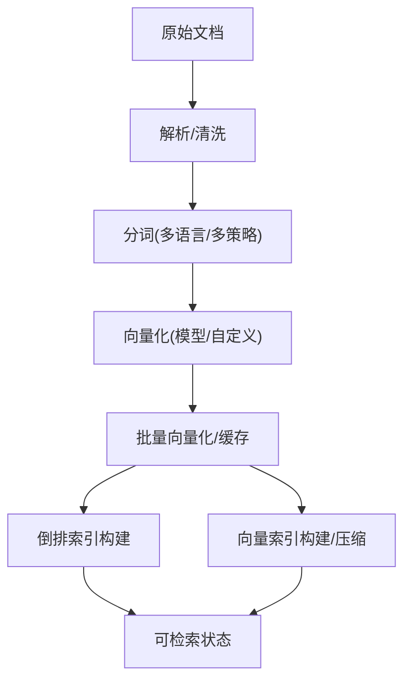
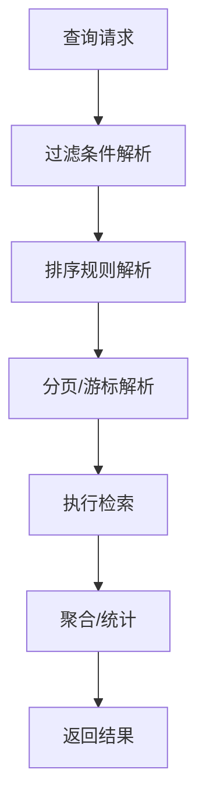
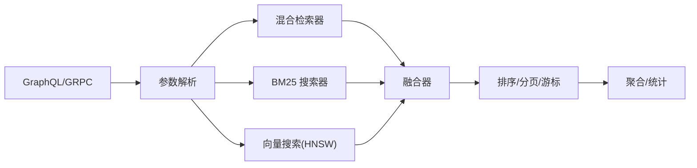

# 文档检索和信息提取

<cite>
**本文引用的文件**
- [README.md](file://README.md)
- [example/semantic_search_test.go](file://example/semantic_search_test.go)
- [example/query_existing_data_test.go](file://example/query_existing_data_test.go)
- [adapters/handlers/graphql/local/common_filters/bm25.go](file://adapters/handlers/graphql/local/common_filters/bm25.go)
- [adapters/handlers/graphql/local/common_filters/hybrid.go](file://adapters/handlers/graphql/local/common_filters/hybrid.go)
- [adapters/handlers/grpc/v1/parse_aggregate_request.go](file://adapters/handlers/grpc/v1/parse_aggregate_request.go)
- [adapters/repos/db/inverted/bm25_searcher.go](file://adapters/repos/db/inverted/bm25_searcher.go)
- [adapters/repos/db/inverted/bm25_searcher_block.go](file://adapters/repos/db/inverted/bm25_searcher_block.go)
- [usecases/traverser/hybrid/searcher.go](file://usecases/traverser/hybrid/searcher.go)
- [usecases/traverser/explorer_hybrid.go](file://usecases/traverser/explorer_hybrid.go)
- [entities/tokenizer/tokenizer.go](file://entities/tokenizer/tokenizer.go)
- [adapters/repos/db/vector/hnsw/index.go](file://adapters/repos/db/vector/hnsw/index.go)
- [adapters/repos/db/vector/hnsw/startup.go](file://adapters/repos/db/vector/hnsw/startup.go)
- [adapters/repos/db/vector/hnsw/compress.go](file://adapters/repos/db/vector/hnsw/compress.go)
- [adapters/repos/db/vector/hnsw/search_with_max_dist.go](file://adapters/repos/db/vector/hnsw/search_with_max_dist.go)
- [usecases/modulecomponents/text2vecbase/batch_vectorizer.go](file://usecases/modulecomponents/text2vecbase/batch_vectorizer.go)
- [modules/text2vec-transformers/vectorizer/texts_test.go](file://modules/text2vec-transformers/vectorizer/texts_test.go)
- [entities/filters/filters.go](file://entities/filters/filters.go)
- [entities/filters/pagination.go](file://entities/filters/pagination.go)
- [entities/filters/sort.go](file://entities/filters/sort.go)
- [adapters/handlers/graphql/descriptions/filters.go](file://adapters/handlers/graphql/descriptions/filters.go)
- [adapters/repos/db/search.go](file://adapters/repos/db/search.go)
- [grpc/generated/protocol/v1/search_get.pb.go](file://grpc/generated/protocol/v1/search_get.pb.go)
- [adapters/repos/db/multi_shard_integration_test.go](file://adapters/repos/db/multi_shard_integration_test.go)
- [adapters/repos/db/clusterintegrationtest/cluster_integration_test.go](file://adapters/repos/db/clusterintegrationtest/cluster_integration_test.go)
- [adapters/repos/db/inverted/filters_integration_test.go](file://adapters/repos/db/inverted/filters_integration_test.go)
- [adapters/repos/db/lsmkv/memtable_flush_inverted.go](file://adapters/repos/db/lsmkv/memtable_flush_inverted.go)
- [test/acceptance_with_go_client/named_vectors_tests/test_suits/named_vectors_test_data.go](file://test/acceptance_with_go_client/named_vectors_tests/test_suits/named_vectors_test_data.go)
</cite>

## 目录
1. [简介](#简介)
2. [项目结构](#项目结构)
3. [核心组件](#核心组件)
4. [架构总览](#架构总览)
5. [详细组件分析](#详细组件分析)
6. [依赖关系分析](#依赖关系分析)
7. [性能考量](#性能考量)
8. [故障排查指南](#故障排查指南)
9. [结论](#结论)
10. [附录](#附录)

## 简介
本场景文档聚焦于 Weaviate 在文档检索与信息提取中的应用，围绕“高效文档检索系统”的目标，系统阐述以下能力与实践：
- 全文搜索（BM25 关键词检索）
- 语义检索（向量相似度搜索）
- 混合检索（关键词与向量融合）
- 高级过滤与排序、分页与游标
- 文档处理流水线（解析、分词、向量化、索引构建）
- 高级检索特性（相关性评分、结果排序、分页）
- 行业化场景（法律文档检索、学术论文搜索、企业知识库、客户支持系统）
- 性能优化（索引优化、查询缓存、并发处理）

Weaviate 将向量相似性搜索与关键词过滤、检索增强生成（RAG）和重排序结合在单一查询接口中，支持大规模语义搜索与混合检索，适合构建生产级 AI 应用。

**章节来源**
- [README.md](file://README.md#L10-L128)

## 项目结构
Weaviate 的检索与信息提取涉及多个层次：
- GraphQL/REST/gRPC 接口层：统一入口，解析查询参数（BM25、混合检索、过滤、排序、分页等）
- 解析与参数提取层：将 GraphQL 输入转换为内部检索参数（BM25 参数、混合检索权重、融合算法等）
- 检索执行层：关键词（BM25）与向量（HNSW）子搜索器，混合融合与后处理
- 存储与索引层：倒排索引（LSM/Segment）、向量索引（HNSW/PQ/RQ/SQ）、缓存与压缩
- 结果处理层：排序、分页、游标、聚合统计、RAG/重排序

**图表来源**
- [adapters/handlers/graphql/local/common_filters/bm25.go](file://adapters/handlers/graphql/local/common_filters/bm25.go#L60-L91)
- [adapters/handlers/graphql/local/common_filters/hybrid.go](file://adapters/handlers/graphql/local/common_filters/hybrid.go#L131-L188)
- [adapters/handlers/grpc/v1/parse_aggregate_request.go](file://adapters/handlers/grpc/v1/parse_aggregate_request.go#L263-L307)
- [adapters/repos/db/inverted/bm25_searcher.go](file://adapters/repos/db/inverted/bm25_searcher.go#L340-L382)
- [adapters/repos/db/vector/hnsw/index.go](file://adapters/repos/db/vector/hnsw/index.go#L296-L326)

**章节来源**
- [README.md](file://README.md#L100-L128)

## 核心组件
- BM25 关键词检索：基于属性分词与倒排索引，支持 AND/OR 操作、最小匹配数、停用词过滤与评分解释。
- 向量相似度搜索：基于 HNSW 图的近似最近邻搜索，支持多向量、向量压缩（SQ/PQ/RQ），归一化与缓存。
- 混合检索：将 BM25 与向量检索结果通过互惠排序融合（RRF）或相对得分融合，可配置 alpha 权重。
- 高级过滤与排序：支持数值/字符串/地理位置/数组等多类型过滤；支持多字段排序与分页。
- 文档处理流水线：分词器（多语言/多切分策略）、向量化器（Transformers/Model2Vec/Ollama 等）、批量向量化与索引构建。
- 结果增强：相关性评分、距离、语义路径、RAG 与重排序。

**章节来源**
- [adapters/handlers/graphql/local/common_filters/bm25.go](file://adapters/handlers/graphql/local/common_filters/bm25.go#L21-L58)
- [adapters/repos/db/inverted/bm25_searcher.go](file://adapters/repos/db/inverted/bm25_searcher.go#L340-L382)
- [adapters/repos/db/vector/hnsw/index.go](file://adapters/repos/db/vector/hnsw/index.go#L296-L326)
- [usecases/traverser/hybrid/searcher.go](file://usecases/traverser/hybrid/searcher.go#L138-L170)
- [entities/tokenizer/tokenizer.go](file://entities/tokenizer/tokenizer.go#L148-L179)
- [usecases/modulecomponents/text2vecbase/batch_vectorizer.go](file://usecases/modulecomponents/text2vecbase/batch_vectorizer.go#L28-L42)

## 架构总览
Weaviate 的检索链路从 GraphQL/REST/gRPC 接收请求，经参数解析与校验，分别触发 BM25 与向量子搜索器，再由混合融合模块整合结果，最后经过排序、分页与后处理输出。

**图表来源**
- [adapters/handlers/graphql/local/common_filters/hybrid.go](file://adapters/handlers/graphql/local/common_filters/hybrid.go#L131-L188)
- [adapters/handlers/grpc/v1/parse_aggregate_request.go](file://adapters/handlers/grpc/v1/parse_aggregate_request.go#L263-L307)
- [usecases/traverser/hybrid/searcher.go](file://usecases/traverser/hybrid/searcher.go#L138-L170)
- [adapters/repos/db/inverted/bm25_searcher.go](file://adapters/repos/db/inverted/bm25_searcher.go#L340-L382)
- [adapters/repos/db/vector/hnsw/index.go](file://adapters/repos/db/vector/hnsw/index.go#L296-L326)

## 详细组件分析

### 组件 A：BM25 关键词检索
- 参数解析：支持 properties、query、searchOperator（AND/OR）、minimumOrTokensMatch、additionalExplanations。
- 停用词过滤：在查询词与重复提升中移除停用词。
- WAND 算法：按词频与平均长度做 Top-K 选择，再合并块结果。
- 结果组合：合并多属性/多分片结果，支持解释性评分与计数统计。

**图表来源**
- [adapters/handlers/graphql/local/common_filters/bm25.go](file://adapters/handlers/graphql/local/common_filters/bm25.go#L60-L91)
- [adapters/repos/db/inverted/bm25_searcher.go](file://adapters/repos/db/inverted/bm25_searcher.go#L340-L382)
- [adapters/repos/db/inverted/bm25_searcher_block.go](file://adapters/repos/db/inverted/bm25_searcher_block.go#L240-L273)

**章节来源**
- [adapters/handlers/graphql/local/common_filters/bm25.go](file://adapters/handlers/graphql/local/common_filters/bm25.go#L60-L91)
- [adapters/repos/db/inverted/bm25_searcher.go](file://adapters/repos/db/inverted/bm25_searcher.go#L340-L382)
- [adapters/repos/db/inverted/bm25_searcher_block.go](file://adapters/repos/db/inverted/bm25_searcher_block.go#L240-L273)

### 组件 B：向量相似度搜索（HNSW）
- 索引初始化：加载/恢复 HNSW，设置节点池、提交日志、指标上报。
- 多向量与压缩：支持多向量、SQ/PQ/RQ 压缩，向量缓存与预热。
- 归一化与距离：根据距离类型（如 cosine-dot）进行向量归一化。
- 搜索流程：从候选集选择邻居，按最大距离限制过滤，优先队列收敛。

**图表来源**
- [adapters/repos/db/vector/hnsw/index.go](file://adapters/repos/db/vector/hnsw/index.go#L296-L326)
- [adapters/repos/db/vector/hnsw/startup.go](file://adapters/repos/db/vector/hnsw/startup.go#L29-L50)
- [adapters/repos/db/vector/hnsw/compress.go](file://adapters/repos/db/vector/hnsw/compress.go#L1-L23)

**章节来源**
- [adapters/repos/db/vector/hnsw/index.go](file://adapters/repos/db/vector/hnsw/index.go#L296-L326)
- [adapters/repos/db/vector/hnsw/startup.go](file://adapters/repos/db/vector/hnsw/startup.go#L29-L50)
- [adapters/repos/db/vector/hnsw/compress.go](file://adapters/repos/db/vector/hnsw/compress.go#L1-L23)

### 组件 C：混合检索（BM25 + 向量）
- 参数解析：GraphQL/GRPC 解析 hybrid 参数（query/properties/vector/alpha/fusionType/targetVectors/distance）。
- 执行流程：分别执行 BM25 与向量搜索，融合（RRF/相对得分），可选 autocut，后处理（引用解析、分组）。
- 限制与约束：禁止同时指定 nearText 与 nearVector、vector 与 nearText/nearVector 等互斥参数。

**图表来源**
- [adapters/handlers/grpc/v1/parse_aggregate_request.go](file://adapters/handlers/grpc/v1/parse_aggregate_request.go#L263-L307)
- [adapters/handlers/graphql/local/common_filters/hybrid.go](file://adapters/handlers/graphql/local/common_filters/hybrid.go#L131-L188)
- [usecases/traverser/hybrid/searcher.go](file://usecases/traverser/hybrid/searcher.go#L138-L170)
- [usecases/traverser/explorer_hybrid.go](file://usecases/traverser/explorer_hybrid.go#L403-L443)

**章节来源**
- [adapters/handlers/grpc/v1/parse_aggregate_request.go](file://adapters/handlers/grpc/v1/parse_aggregate_request.go#L263-L307)
- [adapters/handlers/graphql/local/common_filters/hybrid.go](file://adapters/handlers/graphql/local/common_filters/hybrid.go#L131-L188)
- [usecases/traverser/hybrid/searcher.go](file://usecases/traverser/hybrid/searcher.go#L138-L170)
- [usecases/traverser/explorer_hybrid.go](file://usecases/traverser/explorer_hybrid.go#L403-L443)

### 组件 D：文档处理流水线（解析、分词、向量化、索引）
- 分词：支持 word/lowercase/whitespace/field/trigram/GSE/GseCh/Kagome 等多种 tokenization。
- 向量化：支持 Transformers/Model2Vec/Ollama 等，批量向量化与编码缓存。
- 索引构建：倒排索引（LSM/Segment）写入，向量索引（HNSW/PQ/RQ/SQ）构建与压缩。

**图表来源**
- [entities/tokenizer/tokenizer.go](file://entities/tokenizer/tokenizer.go#L148-L179)
- [usecases/modulecomponents/text2vecbase/batch_vectorizer.go](file://usecases/modulecomponents/text2vecbase/batch_vectorizer.go#L28-L42)
- [adapters/repos/db/lsmkv/memtable_flush_inverted.go](file://adapters/repos/db/lsmkv/memtable_flush_inverted.go#L84-L120)
- [adapters/repos/db/vector/hnsw/index.go](file://adapters/repos/db/vector/hnsw/index.go#L296-L326)

**章节来源**
- [entities/tokenizer/tokenizer.go](file://entities/tokenizer/tokenizer.go#L148-L179)
- [usecases/modulecomponents/text2vecbase/batch_vectorizer.go](file://usecases/modulecomponents/text2vecbase/batch_vectorizer.go#L28-L42)
- [adapters/repos/db/lsmkv/memtable_flush_inverted.go](file://adapters/repos/db/lsmkv/memtable_flush_inverted.go#L84-L120)
- [adapters/repos/db/vector/hnsw/index.go](file://adapters/repos/db/vector/hnsw/index.go#L296-L326)

### 组件 E：高级检索功能（过滤、排序、分页、游标）
- 过滤：支持 Equal/NotEqual/GreaterThan/Like/IsNull/ContainsAny/ContainsAll/ContainsNone/And/Or/Not/WithinGeoRange 等。
- 排序：多字段排序，支持 asc/desc。
- 分页与游标：first/after/afterID，offset/limit/autocut。
- 聚合与统计：元信息统计、分组聚合。

**图表来源**
- [entities/filters/filters.go](file://entities/filters/filters.go#L21-L109)
- [entities/filters/sort.go](file://entities/filters/sort.go#L14-L46)
- [entities/filters/pagination.go](file://entities/filters/pagination.go#L25-L58)
- [adapters/handlers/graphql/descriptions/filters.go](file://adapters/handlers/graphql/descriptions/filters.go#L130-L154)

**章节来源**
- [entities/filters/filters.go](file://entities/filters/filters.go#L21-L109)
- [entities/filters/sort.go](file://entities/filters/sort.go#L14-L46)
- [entities/filters/pagination.go](file://entities/filters/pagination.go#L25-L58)
- [adapters/handlers/graphql/descriptions/filters.go](file://adapters/handlers/graphql/descriptions/filters.go#L130-L154)

### 组件 F：行业化场景应用
- 法律文档检索：关键词（法条/案号/法院）+ 语义（案例相似度）+ 过滤（时间/地区/案件类型）。
- 学术论文搜索：标题/摘要/关键词 BM25 + 语义（主题相似）+ 排序（引用次数/年份）。
- 企业知识库：产品文档/FAQ + 混合检索 + 自动分类/标签过滤。
- 客户支持系统：问题描述语义 + FAQ 关键词 + 排序（解决率/时效）。

[本节为概念性说明，不直接分析具体文件]

## 依赖关系分析
- GraphQL/GRPC 层依赖解析器将输入映射为内部参数。
- 混合检索器依赖 BM25 与向量子搜索器，融合器依赖模块提供者与后处理。
- 存储层依赖倒排索引与向量索引，向量索引依赖缓存与压缩策略。
- 结果处理层依赖排序/分页/游标与聚合统计。

**图表来源**
- [adapters/handlers/graphql/local/common_filters/hybrid.go](file://adapters/handlers/graphql/local/common_filters/hybrid.go#L131-L188)
- [adapters/handlers/grpc/v1/parse_aggregate_request.go](file://adapters/handlers/grpc/v1/parse_aggregate_request.go#L263-L307)
- [usecases/traverser/hybrid/searcher.go](file://usecases/traverser/hybrid/searcher.go#L138-L170)

**章节来源**
- [adapters/handlers/graphql/local/common_filters/hybrid.go](file://adapters/handlers/graphql/local/common_filters/hybrid.go#L131-L188)
- [adapters/handlers/grpc/v1/parse_aggregate_request.go](file://adapters/handlers/grpc/v1/parse_aggregate_request.go#L263-L307)
- [usecases/traverser/hybrid/searcher.go](file://usecases/traverser/hybrid/searcher.go#L138-L170)

## 性能考量
- 索引优化
  - 倒排索引：LSM/Segment 写入与块编码，支持频率/位置信息，减少 IO。
  - 向量索引：HNSW 层连接数与最大层连接数配置，SQ/PQ/RQ 压缩降低内存占用。
- 查询缓存
  - 向量缓存：按对象 ID 缓存向量，支持多向量与 Muvera 编码。
  - 向量预热：按层级与容量预取热点向量。
- 并发处理
  - BM25 搜索块级并行与合并，WAND 选择 Top-K。
  - 混合检索多子搜索并行，融合阶段串行或受限并行。
- 距离与归一化
  - cosine-dot 场景需向量归一化，避免额外计算开销。
- 分页与游标
  - 通过 offset/limit 控制返回规模，autocut 过滤低相关结果。

**章节来源**
- [adapters/repos/db/lsmkv/memtable_flush_inverted.go](file://adapters/repos/db/lsmkv/memtable_flush_inverted.go#L84-L120)
- [adapters/repos/db/vector/hnsw/index.go](file://adapters/repos/db/vector/hnsw/index.go#L296-L326)
- [adapters/repos/db/vector/hnsw/startup.go](file://adapters/repos/db/vector/hnsw/startup.go#L29-L50)
- [adapters/repos/db/inverted/bm25_searcher_block.go](file://adapters/repos/db/inverted/bm25_searcher_block.go#L240-L273)
- [adapters/repos/db/search.go](file://adapters/repos/db/search.go#L472-L525)

## 故障排查指南
- 查询超时/无结果
  - 检查 limit/offset/autocut 是否过大导致结果被截断或过滤。
  - 对混合检索检查 alpha 权重是否偏向某一方。
- 相关性评分异常
  - 开启 additionalExplanations 查看 BM25 词级解释。
  - 检查停用词过滤与最小匹配数设置。
- 向量搜索距离异常
  - 确认距离类型（cosine-dot 需归一化）与压缩策略。
  - 检查向量缓存命中与预热情况。
- 过滤/排序无效
  - 确认属性是否可过滤/可排序，数据类型是否匹配。
  - 检查多字段排序顺序与大小写敏感性。
- gRPC/REST 融合参数错误
  - 确保混合检索参数互斥（nearText/nearVector/vector）未同时设置。
  - 检查 targetVectors 与向量维度一致性。

**章节来源**
- [adapters/handlers/graphql/local/common_filters/bm25.go](file://adapters/handlers/graphql/local/common_filters/bm25.go#L60-L91)
- [adapters/handlers/graphql/local/common_filters/hybrid.go](file://adapters/handlers/graphql/local/common_filters/hybrid.go#L177-L187)
- [adapters/handlers/grpc/v1/parse_aggregate_request.go](file://adapters/handlers/grpc/v1/parse_aggregate_request.go#L263-L307)
- [adapters/repos/db/vector/hnsw/index.go](file://adapters/repos/db/vector/hnsw/index.go#L927-L943)

## 结论
Weaviate 提供了从底层索引到高层查询的完整文档检索与信息提取能力。通过 BM25 关键词检索与向量语义搜索的深度融合，配合丰富的过滤、排序、分页与游标机制，能够满足法律、学术、企业知识库与客户支持等多行业场景需求。结合索引优化、查询缓存与并发处理，可在大规模数据下保持高性能与高可用。

[本节为总结性内容，不直接分析具体文件]

## 附录

### A. 示例：语义检索与混合检索
- 语义检索（NearText/NearVector）：使用 GraphQL 构造 NearText/NearVector 参数，返回相关性分数与向量信息。
- 混合检索（Hybrid）：设置 query/properties/vector/alpha/fusionType，结合 BM25 与向量搜索。

**章节来源**
- [example/semantic_search_test.go](file://example/semantic_search_test.go#L19-L108)
- [example/semantic_search_test.go](file://example/semantic_search_test.go#L110-L157)
- [example/semantic_search_test.go](file://example/semantic_search_test.go#L159-L221)

### B. 示例：查询现有数据与聚合统计
- 查询现有类（Movie）：验证类存在、查询全部/限制数量、仅查询特定字段。
- 聚合统计：使用 Aggregate 计算记录总数。

**章节来源**
- [example/query_existing_data_test.go](file://example/query_existing_data_test.go#L15-L125)

### C. 示例：命名向量与目标向量
- 多向量场景：支持 m2vec/transformers 等多种向量配置与目标向量选择。

**章节来源**
- [test/acceptance_with_go_client/named_vectors_tests/test_suits/named_vectors_test_data.go](file://test/acceptance_with_go_client/named_vectors_tests/test_suits/named_vectors_test_data.go#L33-L57)

### D. 向量化器与分词器测试
- 向量化器：Transformers 文本向量化策略与池化策略测试。
- 分词器：多语言与多切分策略的分词结果验证。

**章节来源**
- [modules/text2vec-transformers/vectorizer/texts_test.go](file://modules/text2vec-transformers/vectorizer/texts_test.go#L23-L50)
- [entities/tokenizer/tokenizer.go](file://entities/tokenizer/tokenizer.go#L148-L179)

### E. 排序与分页集成测试
- 多字段排序：字符串/整数/电话/日期等排序验证。
- 分页与游标：first/after/afterID 的使用与边界处理。

**章节来源**
- [adapters/repos/db/multi_shard_integration_test.go](file://adapters/repos/db/multi_shard_integration_test.go#L506-L545)
- [adapters/repos/db/clusterintegrationtest/cluster_integration_test.go](file://adapters/repos/db/clusterintegrationtest/cluster_integration_test.go#L465-L576)

### F. 过滤与索引集成测试
- 过滤器：布尔/数值/字符串/地理位置/数组等过滤器集成测试。
- 倒排索引：不同 tokenization 与索引开关下的行为验证。

**章节来源**
- [entities/filters/filters.go](file://entities/filters/filters.go#L21-L109)
- [adapters/repos/db/inverted/filters_integration_test.go](file://adapters/repos/db/inverted/filters_integration_test.go#L1258-L1297)

### G. gRPC 搜索结果结构
- 搜索结果包含属性、元数据、生成式结果与重排序分数。

**章节来源**
- [grpc/generated/protocol/v1/search_get.pb.go](file://grpc/generated/protocol/v1/search_get.pb.go#L998-L1018)