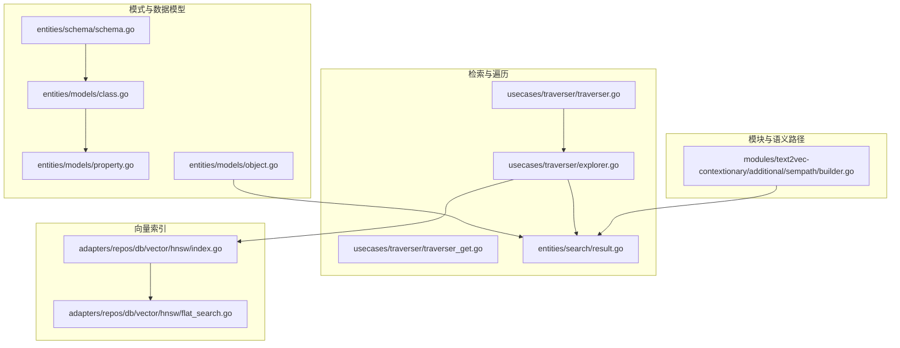
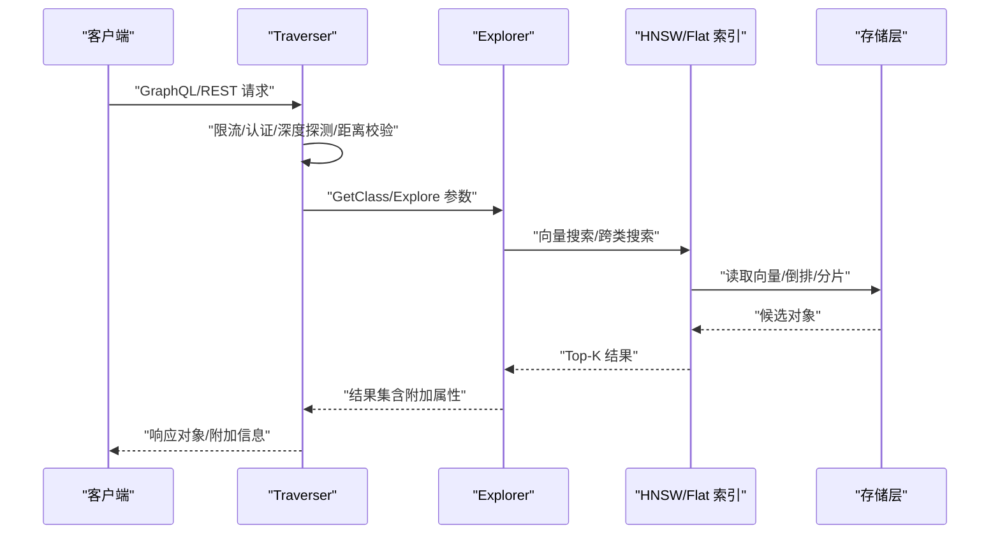
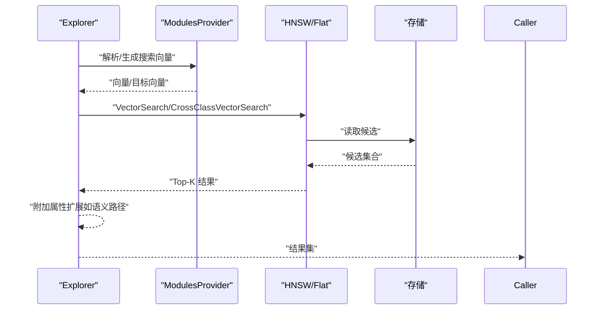
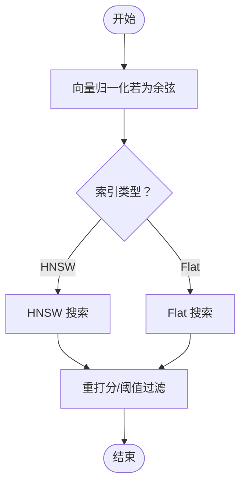
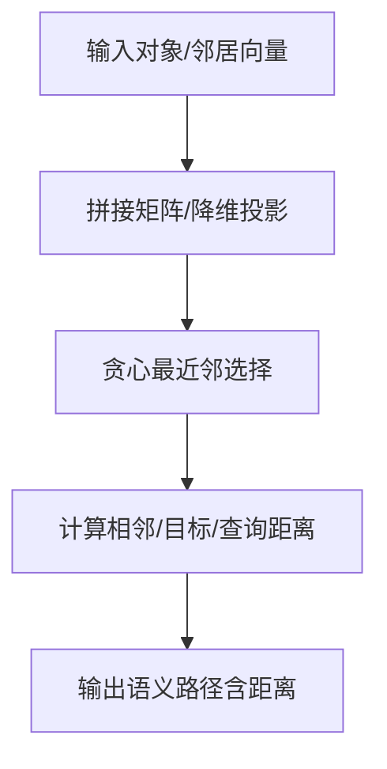
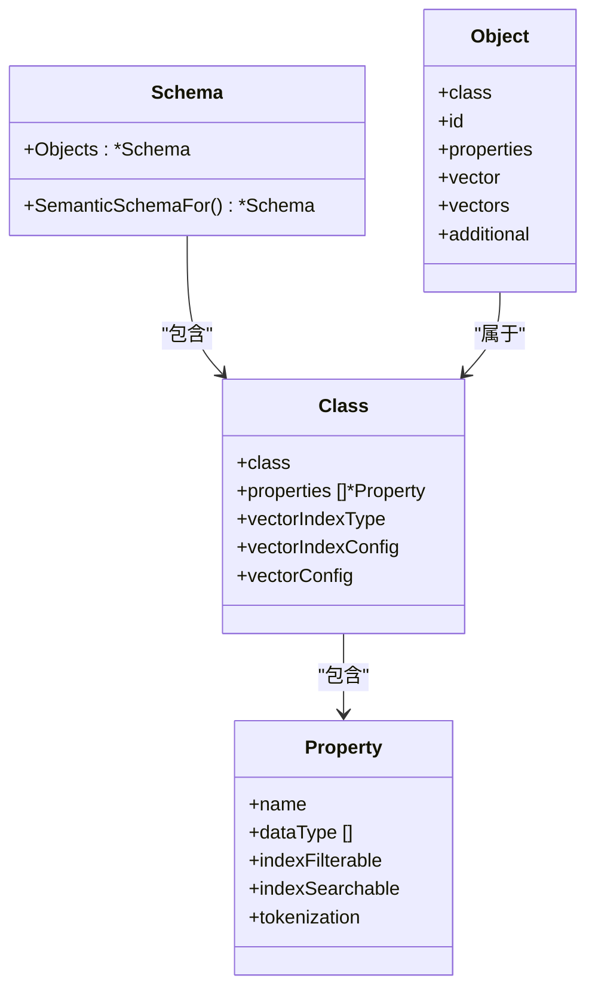
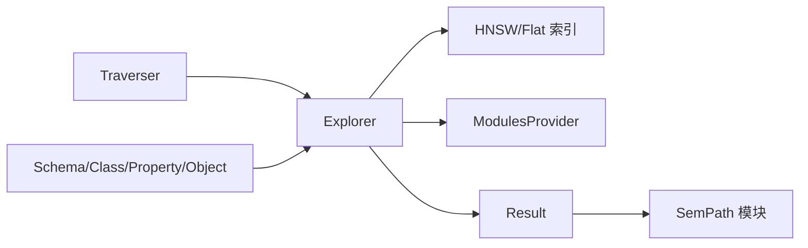

# 知识图谱和实体关系

<cite>
**本文引用的文件**
- [usecases/traverser/traverser.go](file://usecases/traverser/traverser.go)
- [usecases/traverser/explorer.go](file://usecases/traverser/explorer.go)
- [usecases/traverser/traverser_get.go](file://usecases/traverser/traverser_get.go)
- [entities/search/result.go](file://entities/search/result.go)
- [entities/models/class.go](file://entities/models/class.go)
- [entities/models/property.go](file://entities/models/property.go)
- [entities/models/object.go](file://entities/models/object.go)
- [entities/schema/schema.go](file://entities/schema/schema.go)
- [modules/text2vec-contextionary/additional/sempath/builder.go](file://modules/text2vec-contextionary/additional/sempath/builder.go)
- [adapters/repos/db/vector/hnsw/index.go](file://adapters/repos/db/vector/hnsw/index.go)
- [adapters/repos/db/vector/hnsw/flat_search.go](file://adapters/repos/db/vector/hnsw/flat_search.go)
- [adapters/repos/db/crud_references_integration_test.go](file://adapters/repos/db/crud_references_integration_test.go)
- [adapters/repos/db/aggregations_integration_test.go](file://adapters/repos/db/aggregations_integration_test.go)
- [grpc/generated/protocol/v1/aggregate.pb.go](file://grpc/generated/protocol/v1/aggregate.pb.go)
- [adapters/handlers/grpc/v1/parse_aggregate_request.go](file://adapters/handlers/grpc/v1/parse_aggregate_request.go)
- [adapters/handlers/grpc/v1/parse_search_request_test.go](file://adapters/handlers/grpc/v1/parse_search_request_test.go)
- [adapters/repos/db/classification_integration_test.go](file://adapters/repos/db/classification_integration_test.go)
- [modules/text2vec-contextionary/classification/schema_for_test.go](file://modules/text2vec-contextionary/classification/schema_for_test.go)
- [test/acceptance/classifications/setup_test.go](file://test/acceptance/classifications/setup_test.go)
</cite>

## 目录
1. [引言](#引言)
2. [项目结构](#项目结构)
3. [核心组件](#核心组件)
4. [架构总览](#架构总览)
5. [详细组件分析](#详细组件分析)
6. [依赖分析](#依赖分析)
7. [性能考虑](#性能考虑)
8. [故障排查指南](#故障排查指南)
9. [结论](#结论)
10. [附录](#附录)

## 引言
本场景文档聚焦于 Weaviate 在知识图谱构建与实体关系分析中的应用，围绕以下目标展开：  
- 如何利用 Weaviate 构建与查询知识图谱，涵盖实体识别、关系抽取、属性提取与图结构存储；  
- 如何处理实体消歧与关系链接问题，并维护知识图谱的一致性与完整性；  
- 完整的知识图谱构建流程（从原始数据到结构化知识）；  
- 利用向量相似性搜索进行实体链接与关系预测；  
- 展示知识图谱在智能问答、推荐系统、风险评估等场景的应用；  
- 提供图查询优化策略（子图匹配、路径查找、聚合查询）。

## 项目结构
Weaviate 的知识图谱能力由“模式定义（Schema/Class/Property）”、“对象存储（Object）”、“向量检索（Vector Search）”、“图遍历与查询（Traverser/Explorer）”、“模块扩展（Modules）”等模块协同实现。下图给出与知识图谱直接相关的高层结构映射：



图表来源
- [entities/schema/schema.go](file://entities/schema/schema.go#L40-L60)
- [entities/models/class.go](file://entities/models/class.go#L32-L72)
- [entities/models/property.go](file://entities/models/property.go#L30-L65)
- [entities/models/object.go](file://entities/models/object.go#L28-L63)
- [usecases/traverser/traverser.go](file://usecases/traverser/traverser.go#L30-L42)
- [usecases/traverser/explorer.go](file://usecases/traverser/explorer.go#L48-L60)
- [usecases/traverser/traverser_get.go](file://usecases/traverser/traverser_get.go#L29-L68)
- [entities/search/result.go](file://entities/search/result.go#L22-L45)
- [adapters/repos/db/vector/hnsw/index.go](file://adapters/repos/db/vector/hnsw/index.go#L927-L943)
- [adapters/repos/db/vector/hnsw/flat_search.go](file://adapters/repos/db/vector/hnsw/flat_search.go#L28-L47)
- [modules/text2vec-contextionary/additional/sempath/builder.go](file://modules/text2vec-contextionary/additional/sempath/builder.go#L65-L98)

章节来源
- [entities/schema/schema.go](file://entities/schema/schema.go#L40-L60)
- [entities/models/class.go](file://entities/models/class.go#L32-L72)
- [entities/models/property.go](file://entities/models/property.go#L30-L65)
- [entities/models/object.go](file://entities/models/object.go#L28-L63)
- [usecases/traverser/traverser.go](file://usecases/traverser/traverser.go#L30-L42)
- [usecases/traverser/explorer.go](file://usecases/traverser/explorer.go#L48-L60)
- [usecases/traverser/traverser_get.go](file://usecases/traverser/traverser_get.go#L29-L68)
- [entities/search/result.go](file://entities/search/result.go#L22-L45)
- [adapters/repos/db/vector/hnsw/index.go](file://adapters/repos/db/vector/hnsw/index.go#L927-L943)
- [adapters/repos/db/vector/hnsw/flat_search.go](file://adapters/repos/db/vector/hnsw/flat_search.go#L28-L47)
- [modules/text2vec-contextionary/additional/sempath/builder.go](file://modules/text2vec-contextionary/additional/sempath/builder.go#L65-L98)

## 核心组件
- 模式与类定义：通过 Class 与 Property 描述实体类型、属性与索引配置，支持多租户、复制、命名向量等高级特性。  
- 对象模型：Object 封装实体实例的属性、向量、权重与附加信息，是知识图谱中节点的载体。  
- 向量检索：Explorer 负责基于向量参数（nearObject、nearVector、模块向量）执行跨类/类内检索，结合 HNSW/Flat 等索引实现高效相似性搜索。  
- 图遍历与查询：Traverser 统一入口，负责限流、认证、深度探测、距离校验与调用 Explorer 执行查询。  
- 结果模型：Result 统一封装检索结果（ID、距离、向量、附加属性等），支撑后续的语义路径与聚合分析。  
- 语义路径模块：sempath 模块可基于最近邻与余弦距离计算语义路径，辅助实体链接与关系预测。

章节来源
- [entities/models/class.go](file://entities/models/class.go#L32-L72)
- [entities/models/property.go](file://entities/models/property.go#L30-L65)
- [entities/models/object.go](file://entities/models/object.go#L28-L63)
- [usecases/traverser/explorer.go](file://usecases/traverser/explorer.go#L48-L60)
- [usecases/traverser/traverser.go](file://usecases/traverser/traverser.go#L30-L42)
- [entities/search/result.go](file://entities/search/result.go#L22-L45)
- [modules/text2vec-contextionary/additional/sempath/builder.go](file://modules/text2vec-contextionary/additional/sempath/builder.go#L65-L98)

## 架构总览
Weaviate 的知识图谱查询链路以 GraphQL/REST/GRPC 为入口，经由 Traverser 进行参数校验与授权，再由 Explorer 调用底层存储与向量索引完成检索与扩展，最终返回包含节点与附加信息的结果集。



图表来源
- [usecases/traverser/traverser_get.go](file://usecases/traverser/traverser_get.go#L29-L68)
- [usecases/traverser/explorer.go](file://usecases/traverser/explorer.go#L132-L172)
- [adapters/repos/db/vector/hnsw/flat_search.go](file://adapters/repos/db/vector/hnsw/flat_search.go#L28-L47)

## 详细组件分析

### 组件A：Traverser（图遍历与查询入口）
- 职责：统一处理 GraphQL/REST 查询，负责限流、认证、参数校验、深度探测、距离兼容性检查，并委派给 Explorer 执行实际检索。  
- 关键点：  
  - 限流器控制并发请求；  
  - 授权器对过滤器中的引用进行元数据授权；  
  - 深度探测防止过深的交叉引用导致性能问题；  
  - 当启用置信度时，强制校验向量索引使用余弦距离。  

```mermaid
classDiagram
class Traverser {
-config
-logger
-authorizer
-vectorSearcher
-explorer
-schemaGetter
-nearParamsVector
-targetVectorParamHelper
-metrics
-ratelimiter
+GetClass(ctx, principal, params) []interface{}
-probeForRefDepthLimit(props) error
-validateFilters(ctx, principal, filter) error
-validateGetDistanceParams(params) error
}
class Explorer {
+GetClass(ctx, params) []interface{}
+CrossClassVectorSearch(ctx, params) []search.Result
}
Traverser --> Explorer : "委派查询"
```

图表来源
- [usecases/traverser/traverser.go](file://usecases/traverser/traverser.go#L30-L42)
- [usecases/traverser/traverser_get.go](file://usecases/traverser/traverser_get.go#L29-L68)
- [usecases/traverser/explorer.go](file://usecases/traverser/explorer.go#L132-L172)

章节来源
- [usecases/traverser/traverser.go](file://usecases/traverser/traverser.go#L30-L42)
- [usecases/traverser/traverser_get.go](file://usecases/traverser/traverser_get.go#L29-L68)
- [usecases/traverser/explorer.go](file://usecases/traverser/explorer.go#L132-L172)

### 组件B：Explorer（向量检索与扩展）
- 职责：解析 nearObject/nearVector/模块参数，生成目标向量，执行类内/跨类向量搜索，按需扩展附加属性（如语义路径、置信度、向量等）。  
- 关键点：  
  - 支持多目标向量与命名向量；  
  - 自动注入向量以满足模块附加属性需求；  
  - 跨类向量搜索返回可达对象并应用阈值过滤；  
  - TTL 过滤与复制一致性检测。  



图表来源
- [usecases/traverser/explorer.go](file://usecases/traverser/explorer.go#L216-L312)
- [usecases/traverser/explorer.go](file://usecases/traverser/explorer.go#L625-L654)

章节来源
- [usecases/traverser/explorer.go](file://usecases/traverser/explorer.go#L216-L312)
- [usecases/traverser/explorer.go](file://usecases/traverser/explorer.go#L625-L654)

### 组件C：向量索引与相似性搜索
- HNSW 索引：支持压缩（SQ/PQ/RQ）、归一化（cosine-dot 需要归一化）、批量搜索与重打分；  
- Flat 搜索：作为替代或小规模检索路径，支持优先队列聚合与允许列表过滤。  
- 应用：用于实体链接（nearObject/nearVector）、关系预测（Explore 跨类搜索）与语义路径构建。



图表来源
- [adapters/repos/db/vector/hnsw/index.go](file://adapters/repos/db/vector/hnsw/index.go#L927-L943)
- [adapters/repos/db/vector/hnsw/flat_search.go](file://adapters/repos/db/vector/hnsw/flat_search.go#L28-L47)

章节来源
- [adapters/repos/db/vector/hnsw/index.go](file://adapters/repos/db/vector/hnsw/index.go#L927-L943)
- [adapters/repos/db/vector/hnsw/flat_search.go](file://adapters/repos/db/vector/hnsw/flat_search.go#L28-L47)

### 组件D：语义路径（Semantic Path）与实体链接
- 功能：基于最近邻与余弦距离构建从查询向量到目标向量的语义路径，辅助实体链接与关系预测；  
- 流程：提取邻居向量、降维投影、贪心最近邻选择、计算相邻距离与目标距离，输出带距离信息的路径。  



图表来源
- [modules/text2vec-contextionary/additional/sempath/builder.go](file://modules/text2vec-contextionary/additional/sempath/builder.go#L100-L140)
- [modules/text2vec-contextionary/additional/sempath/builder.go](file://modules/text2vec-contextionary/additional/sempath/builder.go#L306-L361)

章节来源
- [modules/text2vec-contextionary/additional/sempath/builder.go](file://modules/text2vec-contextionary/additional/sempath/builder.go#L65-L98)
- [modules/text2vec-contextionary/additional/sempath/builder.go](file://modules/text2vec-contextionary/additional/sempath/builder.go#L100-L140)
- [modules/text2vec-contextionary/additional/sempath/builder.go](file://modules/text2vec-contextionary/additional/sempath/builder.go#L306-L361)

### 组件E：知识图谱构建与存储（Schema/Class/Property/Object）
- Schema/Class：定义集合（类）与属性，支持多租户、复制、命名向量、向量索引类型与配置；  
- Property：描述属性的数据类型、索引策略（过滤、搜索、范围）、分词方式等；  
- Object：实体实例，包含属性、向量、权重与附加信息，是图节点的承载。  



图表来源
- [entities/schema/schema.go](file://entities/schema/schema.go#L40-L60)
- [entities/models/class.go](file://entities/models/class.go#L32-L72)
- [entities/models/property.go](file://entities/models/property.go#L30-L65)
- [entities/models/object.go](file://entities/models/object.go#L28-L63)

章节来源
- [entities/schema/schema.go](file://entities/schema/schema.go#L40-L60)
- [entities/models/class.go](file://entities/models/class.go#L32-L72)
- [entities/models/property.go](file://entities/models/property.go#L30-L65)
- [entities/models/object.go](file://entities/models/object.go#L28-L63)

### 组件F：关系存储与引用
- 多重引用支持：源对象可指向多个目标对象；  
- 引用创建与校验：集成测试覆盖了多引用创建与 beacon 校验；  
- 语义向量聚合：ref2vec-centroid 可基于引用聚合生成中心向量，辅助关系预测。

章节来源
- [adapters/repos/db/crud_references_integration_test.go](file://adapters/repos/db/crud_references_integration_test.go#L709-L756)

### 组件G：分类与上下文链接（用于实体消歧与关系链接）
- KNN 分类：基于邻居投票进行分类；  
- 上下文分类：基于语义空间进行分类；  
- 零样本分类：无需训练样本，基于语义相似性进行分类。  
这些能力可用于实体消歧与关系链接的预处理与后处理阶段。

章节来源
- [adapters/repos/db/classification_integration_test.go](file://adapters/repos/db/classification_integration_test.go#L123-L165)
- [modules/text2vec-contextionary/classification/schema_for_test.go](file://modules/text2vec-contextionary/classification/schema_for_test.go#L149-L198)
- [test/acceptance/classifications/setup_test.go](file://test/acceptance/classifications/setup_test.go#L45-L62)

### 组件H：聚合查询（子图统计与路径分析）
- 支持数值/整数/百分比等聚合器；  
- 支持按属性分组与全局统计；  
- GRPC 协议定义与请求解析确保聚合查询的标准化。

章节来源
- [adapters/repos/db/aggregations_integration_test.go](file://adapters/repos/db/aggregations_integration_test.go#L422-L1430)
- [grpc/generated/protocol/v1/aggregate.pb.go](file://grpc/generated/protocol/v1/aggregate.pb.go#L1509-L1621)
- [adapters/handlers/grpc/v1/parse_aggregate_request.go](file://adapters/handlers/grpc/v1/parse_aggregate_request.go#L341-L382)

## 依赖分析
- Traverser 依赖 Explorer 执行查询；  
- Explorer 依赖 ModulesProvider 解析/生成向量，依赖 HNSW/Flat 索引执行相似性搜索；  
- 结果模型 Result 作为统一载体被 Explorer 与 SemPath 模块使用；  
- Schema/Class/Property/Model 为知识图谱的结构化基础。



图表来源
- [usecases/traverser/traverser.go](file://usecases/traverser/traverser.go#L30-L42)
- [usecases/traverser/explorer.go](file://usecases/traverser/explorer.go#L48-L60)
- [entities/search/result.go](file://entities/search/result.go#L22-L45)
- [modules/text2vec-contextionary/additional/sempath/builder.go](file://modules/text2vec-contextionary/additional/sempath/builder.go#L65-L98)

章节来源
- [usecases/traverser/traverser.go](file://usecases/traverser/traverser.go#L30-L42)
- [usecases/traverser/explorer.go](file://usecases/traverser/explorer.go#L48-L60)
- [entities/search/result.go](file://entities/search/result.go#L22-L45)
- [modules/text2vec-contextionary/additional/sempath/builder.go](file://modules/text2vec-contextionary/additional/sempath/builder.go#L65-L98)

## 性能考虑
- 向量索引选择：HNSW 适合大规模高维向量检索，Flat 适合小规模或低维场景；  
- 归一化与距离：cosine-dot 需要向量归一化，避免精度与距离不一致；  
- 并发与批处理：Explorer 使用并发组限制并行向量生成与搜索；  
- 分页与上限：根据配置设置最大结果数与自动截断（Autocut）；  
- TTL 过滤：在混合搜索中谨慎使用，避免重复过滤开销；  
- 聚合优化：按需分组与聚合器组合，减少不必要的全表扫描。

## 故障排查指南
- 嵌套引用深度超限：当查询中交叉引用层级超过限制时会报错，应简化查询或调整配置；  
- 距离与置信度不兼容：启用置信度时需确保向量索引使用余弦距离；  
- 缺失索引：关键词检索依赖倒排索引，缺失时会报错；  
- 复制一致性：在开启复制因子时，结果可能包含一致性标记；  
- TTL 过滤异常：确认对象 TTL 配置与删除策略是否启用。

章节来源
- [usecases/traverser/traverser_get.go](file://usecases/traverser/traverser_get.go#L70-L99)
- [usecases/traverser/explorer.go](file://usecases/traverser/explorer.go#L174-L214)
- [usecases/traverser/explorer.go](file://usecases/traverser/explorer.go#L766-L800)

## 结论
Weaviate 提供了从模式定义、向量检索、图遍历到模块扩展的完整知识图谱能力。通过 Class/Property/Object 的结构化建模、HNSW/Flat 的高效相似性搜索、Explorer 的参数解析与扩展、SemPath 的语义路径构建，以及分类与聚合查询的支持，Weaviate 能够有效支撑实体识别、关系抽取、实体消歧、关系链接、一致性维护与多种业务场景（智能问答、推荐、风控）的落地。

## 附录
- 知识图谱构建流程建议（概念性说明）：  
  1) 设计 Schema（Class/Property），明确实体类型与属性；  
  2) 导入对象（Object），填充属性与向量；  
  3) 建立引用（关系），形成图结构；  
  4) 使用 nearObject/nearVector/模块向量进行实体链接与关系预测；  
  5) 通过 Explore 跨类搜索与 SemPath 语义路径增强理解；  
  6) 使用聚合查询进行子图统计与路径分析；  
  7) 借助分类模块进行实体消歧与关系验证；  
  8) 维护一致性与完整性（复制、TTL、索引策略）。