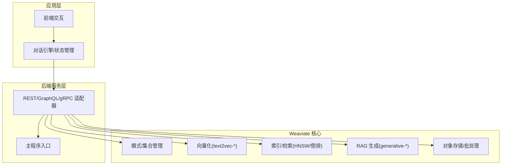
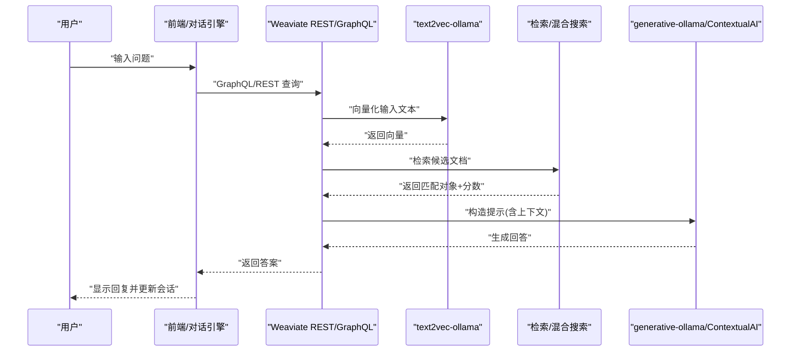
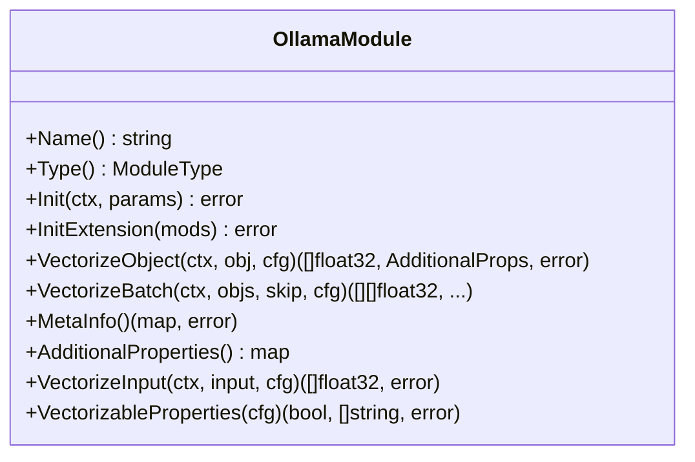
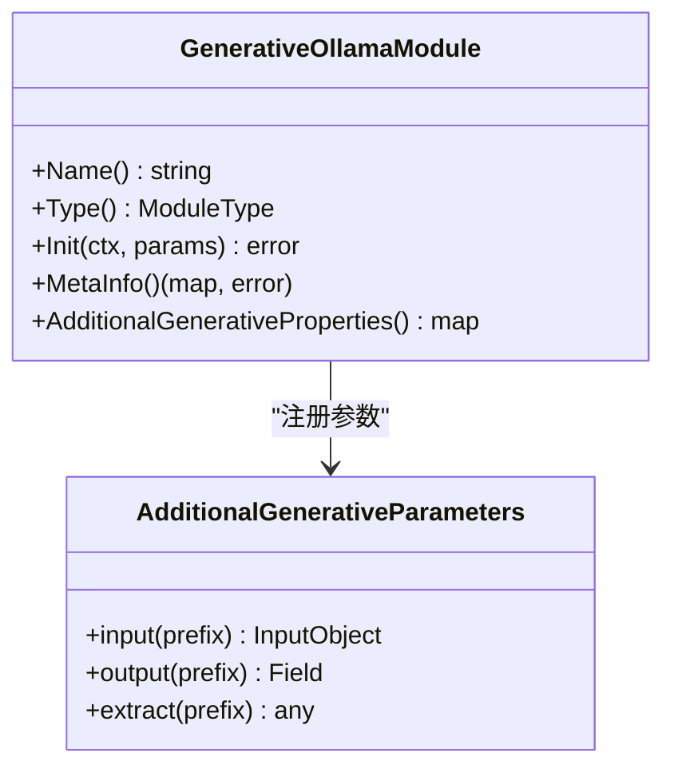
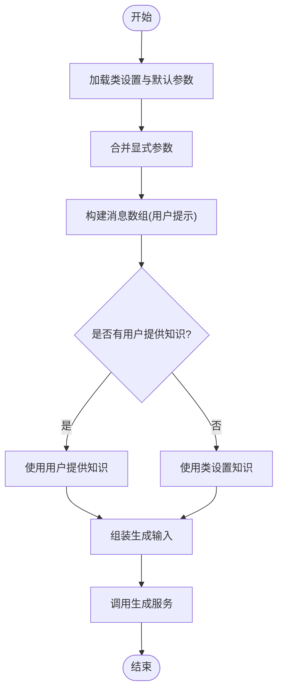
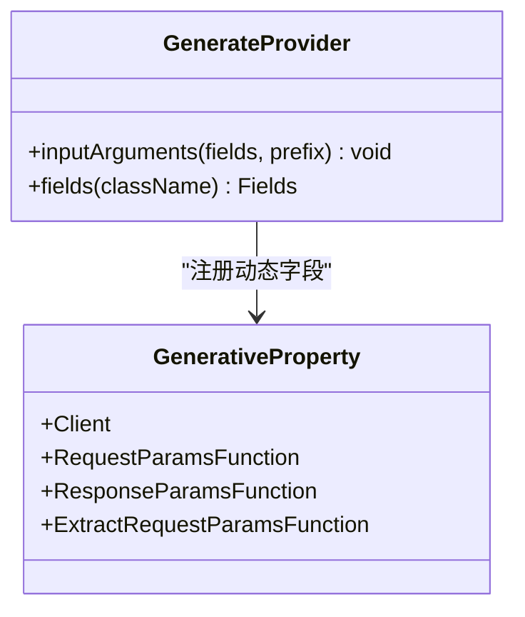
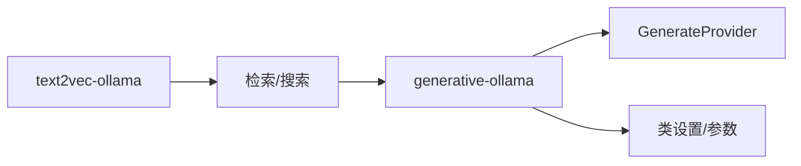

# 聊天机器人和对话式 AI

<cite>
**本文引用的文件**
- [README.md](file://README.md)
- [main.go](file://cmd/weaviate-server/main.go)
- [module.go（text2vec-ollama）](file://modules/text2vec-ollama/module.go)
- [module.go（generative-ollama）](file://modules/generative-ollama/module.go)
- [contextualai.go（generative-contextualai）](file://modules/generative-contextualai/clients/contextualai.go)
- [class_settings.go（generative-contextualai）](file://modules/generative-contextualai/config/class_settings.go)
- [graphql.go（generative-anthropic 参数）](file://modules/generative-anthropic/parameters/graphql.go)
- [graphql.go（generative-cohere 参数）](file://modules/generative-cohere/parameters/graphql.go)
- [generate_graphql_field.go（GenerateProvider）](file://usecases/modulecomponents/additional/generate/generate_graphql_field.go)
- [rag_test.go](file://example/rag_test.go)
- [ollama_and_rag_test.go](file://example/ollama_and_rag_test.go)
- [ollama_and_rag_extended_test.go](file://example/ollama_and_rag_extended_test.go)
- [objects_delete.go（REST 处理器）](file://adapters/handlers/rest/operations/objects/objects_delete.go)
- [search_test.go（接受度测试）](file://test/acceptance_with_go_client/search_test.go)
</cite>

## 目录
1. [简介](#简介)
2. [项目结构](#项目结构)
3. [核心组件](#核心组件)
4. [架构总览](#架构总览)
5. [详细组件分析](#详细组件分析)
6. [依赖关系分析](#依赖关系分析)
7. [性能考量](#性能考量)
8. [故障排查指南](#故障排查指南)
9. [结论](#结论)
10. [附录](#附录)

## 简介
本场景文档面向在 Weaviate 上构建“智能聊天机器人与对话式 AI”的工程实践，聚焦以下目标：
- 对话状态管理、意图识别、实体抽取与上下文理解
- 利用 Weaviate 的 RAG 能力进行知识增强，提升回答准确性与丰富度
- 设计多轮对话流程、会话记忆与个性化回复
- 给出包含前端交互、后端处理、知识库查询与答案生成的完整架构
- 支持多种生成式模型（如 Ollama、Anthropic、Cohere、ContextualAI 等），实现多样化回复风格与专业领域对话
- 对话质量评估与持续改进策略（用户反馈、指标监控、模型优化）

Weaviate 作为云原生向量数据库，提供向量化、混合检索、RAG 与重排序能力，并通过 REST、GraphQL、gRPC 接口对外服务，天然适配聊天机器人与对话式 AI 的数据与推理需求。

章节来源
- file://README.md#L10-L128

## 项目结构
围绕聊天机器人与对话式 AI 的关键路径与模块如下：
- 服务入口与 API 层：REST/gRPC/GraphQL 服务由主程序与适配器层提供
- 向量化与检索：text2vec-* 模块负责文本向量化与近似检索
- 生成式能力：generative-* 模块对接外部 LLM，支持 RAG 生成
- 示例与测试：example 目录提供 RAG 与 Ollama 集成示例；acceptance 测试验证混合检索与评分解释
- GraphQL/RAG 扩展：usecases 下的 GenerateProvider 提供动态 RAG GraphQL 字段

图表来源
- [main.go](file://cmd/weaviate-server/main.go#L30-L66)
- [module.go（text2vec-ollama）](file://modules/text2vec-ollama/module.go#L39-L141)
- [module.go（generative-ollama）](file://modules/generative-ollama/module.go#L28-L83)

章节来源
- file://cmd/weaviate-server/main.go#L30-L66
- file://modules/text2vec-ollama/module.go#L39-L141
- file://modules/generative-ollama/module.go#L28-L83

## 核心组件
- 向量化模块（text2vec-ollama）
  - 负责将属性文本转换为向量，支持批量向量化与元信息查询
  - 提供 GraphQL 参数扩展与 nearText 变换器接入
- 生成式模块（generative-ollama）
  - 对接 Ollama 或其他外部生成服务，提供单条/组块生成能力
  - 通过 GraphQL 扩展暴露生成参数与调试字段
- 生成式模块（generative-contextualai）
  - 支持模型、温度、TopP、最大新 tokens、系统提示、避免注释、知识注入等配置
  - 通过消息数组与知识上下文构建生成输入
- GraphQL/RAG 扩展（GenerateProvider）
  - 动态注册 singleResult/groupedResult/error/debug 等字段，支持不同生成式模块的差异化输出
- 示例与测试
  - RAG 基础查询与错误处理
  - Ollama 向量化与生成集成
  - 混合检索评分解释与相对融合

章节来源
- file://modules/text2vec-ollama/module.go#L91-L141
- file://modules/generative-ollama/module.go#L50-L83
- file://modules/generative-contextualai/clients/contextualai.go#L51-L79
- file://modules/generative-contextualai/clients/contextualai.go#L116-L165
- file://modules/generative-contextualai/config/class_settings.go#L79-L105
- file://usecases/modulecomponents/additional/generate/generate_graphql_field.go#L83-L111
- file://example/rag_test.go#L12-L69
- file://example/ollama_and_rag_test.go#L14-L112
- file://example/ollama_and_rag_extended_test.go#L14-L153
- file://test/acceptance_with_go_client/search_test.go#L424-L439

## 架构总览
Weaviate 在聊天机器人中的典型工作流：
- 输入解析与意图/实体识别：由对话引擎完成（非 Weaviate 核心，但可调用 Weaviate 查询）
- 知识检索：使用 nearText/nearVector/bm25/hybrid 等组合检索，返回候选文档
- 知识增强：将检索到的上下文拼接为提示，触发 RAG 生成
- 生成式模型：支持多种提供商（Ollama、Anthropic、Cohere、ContextualAI 等）
- 结果返回与会话记忆：将生成结果与历史对话合并，形成个性化回复

图表来源
- [module.go（text2vec-ollama）](file://modules/text2vec-ollama/module.go#L105-L127)
- [module.go（generative-ollama）](file://modules/generative-ollama/module.go#L50-L83)
- [contextualai.go（generative-contextualai）](file://modules/generative-contextualai/clients/contextualai.go#L51-L79)

## 详细组件分析

### 组件 A：向量化与检索（text2vec-ollama）
- 职责
  - 初始化向量化客户端与元信息提供者
  - 批量与单条文本向量化
  - GraphQL 参数扩展与 nearText 变换器接入
- 关键点
  - 批量向量化通过内部批处理器分片处理，提升吞吐
  - nearText 变换器可与其他模块协同，实现跨模块的文本变换
- 性能与可用性
  - 支持外部服务超时配置与日志记录
  - 元信息用于诊断与监控

图表来源
- [module.go（text2vec-ollama）](file://modules/text2vec-ollama/module.go#L39-L141)

章节来源
- file://modules/text2vec-ollama/module.go#L57-L141

### 组件 B：生成式模块（generative-ollama）
- 职责
  - 注册为 Text2TextGenerative 模块
  - 初始化生成客户端与 GraphQL 扩展参数
  - 暴露 MetaInfo 与 AdditionalGenerativeProperties
- 关键点
  - 通过参数模块定义请求/响应字段，支持动态扩展
  - 与 GraphQL/RAG 扩展配合，统一输出格式

图表来源
- [module.go（generative-ollama）](file://modules/generative-ollama/module.go#L28-L83)

章节来源
- file://modules/generative-ollama/module.go#L50-L83

### 组件 C：生成式模块（generative-contextualai）
- 职责
  - 支持模型、温度、TopP、最大新 tokens、系统提示、避免注释、知识注入等配置
  - 构造消息数组与知识上下文，调用外部生成服务
- 关键点
  - 参数优先级：显式传入 > 类设置 > 默认值
  - 支持用户提供的知识覆盖类设置的知识

图表来源
- [contextualai.go（generative-contextualai）](file://modules/generative-contextualai/clients/contextualai.go#L116-L165)
- [class_settings.go（generative-contextualai）](file://modules/generative-contextualai/config/class_settings.go#L79-L105)

章节来源
- file://modules/generative-contextualai/clients/contextualai.go#L51-L79
- file://modules/generative-contextualai/clients/contextualai.go#L116-L165
- file://modules/generative-contextualai/config/class_settings.go#L79-L105

### 组件 D：GraphQL/RAG 扩展（GenerateProvider）
- 职责
  - 动态注册 singleResult/groupedResult/error/debug 等字段
  - 依据生成式模块的请求/响应参数函数，生成 GraphQL 输入/输出结构
- 关键点
  - 支持不同生成式模块的差异化字段
  - 便于在 GraphQL 查询中直接获取生成结果与调试信息

图表来源
- [generate_graphql_field.go（GenerateProvider）](file://usecases/modulecomponents/additional/generate/generate_graphql_field.go#L83-L111)

章节来源
- file://usecases/modulecomponents/additional/generate/generate_graphql_field.go#L83-L111

### 组件 E：对话流程与会话记忆（概念性说明）
- 多轮对话管理
  - 将用户问题与历史消息拼接为上下文，结合检索增强生成
  - 使用 nearText/nearVector 检索与 bm25/hybrid 融合策略
- 会话记忆
  - 将历史消息与当前问题向量化，纳入检索空间
  - 通过 TTL/清理策略控制长期记忆占用
- 个性化回复
  - 基于用户画像与偏好调整系统提示与生成参数
  - 通过 rerank 模块对候选答案进行重排序

（本节为概念性说明，不直接分析具体文件）

### 组件 F：前端交互与后端处理（概念性说明）
- 前端
  - 提供输入框、消息列表、发送按钮与加载指示
  - 支持语音输入、表情包与快捷回复
- 后端
  - 解析用户输入，调用 Weaviate GraphQL 查询
  - 调用生成式模块进行 RAG 生成
  - 返回结构化结果并更新会话状态

（本节为概念性说明，不直接分析具体文件）

## 依赖关系分析
- 模块耦合
  - text2vec-ollama 与 generative-ollama 通过模块接口解耦，可独立替换
  - GenerateProvider 与各生成式模块通过接口契约连接，支持动态扩展
- 外部依赖
  - Ollama、Anthropic、Cohere、ContextualAI 等外部服务
  - GraphQL/REST/gRPC 接口作为统一入口
- 可能的循环依赖
  - 模块初始化顺序需保证：Vectorizer → Searcher → Generative

图表来源
- [module.go（text2vec-ollama）](file://modules/text2vec-ollama/module.go#L91-L141)
- [module.go（generative-ollama）](file://modules/generative-ollama/module.go#L50-L83)
- [generate_graphql_field.go（GenerateProvider）](file://usecases/modulecomponents/additional/generate/generate_graphql_field.go#L83-L111)

章节来源
- file://modules/text2vec-ollama/module.go#L91-L141
- file://modules/generative-ollama/module.go#L50-L83
- file://usecases/modulecomponents/additional/generate/generate_graphql_field.go#L83-L111

## 性能考量
- 检索性能
  - 使用 HNSW 向量索引与 BM25 倒排索引的混合检索，结合相对分数融合
  - 可通过 explainScore 观察贡献项，指导参数调优
- 生成性能
  - 生成式模块支持外部服务超时配置与日志记录
  - 批量插入与向量化可显著提升吞吐
- 存储与压缩
  - 向量压缩与多向量编码可降低内存占用，同时保持召回率

章节来源
- file://test/acceptance_with_go_client/search_test.go#L424-L439
- file://modules/text2vec-ollama/module.go#L111-L113

## 故障排查指南
- 连接与认证
  - 确认 Weaviate 服务端已启动，端口与主机配置正确
  - 检查 REST/GraphQL 请求路径与鉴权头
- Schema 与集合
  - 使用存在性检查确认集合是否存在
  - 删除异常集合后重新创建
- 向量化与生成
  - 检查向量化模块配置（如 Ollama 地址与模型）
  - 生成式模块参数（模型、温度、最大 tokens 等）是否合理
- 错误处理
  - GraphQL 返回的错误信息包含详细原因，应逐条检查
  - 批量插入时统计成功数量，定位失败对象

章节来源
- file://example/rag_test.go#L12-L69
- file://example/ollama_and_rag_extended_test.go#L135-L153
- file://adapters/handlers/rest/operations/objects/objects_delete.go#L45-L84

## 结论
Weaviate 为聊天机器人与对话式 AI 提供了从“知识检索”到“生成式回答”的完整基础设施。通过 text2vec-* 与 generative-* 模块的灵活组合，可快速实现多轮对话、上下文理解与个性化回复。配合 GraphQL/RAG 扩展与多种生成式模型，系统具备良好的可扩展性与可维护性。建议在实际落地中重点关注：
- 检索策略与评分解释的持续优化
- 生成参数与知识注入的精细化配置
- 用户反馈闭环与模型迭代机制

（本节为总结性内容，不直接分析具体文件）

## 附录

### A. GraphQL/RAG 字段与参数（示例）
- Anthropic 与 Cohere 的 GraphQL 输入/输出字段定义
- GenerateProvider 动态注册的字段结构

章节来源
- file://modules/generative-anthropic/parameters/graphql.go#L68-L101
- file://modules/generative-cohere/parameters/graphql.go#L20-L60
- file://usecases/modulecomponents/additional/generate/generate_graphql_field.go#L83-L111

### B. 示例：RAG 与 Ollama 集成
- 基础 RAG 查询与错误处理
- Ollama 向量化与生成模块的集成步骤
- 扩展测试：连接性、集合操作与错误处理

章节来源
- file://example/rag_test.go#L12-L69
- file://example/ollama_and_rag_test.go#L14-L112
- file://example/ollama_and_rag_extended_test.go#L14-L153