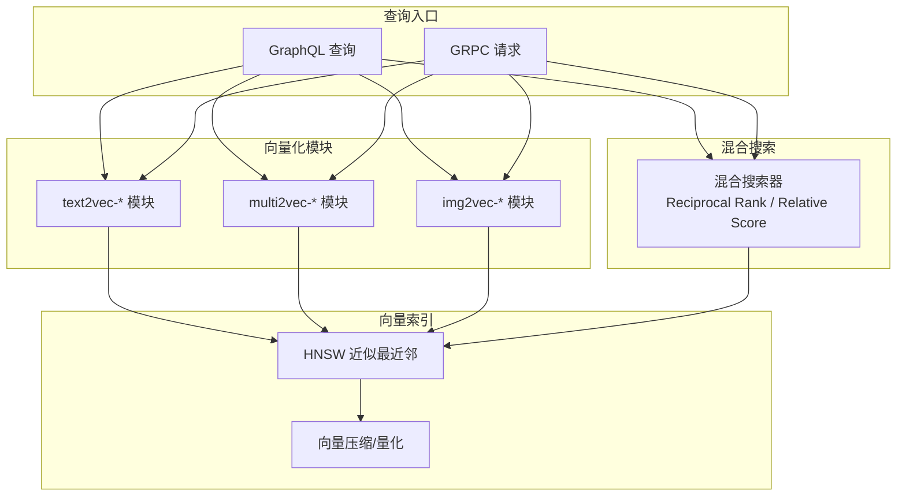
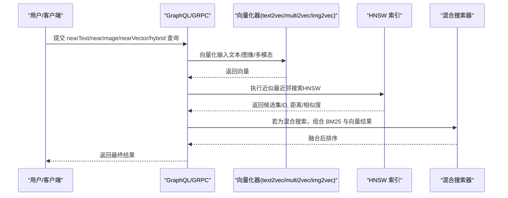
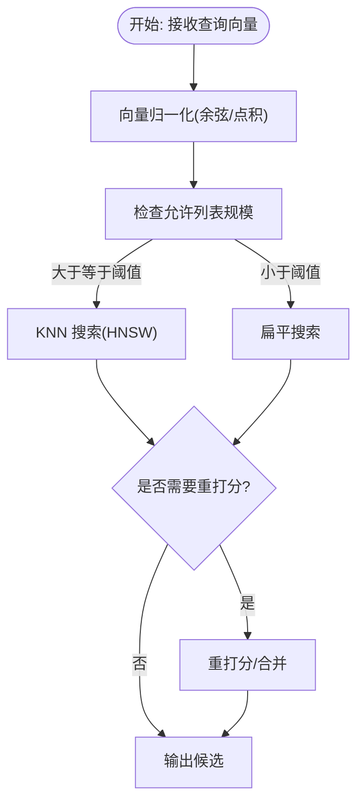
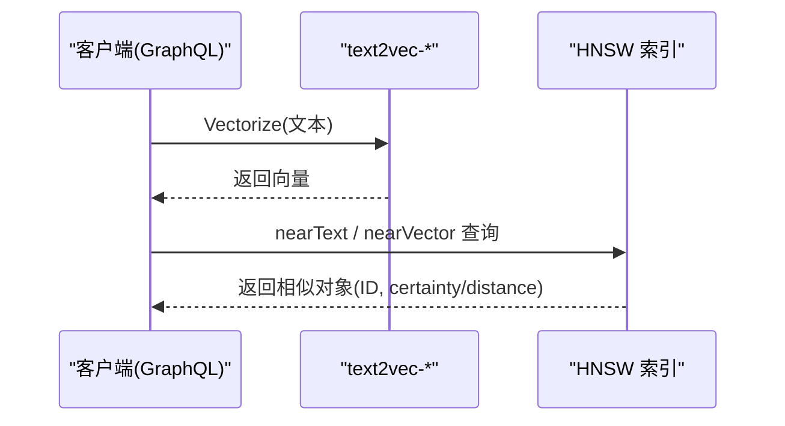
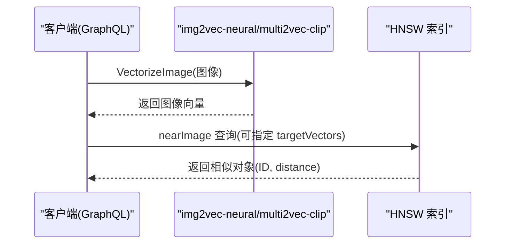
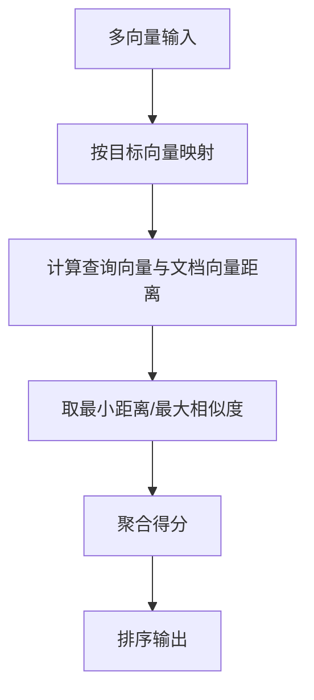
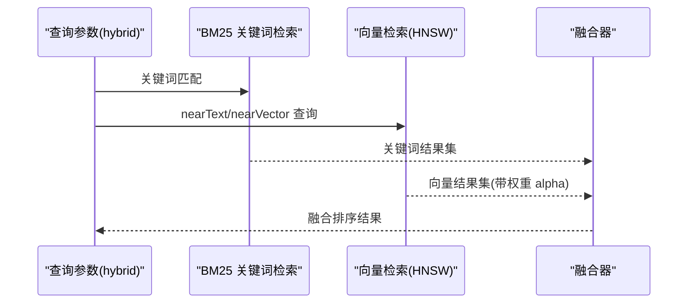
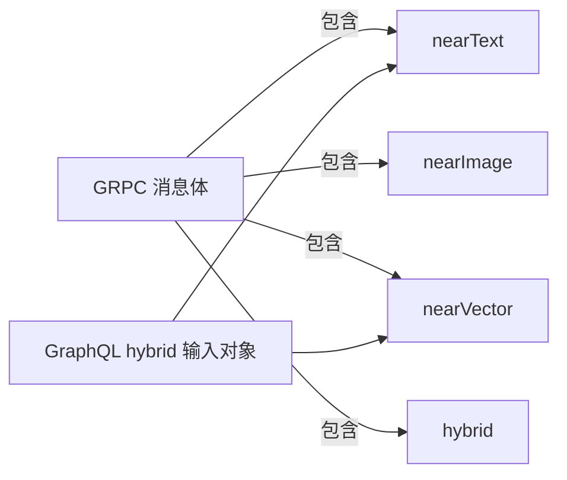

# 语义和图像搜索

<cite>
**本文引用的文件**   
- [example/semantic_search_test.go](file://example/semantic_search_test.go)
- [modules/text2vec-model2vec/module.go](file://modules/text2vec-model2vec/module.go)
- [modules/text2vec-transformers/vectorizer/texts.go](file://modules/text2vec-transformers/vectorizer/texts.go)
- [modules/multi2vec-clip/module.go](file://modules/multi2vec-clip/module.go)
- [modules/img2vec-neural/module.go](file://modules/img2vec-neural/module.go)
- [adapters/repos/db/vector/hnsw/search.go](file://adapters/repos/db/vector/hnsw/search.go)
- [adapters/repos/db/vector/hnsw/flat_search.go](file://adapters/repos/db/vector/hnsw/flat_search.go)
- [adapters/repos/db/vector/hnsw/index.go](file://adapters/repos/db/vector/hnsw/index.go)
- [entities/vectorindex/hnsw/config.go](file://entities/vectorindex/hnsw/config.go)
- [adapters/handlers/graphql/local/get/hybrid_search.go](file://adapters/handlers/graphql/local/get/hybrid_search.go)
- [usecases/traverser/hybrid/searcher.go](file://usecases/traverser/hybrid/searcher.go)
- [grpc/generated/protocol/v1/search_get.pb.go](file://grpc/generated/protocol/v1/search_get.pb.go)
- [grpc/generated/protocol/v1/base_search.pb.go](file://grpc/generated/protocol/v1/base_search.pb.go)
- [adapters/handlers/grpc/v1/parse_aggregate_request.go](file://adapters/handlers/grpc/v1/parse_aggregate_request.go)
- [adapters/repos/db/shard_dimension_tracking.go](file://adapters/repos/db/shard_dimension_tracking.go)
- [adapters/repos/db/vector_distance_query_integration_test.go](file://adapters/repos/db/vector_distance_query_integration_test.go)
- [adapters/repos/db/vector/hnsw/multivector_hnsw_test.go](file://adapters/repos/db/vector/hnsw/multivector_hnsw_test.go)
- [test/acceptance_with_python/get_debug_usage.py](file://test/acceptance_with_python/get_debug_usage.py)
- [example/query_existing_data_test.go](file://example/query_existing_data_test.go)
- [test/modules/multi2vec-clip/multi2vec_clip_test.go](file://test/modules/multi2vec-clip/multi2vec_clip_test.go)
- [test/modules/multi2vec-cohere/multi2vec_cohere_test.go](file://test/modules/multi2vec-cohere/multi2vec_cohere_test.go)
- [test/modules/multi2vec-google/multi2vec_google_test.go](file://test/modules/multi2vec-google/multi2vec_google_test.go)
- [modules/multi2vec-bind/nearArguments.go](file://modules/multi2vec-bind/nearArguments.go)
- [modules/text2vec-google/clients/google.go](file://modules/text2vec-google/clients/google.go)
- [modules/text2vec-google/vectorizer/objects_texts_test.go](file://modules/text2vec-google/vectorizer/objects_texts_test.go)
- [modules/text2vec-transformers/vectorizer/objects_texts_test.go](file://modules/text2vec-transformers/vectorizer/objects_texts_test.go)
</cite>

## 目录
1. [简介](#简介)
2. [项目结构](#项目结构)
3. [核心组件](#核心组件)
4. [架构总览](#架构总览)
5. [详细组件分析](#详细组件分析)
6. [依赖关系分析](#依赖关系分析)
7. [性能考量](#性能考量)
8. [故障排查指南](#故障排查指南)
9. [结论](#结论)
10. [附录](#附录)

## 简介
本文件面向使用 Weaviate 构建“语义与图像搜索”的工程实践，系统阐述如何基于向量数据库实现：
- 文本到向量的转换与语义相似性搜索
- 图像内容向量化与检索
- 多模态（文本+图像）融合搜索
- HNSW 近似最近邻搜索在大规模向量检索中的应用与性能优化
- 混合搜索策略（关键词 BM25 + 向量）提升召回与精度
- 不同行业应用场景（电商商品检索、内容管理、数字资产）的落地建议

## 项目结构
Weaviate 将“向量化”“索引”“查询”“多模态”“混合搜索”等能力解耦为模块化组件，典型路径如下：
- 向量化器模块：text2vec-*、multi2vec-*、img2vec-* 等，负责将文本/图像/多模态输入转为向量
- HNSW 向量索引：提供近似最近邻搜索、压缩、多向量聚合等能力
- GraphQL/GRPC 查询层：统一接收 nearText/nearImage/nearVector/hybrid 等参数
- 混合搜索器：将 BM25 关键词与向量检索结果按权重融合

图示来源
- [grpc/generated/protocol/v1/search_get.pb.go](file://grpc/generated/protocol/v1/search_get.pb.go#L38-L49)
- [adapters/handlers/graphql/local/get/hybrid_search.go](file://adapters/handlers/graphql/local/get/hybrid_search.go#L80-L120)
- [usecases/traverser/hybrid/searcher.go](file://usecases/traverser/hybrid/searcher.go#L91-L170)

章节来源
- [grpc/generated/protocol/v1/search_get.pb.go](file://grpc/generated/protocol/v1/search_get.pb.go#L38-L49)
- [adapters/handlers/graphql/local/get/hybrid_search.go](file://adapters/handlers/graphql/local/get/hybrid_search.go#L80-L120)
- [usecases/traverser/hybrid/searcher.go](file://usecases/traverser/hybrid/searcher.go#L91-L170)

## 核心组件
- 向量化器模块
  - text2vec-*：将文本属性向量化，支持多种模型与池化策略
  - multi2vec-*：多模态（文本+图像/视频/音频等）联合向量化
  - img2vec-*：仅图像向量化
- HNSW 近似最近邻索引
  - 支持动态 EF、扁平搜索阈值、压缩（PQ/RQ/SQ）、多向量聚合
- 混合搜索器
  - 结合 BM25 与向量检索，支持阈值过滤与自动截断
- 查询接口
  - GraphQL nearText/nearImage/nearVector/hybrid
  - GRPC 原生协议

章节来源
- [modules/text2vec-model2vec/module.go](file://modules/text2vec-model2vec/module.go#L32-L170)
- [modules/multi2vec-clip/module.go](file://modules/multi2vec-clip/module.go#L49-L144)
- [modules/img2vec-neural/module.go](file://modules/img2vec-neural/module.go#L30-L116)
- [adapters/repos/db/vector/hnsw/search.go](file://adapters/repos/db/vector/hnsw/search.go#L78-L92)
- [adapters/repos/db/vector/hnsw/index.go](file://adapters/repos/db/vector/hnsw/index.go#L890-L943)
- [usecases/traverser/hybrid/searcher.go](file://usecases/traverser/hybrid/searcher.go#L91-L170)

## 架构总览
下图展示了从“数据导入/向量化”到“查询与融合”的端到端流程。

图示来源
- [grpc/generated/protocol/v1/search_get.pb.go](file://grpc/generated/protocol/v1/search_get.pb.go#L38-L49)
- [adapters/handlers/grpc/v1/parse_aggregate_request.go](file://adapters/handlers/grpc/v1/parse_aggregate_request.go#L263-L307)
- [usecases/traverser/hybrid/searcher.go](file://usecases/traverser/hybrid/searcher.go#L91-L170)

## 详细组件分析

### HNSW 近似最近邻搜索
- 搜索入口
  - SearchByVector/SearchByMultiVector：根据查询向量进行 KNN 搜索
  - flatSearch：当允许列表较小时走扁平搜索，避免全表扫描开销
- 动态 EF 与自适应阈值
  - searchTimeEF/autoEfFromK：根据 k 自动计算 ef，兼顾召回与性能
  - FlatSearchCutoff：允许列表规模阈值，低于阈值启用扁平搜索
- 归一化与距离
  - normalizeVec：对余弦/点积场景归一化向量
- 多向量与压缩
  - Multivector：支持多目标向量聚合
  - 压缩（PQ/RQ/SQ）：降低内存占用与加速检索

图示来源
- [adapters/repos/db/vector/hnsw/search.go](file://adapters/repos/db/vector/hnsw/search.go#L78-L92)
- [adapters/repos/db/vector/hnsw/flat_search.go](file://adapters/repos/db/vector/hnsw/flat_search.go#L28-L47)
- [adapters/repos/db/vector/hnsw/index.go](file://adapters/repos/db/vector/hnsw/index.go#L927-L943)
- [entities/vectorindex/hnsw/config.go](file://entities/vectorindex/hnsw/config.go#L24-L45)

章节来源
- [adapters/repos/db/vector/hnsw/search.go](file://adapters/repos/db/vector/hnsw/search.go#L44-L92)
- [adapters/repos/db/vector/hnsw/flat_search.go](file://adapters/repos/db/vector/hnsw/flat_search.go#L28-L47)
- [adapters/repos/db/vector/hnsw/index.go](file://adapters/repos/db/vector/hnsw/index.go#L890-L943)
- [entities/vectorindex/hnsw/config.go](file://entities/vectorindex/hnsw/config.go#L24-L45)

### 文本向量化与语义搜索
- 模块化向量化器
  - text2vec-model2vec：远程推理服务，支持等待启动与元信息
  - text2vec-transformers：本地/远程 Transformers 客户端，支持池化策略与维度
  - text2vec-google：支持文档/查询任务类型切换
- GraphQL 示例
  - nearText 搜索、certainty 过滤、向量近邻搜索、混合搜索（alpha 控制）

图示来源
- [modules/text2vec-model2vec/module.go](file://modules/text2vec-model2vec/module.go#L90-L111)
- [modules/text2vec-transformers/vectorizer/texts.go](file://modules/text2vec-transformers/vectorizer/texts.go#L23-L47)
- [modules/text2vec-google/clients/google.go](file://modules/text2vec-google/clients/google.go#L100-L120)
- [example/semantic_search_test.go](file://example/semantic_search_test.go#L20-L108)

章节来源
- [modules/text2vec-model2vec/module.go](file://modules/text2vec-model2vec/module.go#L32-L170)
- [modules/text2vec-transformers/vectorizer/texts.go](file://modules/text2vec-transformers/vectorizer/texts.go#L23-L47)
- [modules/text2vec-google/clients/google.go](file://modules/text2vec-google/clients/google.go#L100-L120)
- [example/semantic_search_test.go](file://example/semantic_search_test.go#L20-L108)

### 图像向量化与图像搜索
- img2vec-neural：图像向量化模块，支持 nearImage GraphQL 参数
- multi2vec-clip：多模态 CLIP 向量化，支持 nearImage/nearText/nearVideo 等
- 测试用例验证了 nearImage 查询、目标向量名称与维度

图示来源
- [modules/img2vec-neural/module.go](file://modules/img2vec-neural/module.go#L72-L89)
- [modules/multi2vec-clip/module.go](file://modules/multi2vec-clip/module.go#L105-L130)
- [test/modules/multi2vec-clip/multi2vec_clip_test.go](file://test/modules/multi2vec-clip/multi2vec_clip_test.go#L70-L87)
- [test/modules/multi2vec-cohere/multi2vec_cohere_test.go](file://test/modules/multi2vec-cohere/multi2vec_cohere_test.go#L78-L96)
- [test/modules/multi2vec-google/multi2vec_google_test.go](file://test/modules/multi2vec-google/multi2vec_google_test.go#L110-L130)

章节来源
- [modules/img2vec-neural/module.go](file://modules/img2vec-neural/module.go#L30-L116)
- [modules/multi2vec-clip/module.go](file://modules/multi2vec-clip/module.go#L49-L144)
- [test/modules/multi2vec-clip/multi2vec_clip_test.go](file://test/modules/multi2vec-clip/multi2vec_clip_test.go#L70-L87)
- [test/modules/multi2vec-cohere/multi2vec_cohere_test.go](file://test/modules/multi2vec-cohere/multi2vec_cohere_test.go#L78-L96)
- [test/modules/multi2vec-google/multi2vec_google_test.go](file://test/modules/multi2vec-google/multi2vec_google_test.go#L110-L130)

### 多模态与多向量聚合
- 多向量聚合
  - computeScore：对每个文档的多向量取最小距离/相似度聚合
  - 多向量持久化与加载：支持多目标向量存储与缓存
- 多模态扩展
  - multi2vec-bind：支持 nearImage/nearAudio/nearVideo/nearDepth 等参数

图示来源
- [adapters/repos/db/vector/hnsw/search.go](file://adapters/repos/db/vector/hnsw/search.go#L966-L1018)
- [adapters/repos/db/vector/hnsw/multivector_hnsw_test.go](file://adapters/repos/db/vector/hnsw/multivector_hnsw_test.go#L343-L382)
- [modules/multi2vec-bind/nearArguments.go](file://modules/multi2vec-bind/nearArguments.go#L67-L91)

章节来源
- [adapters/repos/db/vector/hnsw/search.go](file://adapters/repos/db/vector/hnsw/search.go#L966-L1018)
- [adapters/repos/db/vector/hnsw/multivector_hnsw_test.go](file://adapters/repos/db/vector/hnsw/multivector_hnsw_test.go#L343-L382)
- [modules/multi2vec-bind/nearArguments.go](file://modules/multi2vec-bind/nearArguments.go#L67-L91)

### 混合搜索（BM25 + 向量）
- GraphQL/GRPC 支持 hybrid 参数，包含 query、alpha、nearText/nearVector、阈值过滤等
- 混合策略
  - Reciprocal Rank Fusion 或 Relative Score Fusion
  - 可设置阈值过滤向量距离，再回填 BM25 结果
  - 支持 autocut 自动截断

图示来源
- [adapters/handlers/graphql/local/get/hybrid_search.go](file://adapters/handlers/graphql/local/get/hybrid_search.go#L80-L120)
- [usecases/traverser/hybrid/searcher.go](file://usecases/traverser/hybrid/searcher.go#L91-L170)
- [grpc/generated/protocol/v1/base_search.pb.go](file://grpc/generated/protocol/v1/base_search.pb.go#L542-L573)
- [adapters/handlers/grpc/v1/parse_aggregate_request.go](file://adapters/handlers/grpc/v1/parse_aggregate_request.go#L263-L307)

章节来源
- [adapters/handlers/graphql/local/get/hybrid_search.go](file://adapters/handlers/graphql/local/get/hybrid_search.go#L80-L120)
- [usecases/traverser/hybrid/searcher.go](file://usecases/traverser/hybrid/searcher.go#L91-L170)
- [grpc/generated/protocol/v1/base_search.pb.go](file://grpc/generated/protocol/v1/base_search.pb.go#L542-L573)
- [adapters/handlers/grpc/v1/parse_aggregate_request.go](file://adapters/handlers/grpc/v1/parse_aggregate_request.go#L263-L307)

### 向量距离与多向量距离查询
- 支持对对象的多个向量计算距离，便于调试与验证
- 在集成测试中验证了缺失向量时的行为与预期

章节来源
- [adapters/repos/db/vector_distance_query_integration_test.go](file://adapters/repos/db/vector_distance_query_integration_test.go#L159-L208)

## 依赖关系分析
- 查询协议
  - GRPC 搜索消息体包含 nearText、nearImage、nearVector、hybrid 等字段
- GraphQL 输入对象
  - hybrid 支持 nearText 与 nearVector 子搜索列表
- 混合搜索约束
  - 不能同时出现 vector 与 nearText/nearVector 参数
  - 支持阈值过滤与 BM25 操作符

图示来源
- [grpc/generated/protocol/v1/search_get.pb.go](file://grpc/generated/protocol/v1/search_get.pb.go#L38-L49)
- [grpc/generated/protocol/v1/base_search.pb.go](file://grpc/generated/protocol/v1/base_search.pb.go#L514-L573)
- [adapters/handlers/graphql/local/get/hybrid_search.go](file://adapters/handlers/graphql/local/get/hybrid_search.go#L80-L120)

章节来源
- [grpc/generated/protocol/v1/search_get.pb.go](file://grpc/generated/protocol/v1/search_get.pb.go#L38-L49)
- [grpc/generated/protocol/v1/base_search.pb.go](file://grpc/generated/protocol/v1/base_search.pb.go#L514-L573)
- [adapters/handlers/graphql/local/get/hybrid_search.go](file://adapters/handlers/graphql/local/get/hybrid_search.go#L80-L120)

## 性能考量
- HNSW 参数调优
  - maxConnections/efConstruction：影响构建质量与内存
  - ef/dynamicEfFactor/min/max：影响查询召回与延迟
  - FlatSearchCutoff：控制扁平搜索触发点
- 压缩与量化
  - PQ/RQ/SQ：显著降低内存占用；注意重打分与 rescoreLimit
  - 维度跟踪：监控未压缩/压缩维度，辅助容量规划
- 多向量与归一化
  - 多向量聚合可提升表达力；注意距离计算与归一化
- 混合搜索
  - alpha 权衡 BM25 与向量；阈值过滤可减少无效向量比较

章节来源
- [entities/vectorindex/hnsw/config.go](file://entities/vectorindex/hnsw/config.go#L24-L45)
- [adapters/repos/db/vector/hnsw/index.go](file://adapters/repos/db/vector/hnsw/index.go#L890-L943)
- [adapters/repos/db/shard_dimension_tracking.go](file://adapters/repos/db/shard_dimension_tracking.go#L94-L116)
- [usecases/traverser/hybrid/searcher.go](file://usecases/traverser/hybrid/searcher.go#L91-L170)

## 故障排查指南
- 混合搜索参数冲突
  - 同时传入 vector 与 nearText/nearVector 会报错，需二选一
- nearVector 与 nearText 参数互斥
  - hybrid 中不能同时出现 nearText 与 nearVector 子参数
- 向量维度不一致
  - 多向量对象缺失某目标向量时，需确保查询时 targetVectors 对齐
- 启动等待与外部服务可用性
  - 某些模块支持等待启动，若外部推理服务不可用会导致初始化失败

章节来源
- [usecases/traverser/hybrid/searcher.go](file://usecases/traverser/hybrid/searcher.go#L155-L170)
- [adapters/handlers/grpc/v1/parse_aggregate_request.go](file://adapters/handlers/grpc/v1/parse_aggregate_request.go#L263-L307)
- [adapters/repos/db/vector_distance_query_integration_test.go](file://adapters/repos/db/vector_distance_query_integration_test.go#L184-L208)
- [modules/text2vec-model2vec/module.go](file://modules/text2vec-model2vec/module.go#L90-L111)

## 结论
Weaviate 通过模块化的向量化器、可扩展的 HNSW 索引与灵活的混合搜索机制，为语义与图像搜索提供了高召回、高性能的解决方案。结合合适的参数调优与多模态融合策略，可在电商、内容管理、数字资产等领域实现高质量的检索体验。

## 附录

### 实现示例：从数据导入到搜索查询
- 数据导入与 Schema 配置
  - 使用 GraphQL/GRPC 批量导入对象，Schema 中声明向量化器（如 text2vec-ollama、multi2vec-clip、img2vec-neural）
- 向量化处理
  - 文本：text2vec-* 模块将属性向量化
  - 图像：img2vec-* 或 multi2vec-* 将图像向量化
- 搜索查询
  - nearText：语义相似度搜索
  - nearImage：图像内容相似度搜索
  - nearVector：基于已有向量的近邻搜索
  - hybrid：关键词 + 向量融合搜索，alpha 控制权重

章节来源
- [example/semantic_search_test.go](file://example/semantic_search_test.go#L356-L450)
- [example/query_existing_data_test.go](file://example/query_existing_data_test.go#L15-L125)

### 不同向量化器特点与适用场景
- text2vec-model2vec
  - 特点：远程推理、可等待启动、元信息提供
  - 场景：企业级部署、模型服务集中化
- text2vec-transformers
  - 特点：支持池化策略、维度可配
  - 场景：本地/私有化部署、可控的模型与推理
- multi2vec-clip
  - 特点：多模态（文本/图像/视频），nearImage/nearText/nearVideo
  - 场景：跨模态检索、图文/视频理解
- img2vec-neural
  - 特点：图像专用向量化
  - 场景：图像库检索、视觉相似度

章节来源
- [modules/text2vec-model2vec/module.go](file://modules/text2vec-model2vec/module.go#L90-L111)
- [modules/text2vec-transformers/vectorizer/texts.go](file://modules/text2vec-transformers/vectorizer/texts.go#L23-L47)
- [modules/multi2vec-clip/module.go](file://modules/multi2vec-clip/module.go#L105-L130)
- [modules/img2vec-neural/module.go](file://modules/img2vec-neural/module.go#L72-L89)

### 行业应用案例
- 电商商品搜索
  - 多模态：商品图片 + 标题/描述，使用 multi2vec-clip/nearImage + nearText
  - 混合：BM25 关键词（品牌/品类）+ 向量（语义/视觉）
- 内容管理系统
  - nearText + hybrid：标题/摘要语义检索，支持 autocut 提升质量
- 数字资产管理
  - nearImage：基于视觉相似度检索图片/视频
  - 多向量：不同模型/分支向量聚合，提升鲁棒性

章节来源
- [usecases/traverser/hybrid/searcher.go](file://usecases/traverser/hybrid/searcher.go#L91-L170)
- [test/modules/multi2vec-clip/multi2vec_clip_test.go](file://test/modules/multi2vec-clip/multi2vec_clip_test.go#L70-L87)
- [test/modules/multi2vec-google/multi2vec_google_test.go](file://test/modules/multi2vec-google/multi2vec_google_test.go#L110-L130)