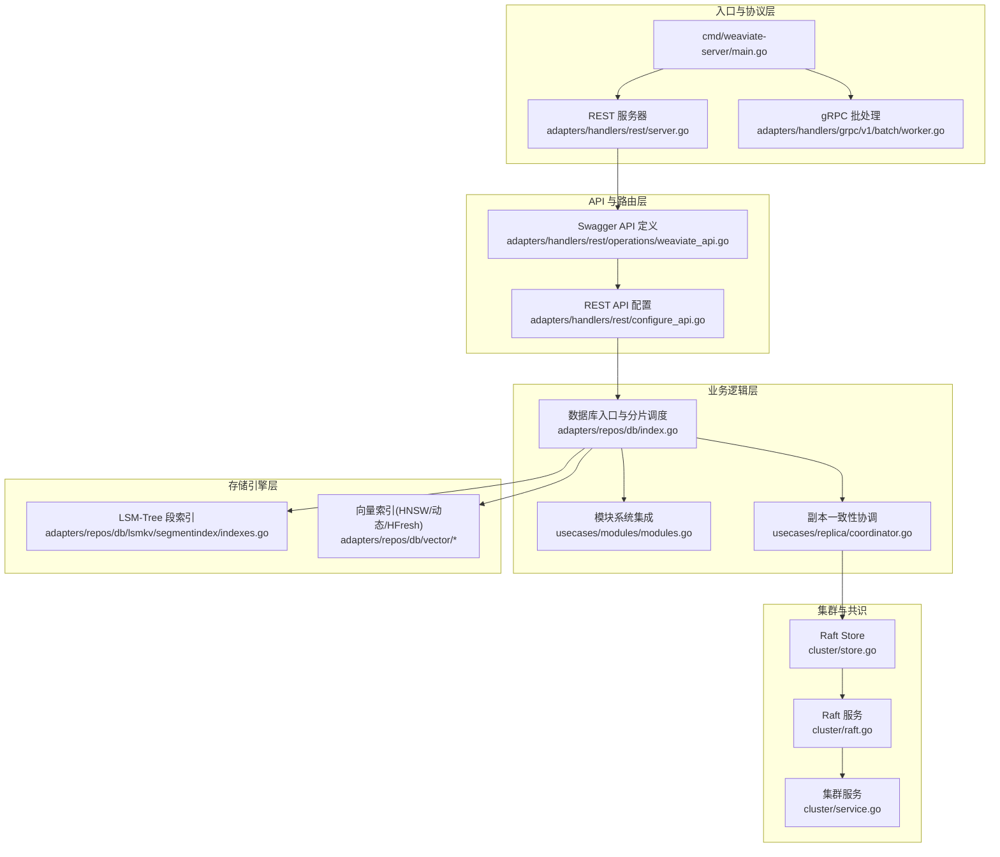
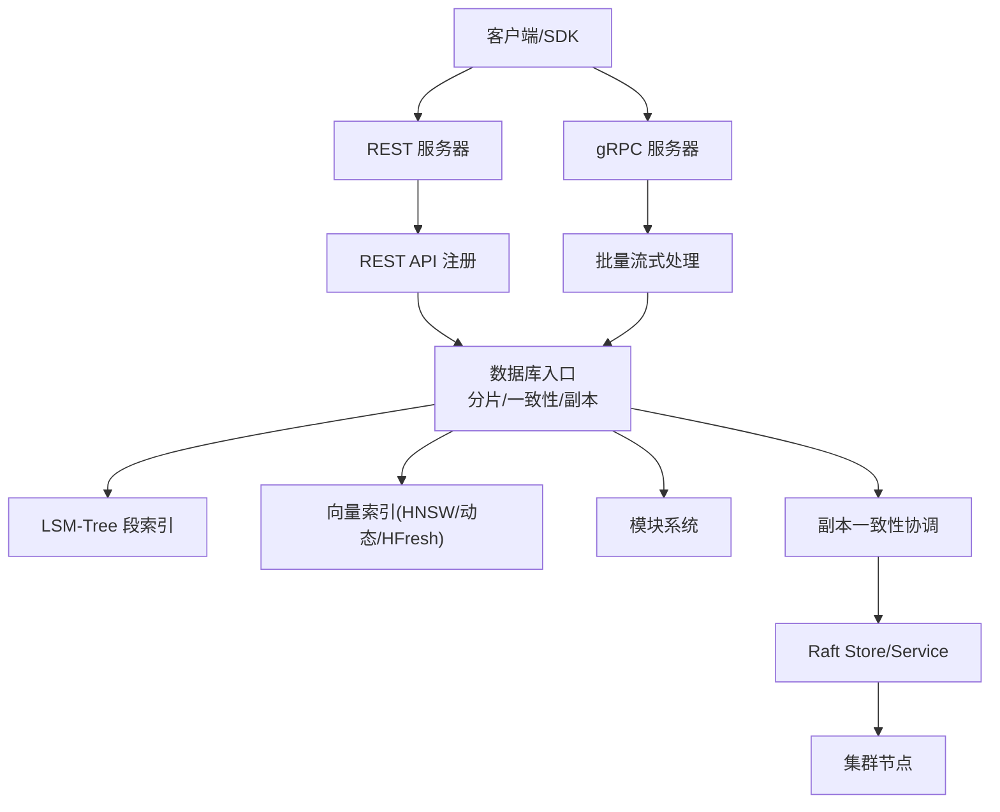
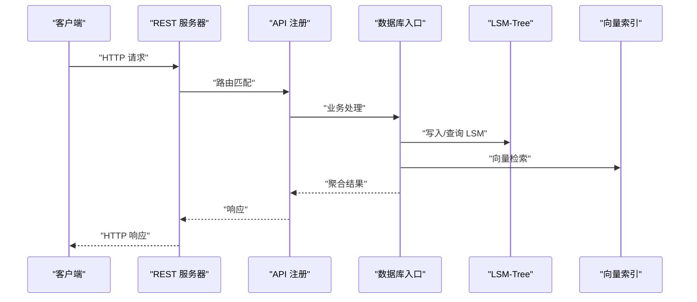
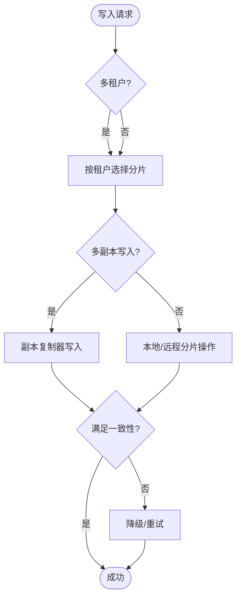
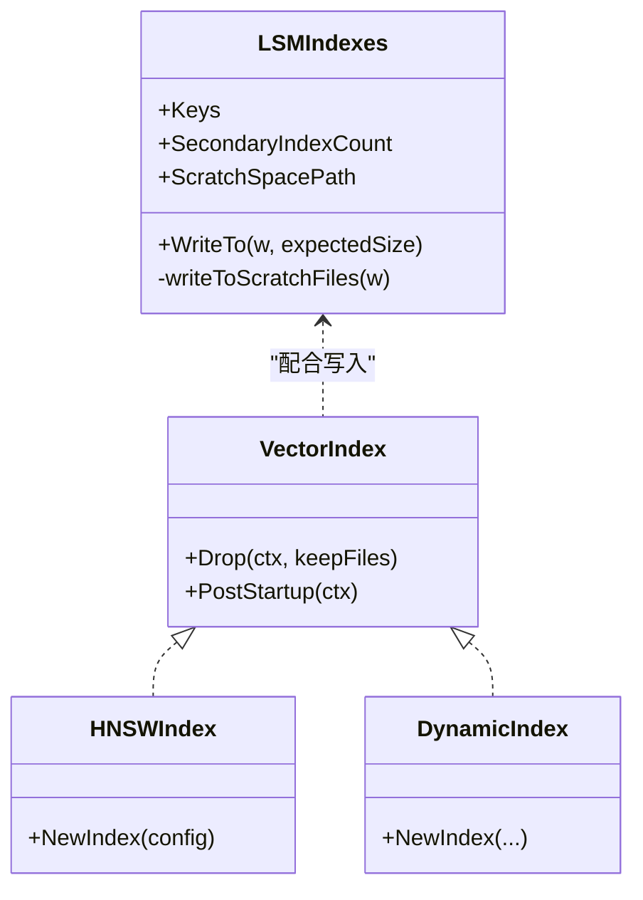
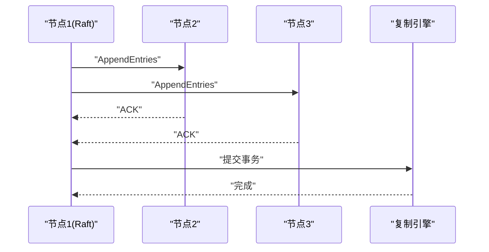
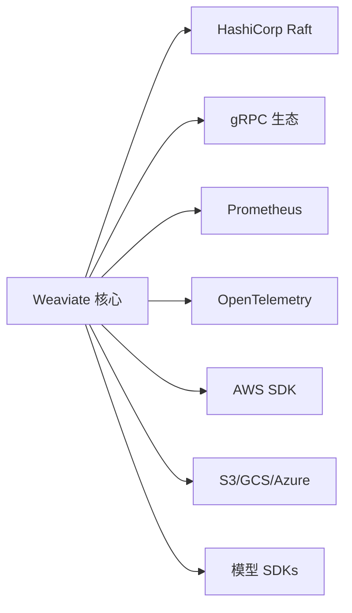

# 技术架构

<cite>
**本文引用的文件**
- [cmd/weaviate-server/main.go](file://cmd/weaviate-server/main.go)
- [adapters/handlers/rest/server.go](file://adapters/handlers/rest/server.go)
- [adapters/handlers/rest/configure_api.go](file://adapters/handlers/rest/configure_api.go)
- [adapters/handlers/rest/operations/weaviate_api.go](file://adapters/handlers/rest/operations/weaviate_api.go)
- [adapters/handlers/grpc/v1/batch/worker.go](file://adapters/handlers/grpc/v1/batch/worker.go)
- [grpc/generated/protocol/v1/batch.pb.go](file://grpc/generated/protocol/v1/batch.pb.go)
- [adapters/repos/db/index.go](file://adapters/repos/db/index.go)
- [adapters/repos/db/vector/hnsw/persistence_integration_test.go](file://adapters/repos/db/vector/hnsw/persistence_integration_test.go)
- [adapters/repos/db/vector/geo/geo.go](file://adapters/repos/db/vector/geo/geo.go)
- [adapters/repos/db/vector/dynamic/index.go](file://adapters/repos/db/vector/dynamic/index.go)
- [adapters/repos/db/lsmkv/segmentindex/indexes.go](file://adapters/repos/db/lsmkv/segmentindex/indexes.go)
- [entities/vectorindex/config.go](file://entities/vectorindex/config.go)
- [cluster/store.go](file://cluster/store.go)
- [cluster/raft.go](file://cluster/raft.go)
- [cluster/service.go](file://cluster/service.go)
- [cluster/raft_utils.go](file://cluster/raft_utils.go)
- [usecases/modules/modules.go](file://usecases/modules/modules.go)
- [usecases/replica/finder.go](file://usecases/replica/finder.go)
- [usecases/replica/coordinator.go](file://usecases/replica/coordinator.go)
- [cluster/router/types/replicaset.go](file://cluster/router/types/replicaset.go)
- [usecases/cluster/transactions_test.go](file://usecases/cluster/transactions_test.go)
- [entities/errors/go_wrapper.go](file://entities/errors/go_wrapper.go)
- [go.mod](file://go.mod)
</cite>

## 目录
1. [简介](#简介)
2. [项目结构](#项目结构)
3. [核心组件](#核心组件)
4. [架构总览](#架构总览)
5. [详细组件分析](#详细组件分析)
6. [依赖分析](#依赖分析)
7. [性能考量](#性能考量)
8. [故障排查指南](#故障排查指南)
9. [结论](#结论)
10. [附录](#附录)

## 简介
本技术架构文档面向 Weaviate 向量数据库，系统性梳理其分层架构、插件架构、事件驱动与微服务化设计，重点阐释服务器层、API 层、业务逻辑层、数据访问层与存储引擎层的职责与交互；深入解析向量索引系统、存储引擎、集群管理与模块系统的关键子系统；并以数据流为主线，描述从客户端请求到数据持久化的完整路径，最后总结关键设计决策与权衡。

## 项目结构
Weaviate 采用多模块分层组织，核心入口位于命令行服务，REST 与 gRPC 双栈对外提供接口，业务逻辑集中在 usecases 与 adapters，数据访问与存储引擎位于 adapters/repos/db，集群与共识由 cluster 子系统负责，模块能力通过 usecases/modules 统一接入。

**图表来源**
- [cmd/weaviate-server/main.go](file://cmd/weaviate-server/main.go#L30-L66)
- [adapters/handlers/rest/server.go](file://adapters/handlers/rest/server.go#L164-L200)
- [adapters/handlers/rest/operations/weaviate_api.go](file://adapters/handlers/rest/operations/weaviate_api.go#L52-L76)
- [adapters/handlers/rest/configure_api.go](file://adapters/handlers/rest/configure_api.go#L723-L744)
- [adapters/repos/db/index.go](file://adapters/repos/db/index.go#L1-L200)
- [adapters/repos/db/lsmkv/segmentindex/indexes.go](file://adapters/repos/db/lsmkv/segmentindex/indexes.go#L1-L182)
- [adapters/repos/db/vector/geo/geo.go](file://adapters/repos/db/vector/geo/geo.go#L81-L109)
- [adapters/repos/db/vector/dynamic/index.go](file://adapters/repos/db/vector/dynamic/index.go#L521-L562)
- [cluster/store.go](file://cluster/store.go#L735-L771)
- [cluster/raft.go](file://cluster/raft.go#L48-L58)
- [cluster/service.go](file://cluster/service.go#L46-L70)

**章节来源**
- [cmd/weaviate-server/main.go](file://cmd/weaviate-server/main.go#L30-L66)
- [adapters/handlers/rest/server.go](file://adapters/handlers/rest/server.go#L164-L200)
- [adapters/handlers/rest/operations/weaviate_api.go](file://adapters/handlers/rest/operations/weaviate_api.go#L52-L76)
- [adapters/handlers/rest/configure_api.go](file://adapters/handlers/rest/configure_api.go#L723-L744)
- [adapters/repos/db/index.go](file://adapters/repos/db/index.go#L1-L200)

## 核心组件
- 服务器层：REST 与 gRPC 服务器，统一监听与优雅关闭，支持 Unix Socket、HTTP、HTTPS。
- API 层：基于 Swagger 的 REST API 与自定义路由，集中注册各端点处理器。
- 业务逻辑层：数据库入口负责分片调度、多租户、一致性级别、副本协调与模块扩展。
- 数据访问层：LSM-Tree 段索引与向量索引抽象，支持多种索引类型与持久化策略。
- 存储引擎层：LSMKV 段索引写入、二级索引偏移计算、磁盘 IO 监控与内存分配检查。
- 集群管理：Raft 共识、集群服务、RPC 客户端/服务端、快照与 FSM。
- 模块系统：向量化、生成式、检索增强、离线/在线备份等能力通过模块注册与扩展。

**章节来源**
- [adapters/handlers/rest/server.go](file://adapters/handlers/rest/server.go#L80-L155)
- [adapters/handlers/rest/operations/weaviate_api.go](file://adapters/handlers/rest/operations/weaviate_api.go#L52-L76)
- [adapters/repos/db/index.go](file://adapters/repos/db/index.go#L1-L200)
- [adapters/repos/db/lsmkv/segmentindex/indexes.go](file://adapters/repos/db/lsmkv/segmentindex/indexes.go#L30-L182)
- [cluster/store.go](file://cluster/store.go#L735-L771)
- [usecases/modules/modules.go](file://usecases/modules/modules.go#L432-L777)

## 架构总览
Weaviate 采用“入口-协议-路由-业务-存储-集群”的分层架构，REST 与 gRPC 双栈对外，业务逻辑通过数据库入口统一编排，存储引擎以 LSM-Tree 为主、向量索引为辅，集群层提供共识与复制保障。

**图表来源**
- [adapters/handlers/rest/server.go](file://adapters/handlers/rest/server.go#L164-L200)
- [adapters/handlers/grpc/v1/batch/worker.go](file://adapters/handlers/grpc/v1/batch/worker.go#L332-L350)
- [adapters/handlers/rest/operations/weaviate_api.go](file://adapters/handlers/rest/operations/weaviate_api.go#L52-L76)
- [adapters/repos/db/index.go](file://adapters/repos/db/index.go#L1312-L1340)
- [adapters/repos/db/lsmkv/segmentindex/indexes.go](file://adapters/repos/db/lsmkv/segmentindex/indexes.go#L148-L182)
- [adapters/repos/db/vector/geo/geo.go](file://adapters/repos/db/vector/geo/geo.go#L81-L109)
- [adapters/repos/db/vector/dynamic/index.go](file://adapters/repos/db/vector/dynamic/index.go#L521-L562)
- [usecases/replica/coordinator.go](file://usecases/replica/coordinator.go#L178-L243)
- [cluster/store.go](file://cluster/store.go#L735-L771)

## 详细组件分析

### 服务器层与 API 层
- REST 服务器支持多监听器（Unix Socket/HTTP/HTTPS），统一超时、连接限制与优雅关闭；API 注册集中于 Swagger 文档，路由按端点分发。
- gRPC 批处理采用 worker 循环，持续消费队列请求，批量提交并回传统计与错误。

**图表来源**
- [adapters/handlers/rest/server.go](file://adapters/handlers/rest/server.go#L164-L200)
- [adapters/handlers/rest/operations/weaviate_api.go](file://adapters/handlers/rest/operations/weaviate_api.go#L52-L76)
- [adapters/repos/db/index.go](file://adapters/repos/db/index.go#L1312-L1340)

**章节来源**
- [adapters/handlers/rest/server.go](file://adapters/handlers/rest/server.go#L80-L155)
- [adapters/handlers/rest/operations/weaviate_api.go](file://adapters/handlers/rest/operations/weaviate_api.go#L52-L76)
- [adapters/handlers/grpc/v1/batch/worker.go](file://adapters/handlers/grpc/v1/batch/worker.go#L332-L350)

### 业务逻辑层：数据库入口与一致性
- 数据库入口负责对象写入/更新/删除、多租户分片选择、一致性级别判定与副本协调；在多副本场景下，通过复制器进行分布式写入，并根据一致性级别聚合结果。
- 副本一致性校验按分片分组并发校验，确保满足指定一致性阈值。

**图表来源**
- [adapters/repos/db/index.go](file://adapters/repos/db/index.go#L1312-L1340)
- [usecases/replica/coordinator.go](file://usecases/replica/coordinator.go#L178-L243)
- [usecases/replica/finder.go](file://usecases/replica/finder.go#L206-L241)

**章节来源**
- [adapters/repos/db/index.go](file://adapters/repos/db/index.go#L1312-L1340)
- [usecases/replica/coordinator.go](file://usecases/replica/coordinator.go#L178-L243)
- [usecases/replica/finder.go](file://usecases/replica/finder.go#L206-L241)

### 存储引擎层：LSM-Tree 与向量索引
- LSM-Tree 段索引支持主索引与二级索引，写入时先写主索引至临时文件再计算二级索引偏移，最终落盘；提供磁盘 IO 监控与内存分配检查。
- 向量索引支持 HNSW、动态索引与 HFresh，支持地理距离、异步索引与快照策略；持久化测试覆盖重建与清理流程。

**图表来源**
- [adapters/repos/db/lsmkv/segmentindex/indexes.go](file://adapters/repos/db/lsmkv/segmentindex/indexes.go#L30-L182)
- [adapters/repos/db/vector/geo/geo.go](file://adapters/repos/db/vector/geo/geo.go#L81-L109)
- [adapters/repos/db/vector/dynamic/index.go](file://adapters/repos/db/vector/dynamic/index.go#L521-L562)

**章节来源**
- [adapters/repos/db/lsmkv/segmentindex/indexes.go](file://adapters/repos/db/lsmkv/segmentindex/indexes.go#L148-L182)
- [adapters/repos/db/vector/hnsw/persistence_integration_test.go](file://adapters/repos/db/vector/hnsw/persistence_integration_test.go#L251-L297)
- [adapters/repos/db/vector/geo/geo.go](file://adapters/repos/db/vector/geo/geo.go#L81-L109)
- [adapters/repos/db/vector/dynamic/index.go](file://adapters/repos/db/vector/dynamic/index.go#L521-L562)
- [entities/vectorindex/config.go](file://entities/vectorindex/config.go#L24-L51)

### 集群管理与共识
- Raft Store 提供超时参数乘数、心跳/选举/任期/快照阈值等配置；Raft 服务封装复制引擎、RPC 客户端/服务端与日志；集群服务负责启动与生命周期管理。
- 一致性级别在副本集内按分片分组校验，确保满足指定阈值。

**图表来源**
- [cluster/store.go](file://cluster/store.go#L735-L771)
- [cluster/raft.go](file://cluster/raft.go#L48-L58)
- [cluster/service.go](file://cluster/service.go#L46-L70)
- [cluster/router/types/replicaset.go](file://cluster/router/types/replicaset.go#L170-L190)

**章节来源**
- [cluster/store.go](file://cluster/store.go#L735-L771)
- [cluster/raft.go](file://cluster/raft.go#L48-L58)
- [cluster/service.go](file://cluster/service.go#L46-L70)
- [cluster/router/types/replicaset.go](file://cluster/router/types/replicaset.go#L170-L190)

### 模块系统
- 模块提供者按能力注册 GraphQL 参数、附加属性与向量化/生成式等扩展；模块配置按类维度解析与校验，支持多模态与检索增强。

**章节来源**
- [usecases/modules/modules.go](file://usecases/modules/modules.go#L432-L777)

## 依赖分析
- 外部依赖广泛，涵盖 Raft、gRPC、Prometheus、OpenTelemetry、AWS/GCS/Azure 存储 SDK、HuggingFace/Anthropic 等模型服务 SDK。
- 关键依赖用于一致性、可观测性、云存储与模型推理，支撑高可用与弹性扩展。

**图表来源**
- [go.mod](file://go.mod#L3-L106)

**章节来源**
- [go.mod](file://go.mod#L3-L106)

## 性能考量
- 并发与限速：数据库入口对分片遍历使用并发控制与 CPU 上限；批处理工作器采用队列与超时控制。
- 内存与 IO：LSM-Tree 写入使用临时目录与偏移计算，降低内存峰值；向量索引支持异步索引与快照策略。
- 一致性与吞吐：副本一致性按分片并发校验，支持降级与重试；gRPC 批量流式处理提升吞吐。
- 监控与追踪：Prometheus 指标与 Sentry 错误上报，结合 OpenTelemetry 追踪链路。

[本节为通用指导，无需具体文件分析]

## 故障排查指南
- 并发恢复：全局 goroutine 包装器在 panic 时记录堆栈并上报 Sentry，避免进程崩溃。
- 集群领导不可达：Raft 工具函数区分正常选举与节点解析失败，便于定位网络问题。
- 事务一致性测试：分布式读事务与允许非就绪节点的测试用例验证一致性与容错行为。

**章节来源**
- [entities/errors/go_wrapper.go](file://entities/errors/go_wrapper.go#L25-L61)
- [cluster/raft_utils.go](file://cluster/raft_utils.go#L21-L35)
- [usecases/cluster/transactions_test.go](file://usecases/cluster/transactions_test.go#L437-L474)

## 结论
Weaviate 通过清晰的分层与插件化设计，在 REST/gRPC 双栈之上提供了统一的业务编排能力；LSM-Tree 与向量索引组合满足高吞吐与高维检索需求；Raft 集群与副本一致性保障了分布式一致性与可用性；模块系统开放扩展，适配多模态与检索增强场景。整体架构在性能、可扩展性与可靠性之间取得平衡，适合生产级部署与演进。

## 附录
- 数据流示例（REST 写入）：客户端 -> REST 服务器 -> API 注册 -> 数据库入口 -> LSM-Tree/向量索引 -> 副本复制 -> Raft 提交 -> 返回响应。
- gRPC 批处理：客户端 -> gRPC 服务器 -> 批处理 worker -> 数据库入口 -> 聚合结果 -> 流式返回。

[本节为概念性说明，无需具体文件分析]