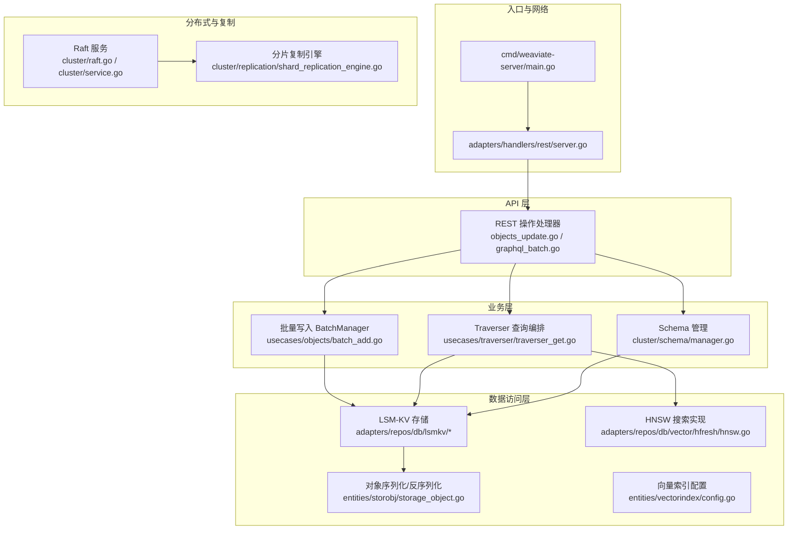
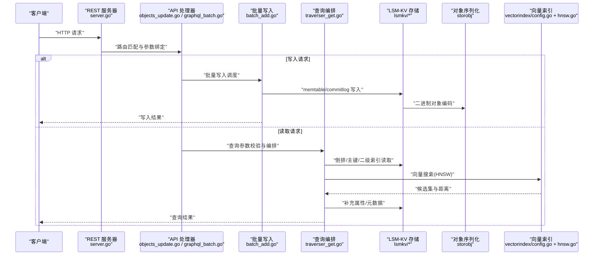
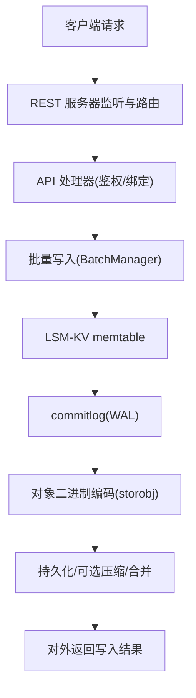
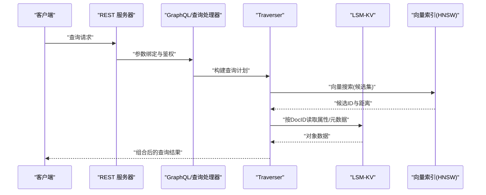
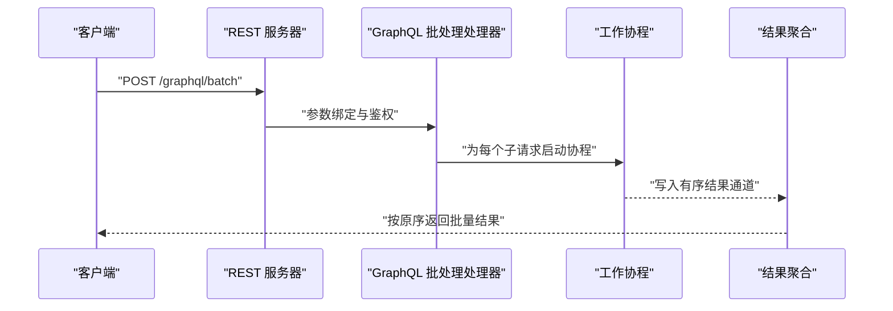
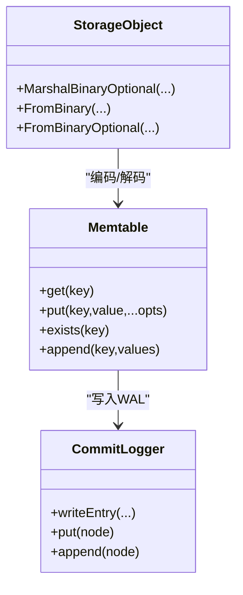
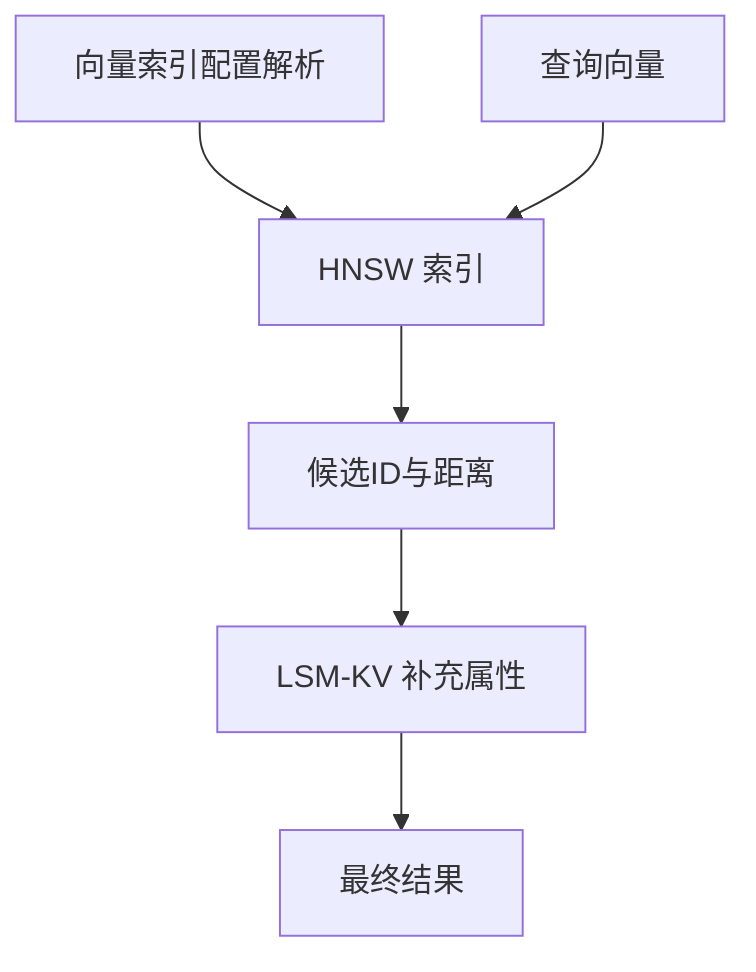
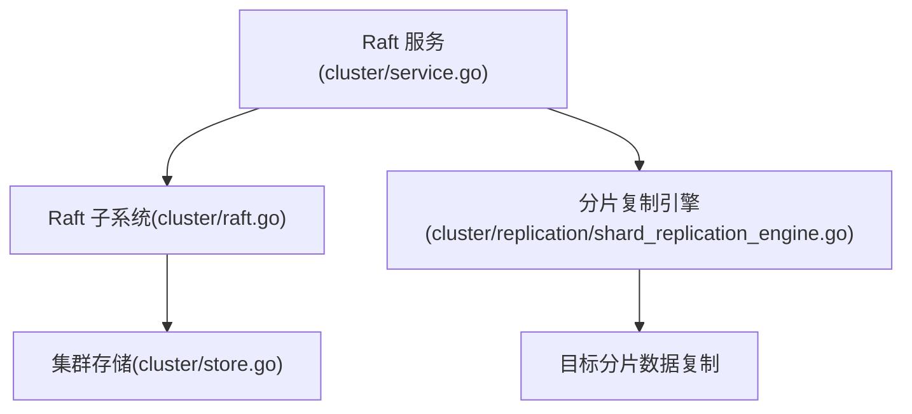
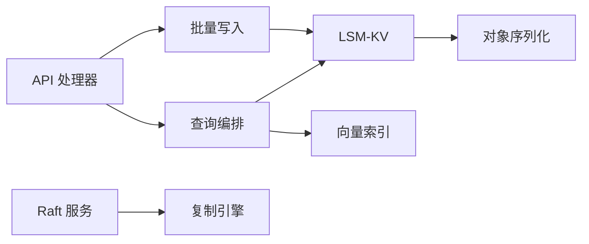

# 数据流架构

<cite>
**本文引用的文件**   
- [cmd/weaviate-server/main.go](file://cmd/weaviate-server/main.go)
- [adapters/handlers/rest/server.go](file://adapters/handlers/rest/server.go)
- [adapters/handlers/rest/operations/objects/objects_update.go](file://adapters/handlers/rest/operations/objects/objects_update.go)
- [adapters/handlers/rest/operations/graphql/graphql_batch.go](file://adapters/handlers/rest/operations/graphql/graphql_batch.go)
- [adapters/handlers/rest/handlers_graphql.go](file://adapters/handlers/rest/handlers_graphql.go)
- [adapters/repos/db/lsmkv/doc.go](file://adapters/repos/db/lsmkv/doc.go)
- [adapters/repos/db/lsmkv/memtable.go](file://adapters/repos/db/lsmkv/memtable.go)
- [adapters/repos/db/lsmkv/commitlogger.go](file://adapters/repos/db/lsmkv/commitlogger.go)
- [adapters/repos/db/lsmkv/binary_search_tree.go](file://adapters/repos/db/lsmkv/binary_search_tree.go)
- [adapters/repos/db/lsmkv/bucket_slow_log.go](file://adapters/repos/db/lsmkv/bucket_slow_log.go)
- [adapters/repos/schema/store.go](file://adapters/repos/schema/store.go)
- [entities/storobj/storage_object.go](file://entities/storobj/storage_object.go)
- [usecases/objects/batch_add.go](file://usecases/objects/batch_add.go)
- [usecases/traverser/traverser_get.go](file://usecases/traverser/traverser_get.go)
- [usecases/traverser/traverser_schema_search_params.go](file://usecases/traverser/traverser_schema_search_params.go)
- [entities/vectorindex/config.go](file://entities/vectorindex/config.go)
- [adapters/repos/db/vector/hfresh/hnsw.go](file://adapters/repos/db/vector/hfresh/hnsw.go)
- [cluster/replication/shard_replication_engine.go](file://cluster/replication/shard_replication_engine.go)
- [cluster/schema/schema.go](file://cluster/schema/schema.go)
- [cluster/schema/manager.go](file://cluster/schema/manager.go)
- [cluster/raft.go](file://cluster/raft.go)
- [cluster/service.go](file://cluster/service.go)
- [cluster/store.go](file://cluster/store.go)
- [entities/sync/sync_test.go](file://entities/sync/sync_test.go)
- [usecases/dynsemaphore/dynsemaphore.go](file://usecases/dynsemaphore/dynsemaphore.go)
- [adapters/repos/db/roaringset/buf_pool.go](file://adapters/repos/db/roaringset/buf_pool.go)
</cite>

## 目录
1. [简介](#简介)
2. [项目结构](#项目结构)
3. [核心组件](#核心组件)
4. [架构总览](#架构总览)
5. [详细组件分析](#详细组件分析)
6. [依赖分析](#依赖分析)
7. [性能考量](#性能考量)
8. [故障排查指南](#故障排查指南)
9. [结论](#结论)
10. [附录](#附录)

## 简介
本文件面向 Weaviate 的数据流架构，系统性梳理从客户端请求进入 API 层，经由业务逻辑处理，到数据访问层与存储引擎的完整路径；同时覆盖写入与读取两条主线流程、缓存与批量机制、事务与并发控制、一致性与分布式同步等主题，并以图示方式标注关键处理节点与性能优化点。

## 项目结构
Weaviate 采用分层清晰的模块化组织：
- 入口与服务启动：命令行入口负责加载 Swagger 规范并启动 REST 服务器。
- API 层：基于 go-swagger 生成的 REST 处理器，统一处理路由、鉴权、参数绑定与响应。
- 业务层：对象批量写入、Traverser 查询编排、Schema 管理等。
- 数据访问层：LSM-KV 存储、倒排索引、向量索引、二进制对象序列化。
- 分布式与复制：Raft 集群、分片复制引擎、集群状态管理。

图表来源
- [cmd/weaviate-server/main.go](file://cmd/weaviate-server/main.go#L30-L66)
- [adapters/handlers/rest/server.go](file://adapters/handlers/rest/server.go#L164-L337)
- [adapters/handlers/rest/operations/objects/objects_update.go](file://adapters/handlers/rest/operations/objects/objects_update.go#L57-L84)
- [adapters/handlers/rest/operations/graphql/graphql_batch.go](file://adapters/handlers/rest/operations/graphql/graphql_batch.go#L57-L84)
- [usecases/objects/batch_add.go](file://usecases/objects/batch_add.go#L103-L115)
- [usecases/traverser/traverser_get.go](file://usecases/traverser/traverser_get.go#L48-L68)
- [adapters/repos/db/lsmkv/doc.go](file://adapters/repos/db/lsmkv/doc.go#L12-L75)
- [entities/storobj/storage_object.go](file://entities/storobj/storage_object.go#L110-L288)
- [entities/vectorindex/config.go](file://entities/vectorindex/config.go#L24-L51)
- [adapters/repos/db/vector/hfresh/hnsw.go](file://adapters/repos/db/vector/hfresh/hnsw.go#L123-L138)
- [cluster/raft.go](file://cluster/raft.go#L57-L98)
- [cluster/service.go](file://cluster/service.go#L46-L70)
- [cluster/replication/shard_replication_engine.go](file://cluster/replication/shard_replication_engine.go#L48-L270)

章节来源
- [cmd/weaviate-server/main.go](file://cmd/weaviate-server/main.go#L30-L66)
- [adapters/handlers/rest/server.go](file://adapters/handlers/rest/server.go#L164-L337)

## 核心组件
- REST 服务器与路由：统一监听 HTTP/HTTPS/Unix Socket，设置超时、KeepAlive、TLS 等参数，启动多监听器并优雅关闭。
- API 处理器：对对象更新、GraphQL 批处理等进行参数绑定、鉴权与响应封装。
- 批量写入：集中处理对象批量插入，支持复制与类缓存，记录指标并进行限流与并发控制。
- Traverser 查询：校验过滤条件、距离参数，编排对象检索与向量搜索。
- LSM-KV 存储：替换型、集合型、映射型等策略，支持 memtable、commitlog、段落合并与二级索引。
- 对象序列化：二进制格式高效存储对象元数据、向量、属性与附加信息。
- 向量索引：HNSW/Flat/Dynamic/HFresh 等类型配置与选择。
- 分布式复制：基于 Raft 的分片复制引擎，背压与并发控制，节点生命周期管理。

章节来源
- [adapters/handlers/rest/server.go](file://adapters/handlers/rest/server.go#L80-L115)
- [adapters/handlers/rest/operations/objects/objects_update.go](file://adapters/handlers/rest/operations/objects/objects_update.go#L57-L84)
- [adapters/handlers/rest/operations/graphql/graphql_batch.go](file://adapters/handlers/rest/operations/graphql/graphql_batch.go#L57-L84)
- [usecases/objects/batch_add.go](file://usecases/objects/batch_add.go#L103-L115)
- [usecases/traverser/traverser_get.go](file://usecases/traverser/traverser_get.go#L48-L68)
- [adapters/repos/db/lsmkv/doc.go](file://adapters/repos/db/lsmkv/doc.go#L12-L75)
- [entities/storobj/storage_object.go](file://entities/storobj/storage_object.go#L110-L288)
- [entities/vectorindex/config.go](file://entities/vectorindex/config.go#L24-L51)
- [adapters/repos/db/vector/hfresh/hnsw.go](file://adapters/repos/db/vector/hfresh/hnsw.go#L123-L138)
- [cluster/replication/shard_replication_engine.go](file://cluster/replication/shard_replication_engine.go#L48-L270)

## 架构总览
下图展示从客户端请求到存储引擎的数据流主干，包括写入与读取两条路径的关键节点与交互。

图表来源
- [adapters/handlers/rest/server.go](file://adapters/handlers/rest/server.go#L164-L337)
- [adapters/handlers/rest/operations/objects/objects_update.go](file://adapters/handlers/rest/operations/objects/objects_update.go#L57-L84)
- [adapters/handlers/rest/operations/graphql/graphql_batch.go](file://adapters/handlers/rest/operations/graphql/graphql_batch.go#L57-L84)
- [usecases/objects/batch_add.go](file://usecases/objects/batch_add.go#L103-L115)
- [usecases/traverser/traverser_get.go](file://usecases/traverser/traverser_get.go#L48-L68)
- [adapters/repos/db/lsmkv/memtable.go](file://adapters/repos/db/lsmkv/memtable.go#L38-L49)
- [adapters/repos/db/lsmkv/commitlogger.go](file://adapters/repos/db/lsmkv/commitlogger.go#L34-L45)
- [entities/storobj/storage_object.go](file://entities/storobj/storage_object.go#L110-L288)
- [entities/vectorindex/config.go](file://entities/vectorindex/config.go#L24-L51)
- [adapters/repos/db/vector/hfresh/hnsw.go](file://adapters/repos/db/vector/hfresh/hnsw.go#L123-L138)

## 详细组件分析

### 写入流程：客户端 → API 层 → 业务逻辑 → 数据库层 → 存储引擎
- 客户端请求到达 REST 服务器后，按路由进入对应处理器（如对象更新）。
- 处理器完成鉴权、参数绑定与基础校验后，交由业务层（批量写入）执行。
- 批量写入会进行类缓存、复制策略与并发度控制，随后写入 LSM-KV 的 memtable，并通过 commitlog 记录。
- 对象以二进制格式编码，包含 DocID、UUID、时间戳、向量、属性与附加字段，便于后续快速反序列化与检索。

图表来源
- [adapters/handlers/rest/server.go](file://adapters/handlers/rest/server.go#L164-L337)
- [adapters/handlers/rest/operations/objects/objects_update.go](file://adapters/handlers/rest/operations/objects/objects_update.go#L57-L84)
- [usecases/objects/batch_add.go](file://usecases/objects/batch_add.go#L103-L115)
- [adapters/repos/db/lsmkv/memtable.go](file://adapters/repos/db/lsmkv/memtable.go#L38-L49)
- [adapters/repos/db/lsmkv/commitlogger.go](file://adapters/repos/db/lsmkv/commitlogger.go#L34-L45)
- [entities/storobj/storage_object.go](file://entities/storobj/storage_object.go#L110-L288)

章节来源
- [usecases/objects/batch_add.go](file://usecases/objects/batch_add.go#L103-L115)
- [adapters/repos/db/lsmkv/memtable.go](file://adapters/repos/db/lsmkv/memtable.go#L38-L49)
- [adapters/repos/db/lsmkv/commitlogger.go](file://adapters/repos/db/lsmkv/commitlogger.go#L34-L45)
- [entities/storobj/storage_object.go](file://entities/storobj/storage_object.go#L110-L288)

### 读取流程：客户端 → API 层 → 查询编排 → 向量索引搜索 → 数据返回
- 客户端请求进入 REST 服务器，路由到查询处理器。
- 查询编排层对过滤条件、距离参数等进行校验，决定是否启用向量搜索。
- 向量搜索通过 HNSW 等索引计算候选集与距离；随后回查 LSM-KV 获取属性与元数据，最终返回结果。

图表来源
- [adapters/handlers/rest/server.go](file://adapters/handlers/rest/server.go#L164-L337)
- [adapters/handlers/rest/operations/graphql/graphql_batch.go](file://adapters/handlers/rest/operations/graphql/graphql_batch.go#L57-L84)
- [usecases/traverser/traverser_get.go](file://usecases/traverser/traverser_get.go#L48-L68)
- [adapters/repos/db/vector/hfresh/hnsw.go](file://adapters/repos/db/vector/hfresh/hnsw.go#L123-L138)
- [adapters/repos/db/lsmkv/doc.go](file://adapters/repos/db/lsmkv/doc.go#L12-L75)

章节来源
- [usecases/traverser/traverser_get.go](file://usecases/traverser/traverser_get.go#L48-L68)
- [adapters/repos/db/vector/hfresh/hnsw.go](file://adapters/repos/db/vector/hfresh/hnsw.go#L123-L138)
- [adapters/repos/db/lsmkv/doc.go](file://adapters/repos/db/lsmkv/doc.go#L12-L75)

### GraphQL 批处理与并发
- GraphQL 批处理接口接收数组请求，内部使用 goroutine 并发处理每个子请求，并通过通道收集结果，最后按原顺序组装返回。
- 并发安全通过 WaitGroup 与通道保证，避免结果错位与资源竞争。

图表来源
- [adapters/handlers/rest/operations/graphql/graphql_batch.go](file://adapters/handlers/rest/operations/graphql/graphql_batch.go#L57-L84)
- [adapters/handlers/rest/handlers_graphql.go](file://adapters/handlers/rest/handlers_graphql.go#L184-L215)

章节来源
- [adapters/handlers/rest/handlers_graphql.go](file://adapters/handlers/rest/handlers_graphql.go#L184-L215)

### LSM-KV 存储与对象序列化
- LSM-KV 提供多种策略（替换、集合、映射），支持 memtable、commitlog、二级索引与慢日志统计。
- 对象以二进制格式存储，包含版本号、DocID、UUID、时间戳、向量、属性与附加字段，支持按需解码与提取。

图表来源
- [adapters/repos/db/lsmkv/memtable.go](file://adapters/repos/db/lsmkv/memtable.go#L38-L49)
- [adapters/repos/db/lsmkv/commitlogger.go](file://adapters/repos/db/lsmkv/commitlogger.go#L34-L45)
- [entities/storobj/storage_object.go](file://entities/storobj/storage_object.go#L110-L288)

章节来源
- [adapters/repos/db/lsmkv/doc.go](file://adapters/repos/db/lsmkv/doc.go#L12-L75)
- [adapters/repos/db/lsmkv/bucket_slow_log.go](file://adapters/repos/db/lsmkv/bucket_slow_log.go#L19-L45)
- [entities/storobj/storage_object.go](file://entities/storobj/storage_object.go#L110-L288)

### 向量索引与搜索
- 向量索引类型通过配置解析与校验，支持 HNSW/Flat/Dynamic/HFresh。
- HNSW 实现提供基于向量的近邻搜索，返回候选 ID 与距离，随后结合倒排索引与主键索引完成属性回填。

图表来源
- [entities/vectorindex/config.go](file://entities/vectorindex/config.go#L24-L51)
- [adapters/repos/db/vector/hfresh/hnsw.go](file://adapters/repos/db/vector/hfresh/hnsw.go#L123-L138)

章节来源
- [entities/vectorindex/config.go](file://entities/vectorindex/config.go#L24-L51)
- [adapters/repos/db/vector/hfresh/hnsw.go](file://adapters/repos/db/vector/hfresh/hnsw.go#L123-L138)

### 分布式复制与一致性
- Raft 服务负责集群共识、快照与日志尾部裁剪；分片复制引擎采用生产者-消费者模式，内置背压与并发控制。
- 服务在启动时初始化 RPC 客户端/服务端，管理复制状态机与生命周期。

图表来源
- [cluster/service.go](file://cluster/service.go#L46-L70)
- [cluster/raft.go](file://cluster/raft.go#L57-L98)
- [cluster/store.go](file://cluster/store.go#L735-L771)
- [cluster/replication/shard_replication_engine.go](file://cluster/replication/shard_replication_engine.go#L48-L270)

章节来源
- [cluster/service.go](file://cluster/service.go#L46-L70)
- [cluster/raft.go](file://cluster/raft.go#L57-L98)
- [cluster/store.go](file://cluster/store.go#L735-L771)
- [cluster/replication/shard_replication_engine.go](file://cluster/replication/shard_replication_engine.go#L48-L270)

## 依赖分析
- API 层依赖业务层与数据访问层；业务层依赖存储与索引；存储层依赖对象序列化与 LSM-KV；分布式层依赖 Raft 与复制引擎。
- 关键耦合点：API 处理器与 BatchManager/Traverser 的边界清晰；LSM-KV 与对象序列化紧密协作；向量索引与查询编排解耦。

图表来源
- [adapters/handlers/rest/operations/objects/objects_update.go](file://adapters/handlers/rest/operations/objects/objects_update.go#L57-L84)
- [usecases/objects/batch_add.go](file://usecases/objects/batch_add.go#L103-L115)
- [usecases/traverser/traverser_get.go](file://usecases/traverser/traverser_get.go#L48-L68)
- [adapters/repos/db/lsmkv/doc.go](file://adapters/repos/db/lsmkv/doc.go#L12-L75)
- [entities/storobj/storage_object.go](file://entities/storobj/storage_object.go#L110-L288)
- [entities/vectorindex/config.go](file://entities/vectorindex/config.go#L24-L51)
- [cluster/raft.go](file://cluster/raft.go#L57-L98)
- [cluster/replication/shard_replication_engine.go](file://cluster/replication/shard_replication_engine.go#L48-L270)

章节来源
- [adapters/repos/db/lsmkv/doc.go](file://adapters/repos/db/lsmkv/doc.go#L12-L75)
- [entities/storobj/storage_object.go](file://entities/storobj/storage_object.go#L110-L288)

## 性能考量
- 并发与限流
  - GraphQL 批处理使用 goroutine 并发与 WaitGroup 控制并发度，避免结果错位。
  - 动态信号量（DynamicWeighted）用于动态权重的并发限制与等待队列，支持父级传播释放。
  - LSM-KV 缓冲池（bitmapBufPool）与对象缓冲池（bufferPool）降低内存分配与 GC 压力。
- I/O 与序列化
  - 对象二进制编码仅在需要时解码向量与属性，减少不必要的 CPU 与内存消耗。
  - LSM-KV 支持二级索引读取时的“重查”统计与慢日志，辅助定位热点与瓶颈。
- 网络与监听
  - REST 服务器支持 HTTP/HTTPS/Unix Socket 多监听，可配置 KeepAlive、读写超时与连接上限，提升稳定性与吞吐。
- 向量搜索
  - HNSW 搜索返回候选集与距离，再回表获取属性，平衡召回与延迟。

章节来源
- [adapters/handlers/rest/handlers_graphql.go](file://adapters/handlers/rest/handlers_graphql.go#L184-L215)
- [usecases/dynsemaphore/dynsemaphore.go](file://usecases/dynsemaphore/dynsemaphore.go#L133-L180)
- [adapters/repos/db/roaringset/buf_pool.go](file://adapters/repos/db/roaringset/buf_pool.go#L96-L294)
- [adapters/repos/db/lsmkv/bucket_slow_log.go](file://adapters/repos/db/lsmkv/bucket_slow_log.go#L19-L45)
- [adapters/handlers/rest/server.go](file://adapters/handlers/rest/server.go#L80-L115)
- [adapters/repos/db/vector/hfresh/hnsw.go](file://adapters/repos/db/vector/hfresh/hnsw.go#L123-L138)
- [entities/storobj/storage_object.go](file://entities/storobj/storage_object.go#L110-L288)

## 故障排查指南
- 并发与锁
  - 使用互斥/读写锁与上下文互斥（contextMutex）保障临界区安全；测试覆盖了并发加锁/解锁与超时行为。
- 分布式一致性
  - Raft 服务提供 Ready/WaitForUpdate/IsLeader 等能力，确保在 Schema 更新与复制阶段的一致性。
- 复制引擎
  - 分片复制引擎提供背压监控（内部通道长度）、生命周期管理与错误处理，便于诊断复制积压与失败。
- 慢查询与热点
  - LSM-KV 慢日志统计各阶段耗时，辅助定位慢查询与热点段。

章节来源
- [entities/sync/sync_test.go](file://entities/sync/sync_test.go#L24-L313)
- [cluster/raft.go](file://cluster/raft.go#L57-L98)
- [cluster/replication/shard_replication_engine.go](file://cluster/replication/shard_replication_engine.go#L255-L270)
- [adapters/repos/db/lsmkv/bucket_slow_log.go](file://adapters/repos/db/lsmkv/bucket_slow_log.go#L19-L45)

## 结论
Weaviate 的数据流架构以清晰的分层与职责分离为核心：API 层负责接入与协议适配，业务层承载写入与查询编排，数据访问层以 LSM-KV 与对象二进制编码为基础，向量索引提供高效相似性检索，分布式层通过 Raft 与复制引擎保障一致性与可用性。配合并发控制、动态限流与缓冲池等优化手段，整体在高并发场景下具备良好的吞吐与稳定性。

## 附录
- 关键配置与类型
  - 向量索引类型：HNSW/Flat/Dynamic/HFresh，默认类型为 HNSW。
  - Schema 存储：BoltDB 结构化存储，包含版本、类元数据与分片状态。
  - GraphQL 批处理：支持多查询一次性传输，内部并发执行并保持顺序一致性。

章节来源
- [entities/vectorindex/config.go](file://entities/vectorindex/config.go#L24-L51)
- [adapters/repos/schema/store.go](file://adapters/repos/schema/store.go#L66-L81)
- [adapters/handlers/rest/operations/graphql/graphql_batch.go](file://adapters/handlers/rest/operations/graphql/graphql_batch.go#L57-L84)