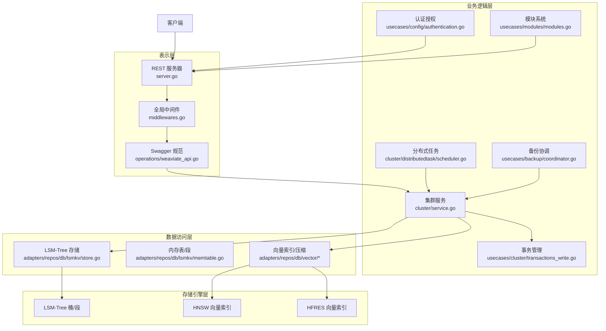
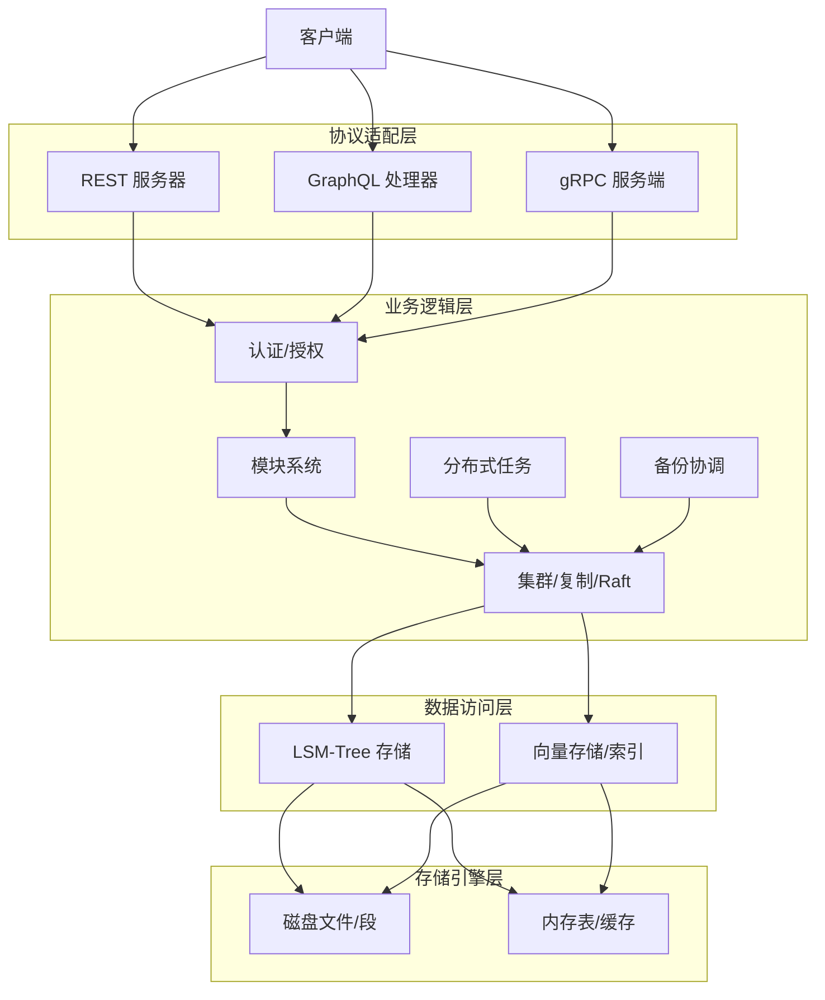
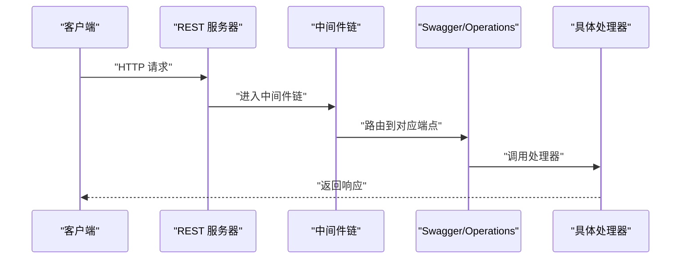
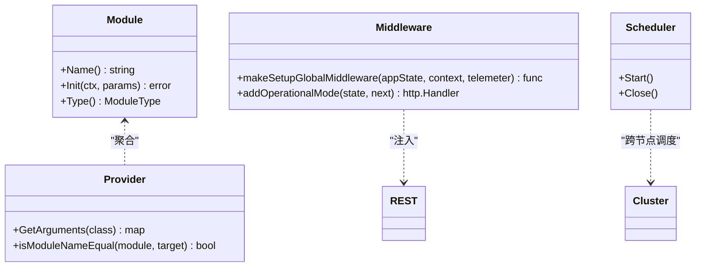
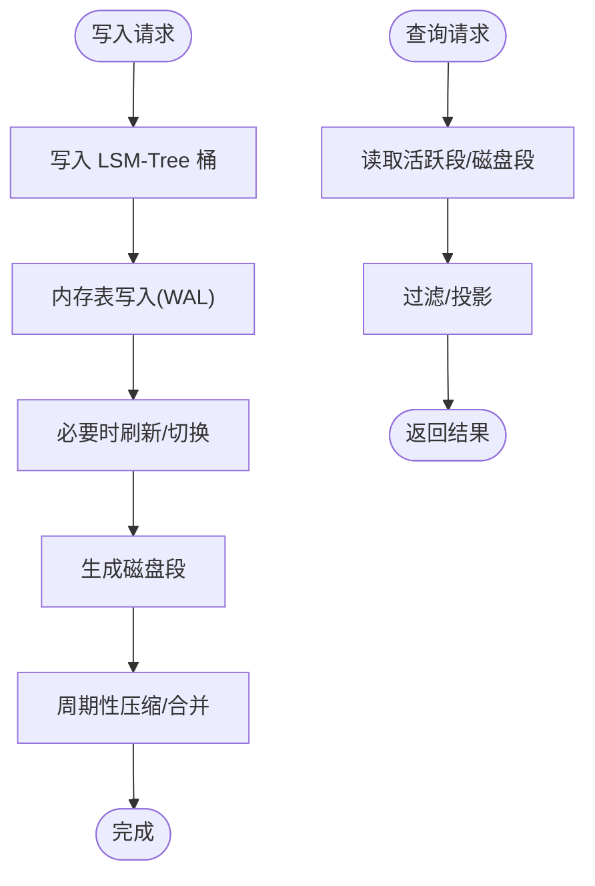
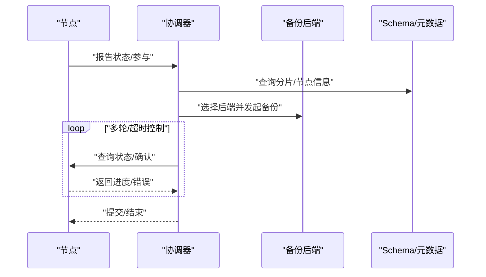
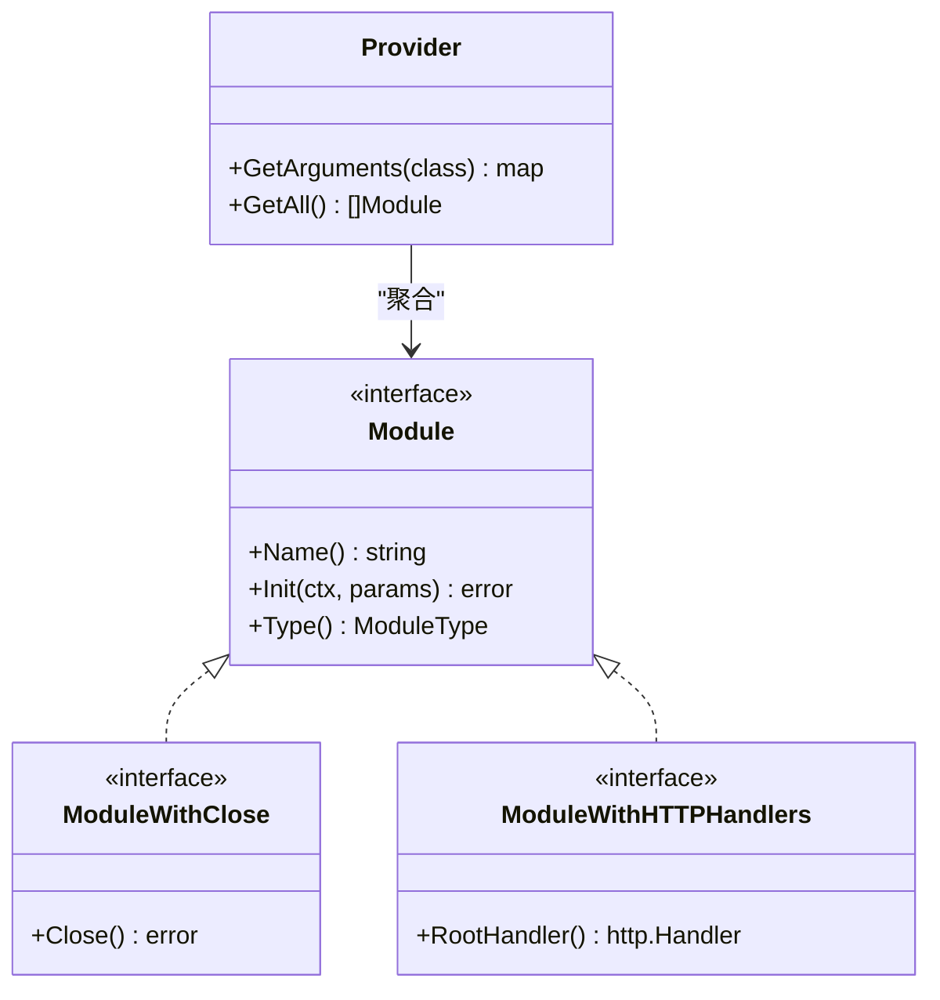
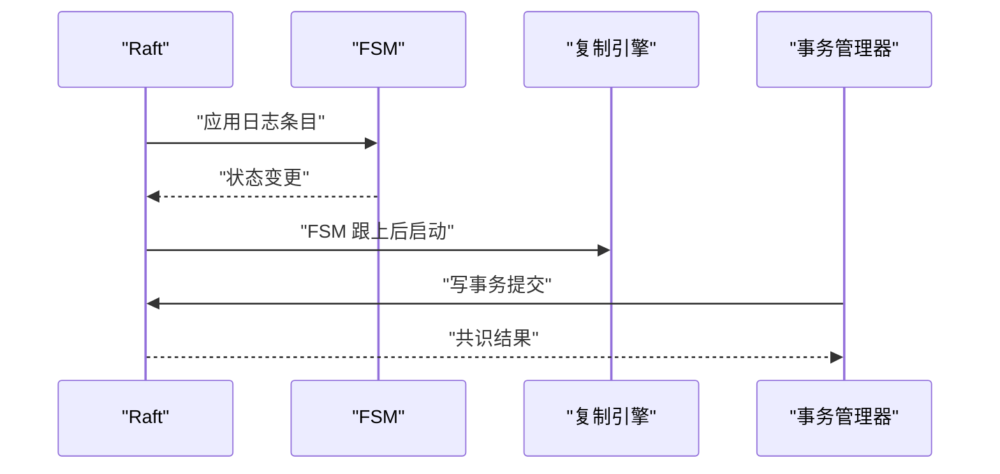
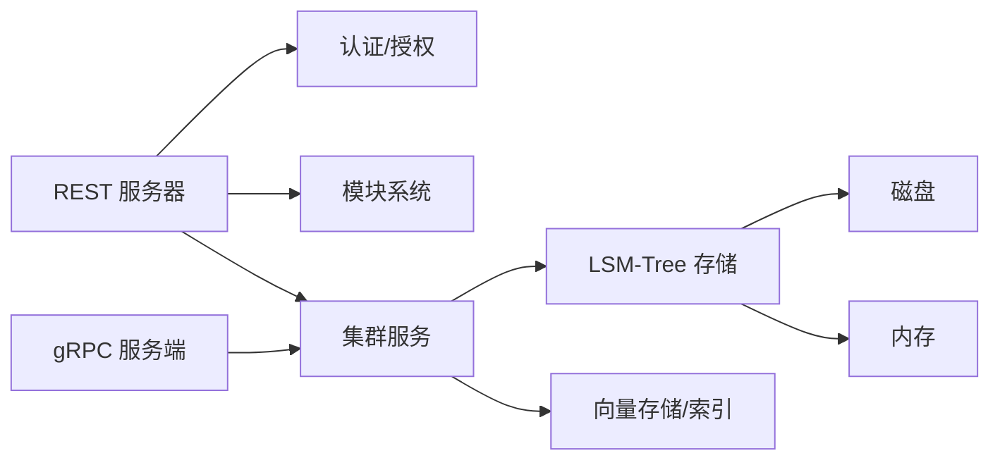

# 整体架构设计

<cite>
**本文引用的文件**
- [cmd/weaviate-server/main.go](file://cmd/weaviate-server/main.go)
- [adapters/handlers/rest/server.go](file://adapters/handlers/rest/server.go)
- [adapters/handlers/rest/configure_api.go](file://adapters/handlers/rest/configure_api.go)
- [adapters/handlers/rest/operations/weaviate_api.go](file://adapters/handlers/rest/operations/weaviate_api.go)
- [adapters/handlers/rest/middlewares.go](file://adapters/handlers/rest/middlewares.go)
- [cluster/service.go](file://cluster/service.go)
- [cluster/raft_apply_endpoints.go](file://cluster/raft_apply_endpoints.go)
- [cluster/raft_query_endpoints.go](file://cluster/raft_query_endpoints.go)
- [usecases/cluster/transactions_write.go](file://usecases/cluster/transactions_write.go)
- [usecases/modules/modules.go](file://usecases/modules/modules.go)
- [entities/modulecapabilities/module.go](file://entities/modulecapabilities/module.go)
- [adapters/repos/db/lsmkv/store.go](file://adapters/repos/db/lsmkv/store.go)
- [adapters/repos/db/lsmkv/memtable.go](file://adapters/repos/db/lsmkv/memtable.go)
- [adapters/repos/db/lsmkv/store_backup.go](file://adapters/repos/db/lsmkv/store_backup.go)
- [adapters/repos/db/vector/hnsw/compress_sift_test.go](file://adapters/repos/db/vector/hnsw/compress_sift_test.go)
- [adapters/repos/db/vector/hfresh/posting_map.go](file://adapters/repos/db/vector/hfresh/posting_map.go)
- [adapters/repos/db/vector/compressionhelpers/compression.go](file://adapters/repos/db/vector/compressionhelpers/compression.go)
- [usecases/backup/coordinator.go](file://usecases/backup/coordinator.go)
- [cluster/distributedtask/scheduler.go](file://cluster/distributedtask/scheduler.go)
- [entities/models/distributed_task.go](file://entities/models/distributed_task.go)
- [usecases/config/authentication.go](file://usecases/config/authentication.go)
- [usecases/auth/authentication/anonymous/middleware.go](file://usecases/auth/authentication/anonymous/middleware.go)
- [grpc/generated/protocol/v1/...](file://grpc/generated/protocol/v1/...)
- [grpc/proto/v1/...](file://grpc/proto/v1/...)
- [README.md](file://README.md)
</cite>

## 目录
1. [简介](#简介)
2. [项目结构](#项目结构)
3. [核心组件](#核心组件)
4. [架构总览](#架构总览)
5. [详细组件分析](#详细组件分析)
6. [依赖关系分析](#依赖关系分析)
7. [性能考量](#性能考量)
8. [故障排查指南](#故障排查指南)
9. [结论](#结论)
10. [附录](#附录)

## 简介
本文件面向 Weaviate 向量数据库的整体架构设计，系统性阐述其分层架构模式与模块化扩展能力，重点覆盖：
- 表示层（REST、GraphQL、gRPC）
- 业务逻辑层（认证授权、模块化能力、分布式任务、备份协调）
- 数据访问层（LSM-Tree 存储抽象、向量索引与压缩）
- 存储引擎层（LSM-Tree、向量索引、持久化策略）

同时解析插件架构如何支持模块化扩展，事件驱动架构如何实现分布式事件处理，以及微服务架构如何实现功能解耦。最后提供系统架构图与组件关系图，展示从客户端请求到数据存储的完整数据流路径。

## 项目结构
Weaviate 采用多层分层与模块化组织方式：
- 服务器入口与协议适配：cmd/weaviate-server/main.go 作为二进制入口，加载 Swagger 规范并启动 REST 服务器；同时支持 gRPC 协议（由 proto 生成）。
- 表示层：adapters/handlers/rest/* 提供 REST/GraphQL 处理链，中间件负责 CORS、日志、监控、模块扩展等；operations/* 定义各端点处理器。
- 业务逻辑层：cluster/* 提供 Raft 分布式一致性、复制与内部 RPC；usecases/* 提供认证授权、模块系统、备份协调、分布式任务等。
- 数据访问层：adapters/repos/db/lsmkv/* 抽象 LSM-Tree 存储，支持桶、内存表、段与压缩；vector/* 提供向量索引与压缩实现。
- 存储引擎层：LSM-Tree（LSM-KV）、向量索引（HNSW、HFRES）与持久化策略（暂停压缩、快照、备份）。

图表来源
- [cmd/weaviate-server/main.go](file://cmd/weaviate-server/main.go#L30-L66)
- [adapters/handlers/rest/server.go](file://adapters/handlers/rest/server.go#L164-L200)
- [adapters/handlers/rest/operations/weaviate_api.go](file://adapters/handlers/rest/operations/weaviate_api.go#L1476-L1495)
- [adapters/handlers/rest/middlewares.go](file://adapters/handlers/rest/middlewares.go#L90-L110)
- [cluster/service.go](file://cluster/service.go#L66-L117)
- [adapters/repos/db/lsmkv/store.go](file://adapters/repos/db/lsmkv/store.go#L66-L86)
- [adapters/repos/db/lsmkv/memtable.go](file://adapters/repos/db/lsmkv/memtable.go#L337-L373)
- [adapters/repos/db/vector/hnsw/compress_sift_test.go](file://adapters/repos/db/vector/hnsw/compress_sift_test.go#L579-L595)

章节来源
- [README.md](file://README.md#L100-L128)

## 核心组件
- 服务器层（REST/gRPC/GraphQL）
  - REST 服务器：监听 HTTP/TLS/Unix Socket，注册中间件与处理器，支持优雅关闭与信号处理。
  - Swagger/Operations：集中定义 REST 端点与处理器映射，支持中间件组合。
  - gRPC：通过 proto 生成协议与客户端/服务端，配合集群内部 RPC。
- 业务逻辑层
  - 集群服务：封装 Raft、复制引擎、内部 RPC 服务，负责元数据一致性与跨节点操作。
  - 认证授权：支持匿名访问、OIDC、API Key、数据库用户等多种认证方式。
  - 模块系统：模块化扩展文本/图像向量化、生成、重排序、离线等能力。
  - 分布式任务：调度与跟踪跨节点任务生命周期。
  - 备份协调：跨分片、跨节点的分布式备份流程协调。
- 数据访问层
  - LSM-Tree：抽象桶、内存表、段、压缩与快照，提供并发安全与生命周期管理。
  - 向量索引：HNSW、HFRES 等索引实现，支持向量压缩与版本化存储。
- 存储引擎层
  - LSM-Tree：替换策略、倒排索引策略、辅助压缩回调。
  - 向量索引：向量 ID 映射、压缩缓存、量化解码。

章节来源
- [adapters/handlers/rest/server.go](file://adapters/handlers/rest/server.go#L55-L115)
- [adapters/handlers/rest/operations/weaviate_api.go](file://adapters/handlers/rest/operations/weaviate_api.go#L51-L68)
- [cluster/service.go](file://cluster/service.go#L46-L64)
- [usecases/config/authentication.go](file://usecases/config/authentication.go#L43-L83)
- [usecases/modules/modules.go](file://usecases/modules/modules.go#L432-L473)
- [adapters/repos/db/lsmkv/store.go](file://adapters/repos/db/lsmkv/store.go#L41-L64)
- [adapters/repos/db/vector/hnsw/compress_sift_test.go](file://adapters/repos/db/vector/hnsw/compress_sift_test.go#L579-L595)

## 架构总览
Weaviate 采用“协议适配层 + 业务逻辑层 + 数据访问层 + 存储引擎层”的四层架构，并通过插件化模块与 Raft 分布式一致性实现高可用与可扩展性。

图表来源
- [adapters/handlers/rest/server.go](file://adapters/handlers/rest/server.go#L164-L200)
- [cluster/service.go](file://cluster/service.go#L66-L117)
- [adapters/repos/db/lsmkv/store.go](file://adapters/repos/db/lsmkv/store.go#L66-L86)

## 详细组件分析

### 服务器层（REST/gRPC/GraphQL）
- REST 服务器
  - 支持 HTTP/TLS/Unix Socket 多监听器，统一设置超时、清理时间、最大头大小等参数。
  - 优雅关闭与中断信号处理，保证服务平滑退出。
- Swagger/Operations
  - 通过 Swagger 规范生成 API 对象，集中注册各端点处理器。
  - 支持中间件注入与自定义消费者/生产者。
- 中间件链
  - CORS、日志、监控、健康检查、模块扩展、操作模式白名单控制等。
- gRPC
  - 通过 proto 生成协议，配合集群内部 RPC 与客户端，实现跨节点调用。

图表来源
- [adapters/handlers/rest/server.go](file://adapters/handlers/rest/server.go#L164-L200)
- [adapters/handlers/rest/middlewares.go](file://adapters/handlers/rest/middlewares.go#L90-L110)
- [adapters/handlers/rest/operations/weaviate_api.go](file://adapters/handlers/rest/operations/weaviate_api.go#L1476-L1495)

章节来源
- [cmd/weaviate-server/main.go](file://cmd/weaviate-server/main.go#L30-L66)
- [adapters/handlers/rest/server.go](file://adapters/handlers/rest/server.go#L80-L115)
- [adapters/handlers/rest/middlewares.go](file://adapters/handlers/rest/middlewares.go#L90-L110)
- [adapters/handlers/rest/operations/weaviate_api.go](file://adapters/handlers/rest/operations/weaviate_api.go#L51-L68)

### 业务逻辑层（认证授权、模块系统、分布式任务、备份协调）
- 认证授权
  - 支持匿名访问、OIDC、API Key、数据库用户等多种认证方式；中间件根据配置拒绝未认证请求并提示可用方案。
- 模块系统
  - 模块类型覆盖 Offload、Backup、Img2Vec、Text2Vec、Text2TextGenerative、Ref2Vec、Reranker 等。
  - Provider 统一聚合模块能力，暴露 GraphQL 参数与扩展根处理器。
- 分布式任务
  - 任务生命周期：提交、调度、节点完成、取消、查询状态；支持命名空间隔离与版本控制。
- 备份协调
  - 协调跨节点、跨分片的备份流程，包含参与者状态、超时控制与分组策略。

图表来源
- [entities/modulecapabilities/module.go](file://entities/modulecapabilities/module.go#L24-L49)
- [usecases/modules/modules.go](file://usecases/modules/modules.go#L432-L473)
- [usecases/config/authentication.go](file://usecases/config/authentication.go#L43-L83)
- [usecases/auth/authentication/anonymous/middleware.go](file://usecases/auth/authentication/anonymous/middleware.go#L43-L70)
- [cluster/distributedtask/scheduler.go](file://cluster/distributedtask/scheduler.go#L1-L27)

章节来源
- [usecases/config/authentication.go](file://usecases/config/authentication.go#L43-L83)
- [usecases/auth/authentication/anonymous/middleware.go](file://usecases/auth/authentication/anonymous/middleware.go#L43-L70)
- [usecases/modules/modules.go](file://usecases/modules/modules.go#L432-L473)
- [entities/modulecapabilities/module.go](file://entities/modulecapabilities/module.go#L24-L49)
- [cluster/distributedtask/scheduler.go](file://cluster/distributedtask/scheduler.go#L1-L27)
- [entities/models/distributed_task.go](file://entities/models/distributed_task.go#L53-L123)

### 数据访问层（LSM-Tree 与向量存储）
- LSM-Tree 存储
  - Store 负责目录、桶注册、并发锁与生命周期管理；支持创建/加载桶、暂停压缩、更新状态等。
  - Bucket 提供替换/倒排等策略，Memtable 写入 WAL、墓碑标记与只读墓碑查询。
- 向量存储与压缩
  - PostingMapStore 将向量 ID 与版本持久化；量化压缩器提供缓存、解码与统计。
  - HNSW/HFRES 索引用于高效近邻检索，支持压缩与版本化。

图表来源
- [adapters/repos/db/lsmkv/store.go](file://adapters/repos/db/lsmkv/store.go#L133-L200)
- [adapters/repos/db/lsmkv/memtable.go](file://adapters/repos/db/lsmkv/memtable.go#L337-L373)
- [adapters/repos/db/vector/hfresh/posting_map.go](file://adapters/repos/db/vector/hfresh/posting_map.go#L223-L269)
- [adapters/repos/db/vector/compressionhelpers/compression.go](file://adapters/repos/db/vector/compressionhelpers/compression.go#L83-L131)

章节来源
- [adapters/repos/db/lsmkv/store.go](file://adapters/repos/db/lsmkv/store.go#L41-L116)
- [adapters/repos/db/lsmkv/memtable.go](file://adapters/repos/db/lsmkv/memtable.go#L337-L373)
- [adapters/repos/db/vector/hnsw/compress_sift_test.go](file://adapters/repos/db/vector/hnsw/compress_sift_test.go#L579-L595)
- [adapters/repos/db/vector/hfresh/posting_map.go](file://adapters/repos/db/vector/hfresh/posting_map.go#L223-L269)
- [adapters/repos/db/vector/compressionhelpers/compression.go](file://adapters/repos/db/vector/compressionhelpers/compression.go#L83-L131)

### 存储引擎层（持久化与备份）
- 持久化策略
  - 暂停压缩：在备份前暂停压缩，避免长耗时操作阻塞备份。
  - 快照与恢复：通过 Raft 快照与 FSM 状态机实现一致性恢复。
- 备份协调
  - 协调器负责节点分组、状态查询、超时控制与提交轮次推进，确保分布式一致性。

图表来源
- [adapters/repos/db/lsmkv/store_backup.go](file://adapters/repos/db/lsmkv/store_backup.go#L20-L46)
- [usecases/backup/coordinator.go](file://usecases/backup/coordinator.go#L102-L148)
- [cluster/service.go](file://cluster/service.go#L149-L200)

章节来源
- [adapters/repos/db/lsmkv/store_backup.go](file://adapters/repos/db/lsmkv/store_backup.go#L20-L46)
- [usecases/backup/coordinator.go](file://usecases/backup/coordinator.go#L102-L148)
- [cluster/service.go](file://cluster/service.go#L149-L200)

### 插件架构与模块化扩展
- 模块接口
  - Module 定义名称、初始化与类型；支持关闭、HTTP 根处理器、扩展/依赖初始化等可选能力。
  - ModuleType 覆盖文本/图像向量化、生成、重排序、离线、备份等类型。
- 模块提供者
  - Provider 聚合模块能力，动态注入 GraphQL 参数与扩展根处理器，支持别名与通用参数。

图表来源
- [entities/modulecapabilities/module.go](file://entities/modulecapabilities/module.go#L24-L49)
- [usecases/modules/modules.go](file://usecases/modules/modules.go#L432-L473)

章节来源
- [entities/modulecapabilities/module.go](file://entities/modulecapabilities/module.go#L24-L49)
- [usecases/modules/modules.go](file://usecases/modules/modules.go#L432-L473)

### 事件驱动架构与分布式事件处理
- Raft 与复制引擎
  - Service 封装 Raft、复制引擎、内部 RPC 服务；在 FSM 落后追赶完成后启动复制引擎。
  - 事务管理器提供提交/响应函数钩子，支持写事务与读事务。
- 分布式任务
  - 任务生命周期由调度器驱动，跨节点记录完成状态与版本控制，支持取消与查询。

图表来源
- [cluster/service.go](file://cluster/service.go#L119-L147)
- [usecases/cluster/transactions_write.go](file://usecases/cluster/transactions_write.go#L290-L322)

章节来源
- [cluster/service.go](file://cluster/service.go#L119-L147)
- [usecases/cluster/transactions_write.go](file://usecases/cluster/transactions_write.go#L290-L322)

### 微服务架构与功能解耦
- 多协议解耦
  - REST、GraphQL、gRPC 通过独立处理器与中间件链解耦，便于演进与替换。
- 业务与存储解耦
  - 业务逻辑通过模块系统与集群服务抽象对外部依赖进行封装，数据访问层通过 LSM-Tree 与向量索引抽象存储细节。
- 分布式能力解耦
  - 认证授权、分布式任务、备份协调均通过独立组件提供，彼此通过接口与消息传递协作。

## 依赖关系分析
- 服务器层依赖业务逻辑层提供的认证、模块与集群能力。
- 业务逻辑层依赖数据访问层的 LSM-Tree 与向量存储。
- 数据访问层依赖存储引擎层的磁盘与内存资源。
- gRPC 与集群内部 RPC 依赖 proto 定义与解析器。

图表来源
- [adapters/handlers/rest/server.go](file://adapters/handlers/rest/server.go#L164-L200)
- [cluster/service.go](file://cluster/service.go#L66-L117)
- [adapters/repos/db/lsmkv/store.go](file://adapters/repos/db/lsmkv/store.go#L66-L86)

章节来源
- [adapters/handlers/rest/server.go](file://adapters/handlers/rest/server.go#L164-L200)
- [cluster/service.go](file://cluster/service.go#L66-L117)
- [adapters/repos/db/lsmkv/store.go](file://adapters/repos/db/lsmkv/store.go#L66-L86)

## 性能考量
- LSM-Tree
  - 并发写入与 WAL 刷新策略减少磁盘写放大；周期性压缩与辅助压缩回调平衡吞吐与延迟。
  - 暂停压缩用于备份窗口，避免长时间阻塞。
- 向量索引
  - HNSW/HFRES 索引支持高效近邻检索；量化压缩降低内存占用与带宽。
- 监控与指标
  - Prometheus 指标导出与扩展 Go 收集器，便于性能观测与告警。

## 故障排查指南
- 认证失败
  - 检查匿名访问是否启用、OIDC/JWT 配置、API Key 白名单；中间件会返回可用认证方案。
- 操作模式限制
  - 只读/只写/扩展模式下会拒绝不符合白名单的请求，需调整模式或放行路径。
- 备份失败
  - 检查备份协调器超时、节点状态与后端可用性；确保在暂停压缩期间执行备份。
- Raft/复制异常
  - 关注 FSM 跟上状态与复制引擎启动时机；检查 RPC 客户端/服务端连通性与消息大小限制。

章节来源
- [usecases/auth/authentication/anonymous/middleware.go](file://usecases/auth/authentication/anonymous/middleware.go#L43-L70)
- [adapters/handlers/rest/middlewares.go](file://adapters/handlers/rest/middlewares.go#L262-L285)
- [usecases/backup/coordinator.go](file://usecases/backup/coordinator.go#L102-L148)
- [cluster/service.go](file://cluster/service.go#L149-L200)

## 结论
Weaviate 通过清晰的分层架构与模块化扩展，实现了高性能、可扩展、可观测的向量数据库系统。协议适配层统一接入，业务逻辑层提供认证授权、模块系统与分布式能力，数据访问层抽象存储细节，存储引擎层保障持久化与一致性。插件架构与事件驱动机制进一步增强了系统的灵活性与可维护性。

## 附录
- gRPC 协议与生成代码位于 grpc/ 目录，包含 proto 与生成的协议文件。
- README 提供了安装、入门与 API 概览，便于快速理解系统能力与部署方式。

章节来源
- [README.md](file://README.md#L100-L128)
- [grpc/generated/protocol/v1/...](file://grpc/generated/protocol/v1/...)
- [grpc/proto/v1/...](file://grpc/proto/v1/...)