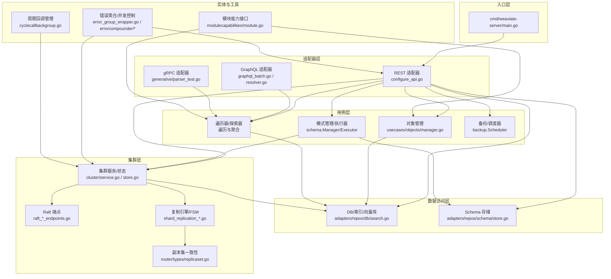
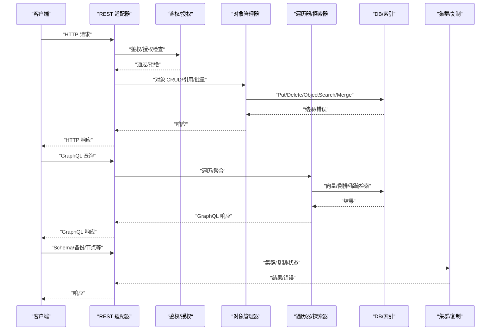
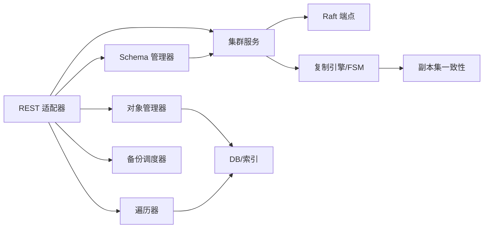
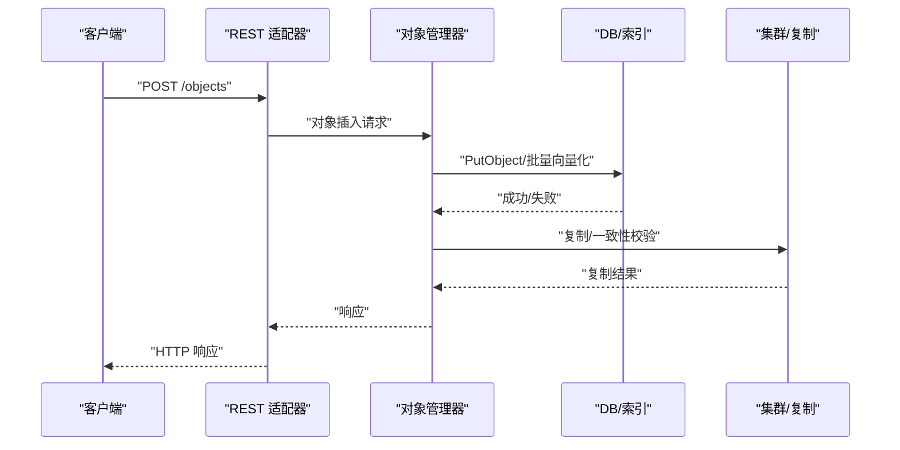

# 核心组件关系

<cite>
**本文档引用的文件**
- [cmd/weaviate-server/main.go](file://cmd/weaviate-server/main.go)
- [adapters/handlers/rest/configure_api.go](file://adapters/handlers/rest/configure_api.go)
- [adapters/handlers/rest/state/state.go](file://adapters/handlers/rest/state/state.go)
- [adapters/handlers/rest/handlers_objects.go](file://adapters/handlers/rest/handlers_objects.go)
- [adapters/handlers/rest/operations/graphql/graphql_batch.go](file://adapters/handlers/rest/operations/graphql/graphql_batch.go)
- [adapters/handlers/graphql/local/aggregate/resolver.go](file://adapters/handlers/graphql/local/aggregate/resolver.go)
- [adapters/handlers/grpc/v1/generative/parser_test.go](file://adapters/handlers/grpc/v1/generative/parser_test.go)
- [adapters/repos/db/vector/hnsw/datasets/neurips23/clustered_runbook.yaml](file://adapters/repos/db/vector/hnsw/datasets/neurips23/clustered_runbook.yaml)
- [adapters/repos/db/search.go](file://adapters/repos/db/search.go)
- [adapters/repos/schema/store.go](file://adapters/repos/schema/store.go)
- [usecases/objects/manager.go](file://usecases/objects/manager.go)
- [usecases/replica/finder.go](file://usecases/replica/finder.go)
- [usecases/replica/metrics.go](file://usecases/replica/metrics.go)
- [cluster/router/types/replicaset.go](file://cluster/router/types/replicaset.go)
- [cluster/replication/shard_replication_engine.go](file://cluster/replication/shard_replication_engine.go)
- [cluster/replication/shard_replication_apply.go](file://cluster/replication/shard_replication_apply.go)
- [cluster/replication/shard_replication_fsm.go](file://cluster/replication/shard_replication_fsm.go)
- [cluster/replication/shard_replication_op_state.go](file://cluster/replication/shard_replication_op_state.go)
- [cluster/replication/utils.go](file://cluster/replication/utils.go)
- [cluster/replication/validate.go](file://cluster/replication/validate.go)
- [cluster/service.go](file://cluster/service.go)
- [cluster/store.go](file://cluster/store.go)
- [cluster/store_apply.go](file://cluster/store_apply.go)
- [cluster/store_query.go](file://cluster/store_query.go)
- [cluster/raft_cluster_endpoints.go](file://cluster/raft_cluster_endpoints.go)
- [cluster/raft_apply_endpoints.go](file://cluster/raft_apply_endpoints.go)
- [cluster/raft_query_endpoints.go](file://cluster/raft_query_endpoints.go)
- [entities/modulecapabilities/module.go](file://entities/modulecapabilities/module.go)
- [entities/errors/error_group_wrapper.go](file://entities/errors/error_group_wrapper.go)
- [entities/errorcompounder/compounder.go](file://entities/errorcompounder/compounder.go)
- [entities/errorcompounder/compounder_thread_safe.go](file://entities/errorcompounder/compounder_thread_safe.go)
- [entities/cyclemanager/cyclecallbackgroup.go](file://entities/cyclemanager/cyclecallbackgroup.go)
- [entities/cyclemanager/errors.go](file://entities/cyclemanager/errors.go)
- [adapters/repos/db/shard_shutdown.go](file://adapters/repos/db/shard_shutdown.go)
- [adapters/repos/db/shard_shutdown_test.go](file://adapters/repos/db/shard_shutdown_test.go)
- [modules/text2vec-contextionary/extensions/rest_user_facing.go](file://modules/text2vec-contextionary/extensions/rest_user_facing.go)
- [modules/text2vec-contextionary/extensions/usecase.go](file://modules/text2vec-contextionary/extensions/usecase.go)
- [test/acceptance/replication/async_replication/async_repair_insertions_test.go](file://test/acceptance/replication/async_replication/async_repair_insertions_test.go)
</cite>

## 目录
1. [简介](#简介)
2. [项目结构](#项目结构)
3. [核心组件](#核心组件)
4. [架构总览](#架构总览)
5. [详细组件分析](#详细组件分析)
6. [依赖分析](#依赖分析)
7. [性能考虑](#性能考虑)
8. [故障排查指南](#故障排查指南)
9. [结论](#结论)
10. [附录](#附录)

## 简介
本文件面向 Weaviate 的核心组件关系与交互，聚焦以下目标：
- 服务器组件（REST、GraphQL、gRPC）如何协同工作，统一接入入口与路由分发。
- 业务逻辑组件如何处理请求，授权、鉴权、对象管理、聚合与查询。
- 数据访问组件如何管理存储与索引，以及并发安全与生命周期管理。
- 集群组件如何保证一致性与可伸缩性，涵盖复制、Raft、分片与一致性级别校验。
- 接口定义、参数传递、返回值处理与错误传播机制。
- 组件生命周期管理、初始化顺序与销毁流程。
- 组件依赖图与交互时序图，展示典型请求在各组件间的流转。
- 组件扩展点与自定义接口的使用方法。

## 项目结构
Weaviate 采用分层与职责分离的组织方式：
- 入口层：命令行入口负责加载 Swagger 规范并启动 HTTP 服务器。
- 适配器层：REST、GraphQL、gRPC 适配器分别处理不同协议的请求与响应。
- 用例层：对象管理、遍历器、模式管理、备份、分布式任务等业务用例。
- 数据访问层：DB、索引、向量库、倒排索引、Schema 存储等。
- 集群层：Raft、复制引擎、路由、状态机、集群服务等。
- 实体与工具：模块能力接口、错误聚合、并发控制、度量指标等。

图表来源
- [cmd/weaviate-server/main.go](file://cmd/weaviate-server/main.go#L30-L68)
- [adapters/handlers/rest/configure_api.go](file://adapters/handlers/rest/configure_api.go#L1000-L1170)
- [adapters/handlers/rest/state/state.go](file://adapters/handlers/rest/state/state.go#L50-L98)
- [adapters/handlers/rest/operations/graphql/graphql_batch.go](file://adapters/handlers/rest/operations/graphql/graphql_batch.go#L45-L84)
- [adapters/handlers/graphql/local/aggregate/resolver.go](file://adapters/handlers/graphql/local/aggregate/resolver.go#L39-L69)
- [adapters/handlers/grpc/v1/generative/parser_test.go](file://adapters/handlers/grpc/v1/generative/parser_test.go#L73-L125)
- [adapters/repos/db/search.go](file://adapters/repos/db/search.go#L42-L82)
- [adapters/repos/schema/store.go](file://adapters/repos/schema/store.go#L60-L97)
- [usecases/objects/manager.go](file://usecases/objects/manager.go#L76-L183)
- [cluster/service.go](file://cluster/service.go)
- [cluster/store.go](file://cluster/store.go)
- [cluster/raft_cluster_endpoints.go](file://cluster/raft_cluster_endpoints.go)
- [cluster/raft_apply_endpoints.go](file://cluster/raft_apply_endpoints.go)
- [cluster/raft_query_endpoints.go](file://cluster/raft_query_endpoints.go)
- [cluster/replication/shard_replication_engine.go](file://cluster/replication/shard_replication_engine.go)
- [cluster/replication/shard_replication_fsm.go](file://cluster/replication/shard_replication_fsm.go)
- [cluster/router/types/replicaset.go](file://cluster/router/types/replicaset.go#L151-L211)
- [entities/modulecapabilities/module.go](file://entities/modulecapabilities/module.go#L45-L90)
- [entities/errors/error_group_wrapper.go](file://entities/errors/error_group_wrapper.go#L28-L136)
- [entities/errorcompounder/compounder.go](file://entities/errorcompounder/compounder.go)
- [entities/errorcompounder/compounder_thread_safe.go](file://entities/errorcompounder/compounder_thread_safe.go#L18-L90)
- [entities/cyclemanager/cyclecallbackgroup.go](file://entities/cyclemanager/cyclecallbackgroup.go#L336-L391)

章节来源
- [cmd/weaviate-server/main.go](file://cmd/weaviate-server/main.go#L30-L68)
- [adapters/handlers/rest/configure_api.go](file://adapters/handlers/rest/configure_api.go#L1000-L1170)
- [adapters/handlers/rest/state/state.go](file://adapters/handlers/rest/state/state.go#L50-L98)

## 核心组件
- 入口与服务器
  - 命令行入口加载 Swagger 并创建 REST 服务器，随后解析参数、配置 API 并启动服务。
  - REST 适配器在配置阶段注册各类处理器（对象、模式、备份、节点、分布式任务等），并创建 gRPC 服务器与中间件链路。
- 应用状态容器
  - 统一持有认证、授权、模块、Schema 管理、集群、Traverser、DB、备份、指标等全局组件。
- 对象管理器
  - 提供对象增删改查、引用管理、批量操作、向量化更新、自动模式等能力，并通过 Metrics 记录操作计数。
- 遍历器/探索器
  - 支持向量检索、聚合、混合搜索等，连接 DB 与模块能力。
- Schema 管理与执行器
  - 管理类、属性、多租户、别名、分片状态；执行器负责在集群上应用变更并回调更新。
- 数据访问层
  - DB 提供聚合、稀疏检索、查询最大结果限制等；Schema 存储负责持久化模式结构。
- 集群与复制
  - Raft 端点负责集群成员、配置与日志复制；复制引擎与 FSM 管理分片复制状态；副本集一致性校验确保写入满足一致性级别。
- 错误与并发控制
  - 错误聚合器与并发组包装器统一错误收集与并发控制；周期回调组管理后台任务启停。

章节来源
- [adapters/handlers/rest/configure_api.go](file://adapters/handlers/rest/configure_api.go#L1000-L1170)
- [adapters/handlers/rest/state/state.go](file://adapters/handlers/rest/state/state.go#L50-L98)
- [usecases/objects/manager.go](file://usecases/objects/manager.go#L76-L183)
- [adapters/repos/db/search.go](file://adapters/repos/db/search.go#L42-L82)
- [adapters/repos/schema/store.go](file://adapters/repos/schema/store.go#L60-L97)
- [cluster/raft_cluster_endpoints.go](file://cluster/raft_cluster_endpoints.go)
- [cluster/raft_apply_endpoints.go](file://cluster/raft_apply_endpoints.go)
- [cluster/raft_query_endpoints.go](file://cluster/raft_query_endpoints.go)
- [cluster/replication/shard_replication_engine.go](file://cluster/replication/shard_replication_engine.go)
- [cluster/replication/shard_replication_fsm.go](file://cluster/replication/shard_replication_fsm.go)
- [cluster/router/types/replicaset.go](file://cluster/router/types/replicaset.go#L151-L211)
- [entities/errors/error_group_wrapper.go](file://entities/errors/error_group_wrapper.go#L28-L136)
- [entities/errorcompounder/compounder.go](file://entities/errorcompounder/compounder.go)
- [entities/errorcompounder/compounder_thread_safe.go](file://entities/errorcompounder/compounder_thread_safe.go#L18-L90)
- [entities/cyclemanager/cyclecallbackgroup.go](file://entities/cyclemanager/cyclecallbackgroup.go#L336-L391)

## 架构总览
Weaviate 的请求从入口进入 REST 适配器，经由中间件、鉴权与绑定参数后，路由到具体用例层（对象管理、遍历器、Schema 等）。数据访问层负责实际的存储与索引操作；集群层保障跨节点一致性与复制；模块能力接口支持插件化扩展。

图表来源
- [adapters/handlers/rest/configure_api.go](file://adapters/handlers/rest/configure_api.go#L1000-L1170)
- [usecases/objects/manager.go](file://usecases/objects/manager.go#L76-L183)
- [adapters/repos/db/search.go](file://adapters/repos/db/search.go#L42-L82)
- [cluster/service.go](file://cluster/service.go)
- [cluster/store.go](file://cluster/store.go)

## 详细组件分析

### 服务器组件（REST、GraphQL、gRPC）
- REST 入口与配置
  - 命令行入口加载 Swagger 并创建 REST 服务器，解析参数、配置 API 并启动服务。
  - REST 配置阶段注册对象、模式、GraphQL、备份、节点、分布式任务等处理器，并创建 gRPC 服务器与监控中间件。
- GraphQL 处理
  - GraphQL 批处理路由负责绑定参数、鉴权与调用处理器，返回 GraphQL 响应。
  - GraphQL 解析器接口定义了聚合解析能力，结合模块提供者与授权器进行解析。
- gRPC 处理
  - gRPC 生成的解析器测试展示了请求参数解析与生成式搜索参数映射，体现模块参数与请求体的桥接。

章节来源
- [cmd/weaviate-server/main.go](file://cmd/weaviate-server/main.go#L30-L68)
- [adapters/handlers/rest/configure_api.go](file://adapters/handlers/rest/configure_api.go#L1000-L1170)
- [adapters/handlers/rest/operations/graphql/graphql_batch.go](file://adapters/handlers/rest/operations/graphql/graphql_batch.go#L45-L84)
- [adapters/handlers/graphql/local/aggregate/resolver.go](file://adapters/handlers/graphql/local/aggregate/resolver.go#L39-L69)
- [adapters/handlers/grpc/v1/generative/parser_test.go](file://adapters/handlers/grpc/v1/generative/parser_test.go#L73-L125)

### 业务逻辑组件（对象管理、遍历器、模式）
- 对象管理器
  - 职责：对象增删改查、引用管理、批量操作、向量化更新、自动模式、指标统计。
  - 接口：通过 VectorRepo 抽象访问底层 DB；通过 ModulesProvider 扩展模块能力；通过 Authorizer 进行权限控制。
- 遍历器/探索器
  - 职责：向量检索、聚合、混合搜索；与 DB、模块、指标集成。
  - 与 DB 的交互：聚合、稀疏检索、查询最大结果限制等。
- 模式管理与执行器
  - 职责：类/属性/多租户/别名/分片状态管理；在集群上应用变更并回调更新。
  - 与集群协作：通过 ClusterService 的 SchemaReader 与 Raft 执行器。

章节来源
- [usecases/objects/manager.go](file://usecases/objects/manager.go#L76-L183)
- [adapters/repos/db/search.go](file://adapters/repos/db/search.go#L42-L82)
- [adapters/handlers/rest/configure_api.go](file://adapters/handlers/rest/configure_api.go#L487-L780)

### 数据访问组件（DB、Schema 存储）
- DB
  - 职责：聚合、稀疏检索、查询最大结果限制；与索引、向量库、倒排索引协作。
  - 生命周期：支持关闭与重索引器集成；分片关闭流程具备幂等与重试机制。
- Schema 存储
  - 职责：以结构化方式持久化模式，包含类元数据、分片状态与类分片桶。
  - 初始化：Open() 打开底层存储，Close() 释放资源。

章节来源
- [adapters/repos/db/search.go](file://adapters/repos/db/search.go#L42-L82)
- [adapters/repos/db/shard_shutdown.go](file://adapters/repos/db/shard_shutdown.go#L26-L98)
- [adapters/repos/schema/store.go](file://adapters/repos/schema/store.go#L60-L97)

### 集群组件（Raft、复制、一致性）
- Raft 端点
  - 职责：集群成员管理、配置变更、日志复制；提供查询与应用端点。
- 复制引擎与 FSM
  - 职责：分片复制状态机、操作状态管理、复制应用与验证。
- 副本集一致性
  - 职责：按分片分组副本，校验一致性级别是否可满足；不一致时返回错误。
- 集成验证
  - 测试用例展示了异步复制修复与一致性级别校验，确保对象最终一致。

章节来源
- [cluster/raft_cluster_endpoints.go](file://cluster/raft_cluster_endpoints.go)
- [cluster/raft_apply_endpoints.go](file://cluster/raft_apply_endpoints.go)
- [cluster/raft_query_endpoints.go](file://cluster/raft_query_endpoints.go)
- [cluster/replication/shard_replication_engine.go](file://cluster/replication/shard_replication_engine.go)
- [cluster/replication/shard_replication_fsm.go](file://cluster/replication/shard_replication_fsm.go)
- [cluster/router/types/replicaset.go](file://cluster/router/types/replicaset.go#L151-L211)
- [test/acceptance/replication/async_replication/async_repair_insertions_test.go](file://test/acceptance/replication/async_replication/async_repair_insertions_test.go#L94-L109)

### 组件扩展点与自定义接口
- 模块能力接口
  - 定义模块类型、初始化、关闭、HTTP 处理器、扩展/依赖注入等能力。
- 文本向量化扩展（示例）
  - 用户可通过 REST 接口扩展词向量概念，存储与加载概念值，体现模块扩展点。
- 模块参数与 GraphQL 参数桥接
  - 模块参数与 GraphQL 输入字段、响应字段、提取函数形成桥接，支持自定义扩展属性。

章节来源
- [entities/modulecapabilities/module.go](file://entities/modulecapabilities/module.go#L45-L90)
- [modules/text2vec-contextionary/extensions/rest_user_facing.go](file://modules/text2vec-contextionary/extensions/rest_user_facing.go#L54-L107)
- [modules/text2vec-contextionary/extensions/usecase.go](file://modules/text2vec-contextionary/extensions/usecase.go#L21-L70)

## 依赖分析
- 组件耦合与内聚
  - REST 适配器对对象管理器、遍历器、Schema 管理器、备份、集群服务存在直接依赖；通过应用状态容器集中管理，降低全局耦合。
  - DB 与索引、向量库、倒排索引之间存在紧密耦合，但通过接口抽象隔离具体实现。
  - 集群层与复制引擎通过 Raft 端点与 FSM 解耦，提升可维护性。
- 直接与间接依赖
  - REST -> 对象管理器/遍历器/Schema/备份/集群服务
  - 对象管理器 -> DB/模块提供者/授权器
  - 遍历器 -> DB/模块提供者/指标
  - Schema 管理器 -> 集群服务/Raft/Schema 存储
  - 集群服务 -> Raft/复制引擎/路由
- 循环依赖风险
  - 通过接口与状态容器避免循环依赖；模块能力接口采用可选能力，减少强制耦合。
- 外部依赖与集成点
  - gRPC 客户端连接管理、监控指标、遥测、Sentry、OpenTelemetry 等。

图表来源
- [adapters/handlers/rest/configure_api.go](file://adapters/handlers/rest/configure_api.go#L1000-L1170)
- [usecases/objects/manager.go](file://usecases/objects/manager.go#L76-L183)
- [cluster/service.go](file://cluster/service.go)
- [cluster/store.go](file://cluster/store.go)
- [cluster/raft_cluster_endpoints.go](file://cluster/raft_cluster_endpoints.go)
- [cluster/replication/shard_replication_engine.go](file://cluster/replication/shard_replication_engine.go)
- [cluster/router/types/replicaset.go](file://cluster/router/types/replicaset.go#L151-L211)

章节来源
- [adapters/handlers/rest/configure_api.go](file://adapters/handlers/rest/configure_api.go#L1000-L1170)
- [usecases/objects/manager.go](file://usecases/objects/manager.go#L76-L183)
- [cluster/service.go](file://cluster/service.go)
- [cluster/store.go](file://cluster/store.go)

## 性能考虑
- 并发与错误聚合
  - 使用并发组包装器与错误聚合器统一收集与记录错误，避免单点阻塞与堆栈泄露。
- 指标与监控
  - REST 与 gRPC 服务器指标、复制协调器指标、周期回调组管理后台任务启停，有助于性能观测与调优。
- 查询与批处理
  - 对象管理器提供批量操作计数器，便于识别热点操作；DB 层提供查询最大结果限制，防止超大结果集影响性能。
- 分片与一致性
  - 副本集一致性校验确保写入满足一致性级别，避免过度一致性导致延迟；异步复制测试表明最终一致性策略在大规模场景下的可行性。

章节来源
- [entities/errors/error_group_wrapper.go](file://entities/errors/error_group_wrapper.go#L28-L136)
- [entities/errorcompounder/compounder.go](file://entities/errorcompounder/compounder.go)
- [entities/errorcompounder/compounder_thread_safe.go](file://entities/errorcompounder/compounder_thread_safe.go#L18-L90)
- [usecases/objects/manager.go](file://usecases/objects/manager.go#L91-L117)
- [adapters/repos/db/search.go](file://adapters/repos/db/search.go#L64-L66)
- [cluster/router/types/replicaset.go](file://cluster/router/types/replicaset.go#L151-L211)
- [test/acceptance/replication/async_replication/async_repair_insertions_test.go](file://test/acceptance/replication/async_replication/async_repair_insertions_test.go#L94-L109)

## 故障排查指南
- 错误传播与日志
  - REST 对象处理器根据错误类型区分用户错误与服务器错误，记录相应日志；模块错误与授权错误有明确分支处理。
- 并发与错误聚合
  - 并发组包装器在等待时记录作业数量与限制，必要时包含堆栈信息，便于定位问题。
- 分片关闭与幂等
  - 分片关闭流程具备幂等与重试机制，若分片仍被使用会返回错误；测试用例验证关闭标记与状态一致性。
- 周期回调管理
  - 回调组支持激活、停用与注销，失败时返回明确错误信息，便于诊断回调状态异常。

章节来源
- [adapters/handlers/rest/handlers_objects.go](file://adapters/handlers/rest/handlers_objects.go#L814-L842)
- [entities/errors/error_group_wrapper.go](file://entities/errors/error_group_wrapper.go#L114-L136)
- [adapters/repos/db/shard_shutdown.go](file://adapters/repos/db/shard_shutdown.go#L26-L98)
- [adapters/repos/db/shard_shutdown_test.go](file://adapters/repos/db/shard_shutdown_test.go#L209-L228)
- [entities/cyclemanager/cyclecallbackgroup.go](file://entities/cyclemanager/cyclecallbackgroup.go#L336-L391)
- [entities/cyclemanager/errors.go](file://entities/cyclemanager/errors.go#L19-L45)

## 结论
Weaviate 的核心组件围绕“入口适配器—业务用例—数据访问—集群一致性”形成清晰的分层架构。REST、GraphQL、gRPC 三路入口通过统一的应用状态容器与鉴权体系接入业务用例；数据访问层与集群层通过接口抽象与一致性校验保障可扩展性与可靠性；模块能力接口与扩展点为生态提供了灵活的定制空间。生命周期管理与错误处理机制进一步增强了系统的健壮性与可观测性。

## 附录
- 典型请求时序（对象插入）

图表来源
- [adapters/handlers/rest/configure_api.go](file://adapters/handlers/rest/configure_api.go#L1000-L1170)
- [usecases/objects/manager.go](file://usecases/objects/manager.go#L76-L183)
- [adapters/repos/db/search.go](file://adapters/repos/db/search.go#L42-L82)
- [cluster/router/types/replicaset.go](file://cluster/router/types/replicaset.go#L151-L211)