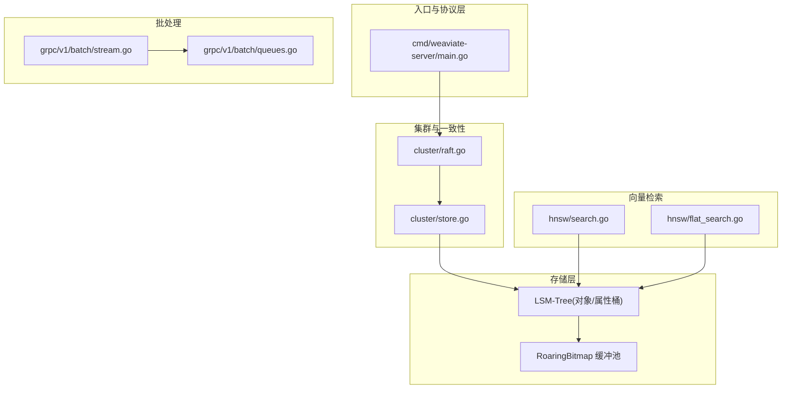
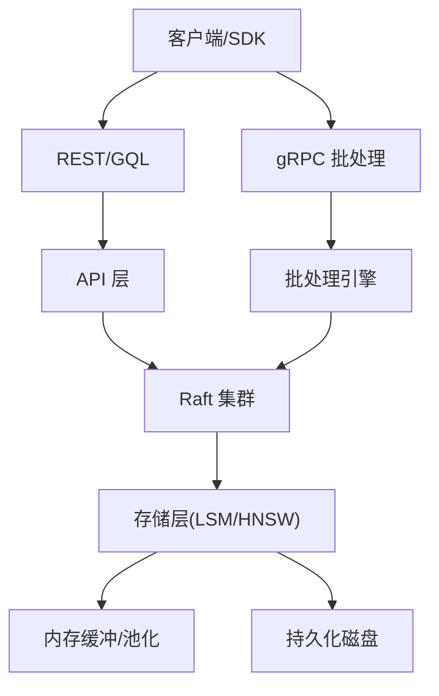
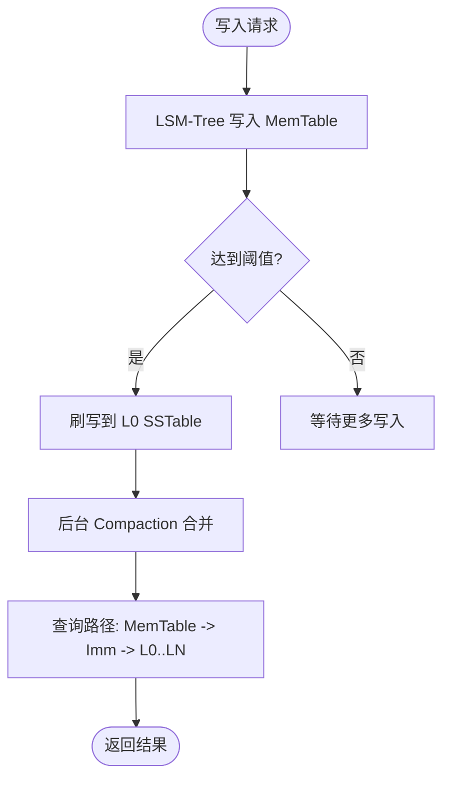
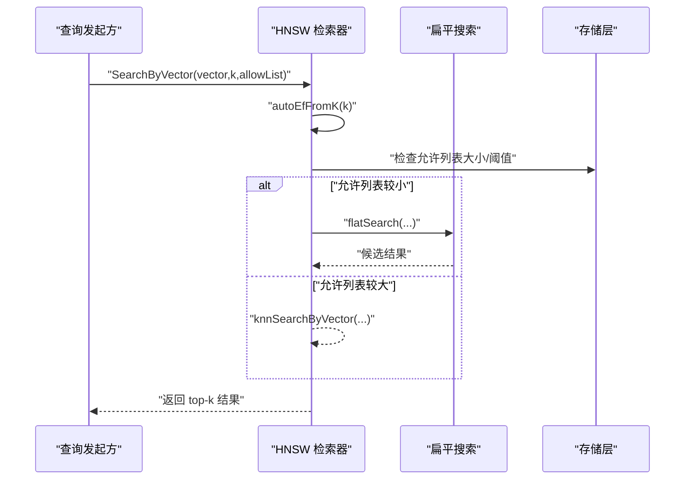
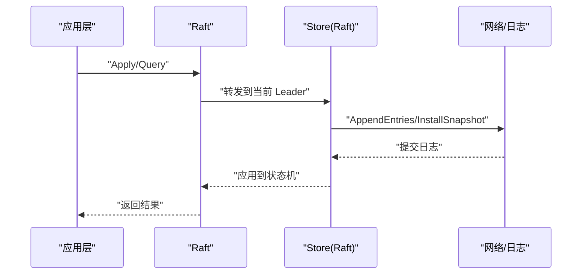
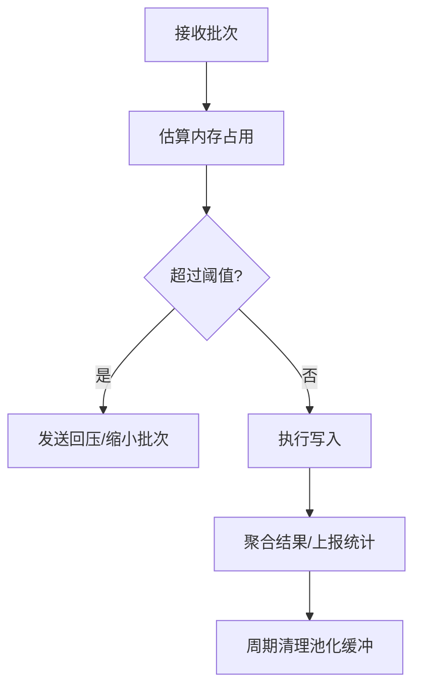
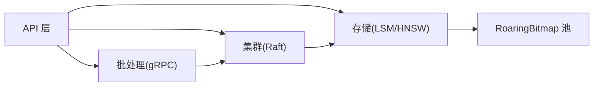

# 设计原则与权衡

<cite>
**本文引用的文件**   
- [cmd/weaviate-server/main.go](file://cmd/weaviate-server/main.go)
- [README.md](file://README.md)
- [cluster/raft.go](file://cluster/raft.go)
- [cluster/store.go](file://cluster/store.go)
- [adapters/repos/db/vector/hnsw/search.go](file://adapters/repos/db/vector/hnsw/search.go)
- [adapters/repos/db/vector/hnsw/flat_search.go](file://adapters/repos/db/vector/hnsw/flat_search.go)
- [adapters/repos/db/lsmkv/binary_search_tree_test.go](file://adapters/repos/db/lsmkv/binary_search_tree_test.go)
- [adapters/repos/db/sorter/query_planner_test.go](file://adapters/repos/db/sorter/query_planner_test.go)
- [adapters/repos/db/roaringset/buf_pool.go](file://adapters/repos/db/roaringset/buf_pool.go)
- [adapters/handlers/grpc/v1/batch/stream.go](file://adapters/handlers/grpc/v1/batch/stream.go)
- [adapters/handlers/grpc/v1/batch/queues.go](file://adapters/handlers/grpc/v1/batch/queues.go)
- [usecases/sharding/config/config.go](file://usecases/sharding/config/config.go)
- [adapters/repos/db/fakes_for_tests.go](file://adapters/repos/db/fakes_for_tests.go)
</cite>

## 目录
1. [引言](#引言)
2. [项目结构](#项目结构)
3. [核心组件](#核心组件)
4. [架构总览](#架构总览)
5. [详细组件分析](#详细组件分析)
6. [依赖分析](#依赖分析)
7. [性能考量](#性能考量)
8. [故障排查指南](#故障排查指南)
9. [结论](#结论)
10. [附录](#附录)

## 引言
本文件面向开发者与架构师，系统梳理 Weaviate 的设计原则与关键权衡，围绕性能优先、可扩展性、可靠性、安全性等维度展开；重点分析 LSM-Tree 存储与传统 B-Tree 的取舍、向量索引算法选择、分布式一致性与复制策略、内存与批处理优化等。文档同时提供设计决策矩阵与权衡分析表，帮助读者理解架构背后的约束与取舍。

## 项目结构
Weaviate 采用分层与模块化组织方式：入口程序负责启动 REST/gRPC/GraphQL 服务；集群子系统以 Raft 为核心实现强一致与复制；存储层以 LSM-Tree 为主，辅以倒排与 RoaringBitmap 等；向量检索采用 HNSW/MHNSW 与扁平搜索组合策略；批处理通过 gRPC 流式队列与内存估算保障吞吐与稳定性。

图表来源
- [cmd/weaviate-server/main.go](file://cmd/weaviate-server/main.go#L30-L66)
- [cluster/raft.go](file://cluster/raft.go#L26-L99)
- [cluster/store.go](file://cluster/store.go#L735-L771)
- [adapters/repos/db/vector/hnsw/search.go](file://adapters/repos/db/vector/hnsw/search.go#L78-L92)
- [adapters/repos/db/vector/hnsw/flat_search.go](file://adapters/repos/db/vector/hnsw/flat_search.go#L28-L47)
- [adapters/repos/db/roaringset/buf_pool.go](file://adapters/repos/db/roaringset/buf_pool.go#L96-L132)
- [adapters/handlers/grpc/v1/batch/stream.go](file://adapters/handlers/grpc/v1/batch/stream.go#L553-L607)
- [adapters/handlers/grpc/v1/batch/queues.go](file://adapters/handlers/grpc/v1/batch/queues.go#L100-L116)

章节来源
- [cmd/weaviate-server/main.go](file://cmd/weaviate-server/main.go#L30-L66)
- [README.md](file://README.md#L10-L128)

## 核心组件
- 入口与协议：REST/gRPC/GraphQL 服务初始化与路由，统一对外暴露 API。
- 集群与一致性：Raft 封装与状态机应用，保证跨节点写入顺序与可见性。
- 存储层：LSM-Tree 对象桶与属性桶，配合倒排与 RoaringBitmap 优化过滤与集合运算。
- 向量检索：HNSW/MHNSW 主索引，结合扁平搜索与动态 ef 自适应，兼顾召回与延迟。
- 批处理：gRPC 流式批写入，带内存估算、回压与批量聚合，避免 OOM 与抖动。

章节来源
- [cmd/weaviate-server/main.go](file://cmd/weaviate-server/main.go#L30-L66)
- [cluster/raft.go](file://cluster/raft.go#L26-L99)
- [adapters/repos/db/vector/hnsw/search.go](file://adapters/repos/db/vector/hnsw/search.go#L78-L92)
- [adapters/repos/db/roaringset/buf_pool.go](file://adapters/repos/db/roaringset/buf_pool.go#L96-L132)
- [adapters/handlers/grpc/v1/batch/stream.go](file://adapters/handlers/grpc/v1/batch/stream.go#L553-L607)

## 架构总览
Weaviate 的整体设计以“高性能向量检索 + 可扩展存储 + 分布式一致性”为核心，通过 LSM-Tree 与 HNSW 的协同，在高并发与大数据量场景下取得读写分离、缓存与批处理的平衡。

图表来源
- [cmd/weaviate-server/main.go](file://cmd/weaviate-server/main.go#L30-L66)
- [cluster/raft.go](file://cluster/raft.go#L26-L99)
- [adapters/handlers/grpc/v1/batch/stream.go](file://adapters/handlers/grpc/v1/batch/stream.go#L553-L607)

## 详细组件分析

### LSM-Tree 存储 vs 传统 B-Tree：设计取舍
- 优势与动机
  - 写放大控制：LSM-Tree 通过分层与合并策略，显著降低随机写放大，适合高吞吐写入场景。
  - 并行化：多层级可并行压缩与清理，利于多核与 SSD 场景。
  - 查询路径：对象桶与属性桶分离，便于按需加载与过滤。
- 关键证据
  - 对象桶与属性桶的创建与策略配置，体现 LSM-Tree 的分层与替换策略。
  - 二叉搜索树插入与净增量统计，反映 LSM-Tree 内部结构与计数优化。
- 权衡点
  - 读放大：需要通过布隆过滤器、前缀索引与缓存缓解。
  - 内存占用：需要缓冲池与内存上限控制，避免 OOM。
  - 复杂度：相比 B-Tree 更复杂，运维与调优门槛更高。

图表来源
- [adapters/repos/db/sorter/query_planner_test.go](file://adapters/repos/db/sorter/query_planner_test.go#L189-L212)
- [adapters/repos/db/lsmkv/binary_search_tree_test.go](file://adapters/repos/db/lsmkv/binary_search_tree_test.go#L29-L65)

章节来源
- [adapters/repos/db/sorter/query_planner_test.go](file://adapters/repos/db/sorter/query_planner_test.go#L189-L212)
- [adapters/repos/db/lsmkv/binary_search_tree_test.go](file://adapters/repos/db/lsmkv/binary_search_tree_test.go#L29-L65)

### 向量索引算法选择：HNSW 与扁平搜索的协同
- 选择理由
  - HNSW：近似最近邻检索高效，支持动态 ef 自适应，适合大规模向量库的低延迟查询。
  - 扁平搜索：小规模或允许列表较小时，扁平搜索避免图遍历开销，提升命中率。
- 关键证据
  - HNSW 根据 k 自动推导 ef，并在允许列表较小时走扁平搜索路径。
  - 多向量检索与压缩距离器支持，兼顾召回与性能。
- 权衡点
  - 训练/构建成本：HNSW 需要训练参数与内存，但查询延迟低。
  - 内存与压缩：压缩向量可节省内存，但会引入额外计算与精度权衡。

图表来源
- [adapters/repos/db/vector/hnsw/search.go](file://adapters/repos/db/vector/hnsw/search.go#L60-L92)
- [adapters/repos/db/vector/hnsw/flat_search.go](file://adapters/repos/db/vector/hnsw/flat_search.go#L28-L47)

章节来源
- [adapters/repos/db/vector/hnsw/search.go](file://adapters/repos/db/vector/hnsw/search.go#L60-L92)
- [adapters/repos/db/vector/hnsw/flat_search.go](file://adapters/repos/db/vector/hnsw/flat_search.go#L28-L47)

### 分布式一致性与复制：Raft 与集群状态机
- 设计要点
  - Raft 封装：统一 Apply/Query/Join/Remove 接口，屏蔽底层网络细节。
  - 超时与心跳：可配置超时倍数与心跳间隔，适配不同网络环境。
  - 状态恢复：等待数据库恢复、等待更新生效，保障一致性视图。
- 关键证据
  - Raft 结构体与方法封装，暴露领导者判断与复制有限状态机。
  - Store 中对 Heartbeat/Election/LeaderLease/Snapshot 的配置与乘数调整。
- 权衡点
  - 性能与可用性：超时增大可提升稳定性，但增加切换与延迟。
  - 节点角色：非投票节点可安全移除，降低选举竞争。

图表来源
- [cluster/raft.go](file://cluster/raft.go#L26-L99)
- [cluster/store.go](file://cluster/store.go#L735-L771)

章节来源
- [cluster/raft.go](file://cluster/raft.go#L26-L99)
- [cluster/store.go](file://cluster/store.go#L735-L771)

### 内存管理策略：缓冲池与批处理回压
- 策略与动机
  - RoaringBitmap 缓冲池：按尺寸范围分层池化，限制内存占用并复用大对象。
  - 批处理流式处理：估算单批内存、回压与批量聚合，避免 OOM 与抖动。
- 关键证据
  - 分段缓冲池构造、内存上限分配与周期清理。
  - 批处理内存估算、OOM 错误报告与回退消息。
- 权衡点
  - 吞吐与延迟：批量越大吞吐越高，但延迟与内存峰值上升。
  - 清理与复用：定期清理降低碎片，但带来额外 CPU 开销。

图表来源
- [adapters/repos/db/roaringset/buf_pool.go](file://adapters/repos/db/roaringset/buf_pool.go#L96-L132)
- [adapters/handlers/grpc/v1/batch/stream.go](file://adapters/handlers/grpc/v1/batch/stream.go#L553-L607)
- [adapters/handlers/grpc/v1/batch/queues.go](file://adapters/handlers/grpc/v1/batch/queues.go#L60-L116)

章节来源
- [adapters/repos/db/roaringset/buf_pool.go](file://adapters/repos/db/roaringset/buf_pool.go#L96-L132)
- [adapters/handlers/grpc/v1/batch/stream.go](file://adapters/handlers/grpc/v1/batch/stream.go#L553-L607)
- [adapters/handlers/grpc/v1/batch/queues.go](file://adapters/handlers/grpc/v1/batch/queues.go#L60-L116)

### 集群与分片：可用性与性能的平衡
- 设计要点
  - 分片键固定为 “_id”，哈希策略与 Murmur3 函数，保证均匀分布。
  - 多租户分区：轮询选择副本节点，确保副本跨节点分布。
- 关键证据
  - 分片配置校验与默认值设置。
  - 多租户分区构建与节点选择策略。
- 权衡点
  - 均匀性与热点：哈希策略简单高效，但需关注极端分布。
  - 副本与容灾：副本数量与节点选择影响可用性与读放大。

章节来源
- [usecases/sharding/config/config.go](file://usecases/sharding/config/config.go#L53-L110)
- [adapters/repos/db/fakes_for_tests.go](file://adapters/repos/db/fakes_for_tests.go#L263-L292)

## 依赖分析
- 组件耦合
  - API 层依赖集群与存储抽象，保持业务与基础设施解耦。
  - Raft 作为一致性后端，向上提供统一 Apply/Query 接口。
  - 向量检索依赖存储层的 LSM-Tree 与属性桶，查询路径清晰。
- 外部依赖
  - gRPC/REST/GraphQL 作为统一入口，承载高并发请求。
  - Prometheus 指标用于缓冲池使用情况监控，辅助容量规划。

图表来源
- [cluster/raft.go](file://cluster/raft.go#L26-L99)
- [adapters/repos/db/roaringset/buf_pool.go](file://adapters/repos/db/roaringset/buf_pool.go#L96-L132)
- [adapters/handlers/grpc/v1/batch/queues.go](file://adapters/handlers/grpc/v1/batch/queues.go#L100-L116)

章节来源
- [cluster/raft.go](file://cluster/raft.go#L26-L99)
- [adapters/repos/db/roaringset/buf_pool.go](file://adapters/repos/db/roaringset/buf_pool.go#L96-L132)
- [adapters/handlers/grpc/v1/batch/queues.go](file://adapters/handlers/grpc/v1/batch/queues.go#L100-L116)

## 性能考量
- 写入性能
  - LSM-Tree 刷写与合并策略降低写放大，适合高吞吐写入。
  - 批处理流式写入与回压机制避免突发流量冲击。
- 查询性能
  - HNSW 自适应 ef 与扁平搜索阈值，兼顾延迟与召回。
  - 属性桶与倒排结合，过滤阶段尽量前置，减少后续扫描。
- 内存与缓存
  - 分层缓冲池与周期清理，平衡内存占用与复用效率。
  - Raft 日志尾部与快照阈值可调，控制内存与 IO 压力。

## 故障排查指南
- 批处理 OOM
  - 现象：批量写入触发 OutOfMemory 回压消息。
  - 处理：降低批次大小、启用回压、检查内存估算逻辑。
- Raft 超时与选主震荡
  - 现象：心跳/选举超时导致频繁选主。
  - 处理：根据网络环境调整超时倍数与心跳间隔。
- 向量检索延迟升高
  - 现象：查询延迟上升，可能由 ef 设置不当或允许列表过大。
  - 处理：检查 ef 自适应参数与扁平搜索阈值。

章节来源
- [adapters/handlers/grpc/v1/batch/stream.go](file://adapters/handlers/grpc/v1/batch/stream.go#L553-L607)
- [adapters/handlers/grpc/v1/batch/queues.go](file://adapters/handlers/grpc/v1/batch/queues.go#L60-L116)
- [cluster/store.go](file://cluster/store.go#L735-L771)
- [adapters/repos/db/vector/hnsw/search.go](file://adapters/repos/db/vector/hnsw/search.go#L60-L92)

## 结论
Weaviate 的设计以“向量检索优先、存储可扩展、一致性可靠”为核心，通过 LSM-Tree 与 HNSW 的组合实现高吞吐与低延迟；借助 Raft 与分片策略在可用性与性能之间取得稳健平衡；批处理与内存池化进一步强化了在高并发与大数据量场景下的稳定性。理解这些设计原则与权衡，有助于在实际部署与调优中做出更合理的取舍。

## 附录

### 设计决策矩阵与权衡分析表
- LSM-Tree vs B-Tree
  - 适用场景：高写吞吐、可接受一定读放大的向量/文本存储。
  - 关键权衡：写放大 vs 读放大；复杂度 vs 易用性。
- HNSW vs 扁平搜索
  - 适用场景：大规模向量检索；允许列表较小时优先扁平搜索。
  - 关键权衡：构建成本 vs 查询延迟；压缩精度 vs 内存占用。
- Raft 超时与心跳
  - 适用场景：跨数据中心部署；网络波动较大的环境。
  - 关键权衡：稳定性 vs 响应时间；选举频率 vs 一致性窗口。
- 批处理与内存池
  - 适用场景：高并发写入；需要稳定吞吐与内存上限控制。
  - 关键权衡：吞吐 vs 延迟；复用效率 vs 清理开销。