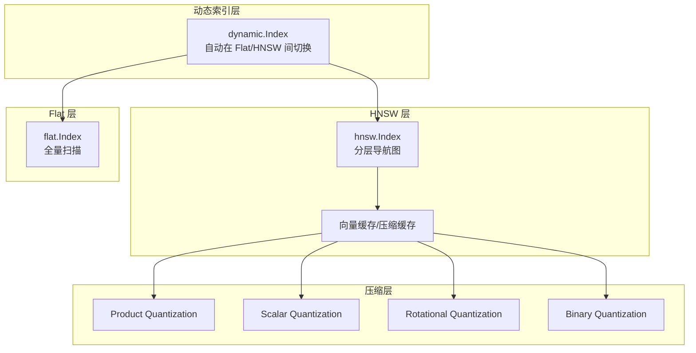
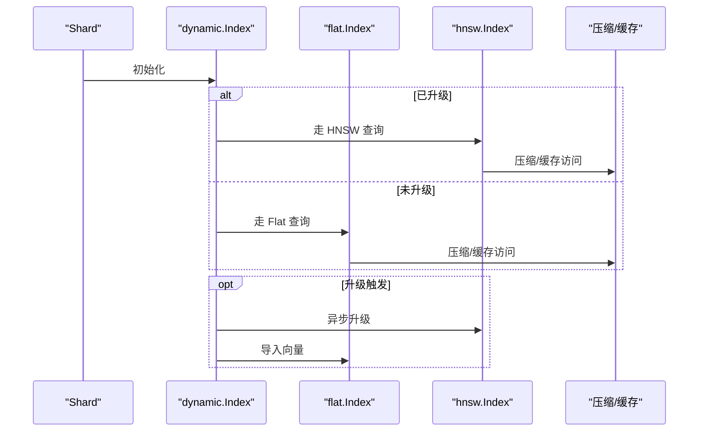
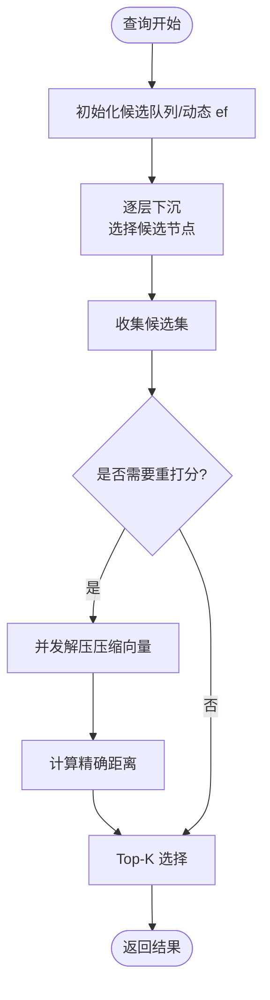
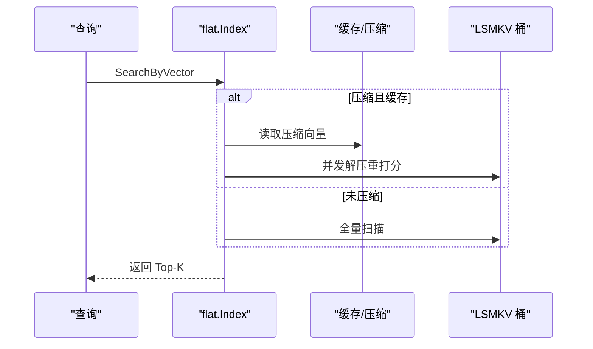
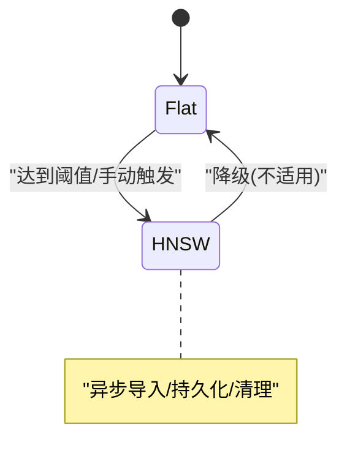
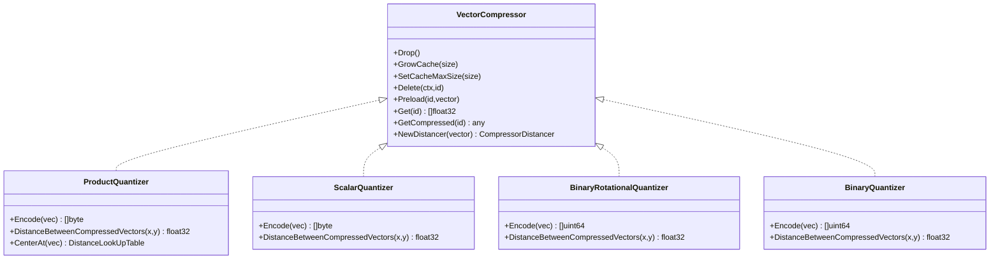
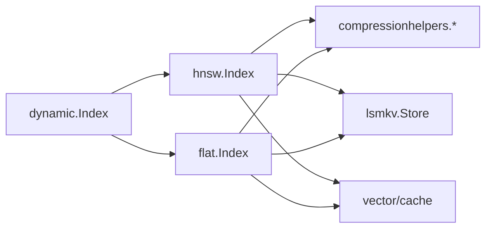

# 快速搜索性能

<cite>
**本文引用的文件**
- [index.go](file://adapters/repos/db/vector/hnsw/index.go)
- [flat_search.go](file://adapters/repos/db/vector/hnsw/flat_search.go)
- [index.go](file://adapters/repos/db/vector/flat/index.go)
- [index.go](file://adapters/repos/db/vector/dynamic/index.go)
- [compression.go](file://adapters/repos/db/vector/compressionhelpers/compression.go)
- [product_quantization.go](file://adapters/repos/db/vector/compressionhelpers/product_quantization.go)
- [binary_rotational_quantization.go](file://adapters/repos/db/vector/compressionhelpers/binary_rotational_quantization.go)
- [scalar_quantization.go](file://adapters/repos/db/vector/compressionhelpers/scalar_quantization.go)
- [shard_init_vector.go](file://adapters/repos/db/shard_init_vector.go)
- [hfresh.go](file://adapters/repos/db/vector/hfresh/hnsw.go)
- [hnsw.go](file://adapters/repos/db/vector/hfresh/hnsw.go)
- [index_test.go](file://adapters/repos/db/vector/flat/index_test.go)
- [flat_search_test.go](file://adapters/repos/db/vector/hnsw/flat_search_test.go)
- [compress_test.go](file://adapters/repos/db/vector/hnsw/compress_test.go)
- [compress_sift_test.go](file://adapters/repos/db/vector/hnsw/compress_sift_test.go)
- [compress_recall_test.go](file://adapters/repos/db/vector/hnsw/compress_recall_test.go)
- [compress_deletes_test.go](file://adapters/repos/db/vector/hnsw/compress_deletes_test.go)
</cite>

## 目录
1. [简介](#简介)
2. [项目结构](#项目结构)
3. [核心组件](#核心组件)
4. [架构总览](#架构总览)
5. [详细组件分析](#详细组件分析)
6. [依赖关系分析](#依赖关系分析)
7. [性能考量](#性能考量)
8. [故障排查指南](#故障排查指南)
9. [结论](#结论)
10. [附录](#附录)

## 简介
本文件聚焦 Weaviate 的快速搜索性能，系统阐述向量相似性搜索的实现与优化，覆盖以下主题：
- HNSW 近似最近邻搜索算法的实现要点与查询路径
- Flat 索引与动态索引策略的切换机制
- 向量压缩技术：PQ、SQ、RQ、BQ 及其对性能与召回的影响
- ANN 搜索的性能优化：索引构建、查询优化、内存管理与磁盘 I/O 优化
- 基准测试与配置参数建议，指导不同数据规模与查询负载下的索引策略选择
- 高并发场景下的调优方法与最佳实践

## 项目结构
Weaviate 的向量搜索由三层协同完成：
- 动态索引层：根据已索引向量数量自动在 Flat 与 HNSW 之间切换
- HNSW 层：基于分层导航图的近似最近邻搜索，支持多向量与压缩存储
- Flat 层：全量扫描，适用于小规模或压缩后重打分阶段
- 压缩层：通过 PQ/SQ/RQ/BQ 将向量编码为低维码字，显著降低内存占用并提升缓存命中率

图表来源
- [index.go](file://adapters/repos/db/vector/dynamic/index.go#L124-L220)
- [index.go](file://adapters/repos/db/vector/hnsw/index.go#L283-L456)
- [index.go](file://adapters/repos/db/vector/flat/index.go#L76-L125)
- [compression.go](file://adapters/repos/db/vector/compressionhelpers/compression.go#L89-L110)

章节来源
- [index.go](file://adapters/repos/db/vector/dynamic/index.go#L124-L220)
- [index.go](file://adapters/repos/db/vector/hnsw/index.go#L283-L456)
- [index.go](file://adapters/repos/db/vector/flat/index.go#L76-L125)
- [compression.go](file://adapters/repos/db/vector/compressionhelpers/compression.go#L89-L110)

## 核心组件
- 动态索引器：根据阈值与已索引向量数决定是否升级到 HNSW；支持运行时配置更新与平滑迁移
- HNSW 索引器：维护分层图结构，支持 efConstruction、ef、动态 ef、过滤搜索阈值等参数；内置压缩与多向量支持
- Flat 索引器：基于 LSMKV 存储的全量扫描，支持 BQ/RQ 压缩与缓存；查询时可进行重打分
- 压缩器：统一接口封装 PQ/SQ/RQ/BQ，提供距离计算器、缓存预热、持久化与统计信息

章节来源
- [index.go](file://adapters/repos/db/vector/dynamic/index.go#L58-L91)
- [index.go](file://adapters/repos/db/vector/hnsw/index.go#L44-L214)
- [index.go](file://adapters/repos/db/vector/flat/index.go#L49-L72)
- [compression.go](file://adapters/repos/db/vector/compressionhelpers/compression.go#L60-L87)

## 架构总览
Weaviate 在启动时按配置初始化向量索引。若启用动态索引，初始使用 Flat；当达到阈值后异步升级至 HNSW，并将 Flat 中的向量批量导入 HNSW。查询时优先走 HNSW，必要时回退到 Flat 或执行重打分。

图表来源
- [index.go](file://adapters/repos/db/vector/dynamic/index.go#L124-L220)
- [index.go](file://adapters/repos/db/vector/hnsw/index.go#L283-L456)
- [index.go](file://adapters/repos/db/vector/flat/index.go#L76-L125)

章节来源
- [index.go](file://adapters/repos/db/vector/dynamic/index.go#L487-L616)
- [shard_init_vector.go](file://adapters/repos/db/shard_init_vector.go#L105-L123)

## 详细组件分析

### HNSW 近似最近邻搜索
- 分层导航图：节点按层级分布，入口点随最大层级变化；连接数在第 0 层更高以增强局部搜索能力
- 查询路径：从最高层入口开始逐层下沉，每层维护候选队列，最终在目标层收集结果；支持动态 ef 与过滤搜索阈值
- 多向量与归一化：支持多向量模式与向量归一化（如余弦-点积），确保距离计算一致性
- 压缩与缓存：压缩向量存储于独立桶，缓存按需加载；重打分阶段并发解压并计算精确距离

图表来源
- [flat_search.go](file://adapters/repos/db/vector/hnsw/flat_search.go#L28-L47)
- [index.go](file://adapters/repos/db/vector/hnsw/index.go#L890-L943)

章节来源
- [index.go](file://adapters/repos/db/vector/hnsw/index.go#L44-L214)
- [flat_search.go](file://adapters/repos/db/vector/hnsw/flat_search.go#L28-L47)

### Flat 全量扫描与重打分
- 存储与缓存：LSMKV 桶存储原始向量；BQ/RQ 压缩向量与缓存可选；缓存并发预热
- 查询流程：根据允许列表过滤；按压缩类型选择路径；压缩路径先选出候选再并发解压重打分
- 并发策略：重打分阶段使用多个 goroutine 并行解压与计算，充分利用 IO 绑定场景

图表来源
- [index.go](file://adapters/repos/db/vector/flat/index.go#L423-L532)

章节来源
- [index.go](file://adapters/repos/db/vector/flat/index.go#L423-L532)
- [index_test.go](file://adapters/repos/db/vector/flat/index_test.go#L502-L516)

### 动态索引切换与升级
- 切换条件：基于阈值与已索引向量数；未升级时走 Flat，升级后走 HNSW
- 升级过程：异步复制 Flat 中向量到 HNSW；完成后标记升级状态并清理旧桶
- 配置更新：支持运行时更新用户配置，动态调整 ef、压缩策略等

图表来源
- [index.go](file://adapters/repos/db/vector/dynamic/index.go#L465-L512)
- [index.go](file://adapters/repos/db/vector/dynamic/index.go#L514-L616)

章节来源
- [index.go](file://adapters/repos/db/vector/dynamic/index.go#L465-L512)
- [index.go](file://adapters/repos/db/vector/dynamic/index.go#L514-L616)

### 向量压缩技术
- PQ（产品量化）：将维度划分为段，每段用码表编码；支持 Tile/KMeans 编码器与分布；通过查找表加速距离计算
- SQ（标量量化）：线性映射到 0-255 码字，保留范数信息用于距离估计
- RQ（旋转量化）：二进制/多比特旋转量化，利用哈明距离近似余弦/L2 距离
- BQ（二进制量化）：将压缩向量以位串形式存储，适合超大规模场景

图表来源
- [compression.go](file://adapters/repos/db/vector/compressionhelpers/compression.go#L60-L87)
- [product_quantization.go](file://adapters/repos/db/vector/compressionhelpers/product_quantization.go#L176-L253)
- [scalar_quantization.go](file://adapters/repos/db/vector/compressionhelpers/scalar_quantization.go#L29-L53)
- [binary_rotational_quantization.go](file://adapters/repos/db/vector/compressionhelpers/binary_rotational_quantization.go#L31-L86)

章节来源
- [compression.go](file://adapters/repos/db/vector/compressionhelpers/compression.go#L438-L764)
- [product_quantization.go](file://adapters/repos/db/vector/compressionhelpers/product_quantization.go#L176-L253)
- [scalar_quantization.go](file://adapters/repos/db/vector/compressionhelpers/scalar_quantization.go#L29-L53)
- [binary_rotational_quantization.go](file://adapters/repos/db/vector/compressionhelpers/binary_rotational_quantization.go#L31-L86)

### 多向量与 Muvera 支持
- 多向量模式：每个文档可关联多个向量 ID，支持多向量聚合与检索
- Muvera：专用多向量编码器，支持独立向量桶与缓存

章节来源
- [index.go](file://adapters/repos/db/vector/hnsw/index.go#L300-L326)
- [hfresh.go](file://adapters/repos/db/vector/hfresh/hnsw.go#L28-L43)

## 依赖关系分析
- 动态索引依赖 HNSW/Flat 实现与 bbolt 共享状态存储
- HNSW 依赖压缩器、缓存、LSMKV 存储与距离提供器
- Flat 依赖 LSMKV、压缩器与缓存
- 压缩器统一抽象，便于替换与扩展

图表来源
- [index.go](file://adapters/repos/db/vector/dynamic/index.go#L124-L220)
- [index.go](file://adapters/repos/db/vector/hnsw/index.go#L283-L456)
- [index.go](file://adapters/repos/db/vector/flat/index.go#L76-L125)
- [compression.go](file://adapters/repos/db/vector/compressionhelpers/compression.go#L89-L110)

章节来源
- [index.go](file://adapters/repos/db/vector/dynamic/index.go#L124-L220)
- [index.go](file://adapters/repos/db/vector/hnsw/index.go#L283-L456)
- [index.go](file://adapters/repos/db/vector/flat/index.go#L76-L125)

## 性能考量

### 索引构建优化
- HNSW 参数：合理设置 MaxConnections、EFConstruction、EF 与动态 ef，平衡构建成本与查询质量
- 压缩训练：PQ 的 Segments/Centroids、SQ 的范围参数、RQ 的旋转与比特数，影响压缩比与精度
- 缓存预热：压缩缓存并发预热，减少冷启动延迟

章节来源
- [index.go](file://adapters/repos/db/vector/hnsw/index.go#L330-L367)
- [compression.go](file://adapters/repos/db/vector/compressionhelpers/compression.go#L438-L582)

### 查询优化
- 动态 ef：根据过滤比例与允许列表大小自适应 ef，避免过度扫描
- 过滤阈值：当允许元素较少时，直接走 Flat 扫描以降低 HNSW 开销
- 重打分并发：压缩路径下并发解压与重打分，充分利用 IO 并行度

章节来源
- [index.go](file://adapters/repos/db/vector/hnsw/index.go#L338-L340)
- [flat_search.go](file://adapters/repos/db/vector/hnsw/flat_search.go#L28-L47)
- [index.go](file://adapters/repos/db/vector/flat/index.go#L494-L531)

### 内存与磁盘 I/O 优化
- 压缩比与缓存：压缩显著降低内存占用，配合缓存提升命中率；BQ/RQ 在大维度场景收益明显
- LSMKV 选项：禁用 Bloom、强制压缩与 mmap 优先策略，减少 IO 开销
- 并发迭代：压缩缓存预热采用并行迭代，缩短启动时间

章节来源
- [index.go](file://adapters/repos/db/vector/flat/index.go#L234-L282)
- [compression.go](file://adapters/repos/db/vector/compressionhelpers/compression.go#L306-L432)

### 基准测试与配置建议
- 基准测试覆盖：不同压缩类型、缓存策略、并发读取下的召回率与延迟
- 回调测试：验证压缩前后检索一致性与删除场景稳定性
- SIFT 压缩测试：演示从非压缩到 PQ 的升级耗时与效果

章节来源
- [index_test.go](file://adapters/repos/db/vector/flat/index_test.go#L146-L300)
- [flat_search_test.go](file://adapters/repos/db/vector/hnsw/flat_search_test.go#L126-L160)
- [compress_test.go](file://adapters/repos/db/vector/hnsw/compress_test.go#L148-L210)
- [compress_sift_test.go](file://adapters/repos/db/vector/hnsw/compress_sift_test.go#L444-L483)
- [compress_recall_test.go](file://adapters/repos/db/vector/hnsw/compress_recall_test.go#L83-L116)
- [compress_deletes_test.go](file://adapters/repos/db/vector/hnsw/compress_deletes_test.go#L141-L199)

## 故障排查指南
- 升级失败：检查 bbolt 状态写入与 HNSW 目录存在性；确认上下文未被取消
- 删除与重建：HNSW 删除节点后会重建邻居连接，注意与插入并发控制
- 压缩一致性：验证压缩参数与距离计算器一致性，确保重打分准确
- 并发异常：关注重打分阶段的并发读取与错误组处理

章节来源
- [index.go](file://adapters/repos/db/vector/dynamic/index.go#L497-L512)
- [index.go](file://adapters/repos/db/vector/hnsw/index.go#L566-L612)
- [compression.go](file://adapters/repos/db/vector/compressionhelpers/compression.go#L250-L283)

## 结论
Weaviate 通过动态索引、HNSW 近似搜索与多样的向量压缩技术，在不同数据规模与查询负载下实现了高性能与高召回的平衡。结合合理的参数配置与并发优化策略，可在生产环境中获得稳定的低延迟与高吞吐表现。

## 附录

### 索引配置参数与建议
- HNSW 关键参数
  - MaxConnections：控制每层连接上限，影响图密度与查询质量
  - EFConstruction/EF：构建期与查询期扩展因子，EFConstruction 更高有助于更佳图结构
  - 动态 ef：根据过滤比例与允许列表大小自适应
  - FlatSearchCutoff/Concurrency：过滤元素较少时走 Flat 扫描，提高整体效率
- 压缩配置
  - PQ：Segments/Centroids 控制压缩比与精度；Tile/KMeans 编码器选择
  - SQ：范围参数 a/b 与维度，适合 L2/Dot 场景
  - RQ：1/8 比特配置，1 比特适合超大规模，8 比特更精确
  - BQ：二进制位串存储，适合极高维度场景

章节来源
- [index.go](file://adapters/repos/db/vector/hnsw/index.go#L330-L367)
- [product_quantization.go](file://adapters/repos/db/vector/compressionhelpers/product_quantization.go#L208-L253)
- [scalar_quantization.go](file://adapters/repos/db/vector/compressionhelpers/scalar_quantization.go#L68-L110)
- [binary_rotational_quantization.go](file://adapters/repos/db/vector/compressionhelpers/binary_rotational_quantization.go#L50-L86)

### 高并发场景调优
- 提升重打分并发度：根据 CPU 核数设置并发读取数，充分利用 IO 并行
- 启用压缩缓存：在内存允许前提下开启缓存，显著降低重复解压开销
- 合理划分 LSMKV：禁用 Bloom、强制压缩与 mmap 优先策略，降低 IO 延迟

章节来源
- [index.go](file://adapters/repos/db/vector/flat/index.go#L494-L531)
- [index.go](file://adapters/repos/db/vector/flat/index.go#L234-L282)