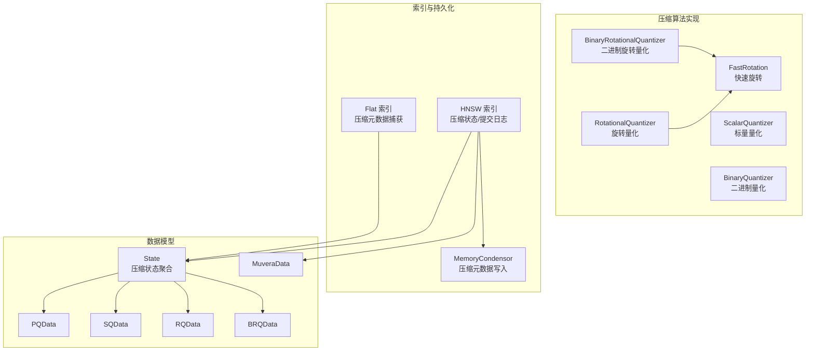
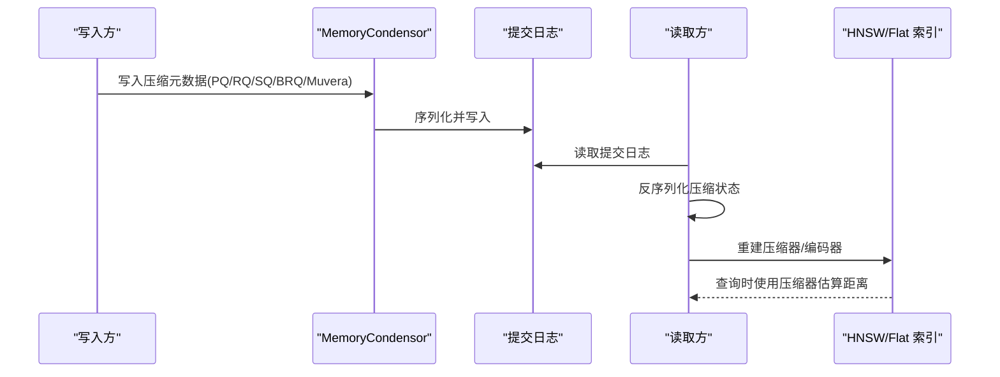
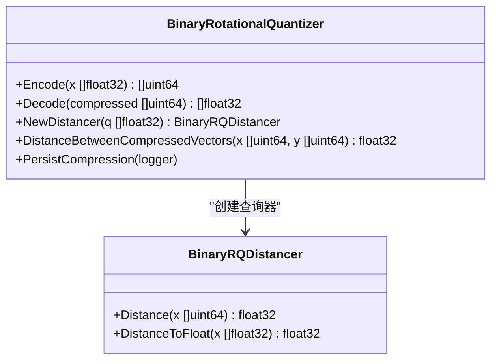
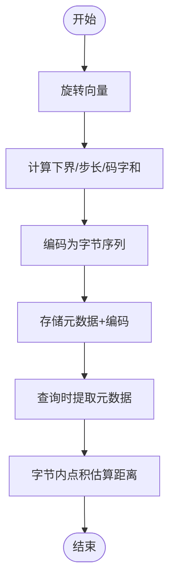
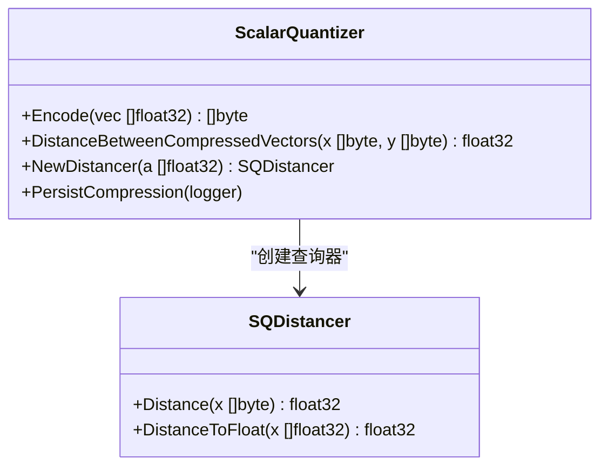
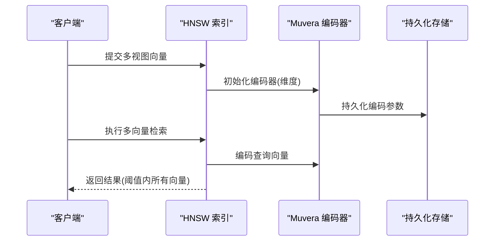
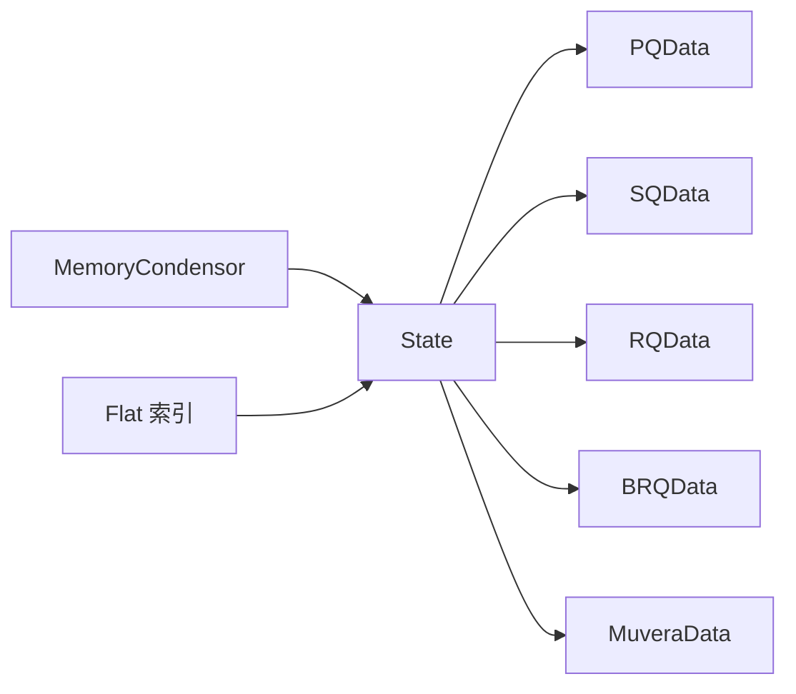

# 成本效益的操作

<cite>
**本文引用的文件**
- [binary_rotational_quantization.go](file://adapters/repos/db/vector/compressionhelpers/binary_rotational_quantization.go)
- [rotational_quantization.go](file://adapters/repos/db/vector/compressionhelpers/rotational_quantization.go)
- [scalar_quantization.go](file://adapters/repos/db/vector/compressionhelpers/scalar_quantization.go)
- [binary_quantization.go](file://adapters/repos/db/vector/compressionhelpers/binary_quantization.go)
- [fast_rotation.go](file://adapters/repos/db/vector/compressionhelpers/fast_rotation.go)
- [pq_data.go](file://entities/vectorindex/compression/pq_data.go)
- [rq_data.go](file://entities/vectorindex/compression/rq_data.go)
- [sq_data.go](file://entities/vectorindex/compression/sq_data.go)
- [brq_data.go](file://entities/vectorindex/compression/brq_data.go)
- [state.go](file://entities/vectorindex/compression/state.go)
- [muvera_data.go](file://entities/vectorindex/compression/muvera_data.go)
- [muvera.go](file://adapters/repos/db/vector/multivector/muvera.go)
- [search.go](file://adapters/repos/db/vector/hnsw/search.go)
- [condensor.go](file://adapters/repos/db/vector/hnsw/condensor.go)
- [metadata.go](file://adapters/repos/db/vector/flat/metadata.go)
- [test_usage.py](file://test/acceptance_with_python/test_usage.py)
</cite>

## 目录
1. [引言](#引言)
2. [项目结构](#项目结构)
3. [核心组件](#核心组件)
4. [架构总览](#架构总览)
5. [详细组件分析](#详细组件分析)
6. [依赖关系分析](#依赖关系分析)
7. [性能考量](#性能考量)
8. [故障排查指南](#故障排查指南)
9. [结论](#结论)
10. [附录：压缩配置与成本效益指南](#附录压缩配置与成本效益指南)

## 引言
本篇文档聚焦 Weaviate 在向量索引中的“成本效益操作”，系统阐述向量压缩技术在存储与查询层面的实现与权衡，覆盖以下主题：
- 向量量化（PQ）、二进制量化（BQ）、随机量化（RQ）、标量量化（SQ）等压缩算法的原理与实现要点
- 压缩比与精度的权衡、压缩率优化与查询性能影响
- 多向量编码（Muvera）支持与查询优化
- 面向不同场景的压缩策略选择与性能调优
- 成本效益分析与 ROI 计算思路
- 适用场景与限制条件、最佳实践

## 项目结构
Weaviate 将向量压缩能力拆分为“压缩算法实现”和“索引集成”两层：
- 压缩算法实现位于 compressionhelpers 包，包含多种量化器与快速旋转工具
- 索引集成位于 hnsw/flat 等模块，负责将压缩数据持久化、恢复与查询加速
- 数据模型定义位于 entities/vectorindex/compression，统一描述各压缩器的序列化数据结构

**图表来源**
- [binary_rotational_quantization.go](file://adapters/repos/db/vector/compressionhelpers/binary_rotational_quantization.go#L31-L86)
- [rotational_quantization.go](file://adapters/repos/db/vector/compressionhelpers/rotational_quantization.go#L26-L76)
- [scalar_quantization.go](file://adapters/repos/db/vector/compressionhelpers/scalar_quantization.go#L29-L37)
- [binary_quantization.go](file://adapters/repos/db/vector/compressionhelpers/binary_quantization.go#L18-L26)
- [fast_rotation.go](file://adapters/repos/db/vector/compressionhelpers/fast_rotation.go#L21-L28)
- [state.go](file://entities/vectorindex/compression/state.go#L14-L37)
- [condensor.go](file://adapters/repos/db/vector/hnsw/condensor.go#L31-L90)
- [metadata.go](file://adapters/repos/db/vector/flat/metadata.go#L358-L380)

**章节来源**
- [binary_rotational_quantization.go](file://adapters/repos/db/vector/compressionhelpers/binary_rotational_quantization.go#L1-L533)
- [rotational_quantization.go](file://adapters/repos/db/vector/compressionhelpers/rotational_quantization.go#L1-L381)
- [scalar_quantization.go](file://adapters/repos/db/vector/compressionhelpers/scalar_quantization.go#L1-L233)
- [binary_quantization.go](file://adapters/repos/db/vector/compressionhelpers/binary_quantization.go#L1-L78)
- [fast_rotation.go](file://adapters/repos/db/vector/compressionhelpers/fast_rotation.go#L1-L29)
- [state.go](file://entities/vectorindex/compression/state.go#L1-L54)
- [condensor.go](file://adapters/repos/db/vector/hnsw/condensor.go#L1-L200)
- [metadata.go](file://adapters/repos/db/vector/flat/metadata.go#L308-L380)

## 核心组件
- 二进制旋转量化（BRQ）：以低比特编码旋转后的向量，查询时通过汉明距离近似点积，适合大规模高维向量的存储与检索
- 旋转量化（RQ）：按位编码旋转后的向量，支持 1/8 比特两种模式；查询时通过预计算常量与字节级点积估算
- 标量量化（SQ）：对每个维度进行范围映射并量化为 1 字节，保留部分统计信息用于距离估计
- 二进制量化（BQ）：按符号位编码，使用汉明距离作为相似度近似
- 快速旋转（FastRotation）：为旋转类量化提供高效旋转矩阵与回旋接口
- 多向量编码（Muvera）：将多视图向量编码为紧凑单向量，提升多视图检索效率

**章节来源**
- [binary_rotational_quantization.go](file://adapters/repos/db/vector/compressionhelpers/binary_rotational_quantization.go#L31-L86)
- [rotational_quantization.go](file://adapters/repos/db/vector/compressionhelpers/rotational_quantization.go#L26-L76)
- [scalar_quantization.go](file://adapters/repos/db/vector/compressionhelpers/scalar_quantization.go#L29-L37)
- [binary_quantization.go](file://adapters/repos/db/vector/compressionhelpers/binary_quantization.go#L18-L26)
- [fast_rotation.go](file://adapters/repos/db/vector/compressionhelpers/fast_rotation.go#L21-L28)
- [muvera_data.go](file://entities/vectorindex/compression/muvera_data.go#L14-L23)
- [muvera.go](file://adapters/repos/db/vector/multivector/muvera.go#L44-L61)

## 架构总览
Weaviate 在 HNSW/Flat 索引中集成压缩器，并通过提交日志与内存压缩器（MemoryCondensor）持久化压缩元数据，确保重启后可正确重建压缩器并恢复查询路径。

**图表来源**
- [condensor.go](file://adapters/repos/db/vector/hnsw/condensor.go#L65-L90)
- [state.go](file://entities/vectorindex/compression/state.go#L14-L37)

**章节来源**
- [condensor.go](file://adapters/repos/db/vector/hnsw/condensor.go#L1-L200)
- [state.go](file://entities/vectorindex/compression/state.go#L1-L54)

## 详细组件分析

### 二进制旋转量化（BRQ）
- 实现要点
  - 输入维度不足时进行填充，保证最小维度阈值
  - 使用快速旋转生成旋转矩阵，支持 L2、余弦/点积等距离类型指示
  - 查询端采用多比特签名编码与汉明距离近似点积
  - 提供压缩字节序列化与反序列化接口
- 压缩比与查询性能
  - 存储：原始 4×N 字节 → 元数据 8 字节 + 1/8×N 字节（按位）
  - 查询：汉明距离 SIMD 加速，阈值下切换不同实现
- 适用场景
  - 超高维向量（如 1000+）的存储与检索
  - 对召回要求较高但对精度有容忍度的场景

**图表来源**
- [binary_rotational_quantization.go](file://adapters/repos/db/vector/compressionhelpers/binary_rotational_quantization.go#L31-L86)
- [binary_rotational_quantization.go](file://adapters/repos/db/vector/compressionhelpers/binary_rotational_quantization.go#L337-L417)

**章节来源**
- [binary_rotational_quantization.go](file://adapters/repos/db/vector/compressionhelpers/binary_rotational_quantization.go#L180-L237)
- [binary_rotational_quantization.go](file://adapters/repos/db/vector/compressionhelpers/binary_rotational_quantization.go#L387-L429)
- [binary_rotational_quantization.go](file://adapters/repos/db/vector/compressionhelpers/binary_rotational_quantization.go#L518-L532)

### 旋转量化（RQ）
- 实现要点
  - 支持 1 比特（BRQ）与 8 比特两种模式
  - 编码时计算下界、步长、码字和范数，解码时还原为浮点向量
  - 查询端通过预提取的元数据与字节内点积估算距离
- 压缩比与查询性能
  - 存储：元数据 16 字节 + 1/8 字节/维度（1 比特）或 1 字节/维度（8 比特）
  - 查询：避免分支判断，使用指示变量与字节内点积实现
- 适用场景
  - 中高维向量，追求稳定压缩比与较快查询

**图表来源**
- [rotational_quantization.go](file://adapters/repos/db/vector/compressionhelpers/rotational_quantization.go#L185-L216)
- [rotational_quantization.go](file://adapters/repos/db/vector/compressionhelpers/rotational_quantization.go#L278-L286)

**章节来源**
- [rotational_quantization.go](file://adapters/repos/db/vector/compressionhelpers/rotational_quantization.go#L169-L233)
- [rotational_quantization.go](file://adapters/repos/db/vector/compressionhelpers/rotational_quantization.go#L271-L309)
- [rq_data.go](file://entities/vectorindex/compression/rq_data.go#L14-L20)

### 标量量化（SQ）
- 实现要点
  - 对每个维度进行范围映射，量化为 1 字节，保留求和与平方和统计
  - 支持 L2 平方、点积、余弦/点积三种距离类型的估算
- 压缩比与查询性能
  - 存储：N 字节向量 + 8 字节统计 → 约 4:1 压缩比（随维度增大更接近）
  - 查询：基于已编码统计的线性组合估算
- 适用场景
  - 维度适中且对存储节省敏感的场景

**图表来源**
- [scalar_quantization.go](file://adapters/repos/db/vector/compressionhelpers/scalar_quantization.go#L68-L93)
- [scalar_quantization.go](file://adapters/repos/db/vector/compressionhelpers/scalar_quantization.go#L140-L182)

**章节来源**
- [scalar_quantization.go](file://adapters/repos/db/vector/compressionhelpers/scalar_quantization.go#L122-L134)
- [scalar_quantization.go](file://adapters/repos/db/vector/compressionhelpers/scalar_quantization.go#L39-L53)
- [sq_data.go](file://entities/vectorindex/compression/sq_data.go#L14-L19)

### 二进制量化（BQ）
- 实现要点
  - 按符号位编码，使用汉明距离作为相似度近似
  - 压缩比恒定，约 32:1（取决于维度）
- 适用场景
  - 对存储极度敏感且可接受较大精度损失的场景

**章节来源**
- [binary_quantization.go](file://adapters/repos/db/vector/compressionhelpers/binary_quantization.go#L28-L47)
- [binary_quantization.go](file://adapters/repos/db/vector/compressionhelpers/binary_quantization.go#L53-L55)
- [brq_data.go](file://entities/vectorindex/compression/brq_data.go#L14-L19)

### 快速旋转（FastRotation）
- 作用
  - 为旋转类量化提供高效旋转矩阵初始化与恢复
  - 支持旋转/反旋转与原地处理
- 集成方式
  - BRQ/RQ 通过 FastRotation 完成旋转与回旋

**章节来源**
- [fast_rotation.go](file://adapters/repos/db/vector/compressionhelpers/fast_rotation.go#L21-L28)

### 多向量编码（Muvera）
- 功能
  - 将多视图向量集合编码为紧凑单向量，支持重复采样与投影矩阵
  - 提供文档向量与查询向量的编码接口
- 集成
  - HNSW 搜索支持多向量距离阈值搜索，并在首次使用时初始化编码器与持久化

**图表来源**
- [muvera.go](file://adapters/repos/db/vector/multivector/muvera.go#L48-L61)
- [muvera.go](file://adapters/repos/db/vector/multivector/muvera.go#L198-L206)
- [search.go](file://adapters/repos/db/vector/hnsw/search.go#L148-L180)

**章节来源**
- [muvera_data.go](file://entities/vectorindex/compression/muvera_data.go#L14-L23)
- [muvera.go](file://adapters/repos/db/vector/multivector/muvera.go#L63-L81)
- [muvera.go](file://adapters/repos/db/vector/multivector/muvera.go#L173-L196)
- [search.go](file://adapters/repos/db/vector/hnsw/search.go#L148-L180)

## 依赖关系分析
- 压缩状态聚合
  - State 结构体统一持有 PQ/SQ/RQ/BRQ/Muvera 的序列化数据，决定索引是否启用压缩与多向量编码
- 提交日志与持久化
  - MemoryCondensor 将压缩元数据写入提交日志，确保重启后可重建压缩器
- Flat 索引元数据捕获
  - 通过自定义 CommitLogger 捕获 RQ/BRQ 的训练数据，转换为序列化格式

**图表来源**
- [state.go](file://entities/vectorindex/compression/state.go#L14-L37)
- [condensor.go](file://adapters/repos/db/vector/hnsw/condensor.go#L65-L90)
- [metadata.go](file://adapters/repos/db/vector/flat/metadata.go#L358-L380)

**章节来源**
- [state.go](file://entities/vectorindex/compression/state.go#L1-L54)
- [condensor.go](file://adapters/repos/db/vector/hnsw/condensor.go#L342-L371)
- [metadata.go](file://adapters/repos/db/vector/flat/metadata.go#L308-L356)

## 性能考量
- 存储开销
  - BRQ：约 32:1（维度大时更优），查询时汉明距离 SIMD
  - RQ（1 比特）：约 32:1，查询时汉明距离混合实现
  - RQ（8 比特）：约 4:1，查询时字节内点积
  - SQ：约 4:1，查询时基于统计的线性组合
  - BQ：约 32:1，查询时汉明距离
- 查询性能
  - 旋转类量化通过预计算常量与指示变量减少分支判断
  - BRQ/RQ 在高维下利用 SIMD 优化汉明距离
  - SQ/BQ 查询路径短、常数开销小
- 精度与召回
  - 旋转类量化通过旋转与量化误差控制，结合随机化/指示变量降低偏差
  - SQ/BQ 更易受分布偏移影响，需配合数据归一化与距离类型选择

[本节为通用性能讨论，无需列出具体文件来源]

## 故障排查指南
- 无法捕获压缩元数据
  - Flat 索引通过 dataCaptureLogger 捕获 RQ/BRQ 训练数据，若为空则检查 PersistCompression 是否被调用
- 提交日志缺失压缩元数据
  - 检查 MemoryCondensor 是否正确写入对应压缩类型的数据块
- 多向量检索无结果
  - 确认 Muvera 编码器已初始化并持久化，且查询时使用了正确的阈值

**章节来源**
- [metadata.go](file://adapters/repos/db/vector/flat/metadata.go#L358-L380)
- [condensor.go](file://adapters/repos/db/vector/hnsw/condensor.go#L65-L90)
- [search.go](file://adapters/repos/db/vector/hnsw/search.go#L148-L180)

## 结论
Weaviate 的向量压缩体系在存储与查询之间取得平衡：BRQ/RQ 适合高维场景，SQ/BQ 适合中低维与极致存储节省。通过快速旋转与 SIMD 优化，查询延迟可控；通过持久化压缩元数据，系统具备强健的可恢复性。结合多向量编码（Muvera），可在多视图场景进一步提升检索效率。

[本节为总结性内容，无需列出具体文件来源]

## 附录：压缩配置与成本效益指南

### 压缩算法与适用场景对照
- BRQ（二进制旋转量化）
  - 适用：超高维（>1000）、召回优先、存储压力大
  - 压缩比：约 32:1（维度越大越优）
  - 查询：汉明距离 SIMD，阈值下切换实现
- RQ（旋转量化）
  - 适用：中高维、稳定压缩比、查询延迟敏感
  - 1 比特：约 32:1；8 比特：约 4:1
  - 查询：字节内点积估算，预计算常量
- SQ（标量量化）
  - 适用：中等维度、存储节省优先
  - 压缩比：约 4:1
  - 查询：基于统计的线性组合
- BQ（二进制量化）
  - 适用：极端存储压力、可接受较大精度损失
  - 压缩比：约 32:1
  - 查询：汉明距离

**章节来源**
- [binary_rotational_quantization.go](file://adapters/repos/db/vector/compressionhelpers/binary_rotational_quantization.go#L518-L532)
- [rotational_quantization.go](file://adapters/repos/db/vector/compressionhelpers/rotational_quantization.go#L324-L331)
- [scalar_quantization.go](file://adapters/repos/db/vector/compressionhelpers/scalar_quantization.go#L215-L225)
- [binary_quantization.go](file://adapters/repos/db/vector/compressionhelpers/binary_quantization.go#L63-L73)

### 多向量编码（Muvera）配置与优化
- 场景：同一对象存在多个视图向量（如多模态、多片段文本）
- 配置要点
  - 设置 KSim、NumClusters、DProjections、Repetitions 等参数，控制编码维度与投影矩阵
  - 文档向量与查询向量均通过编码器统一编码，提升检索一致性
- 查询优化
  - 使用阈值驱动的多向量检索，返回阈值内的全部候选

**章节来源**
- [muvera_data.go](file://entities/vectorindex/compression/muvera_data.go#L14-L23)
- [muvera.go](file://adapters/repos/db/vector/multivector/muvera.go#L48-L61)
- [muvera.go](file://adapters/repos/db/vector/multivector/muvera.go#L198-L206)
- [search.go](file://adapters/repos/db/vector/hnsw/search.go#L148-L180)

### 压缩配置示例（来自测试用例）
- 多向量集合中，为不同向量名称配置不同的编码与量化策略，验证多视图与二进制量化的组合使用

**章节来源**
- [test_usage.py](file://test/acceptance_with_python/test_usage.py#L277-L314)

### 成本效益分析与 ROI 计算思路
- 成本构成
  - 存储成本：压缩前（原始向量）vs 压缩后（含元数据）
  - 计算成本：训练/编码（一次性）vs 查询估算（持续）
- ROI 评估步骤
  1. 估算压缩比（参考各算法的理论/实际比率）
  2. 评估查询延迟变化（对比未压缩与压缩查询）
  3. 评估召回/精度变化（通过 A/B 测试或离线评估）
  4. 计算总拥有成本（TCO）：(存储+计算)×时间周期
  5. ROI = (收益/成本) 或 投资回收期 = 初始投入/年节约
- 建议
  - 高维场景优先 BRQ/RQ（1/8 比特）
  - 中等维度优先 SQ（4:1 压缩）
  - 极端存储压力优先 BQ（32:1 压缩）

[本节为通用方法论，无需列出具体文件来源]

### 最佳实践
- 选择策略
  - 高维 + 召回优先：BRQ（1 比特）或 RQ（1 比特）
  - 中等维度 + 平衡：SQ 或 RQ（8 比特）
  - 极端存储：BQ
- 参数调优
  - RQ：根据数据分布调整位宽；确保旋转轮次充足
  - SQ：关注范围参数 a/b 的稳定性
  - Muvera：合理设置投影与重复次数，平衡编码质量与性能
- 监控与回归
  - 持续监控召回曲线与查询延迟
  - 通过提交日志与持久化数据验证压缩器重建正确性

[本节为通用最佳实践，无需列出具体文件来源]