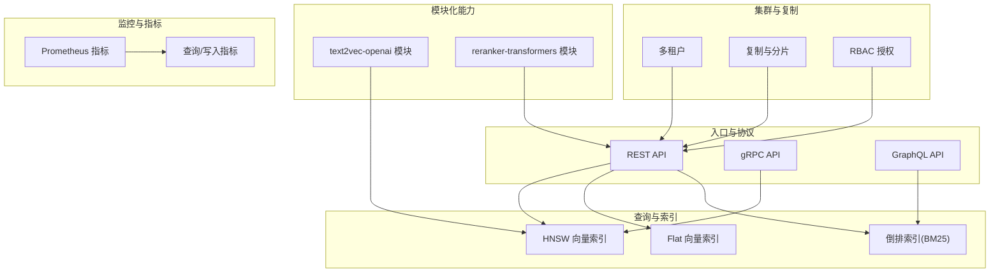
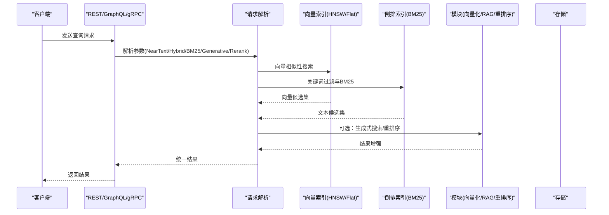
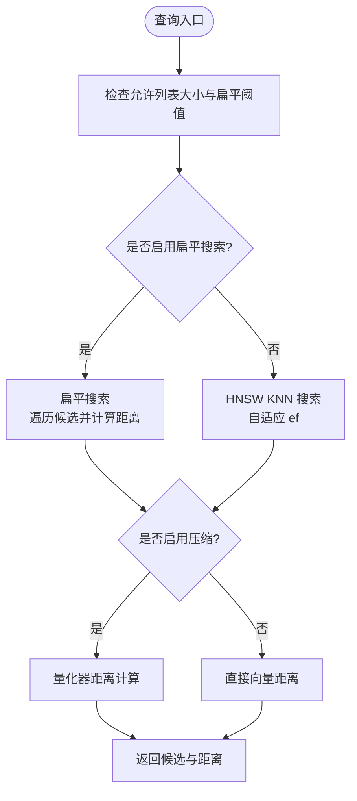
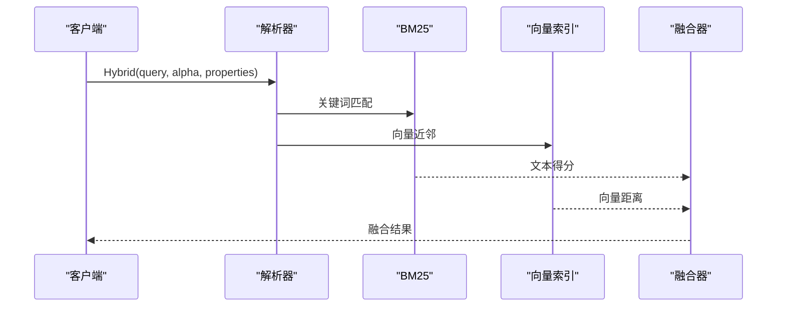
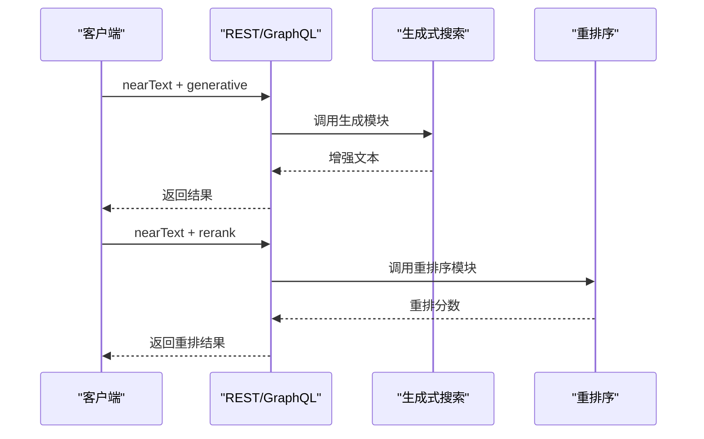
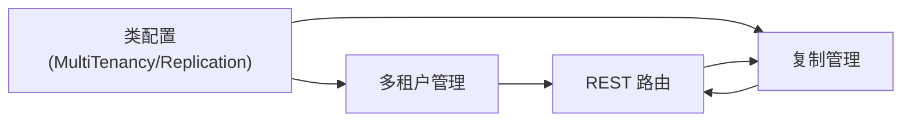
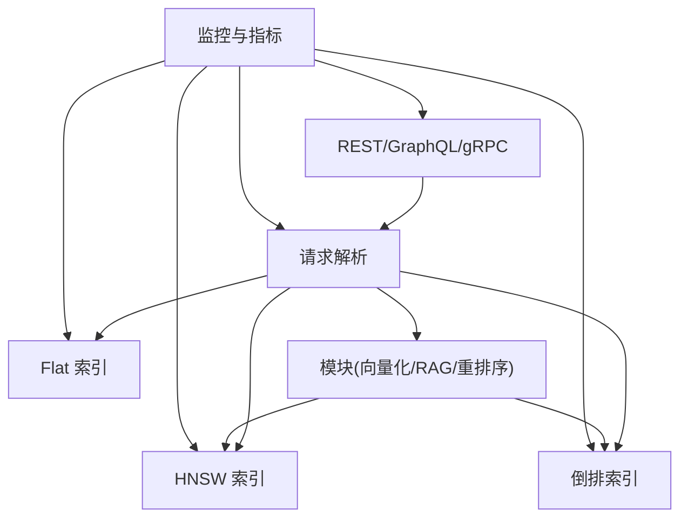

# 核心特性

<cite>
**本文引用的文件**
- [README.md](file://README.md)
- [main.go](file://cmd/weaviate-server/main.go)
- [class.go](file://entities/models/class.go)
- [bm25.go](file://adapters/handlers/graphql/local/common_filters/bm25.go)
- [search_get.pb.go](file://grpc/generated/protocol/v1/search_get.pb.go)
- [parse_search_request.go](file://adapters/handlers/grpc/v1/parse_search_request.go)
- [retrieval.go](file://entities/searchparams/retrieval.go)
- [search.go](file://adapters/repos/db/vector/hnsw/search.go)
- [flat_search.go](file://adapters/repos/db/vector/hnsw/flat_search.go)
- [metadata.go](file://adapters/repos/db/vector/flat/metadata.go)
- [rotational_quantization.go](file://adapters/repos/db/vector/compressionhelpers/rotational_quantization.go)
- [scalar_quantization.go](file://adapters/repos/db/vector/compressionhelpers/scalar_quantization.go)
- [binary_rotational_quantization_test.go](file://adapters/repos/db/vector/compressionhelpers/binary_rotational_quantization_test.go)
- [module.go](file://modules/text2vec-openai/module.go)
- [module.go](file://modules/reranker-transformers/module.go)
- [prometheus.go](file://usecases/monitoring/prometheus.go)
- [metrics.go](file://adapters/repos/db/metrics.go)
- [semantic_search_test.go](file://example/semantic_search_test.go)
- [rag_test.go](file://example/rag_test.go)
- [basic_weaviate_test.go](file://example/basic_weaviate_test.go)
- [manager_test.go](file://cluster/schema/manager_test.go)
- [schema_thread_safety_test.go](file://cluster/schema/schema_thread_safety_test.go)
- [replicate.go](file://adapters/handlers/rest/operations/replication/replicate.go)
- [handlers_replicate_test.go](file://adapters/handlers/rest/replication/handlers_replicate_test.go)
- [generative_test.go](file://test/acceptance_with_go_client/generative_test.go)
- [reranker_transformers_test.go](file://test/modules/reranker-transformers/reranker_transformers_test.go)
</cite>

## 目录
1. [简介](#简介)
2. [项目结构](#项目结构)
3. [核心组件](#核心组件)
4. [架构总览](#架构总览)
5. [详细组件分析](#详细组件分析)
6. [依赖关系分析](#依赖关系分析)
7. [性能考量](#性能考量)
8. [故障排查指南](#故障排查指南)
9. [结论](#结论)
10. [附录](#附录)

## 简介
Weaviate 是一个开源、云原生的向量数据库，支持对象与向量的统一存储，并提供大规模语义搜索能力。其核心特性覆盖六大方面：
- ⚡ 快速搜索性能：毫秒级检索数十亿向量，支持 ANN 加速与向量压缩。
- 🔌 灵活的向量化：内置多种向量化器，支持导入时自动生成向量或直接导入预计算向量。
- 🔍 高级混合与图像搜索：融合 BM25 关键词搜索、图像搜索与高级过滤，统一查询接口。
- 🤖 集成的 RAG 与重排序：内置生成式搜索与重排序模块，直接驱动问答、摘要与对话。
- 📈 生产就绪且可扩展：支持多租户、复制、RBAC 授权与水平扩展。
- 💰 成本效益的操作：通过向量压缩显著降低内存占用与运营成本。

以上特性在仓库中均有对应的实现与测试验证，本文将从架构、数据流、处理逻辑与最佳实践等维度进行系统化解读。

**章节来源**
- [README.md](file://README.md#L10-L128)

## 项目结构
Weaviate 采用分层与模块化组织方式：
- 服务入口与 API：REST/GraphQL/gRPC 入口位于适配层，负责请求解析与路由。
- 查询与索引：向量索引（HNSW/Flat）与倒排索引（BM25）分别位于存储与检索层。
- 模块化能力：向量化器、重排序器、生成式模块等以插件形式接入。
- 集群与复制：多租户、复制、授权与分布式任务管理由集群子系统提供。
- 监控与指标：Prometheus 指标采集与埋点贯穿查询与写入路径。



**图表来源**
- [main.go](file://cmd/weaviate-server/main.go#L30-L66)
- [search_get.pb.go](file://grpc/generated/protocol/v1/search_get.pb.go#L177-L266)
- [bm25.go](file://adapters/handlers/graphql/local/common_filters/bm25.go#L60-L91)
- [search.go](file://adapters/repos/db/vector/hnsw/search.go#L78-L92)
- [module.go](file://modules/text2vec-openai/module.go#L48-L121)
- [module.go](file://modules/reranker-transformers/module.go#L53-L87)
- [prometheus.go](file://usecases/monitoring/prometheus.go#L394-L424)
- [metrics.go](file://adapters/repos/db/metrics.go#L76-L130)

**章节来源**
- [main.go](file://cmd/weaviate-server/main.go#L30-L66)
- [class.go](file://entities/models/class.go#L32-L72)

## 核心组件
- 向量相似性搜索：HNSW 与 Flat 索引，支持单/多向量与压缩。
- BM25 关键词搜索：倒排索引与属性过滤，支持最小匹配与运算符。
- 图像搜索：多模态向量化器（如 multi2vec-clip）与 nearImage 查询。
- RAG 与重排序：生成式搜索与 rerank 模块，支持单/组聚合结果。
- 多租户与复制：类配置中的多租户与复制配置，配合分片状态管理。
- RBAC 授权：基于角色的访问控制，REST 路由中预留授权处理器占位。
- 监控与指标：查询耗时、批处理耗时、过滤/向量/对象三类查询路径指标。

**章节来源**
- [search.go](file://adapters/repos/db/vector/hnsw/search.go#L78-L92)
- [bm25.go](file://adapters/handlers/graphql/local/common_filters/bm25.go#L60-L91)
- [search_get.pb.go](file://grpc/generated/protocol/v1/search_get.pb.go#L212-L231)
- [module.go](file://modules/reranker-transformers/module.go#L53-L87)
- [class.go](file://entities/models/class.go#L46-L56)
- [prometheus.go](file://usecases/monitoring/prometheus.go#L394-L424)
- [metrics.go](file://adapters/repos/db/metrics.go#L76-L130)

## 架构总览
Weaviate 的查询链路从入口协议开始，经由解析与参数提取，进入向量与倒排索引，再结合模块化能力（如 RAG、重排序）输出最终结果；写入路径则通过模块化向量化器生成向量并持久化。



**图表来源**
- [parse_search_request.go](file://adapters/handlers/grpc/v1/parse_search_request.go#L621-L624)
- [bm25.go](file://adapters/handlers/graphql/local/common_filters/bm25.go#L60-L91)
- [search_get.pb.go](file://grpc/generated/protocol/v1/search_get.pb.go#L177-L266)
- [module.go](file://modules/text2vec-openai/module.go#L128-L157)
- [module.go](file://modules/reranker-transformers/module.go#L89-L95)

## 详细组件分析

### 快速搜索性能
- HNSW 与 Flat 索引：根据节点规模与允许列表选择扁平搜索或 HNSW KNN 搜索；支持多向量与压缩。
- 自适应 ef：根据 k 值动态调整 ef，兼顾召回与性能。
- 向量压缩：旋转量化（RQ/SQ）与二进制旋转量化（BRQ），显著降低内存占用。



**图表来源**
- [search.go](file://adapters/repos/db/vector/hnsw/search.go#L78-L92)
- [flat_search.go](file://adapters/repos/db/vector/hnsw/flat_search.go#L28-L47)
- [metadata.go](file://adapters/repos/db/vector/flat/metadata.go#L308-L356)
- [rotational_quantization.go](file://adapters/repos/db/vector/compressionhelpers/rotational_quantization.go#L366-L380)
- [scalar_quantization.go](file://adapters/repos/db/vector/compressionhelpers/scalar_quantization.go#L194-L232)

**章节来源**
- [search.go](file://adapters/repos/db/vector/hnsw/search.go#L60-L76)
- [flat_search.go](file://adapters/repos/db/vector/hnsw/flat_search.go#L28-L47)
- [metadata.go](file://adapters/repos/db/vector/flat/metadata.go#L308-L356)
- [rotational_quantization.go](file://adapters/repos/db/vector/compressionhelpers/rotational_quantization.go#L333-L380)
- [scalar_quantization.go](file://adapters/repos/db/vector/compressionhelpers/scalar_quantization.go#L206-L232)
- [binary_rotational_quantization_test.go](file://adapters/repos/db/vector/compressionhelpers/binary_rotational_quantization_test.go#L109-L131)

最佳实践
- 对大表与高维向量优先使用 HNSW；小表或需要精确遍历时使用扁平搜索。
- 开启向量压缩以降低内存占用，结合测试验证距离估计误差与性能收益。
- 合理设置 autocut 或阈值，减少无效候选提升吞吐。

### 灵活的向量化支持
- 内置向量化器：如 text2vec-openai，支持外部 API 调用与批处理。
- 导入策略：支持在导入时自动生成向量，或直接导入预计算向量。
- 类配置：通过 vectorizer 字段指定模块，或使用多向量配置。

```mermaid
classDiagram
class OpenAIModule {
+Name() string
+Type() ModuleType
+Init(ctx, params) error
+InitExtension(modules) error
+VectorizeObject(...)
+VectorizeBatch(...)
+MetaInfo() map[string]interface{}
+AdditionalProperties()
}
class TextVectorizerBatch {
+Object(...)
+ObjectBatch(...)
}
OpenAIModule --> TextVectorizerBatch : "使用"
```

**图表来源**
- [module.go](file://modules/text2vec-openai/module.go#L48-L121)

**章节来源**
- [module.go](file://modules/text2vec-openai/module.go#L48-L121)
- [class.go](file://entities/models/class.go#L61-L71)

最佳实践
- 根据数据规模与延迟要求选择合适的批大小与超时。
- 对多语言/多模态场景选择对应模块（如 text2vec-huggingface、multi2vec-clip）。

### 高级混合与图像搜索
- 混合搜索：将 BM25 与向量搜索融合，通过 alpha 控制权重。
- 图像搜索：nearImage 参数结合多模态向量化器（如 multi2vec-clip）。
- 过滤与排序：支持属性过滤、排序与分页。



**图表来源**
- [bm25.go](file://adapters/handlers/graphql/local/common_filters/bm25.go#L60-L91)
- [retrieval.go](file://entities/searchparams/retrieval.go#L102-L117)
- [search_get.pb.go](file://grpc/generated/protocol/v1/search_get.pb.go#L177-L217)

**章节来源**
- [bm25.go](file://adapters/handlers/graphql/local/common_filters/bm25.go#L60-L91)
- [retrieval.go](file://entities/searchparams/retrieval.go#L82-L117)
- [search_get.pb.go](file://grpc/generated/protocol/v1/search_get.pb.go#L177-L217)

最佳实践
- 通过 alpha 平滑平衡关键词与语义权重，结合业务反馈调优。
- 使用 properties 明确参与 BM25 的字段，避免无关噪声。

### 集成的 RAG 与重排序
- 生成式搜索：在 nearText/nearVector 查询后附加生成参数，支持单条与组聚合结果。
- 重排序：通过 rerank 模块对候选进行二次打分，提升相关性。



**图表来源**
- [generative_test.go](file://test/acceptance_with_go_client/generative_test.go#L69-L110)
- [module.go](file://modules/reranker-transformers/module.go#L53-L87)
- [reranker_transformers_test.go](file://test/modules/reranker-transformers/reranker_transformers_test.go#L197-L253)

**章节来源**
- [generative_test.go](file://test/acceptance_with_go_client/generative_test.go#L69-L110)
- [module.go](file://modules/reranker-transformers/module.go#L53-L87)
- [reranker_transformers_test.go](file://test/modules/reranker-transformers/reranker_transformers_test.go#L197-L253)

最佳实践
- 生成式搜索适合摘要与问答场景，注意控制上下文长度与提示词。
- 重排序模块需与检索质量协同优化，避免过度重排导致信息丢失。

### 生产就绪且可扩展
- 多租户：类配置开启多租户，分片状态管理租户映射。
- 复制：REST 路由预留复制操作处理器，支持副本移动/复制计划。
- RBAC：授权处理器预留，便于接入细粒度权限控制。



**图表来源**
- [class.go](file://entities/models/class.go#L46-L56)
- [manager_test.go](file://cluster/schema/manager_test.go#L148-L172)
- [schema_thread_safety_test.go](file://cluster/schema/schema_thread_safety_test.go#L398-L455)
- [replicate.go](file://adapters/handlers/rest/operations/replication/replicate.go#L45-L84)
- [handlers_replicate_test.go](file://adapters/handlers/rest/replication/handlers_replicate_test.go#L543-L553)

**章节来源**
- [class.go](file://entities/models/class.go#L46-L56)
- [manager_test.go](file://cluster/schema/manager_test.go#L148-L172)
- [schema_thread_safety_test.go](file://cluster/schema/schema_thread_safety_test.go#L398-L455)
- [replicate.go](file://adapters/handlers/rest/operations/replication/replicate.go#L45-L84)
- [handlers_replicate_test.go](file://adapters/handlers/rest/replication/handlers_replicate_test.go#L543-L553)

最佳实践
- 多租户与复制策略应与业务隔离需求一致，定期校验分片分布。
- 复制操作建议在低峰期执行，并监控同步进度与一致性。

### 成本效益的操作
- 向量压缩：旋转量化（RQ/SQ）与二进制旋转量化（BRQ），显著降低内存占用。
- 性能与精度权衡：通过测试验证压缩误差与距离估计偏差，确保业务可用性。

**章节来源**
- [metadata.go](file://adapters/repos/db/vector/flat/metadata.go#L308-L356)
- [rotational_quantization.go](file://adapters/repos/db/vector/compressionhelpers/rotational_quantization.go#L333-L380)
- [scalar_quantization.go](file://adapters/repos/db/vector/compressionhelpers/scalar_quantization.go#L206-L232)
- [binary_rotational_quantization_test.go](file://adapters/repos/db/vector/compressionhelpers/binary_rotational_quantization_test.go#L109-L131)

## 依赖关系分析
Weaviate 的查询与写入路径存在清晰的依赖层次：
- 入口协议依赖解析器与参数提取模块。
- 查询路径依赖向量索引与倒排索引，必要时调用模块化能力。
- 写入路径依赖向量化器与批处理模块。
- 监控与指标贯穿各层，提供性能观测与告警依据。



**图表来源**
- [main.go](file://cmd/weaviate-server/main.go#L30-L66)
- [parse_search_request.go](file://adapters/handlers/grpc/v1/parse_search_request.go#L611-L619)
- [prometheus.go](file://usecases/monitoring/prometheus.go#L394-L424)
- [metrics.go](file://adapters/repos/db/metrics.go#L76-L130)

**章节来源**
- [main.go](file://cmd/weaviate-server/main.go#L30-L66)
- [parse_search_request.go](file://adapters/handlers/grpc/v1/parse_search_request.go#L611-L619)
- [prometheus.go](file://usecases/monitoring/prometheus.go#L394-L424)
- [metrics.go](file://adapters/repos/db/metrics.go#L76-L130)

## 性能考量
- 向量搜索：HNSW ef 自适应与扁平阈值控制，避免过早截断与无效遍历。
- 压缩策略：RQ/SQ/BRQ 在不同维度下具有稳定的压缩比，需结合业务精度要求评估。
- 批处理：向量化器批大小与超时需与外部服务 SLA 对齐，避免拥塞。
- 监控：针对查询与写入的关键路径埋点，结合 Prometheus 指标进行容量规划与瓶颈定位。

[本节为通用指导，不直接分析具体文件]

## 故障排查指南
- 向量搜索异常
  - 检查 ef 自适应参数与扁平阈值设置，确认候选集规模与阈值匹配。
  - 若启用压缩，确认量化器初始化与恢复流程正常。
- 混合搜索结果偏差
  - 调整 alpha 权重，明确参与 BM25 的属性列表。
- RAG/重排序失败
  - 确认模块环境变量（如 RERANKER_INFERENCE_API）正确配置。
  - 检查生成式搜索的上下文长度与提示词。
- 多租户/复制问题
  - 校验类配置中的多租户与复制字段，关注分片状态与租户映射。
  - 复制操作需确保目标节点可达并具备足够磁盘空间。

**章节来源**
- [search.go](file://adapters/repos/db/vector/hnsw/search.go#L60-L76)
- [metadata.go](file://adapters/repos/db/vector/flat/metadata.go#L486-L526)
- [module.go](file://modules/reranker-transformers/module.go#L63-L87)
- [class.go](file://entities/models/class.go#L46-L56)
- [replicate.go](file://adapters/handlers/rest/operations/replication/replicate.go#L45-L84)

## 结论
Weaviate 将向量相似性搜索、关键词过滤、RAG 与重排序整合在同一查询接口中，配合多租户、复制与 RBAC，形成生产就绪的向量数据库方案。通过向量压缩与索引优化，实现高性能与低成本的平衡。结合监控指标与测试用例，可在不同业务场景中稳定落地。

[本节为总结性内容，不直接分析具体文件]

## 附录
- 快速开始与示例
  - 基础操作与 Schema 管理：[basic_weaviate_test.go](file://example/basic_weaviate_test.go#L14-L118)
  - 语义搜索与混合搜索：[semantic_search_test.go](file://example/semantic_search_test.go#L19-L331)
  - RAG 示例：[rag_test.go](file://example/rag_test.go#L12-L69)

**章节来源**
- [basic_weaviate_test.go](file://example/basic_weaviate_test.go#L14-L118)
- [semantic_search_test.go](file://example/semantic_search_test.go#L19-L331)
- [rag_test.go](file://example/rag_test.go#L12-L69)