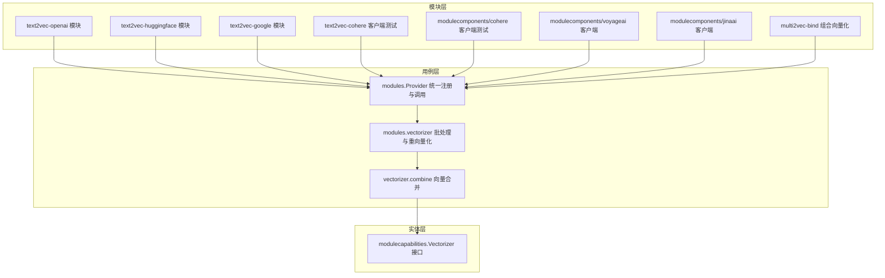
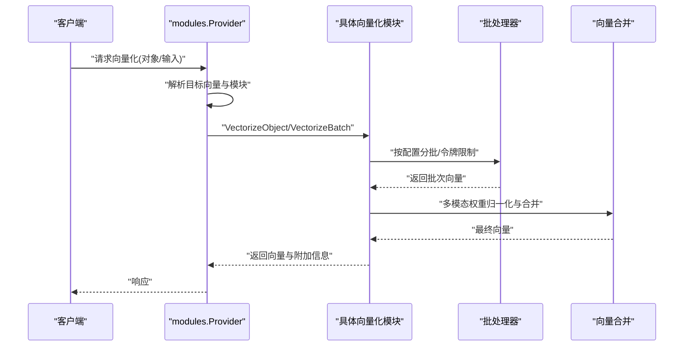
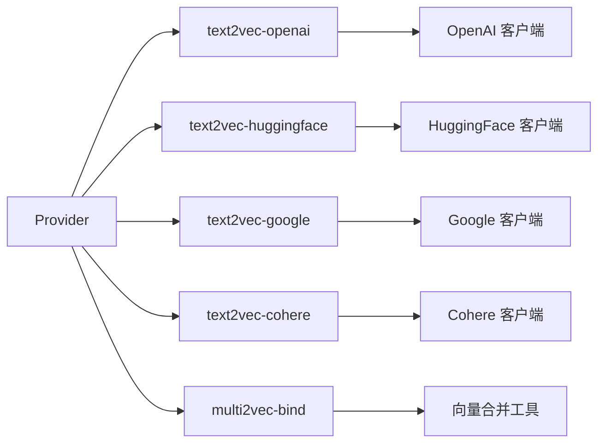

# 灵活的向量化支持

<cite>
**本文引用的文件**
- [modules/text2vec-openai/module.go](file://modules/text2vec-openai/module.go)
- [modules/text2vec-huggingface/module.go](file://modules/text2vec-huggingface/module.go)
- [modules/text2vec-google/module.go](file://modules/text2vec-google/module.go)
- [modules/text2vec-cohere/clients/cohere_test.go](file://modules/text2vec-cohere/clients/cohere_test.go)
- [usecases/modulecomponents/clients/cohere/cohere_test.go](file://usecases/modulecomponents/clients/cohere/cohere_test.go)
- [usecases/modulecomponents/clients/voyageai/voyageai.go](file://usecases/modulecomponents/clients/voyageai/voyageai.go)
- [usecases/modulecomponents/clients/jinaai/jinaai.go](file://usecases/modulecomponents/clients/jinaai/jinaai.go)
- [modules/multi2vec-bind/vectorizer/vectorizer.go](file://modules/multi2vec-bind/vectorizer/vectorizer.go)
- [modules/multi2vec-bind/vectorizer/vectorizer_test.go](file://modules/multi2vec-bind/vectorizer/vectorizer_test.go)
- [modules/multi2vec-aws/vectorizer/vectorizer_test.go](file://modules/multi2vec-aws/vectorizer/vectorizer_test.go)
- [usecases/vectorizer/combine.go](file://usecases/vectorizer/combine.go)
- [usecases/modules/modules.go](file://usecases/modules/modules.go)
- [usecases/modules/vectorizer.go](file://usecases/modules/vectorizer.go)
- [entities/modulecapabilities/vectorizer.go](file://entities/modulecapabilities/vectorizer.go)
- [adapters/repos/db/batch_integration_test.go](file://adapters/repos/db/batch_integration_test.go)
- [usecases/objects/batch_add.go](file://usecases/objects/batch_add.go)
- [usecases/schema/property.go](file://usecases/schema/property.go)
- [modules/ref2vec-centroid/module.go](file://modules/ref2vec-centroid/module.go)
- [modules/multi2vec-cohere/clients/meta.go](file://modules/multi2vec-cohere/clients/meta.go)
- [modules/text2vec-cohere/clients/meta.go](file://modules/text2vec-cohere/clients/meta.go)
</cite>

## 目录
1. [简介](#简介)
2. [项目结构](#项目结构)
3. [核心组件](#核心组件)
4. [架构总览](#架构总览)
5. [详细组件分析](#详细组件分析)
6. [依赖关系分析](#依赖关系分析)
7. [性能考量](#性能考量)
8. [故障排查指南](#故障排查指南)
9. [结论](#结论)
10. [附录：配置与最佳实践](#附录配置与最佳实践)

## 简介
本文件系统性阐述 Weaviate 的“灵活向量化支持”能力，覆盖以下关键主题：
- 多主流模型提供商的集成方式：OpenAI、HuggingFace、Cohere、Google 等
- 自定义向量嵌入的导入机制：维度校验、批量导入优化、向量格式兼容性
- 多模态向量化：文本、图像、视频等多源融合与权重组合
- 配置示例与最佳实践：向量化器选择策略、性能优化与成本控制
- 动态加载机制与扩展开发指南：如何集成新的向量化模型

## 项目结构
Weaviate 将“向量化”能力以模块化形式组织在 modules 目录中，每个提供商对应一个独立模块；同时通过 usecases 层统一调度与批处理，实体层定义通用接口。

**图表来源**
- [modules/text2vec-openai/module.go](file://modules/text2vec-openai/module.go#L48-L121)
- [modules/text2vec-huggingface/module.go](file://modules/text2vec-huggingface/module.go#L43-L112)
- [modules/text2vec-google/module.go](file://modules/text2vec-google/module.go#L47-L129)
- [usecases/modules/modules.go](file://usecases/modules/modules.go#L138-L179)
- [usecases/modules/vectorizer.go](file://usecases/modules/vectorizer.go#L358-L393)
- [usecases/vectorizer/combine.go](file://usecases/vectorizer/combine.go#L16-L51)
- [entities/modulecapabilities/vectorizer.go](file://entities/modulecapabilities/vectorizer.go#L25-L53)

**章节来源**
- [modules/text2vec-openai/module.go](file://modules/text2vec-openai/module.go#L1-L180)
- [modules/text2vec-huggingface/module.go](file://modules/text2vec-huggingface/module.go#L1-L167)
- [modules/text2vec-google/module.go](file://modules/text2vec-google/module.go#L1-L179)
- [usecases/modules/modules.go](file://usecases/modules/modules.go#L1-L200)
- [usecases/modules/vectorizer.go](file://usecases/modules/vectorizer.go#L220-L393)
- [usecases/vectorizer/combine.go](file://usecases/vectorizer/combine.go#L1-L51)
- [entities/modulecapabilities/vectorizer.go](file://entities/modulecapabilities/vectorizer.go#L1-L54)

## 核心组件
- 模块化向量化器：各提供商以独立模块实现，统一暴露 Vectorizer 接口，支持对象级与批量向量化。
- Provider 统一调度：负责模块注册、别名解析、目标向量选择、重向量化与批处理编排。
- 批处理与令牌限制：针对不同提供商设置最大对象数、批次时长、令牌上限与速率返回策略。
- 多模态组合：通过权重归一化与向量合并，支持文本/图像/视频等多源融合。
- 参考向量化：基于引用对象向量计算目标对象向量（如质心）。

**章节来源**
- [entities/modulecapabilities/vectorizer.go](file://entities/modulecapabilities/vectorizer.go#L25-L53)
- [usecases/modules/modules.go](file://usecases/modules/modules.go#L46-L99)
- [usecases/modules/vectorizer.go](file://usecases/modules/vectorizer.go#L358-L393)
- [modules/ref2vec-centroid/module.go](file://modules/ref2vec-centroid/module.go#L54-L63)

## 架构总览
Weaviate 的向量化路径从 GraphQL/REST 请求进入，经由 Provider 解析目标向量与模块，再调用具体模块的向量化器完成单条或批量向量化，并在需要时进行多模态融合与权重组合。

**图表来源**
- [usecases/modules/vectorizer.go](file://usecases/modules/vectorizer.go#L358-L393)
- [usecases/vectorizer/combine.go](file://usecases/vectorizer/combine.go#L26-L51)
- [modules/text2vec-openai/module.go](file://modules/text2vec-openai/module.go#L128-L141)
- [modules/multi2vec-bind/vectorizer/vectorizer.go](file://modules/multi2vec-bind/vectorizer/vectorizer.go#L184-L229)

## 详细组件分析

### OpenAI 向量化模块
- 功能要点
  - 支持 OpenAI Embeddings API，环境变量读取 API Key 与组织信息，Azure Key 兼容。
  - 批处理设置包含最大对象数、批次时长、令牌上限与速率返回策略。
  - 提供对象级与批量向量化入口，并暴露元信息查询。
- 关键实现位置
  - 模块初始化与批处理设置：[modules/text2vec-openai/module.go](file://modules/text2vec-openai/module.go#L37-L46)
  - 初始化向量化器与额外属性提供者：[modules/text2vec-openai/module.go](file://modules/text2vec-openai/module.go#L104-L121)
  - 对象与批量向量化入口：[modules/text2vec-openai/module.go](file://modules/text2vec-openai/module.go#L128-L141)

**章节来源**
- [modules/text2vec-openai/module.go](file://modules/text2vec-openai/module.go#L37-L141)

### HuggingFace 向量化模块
- 功能要点
  - 基于 HuggingFace 推理 API，环境变量读取 API Key。
  - 批处理设置无令牌限制，适合大模型推理场景。
  - 提供对象级与批量向量化入口。
- 关键实现位置
  - 批处理设置与初始化：[modules/text2vec-huggingface/module.go](file://modules/text2vec-huggingface/module.go#L34-L112)
  - 对象与批量向量化入口：[modules/text2vec-huggingface/module.go](file://modules/text2vec-huggingface/module.go#L119-L132)

**章节来源**
- [modules/text2vec-huggingface/module.go](file://modules/text2vec-huggingface/module.go#L34-L132)

### Google 向量化模块
- 功能要点
  - 支持 Google AI Embeddings（含历史名称 text2vec-palm），优先使用 GOOGLE_APIKEY，其次 PALM_APIKEY。
  - 支持标题属性的特殊向量化路径，以及带标题属性的批处理。
  - 提供对象级与批量向量化入口。
- 关键实现位置
  - 初始化与别名支持：[modules/text2vec-google/module.go](file://modules/text2vec-google/module.go#L66-L129)
  - 批处理分支逻辑（有/无标题属性）：[modules/text2vec-google/module.go](file://modules/text2vec-google/module.go#L143-L150)

**章节来源**
- [modules/text2vec-google/module.go](file://modules/text2vec-google/module.go#L66-L150)

### Cohere 向量化（模块与客户端）
- 功能要点
  - 模块侧提供元信息（文档链接等）。
  - 客户端测试覆盖上下文过期、服务器错误、API Key 传递等边界情况。
- 关键实现位置
  - 模块元信息：[modules/text2vec-cohere/clients/meta.go](file://modules/text2vec-cohere/clients/meta.go#L14-L18)
  - 客户端测试（模块侧）：[modules/text2vec-cohere/clients/cohere_test.go](file://modules/text2vec-cohere/clients/cohere_test.go#L123-L160)
  - 客户端测试（modulecomponents 侧）：[usecases/modulecomponents/clients/cohere/cohere_test.go](file://usecases/modulecomponents/clients/cohere/cohere_test.go#L56-L157)

**章节来源**
- [modules/text2vec-cohere/clients/meta.go](file://modules/text2vec-cohere/clients/meta.go#L14-L18)
- [modules/text2vec-cohere/clients/cohere_test.go](file://modules/text2vec-cohere/clients/cohere_test.go#L123-L160)
- [usecases/modulecomponents/clients/cohere/cohere_test.go](file://usecases/modulecomponents/clients/cohere/cohere_test.go#L56-L157)

### 多模态向量化（VoyageAI、JinaAI）
- 功能要点
  - 支持文本与图像等多模态输入，分别生成向量并可进行后续融合。
  - 提供多模态请求构建与结果解析。
- 关键实现位置
  - VoyageAI 多模态向量化入口与上下文模型判断：[usecases/modulecomponents/clients/voyageai/voyageai.go](file://usecases/modulecomponents/clients/voyageai/voyageai.go#L187-L224)
  - JinaAI 多模态向量化与向量提取：[usecases/modulecomponents/clients/jinaai/jinaai.go](file://usecases/modulecomponents/clients/jinaai/jinaai.go#L148-L192)

**章节来源**
- [usecases/modulecomponents/clients/voyageai/voyageai.go](file://usecases/modulecomponents/clients/voyageai/voyageai.go#L187-L224)
- [usecases/modulecomponents/clients/jinaai/jinaai.go](file://usecases/modulecomponents/clients/jinaai/jinaai.go#L148-L192)

### 多模态组合与权重归一化（multi2vec-bind、multi2vec-aws 等）
- 功能要点
  - 从各类字段权重集合中提取并归一化，随后对向量进行加权合并。
  - 测试覆盖多种权重归一化场景，确保权重之和为 1。
- 关键实现位置
  - 权重提取与归一化（bind）：[modules/multi2vec-bind/vectorizer/vectorizer.go](file://modules/multi2vec-bind/vectorizer/vectorizer.go#L187-L229)
  - 权重归一化测试（bind）：[modules/multi2vec-bind/vectorizer/vectorizer_test.go](file://modules/multi2vec-bind/vectorizer/vectorizer_test.go#L75-L116)
  - 权重归一化测试（aws）：[modules/multi2vec-aws/vectorizer/vectorizer_test.go](file://modules/multi2vec-aws/vectorizer/vectorizer_test.go#L152-L194)

**章节来源**
- [modules/multi2vec-bind/vectorizer/vectorizer.go](file://modules/multi2vec-bind/vectorizer/vectorizer.go#L187-L229)
- [modules/multi2vec-bind/vectorizer/vectorizer_test.go](file://modules/multi2vec-bind/vectorizer/vectorizer_test.go#L75-L116)
- [modules/multi2vec-aws/vectorizer/vectorizer_test.go](file://modules/multi2vec-aws/vectorizer/vectorizer_test.go#L152-L194)

### 向量合并与多模态融合
- 功能要点
  - 合并多个向量序列，支持按权重加权求和后平均，确保输出维度一致性。
- 关键实现位置
  - 向量合并与加权平均：[usecases/vectorizer/combine.go](file://usecases/vectorizer/combine.go#L16-L51)

**章节来源**
- [usecases/vectorizer/combine.go](file://usecases/vectorizer/combine.go#L16-L51)

### Provider 统一调度与重向量化
- 功能要点
  - 注册模块、解析别名、根据目标向量选择模块、决定是否需要重向量化。
  - 对批量对象进行分批、跳过已存在向量的对象、回填附加信息。
- 关键实现位置
  - 模块注册与初始化扩展：[usecases/modules/modules.go](file://usecases/modules/modules.go#L138-L179)
  - 目标向量选择与模块匹配：[usecases/modules/modules.go](file://usecases/modules/modules.go#L966-L986)
  - 对象向量化主流程（含重向量化判定）：[usecases/modules/vectorizer.go](file://usecases/modules/vectorizer.go#L358-L393)
  - 批量向量化与附加属性回填：[usecases/modules/vectorizer.go](file://usecases/modules/vectorizer.go#L220-L251)

**章节来源**
- [usecases/modules/modules.go](file://usecases/modules/modules.go#L138-L179)
- [usecases/modules/modules.go](file://usecases/modules/modules.go#L966-L986)
- [usecases/modules/vectorizer.go](file://usecases/modules/vectorizer.go#L220-L393)

### 参考向量化（基于引用对象）
- 功能要点
  - 仅依据对象的引用向量计算目标对象向量（如质心），无引用则为空向量。
- 关键实现位置
  - 参考向量化入口：[modules/ref2vec-centroid/module.go](file://modules/ref2vec-centroid/module.go#L54-L63)

**章节来源**
- [modules/ref2vec-centroid/module.go](file://modules/ref2vec-centroid/module.go#L54-L63)

## 依赖关系分析
- Provider 作为中枢，依赖模块接口（VectorizableProperties、Vectorizer、Searcher、MetaProvider 等）。
- 各模块内部依赖 clients 与 base 批处理组件，统一对外暴露 VectorizeObject/VectorizeBatch。
- 多模态模块依赖 modulecomponents 的客户端与向量化工具，实现跨模态融合。

**图表来源**
- [usecases/modules/modules.go](file://usecases/modules/modules.go#L138-L179)
- [modules/text2vec-openai/module.go](file://modules/text2vec-openai/module.go#L104-L121)
- [modules/text2vec-huggingface/module.go](file://modules/text2vec-huggingface/module.go#L102-L112)
- [modules/text2vec-google/module.go](file://modules/text2vec-google/module.go#L111-L129)
- [usecases/vectorizer/combine.go](file://usecases/vectorizer/combine.go#L16-L51)

**章节来源**
- [usecases/modules/modules.go](file://usecases/modules/modules.go#L138-L179)
- [modules/text2vec-openai/module.go](file://modules/text2vec-openai/module.go#L104-L121)
- [modules/text2vec-huggingface/module.go](file://modules/text2vec-huggingface/module.go#L102-L112)
- [modules/text2vec-google/module.go](file://modules/text2vec-google/module.go#L111-L129)
- [usecases/vectorizer/combine.go](file://usecases/vectorizer/combine.go#L16-L51)

## 性能考量
- 批处理参数
  - OpenAI：最大对象数、批次时长、令牌上限与速率返回策略，见 [modules/text2vec-openai/module.go](file://modules/text2vec-openai/module.go#L37-L46)。
  - HuggingFace：无令牌限制，适合大模型推理，见 [modules/text2vec-huggingface/module.go](file://modules/text2vec-huggingface/module.go#L34-L41)。
  - Google：令牌乘数、对象数与令牌上限，见 [modules/text2vec-google/module.go](file://modules/text2vec-google/module.go#L38-L45)。
- 令牌与对象数限制
  - Provider 在批量向量化时会根据模块配置与对象数量进行分批，避免超限，见 [usecases/modules/vectorizer.go](file://usecases/modules/vectorizer.go#L220-L251)。
- 重向量化与跳过
  - 对已存在向量的对象可跳过，减少重复调用外部服务，见 [usecases/modules/vectorizer.go](file://usecases/modules/vectorizer.go#L231-L249)。
- 多模态权重归一化
  - 归一化确保权重之和为 1，避免融合偏移，见 [modules/multi2vec-bind/vectorizer/vectorizer.go](file://modules/multi2vec-bind/vectorizer/vectorizer.go#L226-L229)。

**章节来源**
- [modules/text2vec-openai/module.go](file://modules/text2vec-openai/module.go#L37-L46)
- [modules/text2vec-huggingface/module.go](file://modules/text2vec-huggingface/module.go#L34-L41)
- [modules/text2vec-google/module.go](file://modules/text2vec-google/module.go#L38-L45)
- [usecases/modules/vectorizer.go](file://usecases/modules/vectorizer.go#L220-L251)
- [modules/multi2vec-bind/vectorizer/vectorizer.go](file://modules/multi2vec-bind/vectorizer/vectorizer.go#L226-L229)

## 故障排查指南
- API Key 缺失或为空
  - 测试覆盖了请求头与环境变量两种场景下的错误提示，见：
    - [modules/text2vec-cohere/clients/cohere_test.go](file://modules/text2vec-cohere/clients/cohere_test.go#L123-L160)
    - [usecases/modulecomponents/clients/cohere/cohere_test.go](file://usecases/modulecomponents/clients/cohere/cohere_test.go#L110-L138)
- 上下文过期
  - 当上下文超时时返回相应错误，见 [usecases/modulecomponents/clients/cohere/cohere_test.go](file://usecases/modulecomponents/clients/cohere/cohere_test.go#L60-L83)。
- 服务器错误
  - 服务器返回错误时，客户端会返回连接失败与状态码，见 [usecases/modulecomponents/clients/cohere/cohere_test.go](file://usecases/modulecomponents/clients/cohere/cohere_test.go#L85-L108)。
- 批量导入异常
  - 批量写入保存失败时会累加错误计数，见 [usecases/classification/writer.go](file://usecases/classification/writer.go#L110-L141)。
- Schema 校验
  - 属性模块配置需与类向量化器一致，否则报错，见 [usecases/schema/property.go](file://usecases/schema/property.go#L115-L157)。

**章节来源**
- [modules/text2vec-cohere/clients/cohere_test.go](file://modules/text2vec-cohere/clients/cohere_test.go#L123-L160)
- [usecases/modulecomponents/clients/cohere/cohere_test.go](file://usecases/modulecomponents/clients/cohere/cohere_test.go#L60-L138)
- [usecases/classification/writer.go](file://usecases/classification/writer.go#L110-L141)
- [usecases/schema/property.go](file://usecases/schema/property.go#L115-L157)

## 结论
Weaviate 的灵活向量化支持通过模块化设计实现了对多家模型提供商的统一接入，结合批处理、令牌限制、重向量化与多模态融合，既保证了易用性也兼顾了性能与成本控制。开发者可通过 Provider 动态加载新模块，遵循统一接口即可快速扩展新的向量化模型。

## 附录：配置与最佳实践

### 向量化器选择策略
- 文本为主：OpenAI、HuggingFace、Google、Cohere 等均提供文本嵌入能力，可根据延迟、成本与模型质量选择。
- 多模态需求：优先选择支持多模态的模块（如 VoyageAI、JinaAI），或通过 multi2vec-* 组合模块进行融合。
- 参考向量化：当对象语义主要来自其引用对象时，可采用 ref2vec-centroid 等模块。

**章节来源**
- [modules/text2vec-openai/module.go](file://modules/text2vec-openai/module.go#L104-L121)
- [modules/text2vec-huggingface/module.go](file://modules/text2vec-huggingface/module.go#L102-L112)
- [modules/text2vec-google/module.go](file://modules/text2vec-google/module.go#L111-L129)
- [modules/ref2vec-centroid/module.go](file://modules/ref2vec-centroid/module.go#L54-L63)

### 批量导入优化与向量格式兼容性
- 批处理参数建议
  - OpenAI：合理设置最大对象数与令牌上限，启用速率返回以便限流，见 [modules/text2vec-openai/module.go](file://modules/text2vec-openai/module.go#L37-L46)。
  - HuggingFace：无令牌限制，适合大模型，注意并发与内存占用，见 [modules/text2vec-huggingface/module.go](file://modules/text2vec-huggingface/module.go#L34-L41)。
  - Google：平衡对象数与令牌上限，见 [modules/text2vec-google/module.go](file://modules/text2vec-google/module.go#L38-L45)。
- 向量格式兼容
  - Weaviate 支持命名向量与多向量，批量导入时可先不提供向量，由模块自动注入，见 [adapters/repos/db/batch_integration_test.go](file://adapters/repos/db/batch_integration_test.go#L372-L400)。
  - 对象批量写入前会进行验证与向量化，见 [usecases/objects/batch_add.go](file://usecases/objects/batch_add.go#L166-L183)。

**章节来源**
- [modules/text2vec-openai/module.go](file://modules/text2vec-openai/module.go#L37-L46)
- [modules/text2vec-huggingface/module.go](file://modules/text2vec-huggingface/module.go#L34-L41)
- [modules/text2vec-google/module.go](file://modules/text2vec-google/module.go#L38-L45)
- [adapters/repos/db/batch_integration_test.go](file://adapters/repos/db/batch_integration_test.go#L372-L400)
- [usecases/objects/batch_add.go](file://usecases/objects/batch_add.go#L166-L183)

### 多模态向量化最佳实践
- 权重归一化
  - 确保各模态权重之和为 1，避免融合偏移，见 [modules/multi2vec-bind/vectorizer/vectorizer.go](file://modules/multi2vec-bind/vectorizer/vectorizer.go#L226-L229)。
- 输入类型与模型选择
  - 对于上下文敏感模型，按客户端要求采用上下文格式；对于常规模型，采用标准嵌入格式，见 [usecases/modulecomponents/clients/voyageai/voyageai.go](file://usecases/modulecomponents/clients/voyageai/voyageai.go#L187-L224)。

**章节来源**
- [modules/multi2vec-bind/vectorizer/vectorizer.go](file://modules/multi2vec-bind/vectorizer/vectorizer.go#L226-L229)
- [usecases/modulecomponents/clients/voyageai/voyageai.go](file://usecases/modulecomponents/clients/voyageai/voyageai.go#L187-L224)

### 成本控制方法
- 令牌限制与批大小
  - 针对 OpenAI 与 Google，合理设置令牌上限与对象数，避免超限导致重试与费用增加，见 [modules/text2vec-openai/module.go](file://modules/text2vec-openai/module.go#L37-L46)、[modules/text2vec-google/module.go](file://modules/text2vec-google/module.go#L38-L45)。
- 重向量化开关
  - 在不需要时关闭重向量化检查，减少不必要的外部调用，见 [usecases/modules/vectorizer.go](file://usecases/modules/vectorizer.go#L381-L383)。

**章节来源**
- [modules/text2vec-openai/module.go](file://modules/text2vec-openai/module.go#L37-L46)
- [modules/text2vec-google/module.go](file://modules/text2vec-google/module.go#L38-L45)
- [usecases/modules/vectorizer.go](file://usecases/modules/vectorizer.go#L381-L383)

### 动态加载机制与扩展开发指南
- 动态加载
  - Provider 在启动时初始化所有模块，并支持扩展与依赖初始化，见 [usecases/modules/modules.go](file://usecases/modules/modules.go#L138-L179)。
- 扩展开发步骤
  - 实现 modulecapabilities.Vectorizer 接口（对象级与批量），并在模块中注册批处理器与元信息提供者，参考：
    - [entities/modulecapabilities/vectorizer.go](file://entities/modulecapabilities/vectorizer.go#L25-L53)
    - [modules/text2vec-openai/module.go](file://modules/text2vec-openai/module.go#L104-L121)
    - [modules/text2vec-huggingface/module.go](file://modules/text2vec-huggingface/module.go#L102-L112)
    - [modules/text2vec-google/module.go](file://modules/text2vec-google/module.go#L111-L129)
  - 若支持多模态，实现 modulecomponents 客户端与向量合并逻辑，参考：
    - [usecases/modulecomponents/clients/voyageai/voyageai.go](file://usecases/modulecomponents/clients/voyageai/voyageai.go#L187-L224)
    - [usecases/vectorizer/combine.go](file://usecases/vectorizer/combine.go#L16-L51)

**章节来源**
- [usecases/modules/modules.go](file://usecases/modules/modules.go#L138-L179)
- [entities/modulecapabilities/vectorizer.go](file://entities/modulecapabilities/vectorizer.go#L25-L53)
- [modules/text2vec-openai/module.go](file://modules/text2vec-openai/module.go#L104-L121)
- [modules/text2vec-huggingface/module.go](file://modules/text2vec-huggingface/module.go#L102-L112)
- [modules/text2vec-google/module.go](file://modules/text2vec-google/module.go#L111-L129)
- [usecases/modulecomponents/clients/voyageai/voyageai.go](file://usecases/modulecomponents/clients/voyageai/voyageai.go#L187-L224)
- [usecases/vectorizer/combine.go](file://usecases/vectorizer/combine.go#L16-L51)