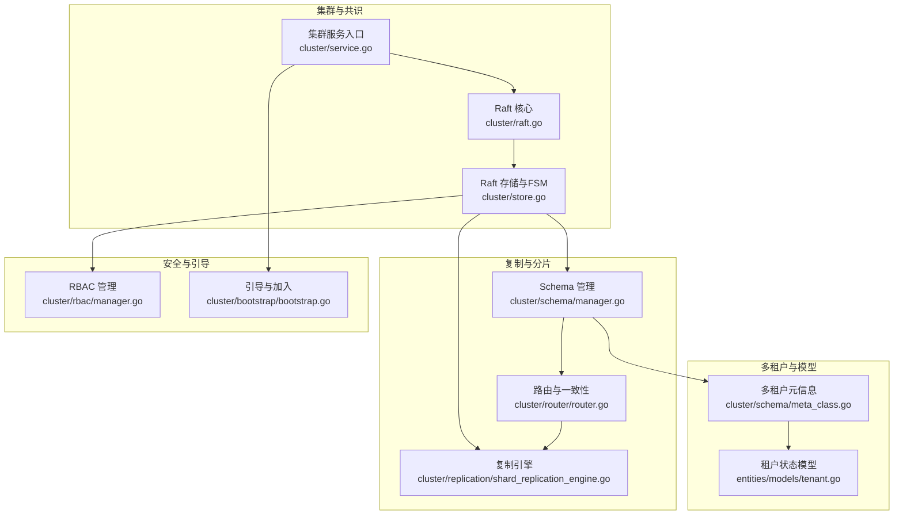
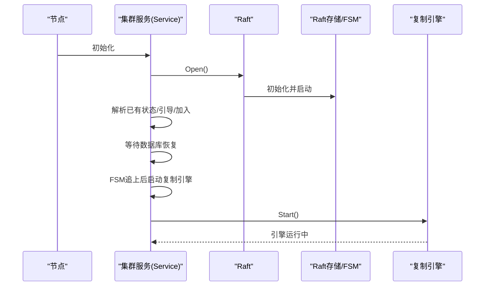
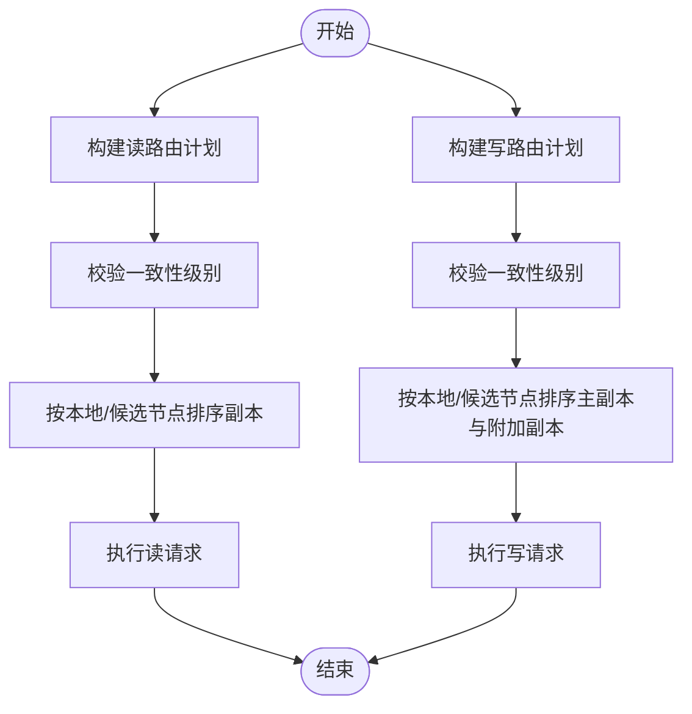
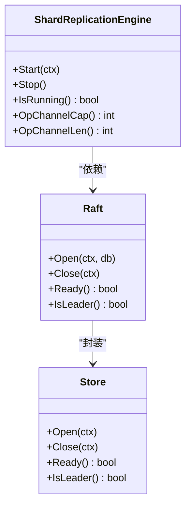
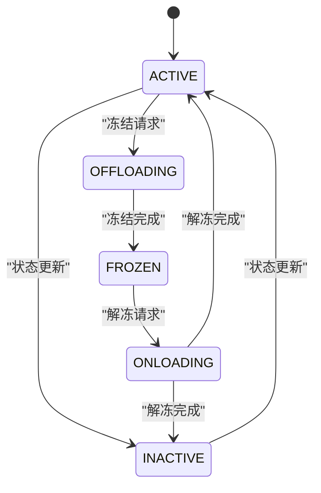
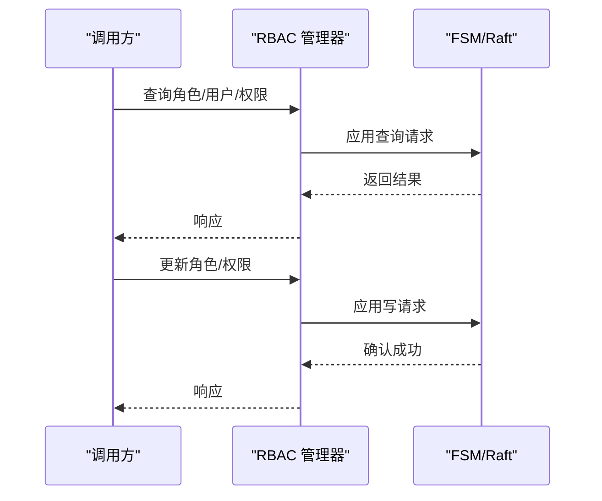
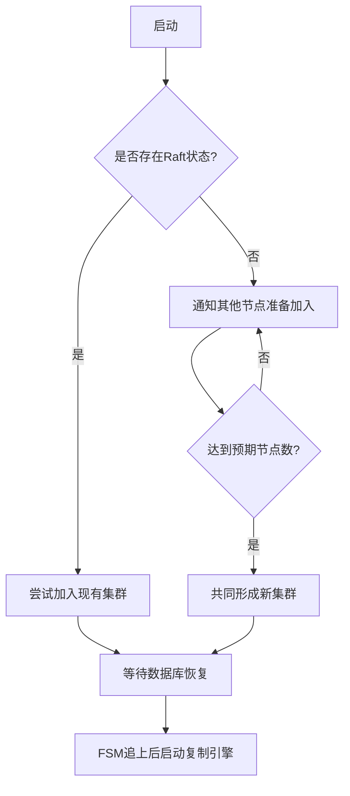
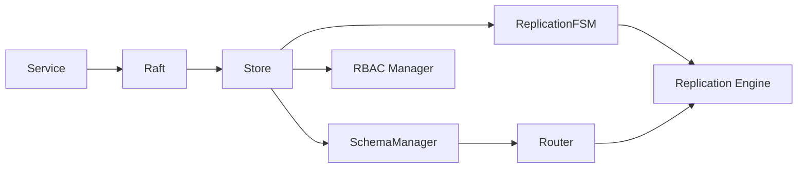

# 生产就绪且可扩展

<cite>
**本文引用的文件**
- [README.md](file://README.md)
- [cluster/service.go](file://cluster/service.go)
- [cluster/store.go](file://cluster/store.go)
- [cluster/raft.go](file://cluster/raft.go)
- [cluster/rbac/manager.go](file://cluster/rbac/manager.go)
- [cluster/replication/shard_replication_engine.go](file://cluster/replication/shard_replication_engine.go)
- [cluster/schema/manager.go](file://cluster/schema/manager.go)
- [cluster/bootstrap/bootstrap.go](file://cluster/bootstrap/bootstrap.go)
- [cluster/router/router.go](file://cluster/router/router.go)
- [entities/models/tenant.go](file://entities/models/tenant.go)
- [cluster/schema/meta_class.go](file://cluster/schema/meta_class.go)
</cite>

## 目录
1. [引言](#引言)
2. [项目结构](#项目结构)
3. [核心组件](#核心组件)
4. [架构总览](#架构总览)
5. [详细组件分析](#详细组件分析)
6. [依赖关系分析](#依赖关系分析)
7. [性能考量](#性能考量)
8. [故障排查指南](#故障排查指南)
9. [结论](#结论)
10. [附录](#附录)

## 引言
本文件面向生产部署与扩展场景，系统化阐述 Weaviate 的“生产就绪且可扩展”能力，覆盖以下主题：
- 水平扩展：分片策略、路由与一致性、负载均衡与动态扩缩容
- 多租户架构：数据隔离、状态流转、资源配额与租户管理
- 复制机制：基于 Raft 的共识、数据同步与故障转移
- 基于角色的访问控制（RBAC）：权限模型、角色管理与安全策略
- 生产部署：集群配置、监控与运维最佳实践
- 高可用与灾备：故障转移、一致性与灾难恢复

Weaviate 以 Raft 为核心共识层，围绕 Schema/FSM/复制引擎/路由/多租户等模块构建分布式向量数据库，具备生产级稳定性与可扩展性。

## 项目结构
Weaviate 的核心位于 cluster 子系统，包含 Raft 层、复制引擎、RBAC 管理、Schema 管理、引导与路由等模块；同时在 usecases 与 entities 中提供多租户状态模型、分片策略与一致性约束。

图表来源
- [cluster/service.go](file://cluster/service.go#L1-L255)
- [cluster/store.go](file://cluster/store.go#L1-L941)
- [cluster/raft.go](file://cluster/raft.go#L1-L99)
- [cluster/replication/shard_replication_engine.go](file://cluster/replication/shard_replication_engine.go#L1-L271)
- [cluster/schema/manager.go](file://cluster/schema/manager.go#L1-L707)
- [cluster/router/router.go](file://cluster/router/router.go#L1-L646)
- [cluster/rbac/manager.go](file://cluster/rbac/manager.go#L1-L300)
- [cluster/bootstrap/bootstrap.go](file://cluster/bootstrap/bootstrap.go#L1-L179)
- [entities/models/tenant.go](file://entities/models/tenant.go#L1-L144)
- [cluster/schema/meta_class.go](file://cluster/schema/meta_class.go#L1-L643)

章节来源
- [README.md](file://README.md#L1-L181)

## 核心组件
- Raft 与集群服务：负责节点发现、选举、日志复制与状态机应用，提供 Ready/Leader 查询与一致性等待。
- 复制引擎：基于生产者-消费者模式，协调跨节点分片复制，支持并发与背压控制。
- Schema 管理：在 Raft 上应用类、属性、分片与多租户变更，保证 Schema 与后端索引一致。
- 路由与一致性：根据多租户与分片状态，构建读写路由计划，支持一致性级别校验与首选节点排序。
- RBAC：在 Raft 上应用角色、权限与用户/组授权，支持快照与恢复。
- 引导与加入：支持从既有集群加入或通知其他节点参与新集群形成。
- 多租户模型：定义租户活动状态（ACTIVE/INACTIVE/OFFLOADED 及过渡态），并提供状态流转与冻结/解冻流程。

章节来源
- [cluster/service.go](file://cluster/service.go#L1-L255)
- [cluster/store.go](file://cluster/store.go#L1-L941)
- [cluster/raft.go](file://cluster/raft.go#L1-L99)
- [cluster/replication/shard_replication_engine.go](file://cluster/replication/shard_replication_engine.go#L1-L271)
- [cluster/schema/manager.go](file://cluster/schema/manager.go#L1-L707)
- [cluster/router/router.go](file://cluster/router/router.go#L1-L646)
- [cluster/rbac/manager.go](file://cluster/rbac/manager.go#L1-L300)
- [cluster/bootstrap/bootstrap.go](file://cluster/bootstrap/bootstrap.go#L1-L179)
- [entities/models/tenant.go](file://entities/models/tenant.go#L1-L144)
- [cluster/schema/meta_class.go](file://cluster/schema/meta_class.go#L1-L643)

## 架构总览
Weaviate 的生产架构以 Raft 为核心，围绕 Schema/FSM/复制引擎/路由/多租户/安全等子系统协同工作。集群服务在启动时初始化 Raft、RPC 服务与复制引擎，并在 FSM 追上后启动复制引擎，完成数据复制与一致性保障。

图表来源
- [cluster/service.go](file://cluster/service.go#L149-L209)
- [cluster/store.go](file://cluster/store.go#L360-L417)
- [cluster/raft.go](file://cluster/raft.go#L48-L99)

章节来源
- [cluster/service.go](file://cluster/service.go#L149-L209)
- [cluster/store.go](file://cluster/store.go#L360-L417)
- [cluster/raft.go](file://cluster/raft.go#L48-L99)

## 详细组件分析

### 水平扩展与分片策略
- 分片与路由
  - 单租户与多租户路由器根据分片状态与一致性级别生成读写路由计划，优先选择本地或指定候选节点，确保就近访问与一致性满足。
  - 多租户模式下，分片名即租户名，状态为 HOT/ACTIVE 时可查询，COLD/INACTIVE 时不可查询，OFFLOADED 则数据迁移至远端。
- 一致性与副本
  - 路由器在构建计划时校验一致性级别，确保满足 QUORUM/ONE 等要求；写路径返回主副本与附加副本，提升可用性。
- 动态扩缩容
  - 通过更新类的复制因子与分片分配，配合复制引擎进行副本增删与数据迁移；Schema 管理在应用前校验现有副本数量是否满足提升复制因子的要求。
- 负载均衡
  - 分片所有者随机选择，避免热点；路由器对副本进行排序，优先本地节点，其次其他副本，实现负载分散与就近访问。

图表来源
- [cluster/router/router.go](file://cluster/router/router.go#L329-L407)
- [cluster/router/router.go](file://cluster/router/router.go#L539-L578)

章节来源
- [cluster/router/router.go](file://cluster/router/router.go#L1-L646)
- [cluster/schema/manager.go](file://cluster/schema/manager.go#L257-L335)
- [cluster/schema/meta_class.go](file://cluster/schema/meta_class.go#L567-L642)

### 复制机制与故障转移
- 复制引擎
  - 采用生产者-消费者模式，缓冲通道实现背压；支持最大并发工作者数、优雅关闭与超时控制；生命周期事件可接入指标回调。
- Raft 与 FSM
  - Raft 负责日志复制与领导者判定；FSM 应用 Schema/多租户/RBAC 等命令；节点在 FSM 追上后才启动复制引擎，确保一致性。
- 故障转移
  - 领导者转移：关闭前主动发起领导权移交；关闭顺序严格，先停止传输、再关闭 Raft，最后关闭存储，避免不一致。
  - 引导与恢复：支持单节点恢复、强制恢复与从旧 Schema 快照恢复，保障集群重建与数据迁移。

图表来源
- [cluster/replication/shard_replication_engine.go](file://cluster/replication/shard_replication_engine.go#L1-L271)
- [cluster/raft.go](file://cluster/raft.go#L1-L99)
- [cluster/store.go](file://cluster/store.go#L520-L568)

章节来源
- [cluster/replication/shard_replication_engine.go](file://cluster/replication/shard_replication_engine.go#L1-L271)
- [cluster/store.go](file://cluster/store.go#L520-L568)
- [cluster/raft.go](file://cluster/raft.go#L57-L70)

### 多租户架构与数据隔离
- 租户状态模型
  - 租户活动状态包括 ACTIVE、INACTIVE、OFFLOADED 及其过渡态（OFFLOADING/ONLOADING），用于控制可查询性与数据存放位置。
- 多租户元信息
  - 类级别的 Sharding 状态维护每个租户（即物理分片）的归属节点、状态与版本；支持添加、删除、更新租户状态与进程（冻结/解冻）。
- 冻结与解冻流程
  - 冻结（FREEZING）：标记为冻结并触发跨节点进程；当所有节点完成冻结后，状态变为 FROZEN。
  - 解冻（UNFREEZING）：重新分配节点集合，标记为 UNFREEZING 并在进程完成后切换到请求状态（如 ACTIVE/INACTIVE）。
- 数据隔离
  - 多租户模式下，每个租户对应独立分片；仅当租户处于 ACTIVE/HOT 时可查询；INACTIVE 仅本地不可查询；OFFLOADED 数据迁移至远端。

图表来源
- [entities/models/tenant.go](file://entities/models/tenant.go#L29-L144)
- [cluster/schema/meta_class.go](file://cluster/schema/meta_class.go#L394-L451)
- [cluster/schema/meta_class.go](file://cluster/schema/meta_class.go#L567-L642)

章节来源
- [entities/models/tenant.go](file://entities/models/tenant.go#L1-L144)
- [cluster/schema/meta_class.go](file://cluster/schema/meta_class.go#L1-L643)
- [cluster/schema/manager.go](file://cluster/schema/manager.go#L451-L521)

### 基于角色的访问控制（RBAC）
- 角色与权限
  - 支持查询角色、用户/组的角色、用户/组的权限、以及权限校验；支持批量增删改角色与权限。
- 策略与迁移
  - 对不同版本的策略进行迁移处理，确保兼容性；支持删除角色与移除权限。
- 安全策略
  - RBAC 管理器与认证配置集成，通过 Raft 应用授权命令，保障权限变更的一致性与可审计性。

图表来源
- [cluster/rbac/manager.go](file://cluster/rbac/manager.go#L42-L155)
- [cluster/rbac/manager.go](file://cluster/rbac/manager.go#L157-L201)
- [cluster/rbac/manager.go](file://cluster/rbac/manager.go#L203-L281)

章节来源
- [cluster/rbac/manager.go](file://cluster/rbac/manager.go#L1-L300)

### 集群引导与动态扩缩容
- 引导流程
  - 若检测到已有 Raft 状态，则尝试加入现有集群；否则作为投票节点通知其他节点，达到预期数量后共同形成新集群。
- 动态扩缩容
  - 通过更新类的复制因子与分片分配，配合复制引擎进行副本增删与数据迁移；Schema 管理在应用前校验现有副本数量是否满足提升复制因子的要求。
- 节点退出与恢复
  - 非投票节点关闭前会从集群移除；领导者关闭前主动移交领导权；支持单节点恢复与强制恢复，保障集群可用性。

图表来源
- [cluster/bootstrap/bootstrap.go](file://cluster/bootstrap/bootstrap.go#L63-L130)
- [cluster/service.go](file://cluster/service.go#L171-L209)
- [cluster/store.go](file://cluster/store.go#L389-L395)

章节来源
- [cluster/bootstrap/bootstrap.go](file://cluster/bootstrap/bootstrap.go#L1-L179)
- [cluster/service.go](file://cluster/service.go#L171-L209)
- [cluster/store.go](file://cluster/store.go#L389-L395)

## 依赖关系分析
- 组件耦合
  - Service 依赖 Raft/Store/RPC/复制引擎；Raft 封装 Store；Store 管理 Schema/RBAC/复制/分布式任务；复制引擎与路由/FSM/复制 FSM 协作。
- 关键依赖链
  - 引导 → Raft 初始化 → Store 打开 → 等待数据库恢复 → FSM 追上 → 启动复制引擎 → 路由/复制生效。
- 外部集成
  - Raft 使用 hashicorp/raft；Prometheus 指标；Sentry 链路追踪；gRPC 通信；成员列表解析。

图表来源
- [cluster/service.go](file://cluster/service.go#L69-L117)
- [cluster/store.go](file://cluster/store.go#L309-L339)
- [cluster/raft.go](file://cluster/raft.go#L44-L46)
- [cluster/schema/manager.go](file://cluster/schema/manager.go#L52-L60)
- [cluster/router/router.go](file://cluster/router/router.go#L82-L98)

章节来源
- [cluster/service.go](file://cluster/service.go#L69-L117)
- [cluster/store.go](file://cluster/store.go#L309-L339)
- [cluster/raft.go](file://cluster/raft.go#L44-L46)
- [cluster/schema/manager.go](file://cluster/schema/manager.go#L52-L60)
- [cluster/router/router.go](file://cluster/router/router.go#L82-L98)

## 性能考量
- Raft 参数调优
  - 心跳/选举/任期超时乘数可按网络延迟调整，建议生产设为较大倍数以降低频繁选举风险。
  - 快照阈值与间隔需平衡磁盘 I/O 与回放效率；尾日志保留数有助于快速回放。
- 复制引擎并发
  - 最大工作者数限制并发复制任务，避免资源耗尽；缓冲通道容量控制背压强度。
- 路由与一致性
  - 一致性级别越高，延迟越大；在高吞吐场景可适度放宽一致性以提升性能。
- 监控与指标
  - Raft 与复制引擎指标（应用时延、失败计数、已应用索引等）可用于容量规划与异常预警。

## 故障排查指南
- 领导者转移失败
  - 检查领导者关闭前是否执行了领导权移交；确认网络连通与成员列表解析正常。
- 复制引擎未启动
  - 确认 FSM 是否已追上；检查启动上下文是否被取消；查看复制引擎错误通道输出。
- 多租户状态异常
  - 检查冻结/解冻进程是否完成；核对状态机中的进程表与节点操作；确认目标节点是否属于新的分区集合。
- RBAC 应用失败
  - 核对策略版本迁移逻辑；检查角色/权限是否存在冲突；确认授权控制器可用。
- 引导失败
  - 检查节点地址解析与端口映射；确认投票节点数量满足形成多数派；必要时启用单节点恢复或强制恢复。

章节来源
- [cluster/store.go](file://cluster/store.go#L520-L568)
- [cluster/service.go](file://cluster/service.go#L119-L147)
- [cluster/schema/meta_class.go](file://cluster/schema/meta_class.go#L394-L451)
- [cluster/rbac/manager.go](file://cluster/rbac/manager.go#L157-L201)
- [cluster/bootstrap/bootstrap.go](file://cluster/bootstrap/bootstrap.go#L132-L151)

## 结论
Weaviate 通过 Raft 共识、复制引擎、路由与一致性、多租户状态机与 RBAC 管理，构建了生产级的可扩展向量数据库。其设计强调：
- 一致性与可用性的平衡：通过 Raft 与路由一致性级别控制，满足不同 SLA 场景。
- 可观测与可运维：完善的指标与日志、引导与恢复策略、领导权移交与优雅关闭。
- 多租户隔离与弹性：租户状态机与冻结/解冻流程，支持热/冷/离线数据策略。
- 易扩展：复制因子与分片策略可动态调整，配合复制引擎实现平滑扩缩容。

## 附录
- 生产部署建议
  - 使用多节点投票集群，合理设置 Raft 超时参数；启用快照与尾日志保留；配置复制引擎最大工作者数与缓冲区大小。
  - 多租户场景下，明确租户状态策略（热/冷/离线），并监控冻结/解冻进程完成率。
  - RBAC 策略集中管理，定期审计角色与权限；启用 Sentry 与 Prometheus 指标。
  - 监控关键指标：Raft 应用时延/失败数、复制引擎队列长度、路由一致性校验失败次数。
- 灾难恢复
  - 单节点恢复与强制恢复路径；从旧 Schema 快照恢复；备份与恢复流程与复制状态机协同。