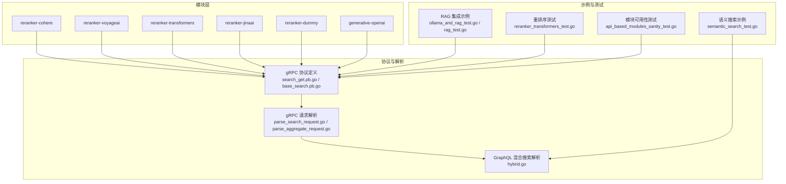
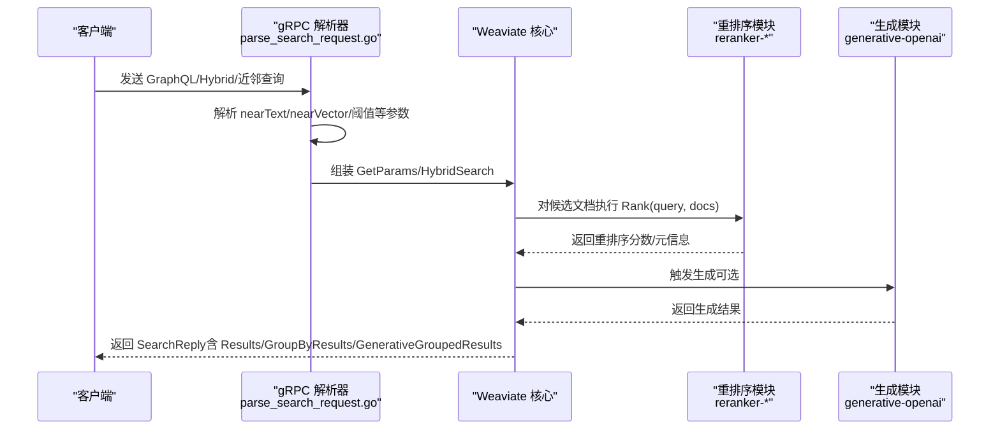
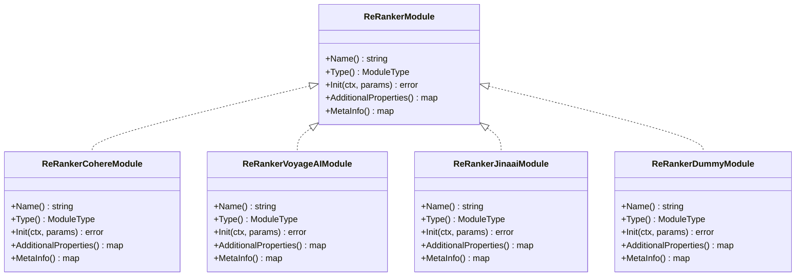
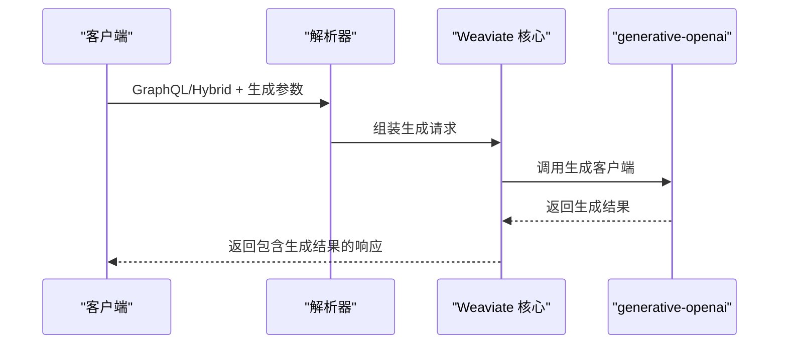
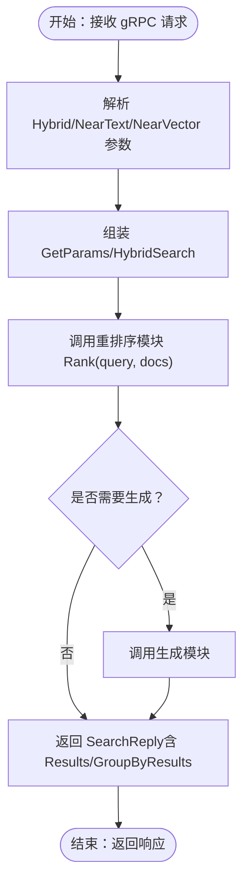
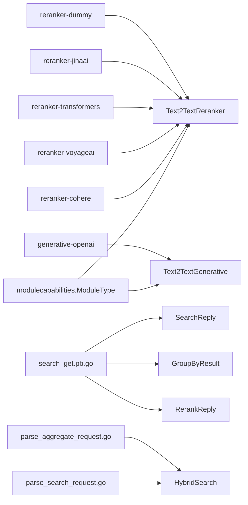

# 集成的 RAG 和重排序

<cite>
**本文引用的文件**
- [modules/reranker-cohere/module.go](file://modules/reranker-cohere/module.go)
- [modules/reranker-voyageai/module.go](file://modules/reranker-voyageai/module.go)
- [modules/reranker-transformers/module.go](file://modules/reranker-transformers/module.go)
- [modules/reranker-jinaai/module.go](file://modules/reranker-jinaai/module.go)
- [modules/reranker-dummy/module.go](file://modules/reranker-dummy/module.go)
- [modules/generative-openai/module.go](file://modules/generative-openai/module.go)
- [entities/modulecapabilities/module.go](file://entities/modulecapabilities/module.go)
- [grpc/generated/protocol/v1/search_get.pb.go](file://grpc/generated/protocol/v1/search_get.pb.go)
- [grpc/generated/protocol/v1/base_search.pb.go](file://grpc/generated/protocol/v1/base_search.pb.go)
- [adapters/handlers/grpc/v1/parse_search_request.go](file://adapters/handlers/grpc/v1/parse_search_request.go)
- [adapters/handlers/grpc/v1/parse_aggregate_request.go](file://adapters/handlers/grpc/v1/parse_aggregate_request.go)
- [adapters/handlers/graphql/local/common_filters/hybrid.go](file://adapters/handlers/graphql/local/common_filters/hybrid.go)
- [test/modules/reranker-transformers/reranker_transformers_test.go](file://test/modules/reranker-transformers/reranker_transformers_test.go)
- [test/modules/many-modules/api_based_modules_sanity_test.go](file://test/modules/many-modules/api_based_modules_sanity_test.go)
- [example/semantic_search_test.go](file://example/semantic_search_test.go)
- [example/ollama_and_rag_test.go](file://example/ollama_and_rag_test.go)
- [example/rag_test.go](file://example/rag_test.go)
- [README.md](file://README.md)
</cite>

## 目录
1. [简介](#简介)
2. [项目结构](#项目结构)
3. [核心组件](#核心组件)
4. [架构总览](#架构总览)
5. [详细组件分析](#详细组件分析)
6. [依赖关系分析](#依赖关系分析)
7. [性能考量](#性能考量)
8. [故障排查指南](#故障排查指南)
9. [结论](#结论)
10. [附录](#附录)

## 简介
本文件面向希望在 Weaviate 中集成检索增强生成（RAG）与重排序能力的开发者，系统阐述以下内容：
- RAG 系统的实现架构：检索、生成与后处理的完整流程
- 重排序算法的工作原理：基于相关性的排序、语义匹配优化与上下文感知排序
- 生成式模块的集成方式：OpenAI、Anthropic、Cohere 等主流生成模型的接入方法
- 完整的 RAG 应用示例：问答系统、对话助手与内容摘要
- 重排序模块的配置与优化：自定义重排序器的开发与集成
- 性能调优与成本控制策略

## 项目结构
Weaviate 将“检索”“生成”“重排序”等能力以模块化方式提供，核心模块包括：
- 重排序模块：reranker-cohere、reranker-voyageai、reranker-transformers、reranker-jinaai、reranker-dummy
- 生成模块：generative-openai 及其他生态厂商模块
- 搜索协议与解析：gRPC 协议定义与请求解析
- 示例与测试：语义搜索、RAG 集成、重排序验证

图表来源
- [modules/reranker-cohere/module.go](file://modules/reranker-cohere/module.go#L1-L87)
- [modules/reranker-voyageai/module.go](file://modules/reranker-voyageai/module.go#L1-L51)
- [modules/reranker-transformers/module.go](file://modules/reranker-transformers/module.go#L1-L103)
- [modules/reranker-jinaai/module.go](file://modules/reranker-jinaai/module.go#L49-L86)
- [modules/reranker-dummy/module.go](file://modules/reranker-dummy/module.go#L1-L85)
- [modules/generative-openai/module.go](file://modules/generative-openai/module.go#L1-L88)
- [grpc/generated/protocol/v1/search_get.pb.go](file://grpc/generated/protocol/v1/search_get.pb.go#L767-L909)
- [grpc/generated/protocol/v1/base_search.pb.go](file://grpc/generated/protocol/v1/base_search.pb.go#L506-L573)
- [adapters/handlers/grpc/v1/parse_search_request.go](file://adapters/handlers/grpc/v1/parse_search_request.go#L258-L303)
- [adapters/handlers/grpc/v1/parse_aggregate_request.go](file://adapters/handlers/grpc/v1/parse_aggregate_request.go#L263-L307)
- [adapters/handlers/graphql/local/common_filters/hybrid.go](file://adapters/handlers/graphql/local/common_filters/hybrid.go#L47-L79)
- [example/semantic_search_test.go](file://example/semantic_search_test.go#L1-L532)
- [example/ollama_and_rag_test.go](file://example/ollama_and_rag_test.go#L1-L112)
- [example/rag_test.go](file://example/rag_test.go#L1-L69)
- [test/modules/reranker-transformers/reranker_transformers_test.go](file://test/modules/reranker-transformers/reranker_transformers_test.go#L197-L253)
- [test/modules/many-modules/api_based_modules_sanity_test.go](file://test/modules/many-modules/api_based_modules_sanity_test.go#L1-L50)

章节来源
- [modules/reranker-cohere/module.go](file://modules/reranker-cohere/module.go#L1-L87)
- [modules/reranker-voyageai/module.go](file://modules/reranker-voyageai/module.go#L1-L51)
- [modules/reranker-transformers/module.go](file://modules/reranker-transformers/module.go#L1-L103)
- [modules/reranker-jinaai/module.go](file://modules/reranker-jinaai/module.go#L49-L86)
- [modules/reranker-dummy/module.go](file://modules/reranker-dummy/module.go#L1-L85)
- [modules/generative-openai/module.go](file://modules/generative-openai/module.go#L1-L88)
- [grpc/generated/protocol/v1/search_get.pb.go](file://grpc/generated/protocol/v1/search_get.pb.go#L767-L909)
- [grpc/generated/protocol/v1/base_search.pb.go](file://grpc/generated/protocol/v1/base_search.pb.go#L506-L573)
- [adapters/handlers/grpc/v1/parse_search_request.go](file://adapters/handlers/grpc/v1/parse_search_request.go#L258-L303)
- [adapters/handlers/grpc/v1/parse_aggregate_request.go](file://adapters/handlers/grpc/v1/parse_aggregate_request.go#L263-L307)
- [adapters/handlers/graphql/local/common_filters/hybrid.go](file://adapters/handlers/graphql/local/common_filters/hybrid.go#L47-L79)
- [example/semantic_search_test.go](file://example/semantic_search_test.go#L1-L532)
- [example/ollama_and_rag_test.go](file://example/ollama_and_rag_test.go#L1-L112)
- [example/rag_test.go](file://example/rag_test.go#L1-L69)
- [test/modules/reranker-transformers/reranker_transformers_test.go](file://test/modules/reranker-transformers/reranker_transformers_test.go#L197-L253)
- [test/modules/many-modules/api_based_modules_sanity_test.go](file://test/modules/many-modules/api_based_modules_sanity_test.go#L1-L50)

## 核心组件
- 模块类型与接口
  - 模块类型枚举定义了 Text2TextReranker、Text2TextGenerative 等能力类别
  - 模块需实现 Name、Init、Type 等接口，并可选择 AdditionalProperties、MetaProvider 等扩展能力
- 重排序模块
  - 支持 Cohere、VoyageAI、Transformers、JinaAI、Dummy 等实现
  - 统一通过 Rank(ctx, query, documents, cfg) 进行重排序，返回分数与元信息
- 生成模块
  - 以 OpenAI 为例，初始化时读取环境变量（如 OPENAI_APIKEY），构造客户端并注册 AdditionalGenerativeProperties
- gRPC 协议与解析
  - 搜索响应包含 Results、GroupByResults、GenerativeGroupedResults 等字段
  - Hybrid 搜索支持 nearText、nearVector、向量阈值等参数，解析逻辑负责组装为内部参数结构

章节来源
- [entities/modulecapabilities/module.go](file://entities/modulecapabilities/module.go#L24-L90)
- [modules/reranker-cohere/module.go](file://modules/reranker-cohere/module.go#L29-L87)
- [modules/reranker-voyageai/module.go](file://modules/reranker-voyageai/module.go#L29-L51)
- [modules/reranker-transformers/module.go](file://modules/reranker-transformers/module.go#L29-L103)
- [modules/reranker-jinaai/module.go](file://modules/reranker-jinaai/module.go#L49-L86)
- [modules/reranker-dummy/module.go](file://modules/reranker-dummy/module.go#L28-L85)
- [modules/generative-openai/module.go](file://modules/generative-openai/module.go#L27-L88)
- [grpc/generated/protocol/v1/search_get.pb.go](file://grpc/generated/protocol/v1/search_get.pb.go#L774-L850)
- [grpc/generated/protocol/v1/base_search.pb.go](file://grpc/generated/protocol/v1/base_search.pb.go#L506-L573)
- [adapters/handlers/grpc/v1/parse_search_request.go](file://adapters/handlers/grpc/v1/parse_search_request.go#L258-L303)
- [adapters/handlers/grpc/v1/parse_aggregate_request.go](file://adapters/handlers/grpc/v1/parse_aggregate_request.go#L263-L307)

## 架构总览
下图展示了从 GraphQL/gRPC 请求到重排序与生成的完整链路，以及关键数据结构之间的关系。

图表来源
- [adapters/handlers/grpc/v1/parse_search_request.go](file://adapters/handlers/grpc/v1/parse_search_request.go#L258-L303)
- [adapters/handlers/grpc/v1/parse_aggregate_request.go](file://adapters/handlers/grpc/v1/parse_aggregate_request.go#L263-L307)
- [grpc/generated/protocol/v1/search_get.pb.go](file://grpc/generated/protocol/v1/search_get.pb.go#L774-L850)
- [modules/reranker-cohere/module.go](file://modules/reranker-cohere/module.go#L53-L87)
- [modules/generative-openai/module.go](file://modules/generative-openai/module.go#L51-L88)

## 详细组件分析

### 重排序模块（Cohere/VoyageAI/Transformers/JinaAI/Dummy）
- 设计模式
  - 每个模块实现统一接口：Name、Type、Init、AdditionalProperties、MetaInfo
  - 初始化阶段读取环境变量或外部服务地址，构造具体客户端
  - 提供 AdditionalProperties，使 GraphQL/Hybrid 查询可附加 rerank 分数
- 关键流程
  - GraphQL/Hybrid 查询携带 rerank 参数时，解析器将参数传递给模块
  - 模块对候选文档列表执行 Rank(query, documents)，返回分数
  - gRPC 响应中包含 GroupByResult.rerank.score 字段

图表来源
- [modules/reranker-transformers/module.go](file://modules/reranker-transformers/module.go#L35-L103)
- [modules/reranker-cohere/module.go](file://modules/reranker-cohere/module.go#L35-L87)
- [modules/reranker-voyageai/module.go](file://modules/reranker-voyageai/module.go#L35-L51)
- [modules/reranker-jinaai/module.go](file://modules/reranker-jinaai/module.go#L49-L86)
- [modules/reranker-dummy/module.go](file://modules/reranker-dummy/module.go#L34-L85)

章节来源
- [modules/reranker-transformers/module.go](file://modules/reranker-transformers/module.go#L53-L103)
- [modules/reranker-cohere/module.go](file://modules/reranker-cohere/module.go#L53-L87)
- [modules/reranker-voyageai/module.go](file://modules/reranker-voyageai/module.go#L53-L51)
- [modules/reranker-jinaai/module.go](file://modules/reranker-jinaai/module.go#L53-L86)
- [modules/reranker-dummy/module.go](file://modules/reranker-dummy/module.go#L52-L85)
- [grpc/generated/protocol/v1/search_get.pb.go](file://grpc/generated/protocol/v1/search_get.pb.go#L896-L909)

### 生成模块（以 OpenAI 为例）
- 初始化与参数
  - 从环境变量读取 API Key、组织信息或 Azure 密钥
  - 构造客户端并注册 AdditionalGenerativeProperties，以便在查询中启用生成
- 调用链
  - 当 GraphQL/Hybrid 查询开启生成时，核心模块调用生成客户端
  - 生成结果封装在 GenerativeGroupedResults 或响应中的生成字段中

图表来源
- [modules/generative-openai/module.go](file://modules/generative-openai/module.go#L51-L88)
- [grpc/generated/protocol/v1/search_get.pb.go](file://grpc/generated/protocol/v1/search_get.pb.go#L774-L850)

章节来源
- [modules/generative-openai/module.go](file://modules/generative-openai/module.go#L51-L88)
- [grpc/generated/protocol/v1/search_get.pb.go](file://grpc/generated/protocol/v1/search_get.pb.go#L774-L850)

### 搜索与重排序工作流（gRPC）
- Hybrid 搜索参数解析
  - nearText、nearVector、向量阈值、融合算法等参数由解析器转换为内部结构
- 重排序与生成
  - 在候选集上执行 Rank，得到 rerank.score
  - 可选地触发生成，返回生成结果

图表来源
- [adapters/handlers/grpc/v1/parse_search_request.go](file://adapters/handlers/grpc/v1/parse_search_request.go#L258-L303)
- [adapters/handlers/grpc/v1/parse_aggregate_request.go](file://adapters/handlers/grpc/v1/parse_aggregate_request.go#L263-L307)
- [grpc/generated/protocol/v1/base_search.pb.go](file://grpc/generated/protocol/v1/base_search.pb.go#L506-L573)
- [grpc/generated/protocol/v1/search_get.pb.go](file://grpc/generated/protocol/v1/search_get.pb.go#L774-L850)

章节来源
- [adapters/handlers/grpc/v1/parse_search_request.go](file://adapters/handlers/grpc/v1/parse_search_request.go#L258-L303)
- [adapters/handlers/grpc/v1/parse_aggregate_request.go](file://adapters/handlers/grpc/v1/parse_aggregate_request.go#L263-L307)
- [grpc/generated/protocol/v1/base_search.pb.go](file://grpc/generated/protocol/v1/base_search.pb.go#L506-L573)
- [grpc/generated/protocol/v1/search_get.pb.go](file://grpc/generated/protocol/v1/search_get.pb.go#L774-L850)

### RAG 应用示例
- 问答系统
  - 使用 GraphQL nearText/nearObject/hybrid 检索相关文档
  - 结合生成模块（如 OpenAI/Ollama）对上下文进行回答生成
- 对话助手
  - 基于 Hybrid 搜索 + 生成，实现多轮上下文检索与生成
- 内容摘要
  - 利用总结模块（sum-*）对长文档进行摘要（与重排序配合提升质量）

章节来源
- [example/semantic_search_test.go](file://example/semantic_search_test.go#L1-L532)
- [example/ollama_and_rag_test.go](file://example/ollama_and_rag_test.go#L1-L112)
- [example/rag_test.go](file://example/rag_test.go#L1-L69)

## 依赖关系分析
- 模块类型与能力
  - Text2TextReranker：reranker-* 模块
  - Text2TextGenerative：generative-* 模块
  - 模块通过 AdditionalProperties 暴露额外属性（如 rerank 分数），通过 MetaInfo 提供文档链接
- 协议与解析
  - gRPC 协议定义了 SearchReply、GroupByResult、RerankReply 等结构
  - 解析器将 GraphQL/Hybrid 参数映射为内部 GetParams/HybridSearch

图表来源
- [entities/modulecapabilities/module.go](file://entities/modulecapabilities/module.go#L24-L90)
- [modules/reranker-cohere/module.go](file://modules/reranker-cohere/module.go#L49-L51)
- [modules/reranker-voyageai/module.go](file://modules/reranker-voyageai/module.go#L49-L51)
- [modules/reranker-transformers/module.go](file://modules/reranker-transformers/module.go#L49-L51)
- [modules/reranker-jinaai/module.go](file://modules/reranker-jinaai/module.go#L49-L51)
- [modules/reranker-dummy/module.go](file://modules/reranker-dummy/module.go#L48-L50)
- [modules/generative-openai/module.go](file://modules/generative-openai/module.go#L47-L49)
- [grpc/generated/protocol/v1/search_get.pb.go](file://grpc/generated/protocol/v1/search_get.pb.go#L774-L909)
- [adapters/handlers/grpc/v1/parse_search_request.go](file://adapters/handlers/grpc/v1/parse_search_request.go#L258-L303)
- [adapters/handlers/grpc/v1/parse_aggregate_request.go](file://adapters/handlers/grpc/v1/parse_aggregate_request.go#L263-L307)

章节来源
- [entities/modulecapabilities/module.go](file://entities/modulecapabilities/module.go#L24-L90)
- [grpc/generated/protocol/v1/search_get.pb.go](file://grpc/generated/protocol/v1/search_get.pb.go#L774-L909)
- [adapters/handlers/grpc/v1/parse_search_request.go](file://adapters/handlers/grpc/v1/parse_search_request.go#L258-L303)
- [adapters/handlers/grpc/v1/parse_aggregate_request.go](file://adapters/handlers/grpc/v1/parse_aggregate_request.go#L263-L307)

## 性能考量
- 检索阶段
  - 合理设置 Hybrid 的 alpha、融合算法与阈值，平衡 BM25 与向量检索
  - 使用 nearText/nearVector 精准缩小候选集，降低后续重排序与生成成本
- 重排序阶段
  - 优先对候选集进行预筛选（如 autocut/阈值），减少 Rank 调用次数
  - Transformers 重排序器支持等待启动（RERANKER_WAIT_FOR_STARTUP），避免冷启动抖动
- 生成阶段
  - 控制上下文长度与生成参数（温度、最大 token），避免过度生成
  - 对高频生成请求考虑缓存与限流策略
- 网络与超时
  - 模块初始化时传入 HTTP 超时，确保外部服务异常时快速失败

章节来源
- [adapters/handlers/grpc/v1/parse_search_request.go](file://adapters/handlers/grpc/v1/parse_search_request.go#L258-L303)
- [adapters/handlers/grpc/v1/parse_aggregate_request.go](file://adapters/handlers/grpc/v1/parse_aggregate_request.go#L263-L307)
- [modules/reranker-transformers/module.go](file://modules/reranker-transformers/module.go#L63-L86)
- [modules/generative-openai/module.go](file://modules/generative-openai/module.go#L60-L72)

## 故障排查指南
- 重排序未生效
  - 确认已启用对应 reranker-* 模块并在查询中开启 rerank
  - 检查 GroupByResult.rerank 是否存在分数
- 生成结果为空
  - 确认已启用 generative-* 模块并正确配置 API Key
  - 检查 GraphQL/Hybrid 查询中是否显式开启生成
- 混合搜索异常
  - 核对 nearText/nearVector/targetVectors 配置是否一致
  - 检查阈值与融合算法参数是否合理
- 模块不可用
  - 通过元信息接口检查模块是否被加载（api-based 模块可用性测试）

章节来源
- [test/modules/reranker-transformers/reranker_transformers_test.go](file://test/modules/reranker-transformers/reranker_transformers_test.go#L197-L253)
- [test/modules/many-modules/api_based_modules_sanity_test.go](file://test/modules/many-modules/api_based_modules_sanity_test.go#L22-L50)
- [grpc/generated/protocol/v1/search_get.pb.go](file://grpc/generated/protocol/v1/search_get.pb.go#L896-L909)

## 结论
Weaviate 通过模块化设计将“检索—重排序—生成”三阶段能力解耦，既保证了灵活性，也便于扩展与优化。结合 gRPC 协议与 GraphQL 解析器，开发者可以轻松构建从问答到对话再到摘要的多样化 RAG 应用；通过合理的参数与性能策略，可在保证质量的同时控制成本与延迟。

## 附录
- 官方演示与教程
  - Weaviate 提供多种演示项目与配方仓库，涵盖 RAG、搜索与推荐等场景
- 常用环境变量
  - OPENAI_APIKEY、OPENAI_ORGANIZATION、AZURE_APIKEY
  - COHERE_APIKEY、JINAAI_APIKEY
  - RERANKER_INFERENCE_API、RERANKER_WAIT_FOR_STARTUP

章节来源
- [README.md](file://README.md#L128-L144)
- [modules/generative-openai/module.go](file://modules/generative-openai/module.go#L63-L67)
- [modules/reranker-cohere/module.go](file://modules/reranker-cohere/module.go#L66-L67)
- [modules/reranker-jinaai/module.go](file://modules/reranker-jinaai/module.go#L66-L67)
- [modules/reranker-transformers/module.go](file://modules/reranker-transformers/module.go#L66-L77)