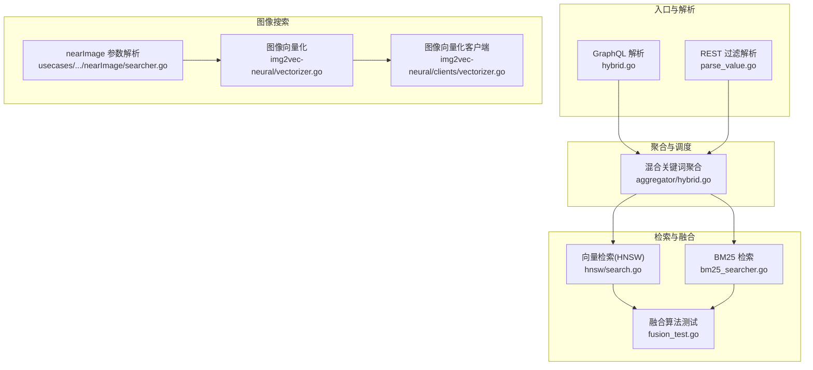
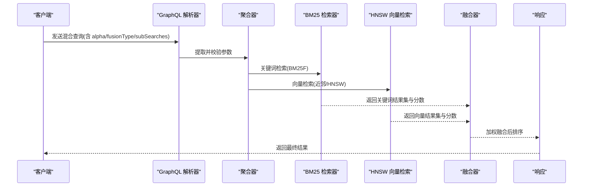
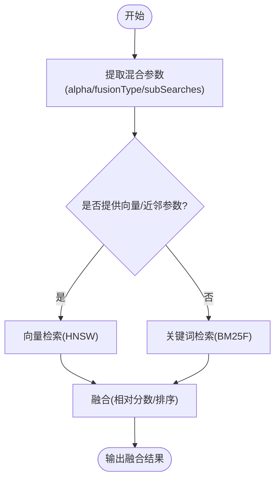
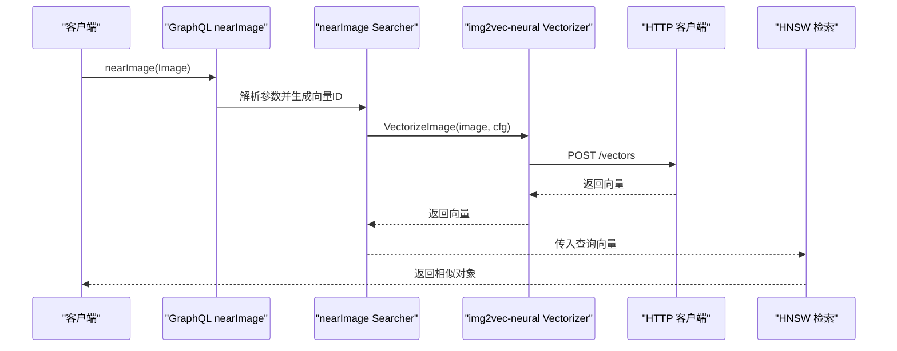
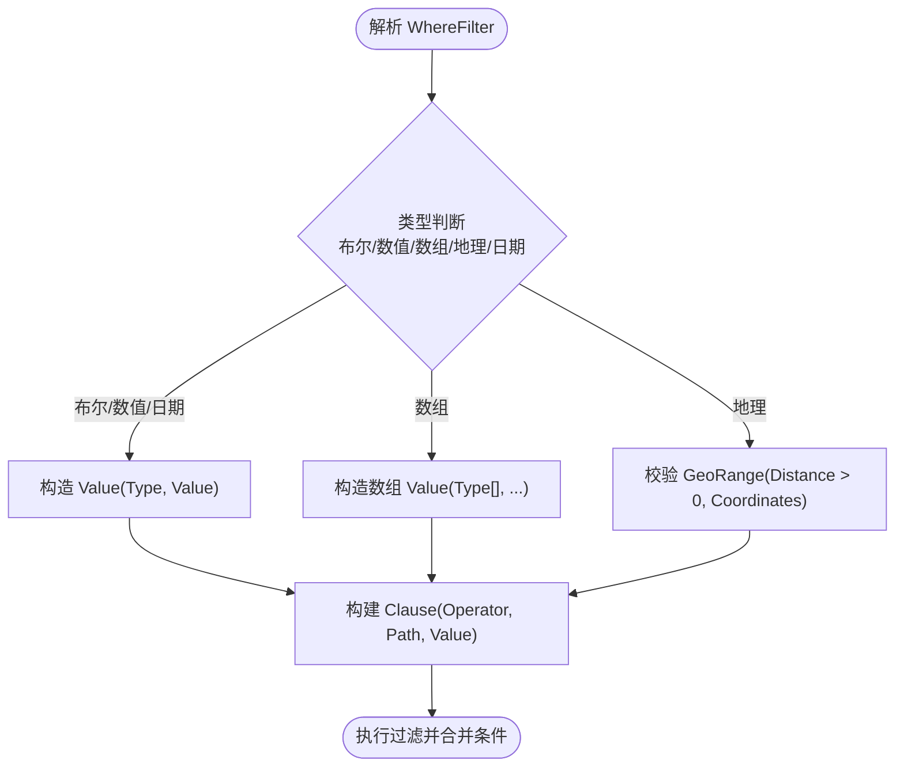
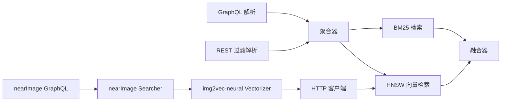

# 高级混合和图像搜索

<cite>
**本文引用的文件**
- [hybrid.go](file://adapters/handlers/graphql/local/common_filters/hybrid.go)
- [filters.go](file://entities/filters/filters.go)
- [parse_value.go](file://adapters/handlers/rest/filterext/parse_value.go)
- [hybrid.go](file://adapters/repos/db/aggregator/hybrid.go)
- [bm25_searcher.go](file://adapters/repos/db/inverted/bm25_searcher.go)
- [bm25_searcher_block.go](file://adapters/repos/db/inverted/bm25_searcher_block.go)
- [searcher.go](file://usecases/modulecomponents/arguments/nearImage/searcher.go)
- [vectorizer.go](file://modules/img2vec-neural/vectorizer/vectorizer.go)
- [vectorizer.go](file://modules/img2vec-neural/clients/vectorizer.go)
- [nearImage.go](file://modules/img2vec-neural/nearImage.go)
- [search.go](file://adapters/repos/db/vector/hnsw/search.go)
- [flat_search.go](file://adapters/repos/db/vector/hnsw/flat_search.go)
- [index.go](file://adapters/repos/db/vector/hnsw/index.go)
- [fusion_test.go](file://usecases/traverser/hybrid/fusion_test.go)
- [hybrid_search_test.go](file://adapters/repos/db/hybrid_search_test.go)
- [bm25f_test.go](file://adapters/repos/db/bm25f_test.go)
- [traverser_get_params_test.go](file://usecases/traverser/traverser_get_params_test.go)
</cite>

## 目录
1. [引言](#引言)
2. [项目结构](#项目结构)
3. [核心组件](#核心组件)
4. [架构总览](#架构总览)
5. [详细组件分析](#详细组件分析)
6. [依赖关系分析](#依赖关系分析)
7. [性能考量](#性能考量)
8. [故障排查指南](#故障排查指南)
9. [结论](#结论)
10. [附录：查询示例与最佳实践](#附录查询示例与最佳实践)

## 引言
本文件面向希望在 Weaviate 中实现“高级混合搜索（语义+关键词）”与“图像搜索（基于视觉向量）”的开发者，系统阐述以下主题：
- 混合搜索的融合机制：语义向量检索与 BM25 关键词检索的加权融合、权重调节与结果排序策略
- 图像搜索的技术实现：图像向量化、视觉相似性计算与图像数据库管理
- 高级过滤能力：布尔过滤、数值范围过滤、地理围栏过滤与复合条件过滤
- 查询示例与最佳实践：如何组合不同搜索策略以获得最优结果
- 性能优化建议与复杂度分析：帮助构建高效稳定的搜索应用

## 项目结构
Weaviate 将混合与图像搜索能力分布在多个层次：
- GraphQL/REST 层负责解析用户输入，提取混合搜索参数与过滤器
- 聚合层将混合查询拆分为语义与关键词子查询，并准备目标向量
- 检索层分别执行向量近邻搜索与 BM25 关键词搜索
- 融合层对多路结果进行加权融合与重排
- 图像模块通过 nearImage 参数将图像转换为向量，参与向量检索

图表来源
- [hybrid.go](file://adapters/handlers/graphql/local/common_filters/hybrid.go#L30-L188)
- [parse_value.go](file://adapters/handlers/rest/filterext/parse_value.go#L112-L155)
- [aggregator/hybrid.go](file://adapters/repos/db/aggregator/hybrid.go#L26-L65)
- [bm25_searcher.go](file://adapters/repos/db/inverted/bm25_searcher.go#L239-L448)
- [hnsw/search.go](file://adapters/repos/db/vector/hnsw/search.go#L78-L92)
- [fusion_test.go](file://usecases/traverser/hybrid/fusion_test.go#L25-L39)
- [usecases/.../nearImage/searcher.go](file://usecases/modulecomponents/arguments/nearImage/searcher.go#L29-L41)
- [img2vec-neural/vectorizer.go](file://modules/img2vec-neural/vectorizer/vectorizer.go#L44-L57)
- [img2vec-neural/clients/vectorizer.go](file://modules/img2vec-neural/clients/vectorizer.go#L44-L87)

章节来源
- [hybrid.go](file://adapters/handlers/graphql/local/common_filters/hybrid.go#L30-L188)
- [aggregator/hybrid.go](file://adapters/repos/db/aggregator/hybrid.go#L26-L65)

## 核心组件
- 混合搜索参数提取与校验：从 GraphQL 请求中提取混合查询参数（alpha、fusionType、subSearches、properties 等），并进行类型与取值范围校验
- 关键词检索（BM25F）：根据类属性自动选择可检索文本字段，执行 WAND/Top-K 合并与排序
- 向量检索（HNSW）：支持单向量与多向量搜索，按距离或内积度量，支持压缩与归一化
- 结果融合：相对分数融合与排序融合两种策略，支持权重调节与截断阈值
- 图像搜索：nearImage 参数将图像编码为向量，参与向量检索流程
- 高级过滤：支持布尔、数值、数组、地理围栏等类型的过滤，支持嵌套与复合条件

章节来源
- [hybrid.go](file://adapters/handlers/graphql/local/common_filters/hybrid.go#L30-L188)
- [bm25_searcher.go](file://adapters/repos/db/inverted/bm25_searcher.go#L239-L448)
- [hnsw/search.go](file://adapters/repos/db/vector/hnsw/search.go#L78-L92)
- [usecases/.../nearImage/searcher.go](file://usecases/modulecomponents/arguments/nearImage/searcher.go#L29-L41)
- [filters.go](file://entities/filters/filters.go#L21-L165)

## 架构总览
下图展示了从请求到结果的端到端路径，重点标注了混合与图像搜索的关键节点。

图表来源
- [hybrid.go](file://adapters/handlers/graphql/local/common_filters/hybrid.go#L30-L188)
- [aggregator/hybrid.go](file://adapters/repos/db/aggregator/hybrid.go#L26-L65)
- [bm25_searcher.go](file://adapters/repos/db/inverted/bm25_searcher.go#L239-L448)
- [hnsw/search.go](file://adapters/repos/db/vector/hnsw/search.go#L78-L92)
- [fusion_test.go](file://usecases/traverser/hybrid/fusion_test.go#L25-L39)

## 详细组件分析

### 混合搜索：语义与 BM25 的融合
- 参数提取与校验
  - 支持 alpha 权重（默认值）、融合类型（相对分数/排序融合）、子查询权重与类型（bm25、nearText、nearVector）
  - 对 vector 与 nearText/nearVector 的互斥进行严格校验
- 关键词检索（BM25F）
  - 自动选择文本/字符串属性作为检索域
  - 使用 WAND 算法与 Top-K 合并，支持最小 OR 匹配数与搜索操作符
- 向量检索（HNSW）
  - 支持归一化与压缩配置，按距离或内核度量进行近邻搜索
- 融合策略
  - 相对分数融合：对各路结果的分数做归一化加权再排序
  - 排序融合：按各自排序位置进行加权，适合不同检索器规模差异较大时
  - 测试用例覆盖多种权重与空结果场景，验证稳定性

图表来源
- [hybrid.go](file://adapters/handlers/graphql/local/common_filters/hybrid.go#L30-L188)
- [aggregator/hybrid.go](file://adapters/repos/db/aggregator/hybrid.go#L26-L65)
- [bm25_searcher.go](file://adapters/repos/db/inverted/bm25_searcher.go#L239-L448)
- [hnsw/search.go](file://adapters/repos/db/vector/hnsw/search.go#L78-L92)
- [fusion_test.go](file://usecases/traverser/hybrid/fusion_test.go#L25-L39)

章节来源
- [hybrid.go](file://adapters/handlers/graphql/local/common_filters/hybrid.go#L30-L188)
- [aggregator/hybrid.go](file://adapters/repos/db/aggregator/hybrid.go#L26-L65)
- [bm25_searcher.go](file://adapters/repos/db/inverted/bm25_searcher.go#L239-L448)
- [hnsw/search.go](file://adapters/repos/db/vector/hnsw/search.go#L78-L92)
- [fusion_test.go](file://usecases/traverser/hybrid/fusion_test.go#L25-L39)

### 图像搜索：nearImage 向量检索
- nearImage 参数解析
  - 在 GraphQL 层将图像数据转换为向量，作为向量检索的一部分
- 图像向量化
  - 通过 img2vec-neural 模块调用外部服务或本地模型生成向量
  - 客户端封装 HTTP 请求，返回向量与维度信息
- 参与向量检索
  - 生成的向量进入 HNSW 近邻搜索流程，与文本向量共享同一检索管道

图表来源
- [usecases/.../nearImage/searcher.go](file://usecases/modulecomponents/arguments/nearImage/searcher.go#L29-L41)
- [img2vec-neural/vectorizer.go](file://modules/img2vec-neural/vectorizer/vectorizer.go#L44-L57)
- [img2vec-neural/clients/vectorizer.go](file://modules/img2vec-neural/clients/vectorizer.go#L44-L87)
- [hnsw/search.go](file://adapters/repos/db/vector/hnsw/search.go#L78-L92)

章节来源
- [usecases/.../nearImage/searcher.go](file://usecases/modulecomponents/arguments/nearImage/searcher.go#L29-L41)
- [img2vec-neural/vectorizer.go](file://modules/img2vec-neural/vectorizer/vectorizer.go#L44-L57)
- [img2vec-neural/clients/vectorizer.go](file://modules/img2vec-neural/clients/vectorizer.go#L44-L87)
- [hnsw/search.go](file://adapters/repos/db/vector/hnsw/search.go#L78-L92)

### 高级过滤：布尔/数值/地理/复合条件
- 过滤器定义
  - 支持等于/不等于/大于/小于/与/或/包含任意/包含全部/围栏/模糊匹配/为空等操作符
  - 值类型与路径解析，支持嵌套过滤
- REST/GraphQL 解析
  - REST 层对 WhereFilter 的数组与地理围栏进行校验与转换
  - GraphQL 层对布尔/数组/日期/地理等类型进行解析与错误提示
- 执行阶段
  - 过滤器在检索前对候选集进行筛选，减少后续向量/关键词计算成本

图表来源
- [filters.go](file://entities/filters/filters.go#L21-L165)
- [parse_value.go](file://adapters/handlers/rest/filterext/parse_value.go#L112-L155)
- [traverser_get_params_test.go](file://usecases/traverser/traverser_get_params_test.go#L400-L747)

章节来源
- [filters.go](file://entities/filters/filters.go#L21-L165)
- [parse_value.go](file://adapters/handlers/rest/filterext/parse_value.go#L112-L155)
- [traverser_get_params_test.go](file://usecases/traverser/traverser_get_params_test.go#L400-L747)

## 依赖关系分析
- 混合搜索依赖
  - GraphQL 解析层 -> 聚合层 -> BM25 检索器 -> HNSW 向量检索 -> 融合器
- 图像搜索依赖
  - GraphQL nearImage -> nearImage Searcher -> img2vec-neural Vectorizer -> HTTP 客户端 -> HNSW
- 过滤依赖
  - REST/GraphQL 解析 -> 过滤器 AST -> 检索前筛选

图表来源
- [hybrid.go](file://adapters/handlers/graphql/local/common_filters/hybrid.go#L30-L188)
- [aggregator/hybrid.go](file://adapters/repos/db/aggregator/hybrid.go#L26-L65)
- [bm25_searcher.go](file://adapters/repos/db/inverted/bm25_searcher.go#L239-L448)
- [hnsw/search.go](file://adapters/repos/db/vector/hnsw/search.go#L78-L92)
- [usecases/.../nearImage/searcher.go](file://usecases/modulecomponents/arguments/nearImage/searcher.go#L29-L41)
- [img2vec-neural/vectorizer.go](file://modules/img2vec-neural/vectorizer/vectorizer.go#L44-L57)
- [img2vec-neural/clients/vectorizer.go](file://modules/img2vec-neural/clients/vectorizer.go#L44-L87)

章节来源
- [hybrid.go](file://adapters/handlers/graphql/local/common_filters/hybrid.go#L30-L188)
- [aggregator/hybrid.go](file://adapters/repos/db/aggregator/hybrid.go#L26-L65)
- [bm25_searcher.go](file://adapters/repos/db/inverted/bm25_searcher.go#L239-L448)
- [hnsw/search.go](file://adapters/repos/db/vector/hnsw/search.go#L78-L92)
- [usecases/.../nearImage/searcher.go](file://usecases/modulecomponents/arguments/nearImage/searcher.go#L29-L41)
- [img2vec-neural/vectorizer.go](file://modules/img2vec-neural/vectorizer/vectorizer.go#L44-L57)
- [img2vec-neural/clients/vectorizer.go](file://modules/img2vec-neural/clients/vectorizer.go#L44-L87)

## 性能考量
- 向量检索（HNSW）
  - 归一化与压缩配置影响精度与吞吐；cosine-dot 场景需归一化
  - EF/EFc 计算因子与上下限控制召回与延迟权衡
  - 允许列表与扁平搜索阈值在小候选集时切换到扁平搜索
- 关键词检索（BM25F）
  - WAND 与 Top-K 合并减少全表扫描；最小 OR 匹配数与属性选择影响召回
  - 平均属性长度的健壮性处理避免 NaN/零导致的分数异常
- 融合
  - 相对分数融合对不同尺度分数更稳健；排序融合在规模差异大时更合适
  - alpha 权重与融合类型直接影响最终排序质量与性能
- 图像搜索
  - 远程向量化服务的超时与错误处理需纳入整体 SLA
  - 大批量 nearImage 查询建议批量化与缓存

章节来源
- [hnsw/search.go](file://adapters/repos/db/vector/hnsw/search.go#L44-L76)
- [hnsw/flat_search.go](file://adapters/repos/db/vector/hnsw/flat_search.go#L28-L47)
- [hnsw/index.go](file://adapters/repos/db/vector/hnsw/index.go#L890-L943)
- [bm25_searcher.go](file://adapters/repos/db/inverted/bm25_searcher.go#L239-L448)
- [bm25_searcher_block.go](file://adapters/repos/db/inverted/bm25_searcher_block.go#L240-L266)
- [img2vec-neural/clients/vectorizer.go](file://modules/img2vec-neural/clients/vectorizer.go#L34-L42)

## 故障排查指南
- 混合查询参数错误
  - vector 与 nearText/nearVector 互斥；alpha 必须在 [0,1]；fusionType 未设置使用默认
- BM25F 行为异常
  - 属性平均长度为 NaN/0 时采用默认值；最小 OR 匹配数过大导致无结果
- nearImage 向量化失败
  - HTTP 客户端超时/状态码错误；返回体解析失败
- 过滤器无效
  - 数组/地理围栏字段缺失或非法；类型与值不匹配

章节来源
- [hybrid.go](file://adapters/handlers/graphql/local/common_filters/hybrid.go#L113-L187)
- [bm25_searcher.go](file://adapters/repos/db/inverted/bm25_searcher.go#L227-L236)
- [parse_value.go](file://adapters/handlers/rest/filterext/parse_value.go#L140-L155)
- [img2vec-neural/clients/vectorizer.go](file://modules/img2vec-neural/clients/vectorizer.go#L77-L87)

## 结论
Weaviate 的高级混合与图像搜索通过清晰的分层设计实现了高扩展性与高性能：
- 混合搜索以参数驱动，融合策略灵活，适配多模态与多来源检索
- BM25F 与 HNSW 各司其职，结合过滤器在大规模数据上保持稳定表现
- nearImage 将图像无缝接入向量检索，统一了多模态相似性计算
- 建议在生产环境中结合业务场景调整 alpha、融合类型与过滤策略，并关注远程向量化服务的可用性与延迟

## 附录：查询示例与最佳实践
- 混合搜索最佳实践
  - 使用相对分数融合时，确保两路检索规模相近；当向量检索规模远大于 BM25 时，考虑排序融合
  - alpha 默认值通常有效，但应依据业务语料与目标进行 A/B 调优
  - 子查询权重与类型需与业务目标一致（如强调关键词召回或语义相关性）
  - 使用 properties 显式限定 BM25 检索字段，减少无关噪声
- 图像搜索最佳实践
  - nearImage 与 nearText/nearVector 可组合，但需注意向量维度与度量一致性
  - 远程向量化服务建议开启超时与重试策略，避免拖慢主查询
  - 对高频图像向量可考虑本地缓存或离线预计算
- 过滤器最佳实践
  - 优先使用布尔/数值/地理等精确过滤缩小候选集
  - 嵌套过滤建议保持简洁，避免过深的逻辑层级
  - 地理围栏必须提供正的距离上限与坐标字段

章节来源
- [hybrid.go](file://adapters/handlers/graphql/local/common_filters/hybrid.go#L30-L188)
- [bm25f_test.go](file://adapters/repos/db/bm25f_test.go#L405-L433)
- [hybrid_search_test.go](file://adapters/repos/db/hybrid_search_test.go#L434-L464)
- [traverser_get_params_test.go](file://usecases/traverser/traverser_get_params_test.go#L400-L747)