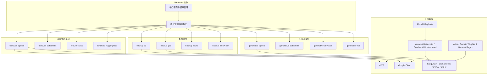
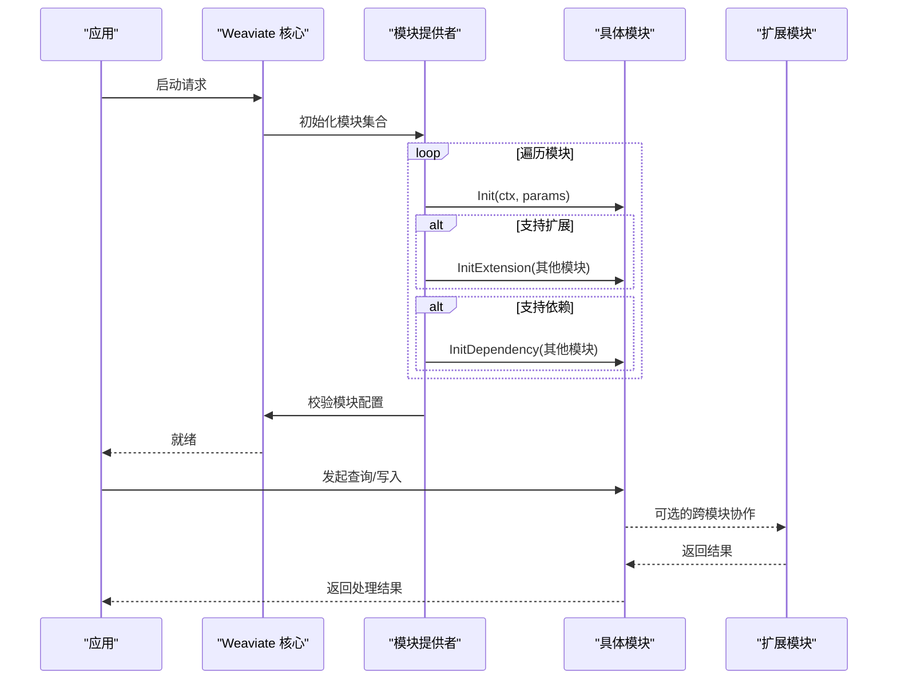
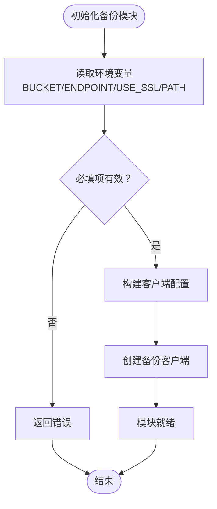
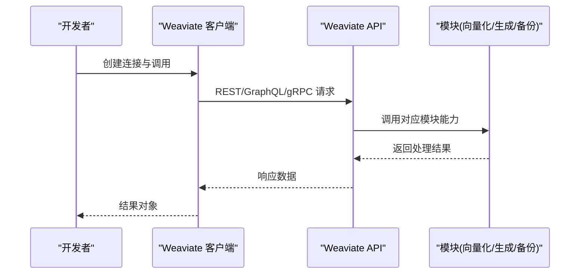
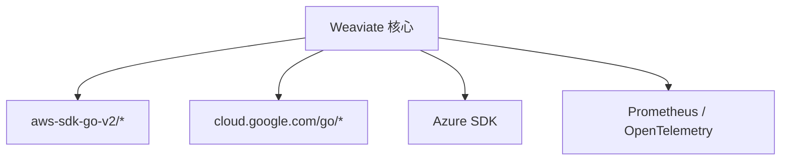

# 生态系统与合作伙伴

<cite>
**本文引用的文件**
- [README.md](file://README.md)
- [go.mod](file://go.mod)
- [entities/modulecapabilities/module.go](file://entities/modulecapabilities/module.go)
- [usecases/modules/modules.go](file://usecases/modules/modules.go)
- [adapters/handlers/rest/configure_api.go](file://adapters/handlers/rest/configure_api.go)
- [modules/text2vec-openai/module.go](file://modules/text2vec-openai/module.go)
- [modules/text2vec-openai/config.go](file://modules/text2vec-openai/config.go)
- [modules/generative-openai/module.go](file://modules/generative-openai/module.go)
- [modules/generative-openai/config.go](file://modules/generative-openai/config.go)
- [modules/generative-openai/clients/openai_meta.go](file://modules/generative-openai/clients/openai_meta.go)
- [modules/generative-databricks/clients/databricks_meta.go](file://modules/generative-databricks/clients/databricks_meta.go)
- [modules/generative-anyscale/clients/anyscale_meta.go](file://modules/generative-anyscale/clients/anyscale_meta.go)
- [modules/generative-xai/clients/xai_meta.go](file://modules/generative-xai/clients/xai_meta.go)
- [modules/backup-s3/module.go](file://modules/backup-s3/module.go)
- [modules/backup-s3/config.go](file://modules/backup-s3/config.go)
- [modules/backup-azure/module.go](file://modules/backup-azure/module.go)
- [modules/backup-gcs/module.go](file://modules/backup-gcs/module.go)
- [modules/backup-filesystem/module.go](file://modules/backup-filesystem/module.go)
- [client/weaviate_client.go](file://client/weaviate_client.go)
- [example/rag_test.go](file://example/rag_test.go)
- [example/ollama_and_rag_test.go](file://example/ollama_and_rag_test.go)
- [.github/workflows/pull_requests.yaml](file://.github/workflows/pull_requests.yaml)
</cite>

## 目录
1. [简介](#简介)
2. [项目结构](#项目结构)
3. [核心组件](#核心组件)
4. [架构总览](#架构总览)
5. [详细组件分析](#详细组件分析)
6. [依赖关系分析](#依赖关系分析)
7. [性能考量](#性能考量)
8. [故障排查指南](#故障排查指南)
9. [结论](#结论)
10. [附录](#附录)

## 简介
本文件面向 Weaviate 向量数据库的生态系统与合作伙伴，系统梳理其模块化架构如何支撑向量化器、生成式模块、备份模块、客户端库与各类外部集成平台的协同工作，并给出与云平台（AWS、Google Cloud）、计算基础设施（Modal、Replicate）、数据平台（Airbyte、Databricks）、LLM 与代理框架（LangChain、LlamaIndex）、运维工具（Arize、Comet）等的对接方式与最佳实践。文档同时总结 Weaviate 的演进趋势与发展方向，帮助用户构建完整的 AI 应用解决方案。

## 项目结构
Weaviate 采用模块化设计，核心能力通过独立模块实现并动态加载。典型模块包括：
- 向量化器模块：text2vec-* 系列（如 OpenAI、HuggingFace、AWS Bedrock、Databricks 等）
- 生成式模块：generative-* 系列（如 OpenAI、Anthropic、Databricks、Anyscale、xAI 等）
- 备份模块：backup-s3、backup-gcs、backup-azure、backup-filesystem
- 客户端库：REST/GraphQL/gRPC 客户端与多语言 SDK
- 集成平台：云平台、计算基础设施、数据平台、LLM/代理框架、运维工具



图表来源
- [entities/modulecapabilities/module.go](file://entities/modulecapabilities/module.go#L24-L43)
- [usecases/modules/modules.go](file://usecases/modules/modules.go#L138-L179)
- [modules/text2vec-openai/module.go](file://modules/text2vec-openai/module.go#L33-L68)
- [modules/generative-openai/module.go](file://modules/generative-openai/module.go#L47-L49)
- [modules/backup-s3/module.go](file://modules/backup-s3/module.go#L66-L68)
- [README.md](file://README.md#L160-L170)

章节来源
- [README.md](file://README.md#L160-L170)
- [go.mod](file://go.mod#L3-L106)

## 核心组件
- 模块类型与接口
  - 模块类型覆盖 Text2Vec、Text2TextGenerative、Backup、Offload、Usage 等
  - 模块生命周期包含 Init、InitExtension、InitDependency、MetaInfo 等
- 模块初始化流程
  - Provider 统一调用各模块 Init；随后尝试 InitExtension 与 InitDependency
  - 若存在多个向量化器，会触发相关限制提示
- 客户端库与 API
  - 提供 REST、GraphQL、gRPC 客户端，覆盖认证、备份、批量写入、模式管理等能力

章节来源
- [entities/modulecapabilities/module.go](file://entities/modulecapabilities/module.go#L24-L43)
- [usecases/modules/modules.go](file://usecases/modules/modules.go#L138-L179)
- [client/weaviate_client.go](file://client/weaviate_client.go#L141-L173)

## 架构总览
Weaviate 的模块化架构通过统一的模块接口与初始化流程，将外部能力以插件形式接入。模块之间通过扩展与依赖机制相互协作，形成“向量化 + 生成 + 备份 + 运维”的完整生态闭环。



图表来源
- [usecases/modules/modules.go](file://usecases/modules/modules.go#L138-L179)
- [entities/modulecapabilities/module.go](file://entities/modulecapabilities/module.go#L45-L71)

## 详细组件分析

### 向量化器模块（text2vec-*）
- OpenAI 向量化器
  - 模块类型：Text2ManyVec
  - 支持环境变量配置（如 OPENAI_APIKEY、OPENAI_ORGANIZATION、AZURE_APIKEY）
  - 提供对象/文本向量化、批处理、元信息查询等能力
- Databricks、AWS、HuggingFace 等向量化器
  - 通过统一接口接入，遵循相同的模块生命周期与配置校验流程

```mermaid
classDiagram
class OpenAIModule {
+Name() string
+Type() ModuleType
+Init(ctx, params) error
+InitExtension(modules) error
+VectorizeObject(...)
+VectorizeBatch(...)
+MetaInfo() map[string]interface{}
}
class Text2VecInterface {
<<interface>>
+Object(...)
+Texts(...)
+MetaInfo()
}
OpenAIModule ..|> Text2VecInterface
```

图表来源
- [modules/text2vec-openai/module.go](file://modules/text2vec-openai/module.go#L48-L84)
- [modules/text2vec-openai/module.go](file://modules/text2vec-openai/module.go#L128-L161)
- [entities/modulecapabilities/module.go](file://entities/modulecapabilities/module.go#L24-L43)

章节来源
- [modules/text2vec-openai/module.go](file://modules/text2vec-openai/module.go#L33-L68)
- [modules/text2vec-openai/config.go](file://modules/text2vec-openai/config.go#L25-L47)

### 生成式模块（generative-*）
- OpenAI 生成式模块
  - 模块类型：Text2TextGenerative
  - 提供额外参数（AdditionalGenerativeProperties）与元信息（MetaInfo）
- Databricks、Anyscale、xAI 等生成式模块
  - 通过统一接口暴露生成能力，便于与查询/重排序等模块组合

```mermaid
classDiagram
class GenerativeOpenAIModule {
+Name() string
+Type() ModuleType
+Init(ctx, params) error
+MetaInfo() map[string]interface{}
+AdditionalGenerativeProperties() map[string]...
}
class GenerativeClient {
<<interface>>
+Generate(...)
+MetaInfo()
}
GenerativeOpenAIModule ..|> GenerativeClient
```

图表来源
- [modules/generative-openai/module.go](file://modules/generative-openai/module.go#L29-L58)
- [modules/generative-openai/module.go](file://modules/generative-openai/module.go#L74-L80)
- [entities/modulecapabilities/module.go](file://entities/modulecapabilities/module.go#L24-L43)

章节来源
- [modules/generative-openai/module.go](file://modules/generative-openai/module.go#L47-L49)
- [modules/generative-openai/config.go](file://modules/generative-openai/config.go#L24-L39)
- [modules/generative-openai/clients/openai_meta.go](file://modules/generative-openai/clients/openai_meta.go#L14-L18)
- [modules/generative-databricks/clients/databricks_meta.go](file://modules/generative-databricks/clients/databricks_meta.go#L14-L18)
- [modules/generative-anyscale/clients/anyscale_meta.go](file://modules/generative-anyscale/clients/anyscale_meta.go#L14-L18)
- [modules/generative-xai/clients/xai_meta.go](file://modules/generative-xai/clients/xai_meta.go#L14-L18)

### 备份模块（backup-*）
- S3 备份模块
  - 模块类型：Backup
  - 通过环境变量配置（BACKUP_S3_ENDPOINT、BACKUP_S3_BUCKET、BACKUP_S3_USE_SSL、BACKUP_S3_PATH）
  - 提供元信息（MetaInfo）用于展示备份目标配置
- GCS、Azure、文件系统备份模块
  - 结构与 S3 类似，遵循统一接口



图表来源
- [modules/backup-s3/module.go](file://modules/backup-s3/module.go#L70-L89)
- [modules/backup-s3/config.go](file://modules/backup-s3/config.go#L25-L31)

章节来源
- [modules/backup-s3/module.go](file://modules/backup-s3/module.go#L66-L68)
- [modules/backup-s3/module.go](file://modules/backup-s3/module.go#L91-L100)
- [modules/backup-s3/config.go](file://modules/backup-s3/config.go#L14-L31)

### 客户端库与 API
- REST/GraphQL/gRPC 客户端
  - 覆盖认证授权、备份、批量写入、模式管理、节点状态、复制、分布式任务等
- Python/TypeScript/Java/Go 官方客户端
  - 通过 OpenAPI 规范生成，提供一致的编程体验



图表来源
- [client/weaviate_client.go](file://client/weaviate_client.go#L141-L173)
- [README.md](file://README.md#L98-L110)

章节来源
- [client/weaviate_client.go](file://client/weaviate_client.go#L141-L173)
- [README.md](file://README.md#L98-L110)

### 与外部服务的集成能力
- 云平台集成（AWS、Google Cloud）
  - 通过向量化器与备份模块对接云端服务，支持 AWS Bedrock、S3、GCS、Azure Blob 等
- 计算基础设施（Modal、Replicate）
  - 作为数据平台与 LLM 服务的运行载体，配合 Airbyte/Databricks 等进行数据采集与处理
- 数据平台（Airbyte、Databricks、Confluent、Unstructured）
  - 通过向量化器将结构化/半结构化/非结构化数据转换为向量并写入 Weaviate
- LLM 与代理框架（LangChain、LlamaIndex、CrewAI、DSPy）
  - 通过 Weaviate 的查询与生成能力，构建 RAG/代理系统
- 运维工具（Arize、Comet、Weights & Biases、Ragas）
  - 用于观测、追踪、评估与优化生成式工作流

章节来源
- [README.md](file://README.md#L160-L170)
- [.github/workflows/pull_requests.yaml](file://.github/workflows/pull_requests.yaml#L559-L586)

## 依赖关系分析
Weaviate 对外部依赖主要集中在云存储与云服务 SDK，以及监控与遥测相关组件。这些依赖为备份模块与监控模块提供了基础能力。



图表来源
- [go.mod](file://go.mod#L3-L106)

章节来源
- [go.mod](file://go.mod#L3-L106)

## 性能考量
- 批处理与速率限制
  - 向量化器模块支持批处理设置（如最大对象数、令牌数、超时），有助于提升吞吐并避免外部服务限流
- 向量压缩与 Offload
  - 通过压缩与离线存储模块降低内存占用与成本
- 模块扩展与依赖
  - 合理配置模块间的依赖与扩展，避免不必要的跨模块调用开销

章节来源
- [modules/text2vec-openai/module.go](file://modules/text2vec-openai/module.go#L37-L46)

## 故障排查指南
- 模块初始化失败
  - 检查模块日志与初始化返回错误，确认环境变量与配置项是否正确
- 备份模块配置错误
  - 确认备份目标的必填项（如 S3 Bucket）已设置，SSL 与 Endpoint 配置正确
- 生成式/向量化器调用异常
  - 核对 API Key、组织 ID、Endpoint 等参数，检查网络连通性与外部服务可用性
- 多向量化器冲突
  - 当存在多个向量化器时，注意相关接口限制提示

章节来源
- [usecases/modules/modules.go](file://usecases/modules/modules.go#L175-L177)
- [modules/backup-s3/module.go](file://modules/backup-s3/module.go#L76-L79)

## 结论
Weaviate 通过模块化架构实现了与外部生态的深度集成：向量化器与生成式模块提供核心 AI 能力，备份模块保障数据安全与可移植性，客户端库与 API 为多语言开发提供统一入口。依托云平台、计算基础设施、数据平台、LLM/代理框架与运维工具，用户可快速构建从数据采集、向量化、检索生成到可观测性的完整 AI 应用方案。

## 附录

### 集成示例与最佳实践
- 使用 Ollama 与 RAG 的集成示例
  - 通过向量化器与生成式模块配置，完成类创建、数据导入与查询验证
- 最佳实践
  - 明确模块职责边界，优先使用官方模块与受支持的第三方模块
  - 在生产环境中启用备份与监控，确保数据与性能可观测
  - 合理规划批处理策略与速率限制，避免外部服务限流

章节来源
- [example/ollama_and_rag_test.go](file://example/ollama_and_rag_test.go#L36-L49)
- [example/rag_test.go](file://example/rag_test.go#L25-L41)