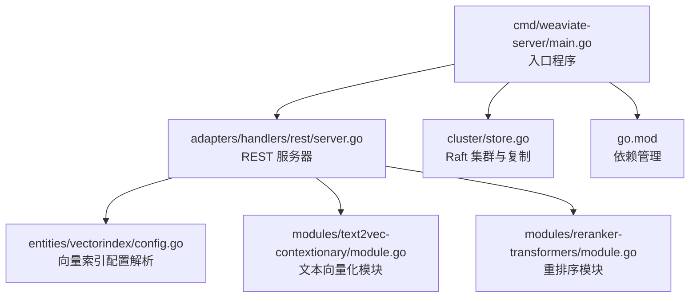
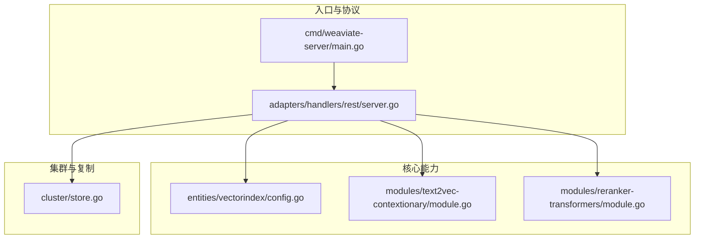
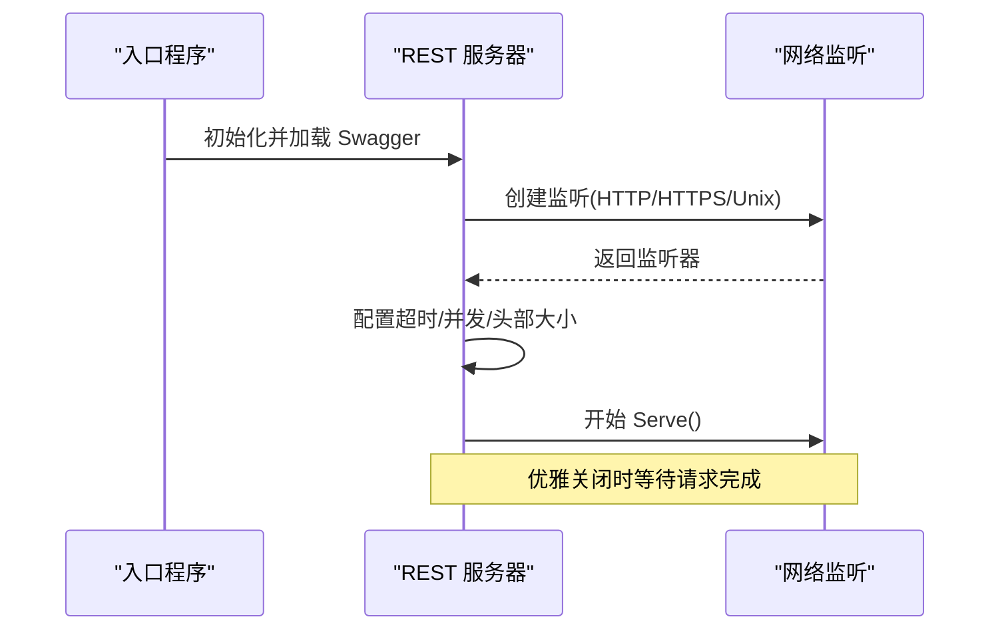
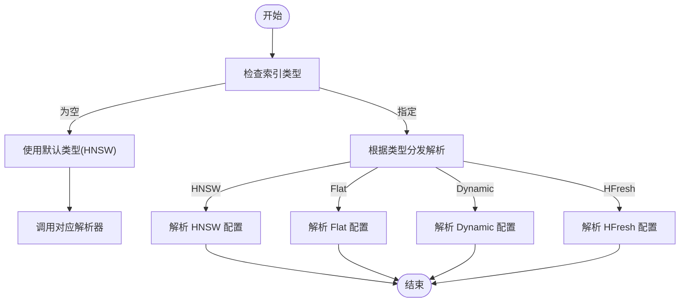
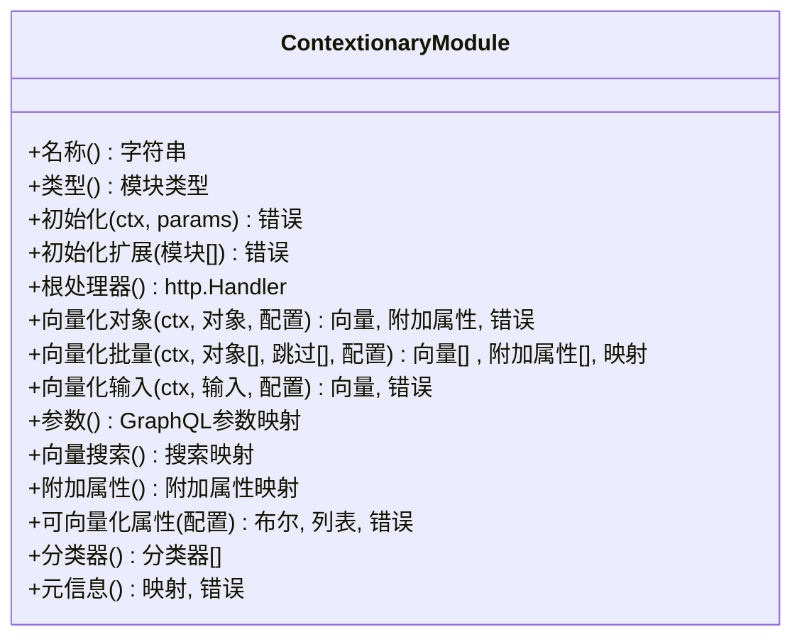
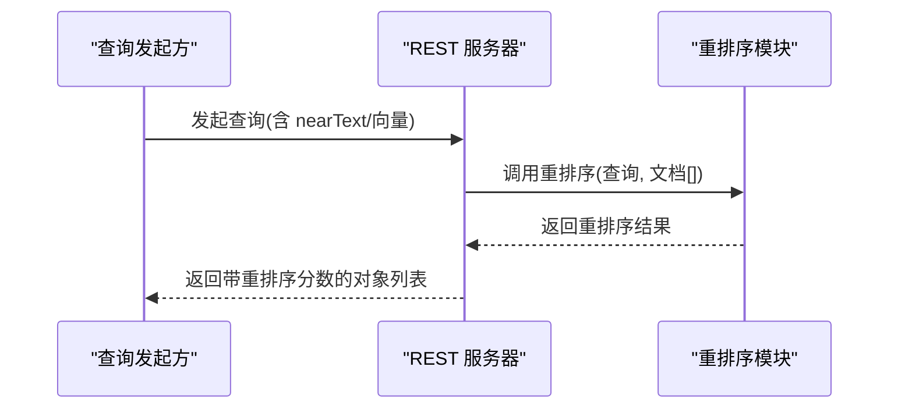
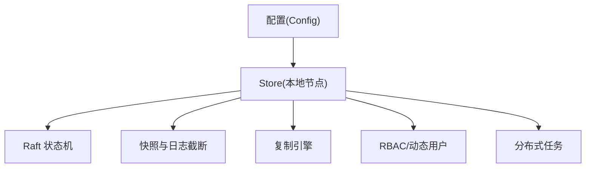
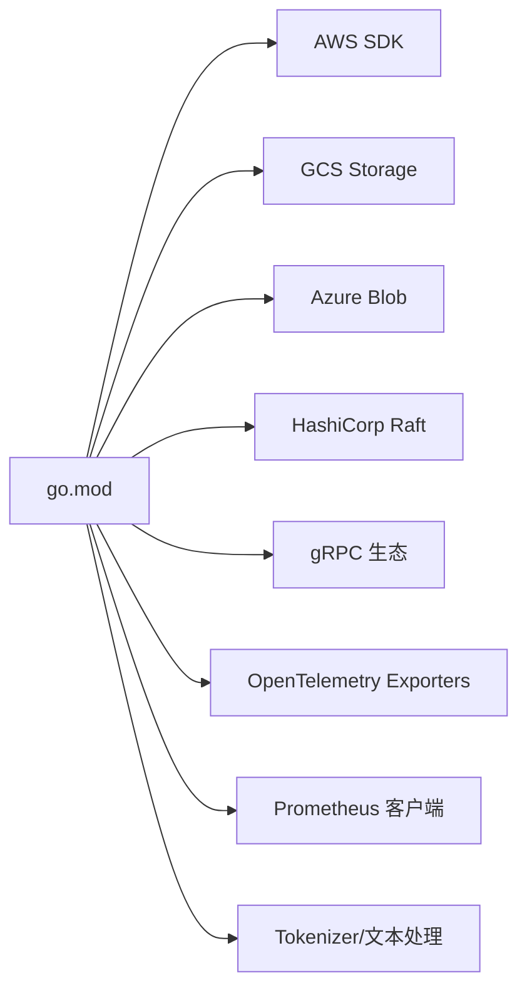

# 项目概述

<cite>
**本文引用的文件**   
- [README.md](file://README.md)
- [main.go](file://cmd/weaviate-server/main.go)
- [server.go](file://adapters/handlers/rest/server.go)
- [go.mod](file://go.mod)
- [config.go](file://entities/vectorindex/config.go)
- [module.go](file://modules/text2vec-contextionary/module.go)
- [module.go](file://modules/reranker-transformers/module.go)
- [store.go](file://cluster/store.go)
</cite>

## 目录
1. [引言](#引言)
2. [项目结构](#项目结构)
3. [核心组件](#核心组件)
4. [架构总览](#架构总览)
5. [详细组件分析](#详细组件分析)
6. [依赖关系分析](#依赖关系分析)
7. [性能考量](#性能考量)
8. [故障排查指南](#故障排查指南)
9. [结论](#结论)
10. [附录](#附录)

## 引言
Weaviate 是一个开源、云原生的向量数据库，专注于在对象与向量共存的基础上，提供大规模语义搜索能力，并将向量相似性搜索、关键词过滤（BM25）、检索增强生成（RAG）与重排序整合在同一查询接口中。其设计理念是“一次查询、多重能力”，既适合初学者快速上手，也为有经验的开发者提供了可扩展、可生产落地的基础设施。

Weaviate 的核心价值主张包括：
- 高性能搜索：毫秒级处理数十亿向量的复杂语义检索
- 灵活的向量化：支持集成模型（如 OpenAI、Cohere、HuggingFace 等）自动向量化，或导入自定义向量
- 高级混合与图像搜索：融合语义与 BM25 关键词搜索、高级过滤，统一 API 返回最优结果
- 集成 RAG 与重排序：内置生成式检索与重排序能力，直接驱动问答、聊天与摘要
- 生产就绪与可扩展：原生支持水平扩展、多租户、复制与细粒度 RBAC
- 成本效益：通过向量压缩等手段降低资源消耗与运营成本

## 项目结构
Weaviate 采用模块化与分层架构，入口程序负责加载 Swagger 规范并启动 REST 服务；适配层提供 REST/gRPC/GraphQL 多协议接入；核心实体与配置位于 entities；模块化能力通过 modules 目录扩展；集群与复制能力由 cluster 子系统实现；go.mod 统一管理第三方依赖。

**图表来源**
- [main.go](file://cmd/weaviate-server/main.go#L30-L66)
- [server.go](file://adapters/handlers/rest/server.go#L66-L70)
- [config.go](file://entities/vectorindex/config.go#L32-L51)
- [module.go](file://modules/text2vec-contextionary/module.go#L84-L90)
- [module.go](file://modules/reranker-transformers/module.go#L45-L51)
- [store.go](file://cluster/store.go#L191-L200)
- [go.mod](file://go.mod#L3-L106)

**章节来源**
- [main.go](file://cmd/weaviate-server/main.go#L30-L66)
- [server.go](file://adapters/handlers/rest/server.go#L66-L70)
- [go.mod](file://go.mod#L3-L106)

## 核心组件
- 服务器与协议适配：REST 服务器支持 HTTP/HTTPS/Unix Socket，具备优雅关闭、超时与并发限制等生产级特性
- 向量索引配置：支持 HNSW、Flat、Dynamic、HFresh 等索引类型，可按需选择
- 模块化能力：文本向量化与重排序模块通过统一接口注入，便于扩展与替换
- 集群与复制：基于 Raft 的分布式状态机，支持快照、日志截断、领导者选举与节点间复制

**章节来源**
- [server.go](file://adapters/handlers/rest/server.go#L80-L115)
- [config.go](file://entities/vectorindex/config.go#L24-L30)
- [module.go](file://modules/text2vec-contextionary/module.go#L84-L90)
- [module.go](file://modules/reranker-transformers/module.go#L45-L51)
- [store.go](file://cluster/store.go#L191-L200)

## 架构总览
Weaviate 的整体架构围绕“入口服务 + 多协议适配 + 模块化能力 + 分布式存储”展开。入口程序加载 Swagger 并初始化 REST 服务器；服务器根据配置启用不同监听方案；模块化子系统提供向量化与重排序等能力；集群子系统保障跨节点一致性与高可用。

**图表来源**
- [main.go](file://cmd/weaviate-server/main.go#L30-L66)
- [server.go](file://adapters/handlers/rest/server.go#L66-L70)
- [config.go](file://entities/vectorindex/config.go#L32-L51)
- [module.go](file://modules/text2vec-contextionary/module.go#L138-L154)
- [module.go](file://modules/reranker-transformers/module.go#L53-L61)
- [store.go](file://cluster/store.go#L191-L200)

## 详细组件分析

### REST 服务器与监听机制
- 支持 http/https/unix socket 三种监听方式，可分别设置读写超时、KeepAlive、最大头部大小与连接上限
- 通过 TLS 配置启用安全监听，支持证书链与双向认证
- 提供优雅关闭流程，等待在途请求完成后再释放资源

**图表来源**
- [main.go](file://cmd/weaviate-server/main.go#L30-L66)
- [server.go](file://adapters/handlers/rest/server.go#L164-L337)

**章节来源**
- [server.go](file://adapters/handlers/rest/server.go#L80-L115)
- [server.go](file://adapters/handlers/rest/server.go#L164-L337)

### 向量索引配置与类型选择
- 默认向量索引类型为 HNSW，亦支持 Flat、Dynamic、HFresh
- 解析输入配置并进行参数校验，确保与多向量场景兼容

**图表来源**
- [config.go](file://entities/vectorindex/config.go#L32-L51)

**章节来源**
- [config.go](file://entities/vectorindex/config.go#L24-L30)
- [config.go](file://entities/vectorindex/config.go#L32-L51)

### 文本向量化模块（text2vec-contextionary）
- 类型标识为 Text2Vec，提供对象与文本的向量化能力
- 支持 GraphQL 参数扩展、近邻搜索、附加属性与分类器
- 通过远程推理 API 获取向量，具备版本校验与启动等待机制

**图表来源**
- [module.go](file://modules/text2vec-contextionary/module.go#L84-L90)
- [module.go](file://modules/text2vec-contextionary/module.go#L138-L154)
- [module.go](file://modules/text2vec-contextionary/module.go#L203-L213)
- [module.go](file://modules/text2vec-contextionary/module.go#L215-L247)
- [module.go](file://modules/text2vec-contextionary/module.go#L249-L263)
- [module.go](file://modules/text2vec-contextionary/module.go#L265-L271)

**章节来源**
- [module.go](file://modules/text2vec-contextionary/module.go#L84-L90)
- [module.go](file://modules/text2vec-contextionary/module.go#L138-L154)
- [module.go](file://modules/text2vec-contextionary/module.go#L203-L213)

### 重排序模块（reranker-transformers）
- 类型标识为 Text2TextReranker，提供查询与候选文档的重排序能力
- 通过环境变量配置推理 API 地址，支持启动等待与元信息查询
- 将重排序结果作为附加属性返回，便于前端展示

**图表来源**
- [module.go](file://modules/reranker-transformers/module.go#L53-L61)
- [module.go](file://modules/reranker-transformers/module.go#L63-L87)
- [module.go](file://modules/reranker-transformers/module.go#L89-L95)

**章节来源**
- [module.go](file://modules/reranker-transformers/module.go#L45-L51)
- [module.go](file://modules/reranker-transformers/module.go#L53-L61)
- [module.go](file://modules/reranker-transformers/module.go#L63-L87)
- [module.go](file://modules/reranker-transformers/module.go#L89-L95)

### 集群与复制（Raft）
- Store 作为本地节点的 Raft 实现，负责启动、引导、快照与日志截断
- 支持节点间 RPC 通信、复制引擎、动态用户与 RBAC 控制
- 提供分布式任务管理与恢复策略，保障单节点恢复与一致性等待

**图表来源**
- [store.go](file://cluster/store.go#L68-L189)
- [store.go](file://cluster/store.go#L191-L200)

**章节来源**
- [store.go](file://cluster/store.go#L68-L189)
- [store.go](file://cluster/store.go#L191-L200)

## 依赖关系分析
- 第三方依赖集中在 go.mod 中，覆盖云存储（AWS/GCS/Azure）、Raft、gRPC、OpenTelemetry、Prometheus、Tokenizers 等
- 服务器与模块均通过标准库与第三方库协作，保证跨平台与可观测性

**图表来源**
- [go.mod](file://go.mod#L3-L106)

**章节来源**
- [go.mod](file://go.mod#L3-L106)

## 性能考量
- 向量索引类型选择：HNSW 适用于大规模高维向量的近似最近邻检索；Flat 适合小规模精确检索；Dynamic/HFresh 适配动态与多模态场景
- 监听与并发：合理设置读写超时、KeepAlive、监听上限，避免突发流量导致连接堆积
- TLS 优化：启用现代密码套件与协议，减少握手开销；证书链与双向认证在高安全场景下建议开启
- 模块启动等待：向量化与重排序模块支持启动等待，避免冷启动带来的首查询延迟
- 集群一致性：通过快照与日志截断减少磁盘压力；一致性等待时间影响写放大与读取延迟

## 故障排查指南
- 服务器启动失败：检查监听端口占用、证书路径与权限、环境变量配置
- TLS 认证错误：确认证书链完整、CA 证书正确、客户端证书匹配
- 模块初始化失败：核对推理 API 地址、网络连通性与版本要求
- 集群无法形成：检查节点发现、Raft 端口、快照与日志截断配置、一致性等待时间
- 查询性能异常：调整向量索引类型、并发与超时参数，评估数据规模与维度

## 结论
Weaviate 以“云原生 + 模块化 + 分布式”为核心，将向量相似性搜索、关键词过滤、RAG 与重排序无缝整合，既满足初学者的易用性需求，又为生产环境提供高性能、可扩展与成本可控的解决方案。通过合理的索引选择、监听配置与集群策略，可在不同业务场景中取得最佳平衡。

## 附录
- 官方文档与示例：参见 README 中的快速入门与功能说明
- 客户端与 API：支持 REST/gRPC/GraphQL，覆盖多语言生态
- 集成生态：与云厂商、数据平台、LLM/Agent 框架、监控与评估工具广泛集成