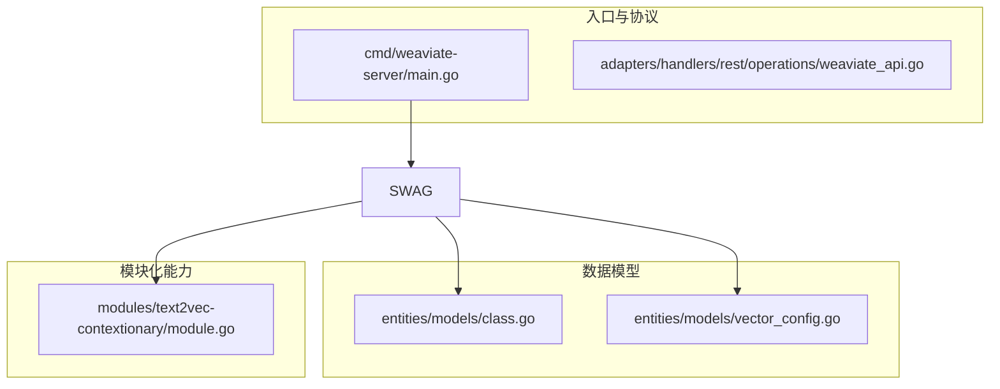
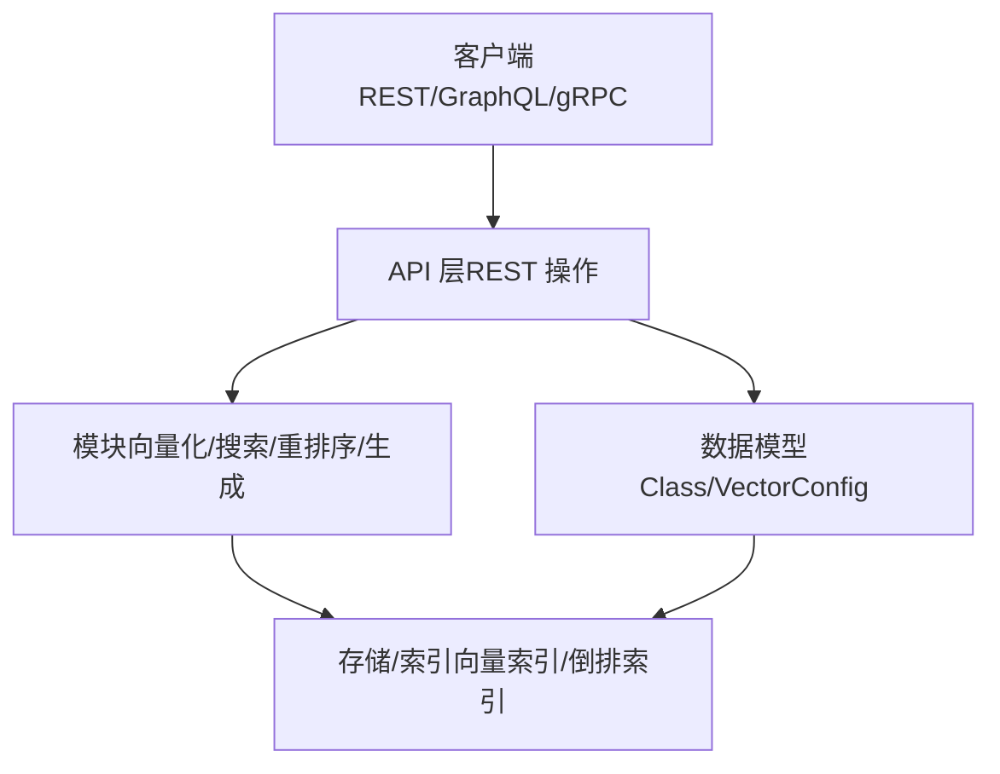
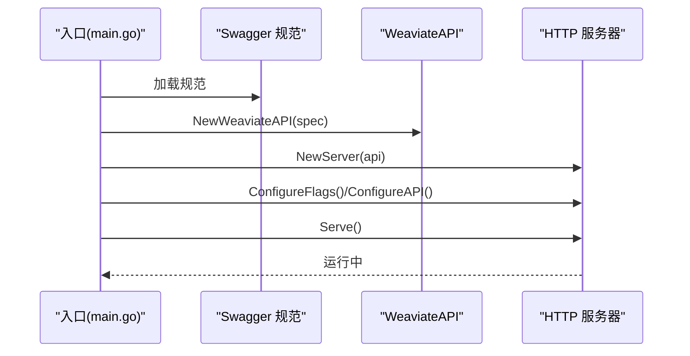
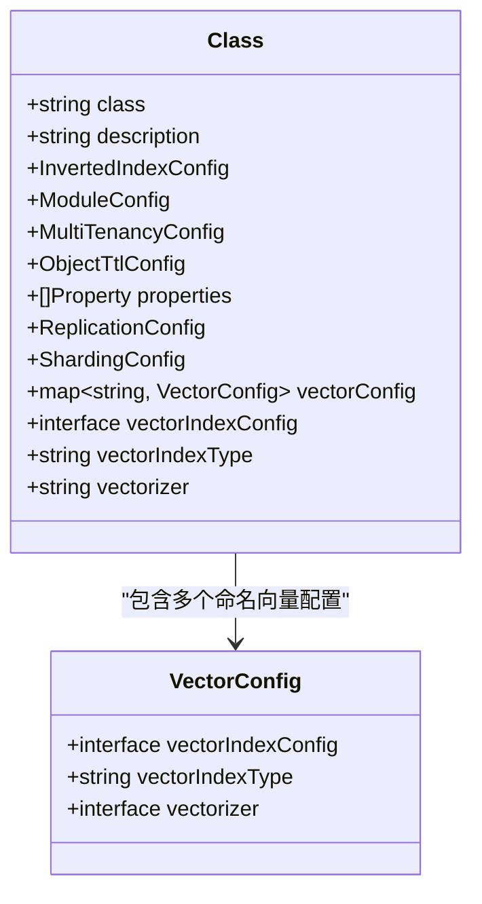
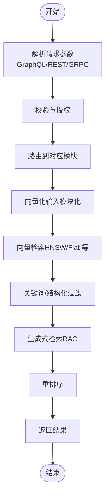
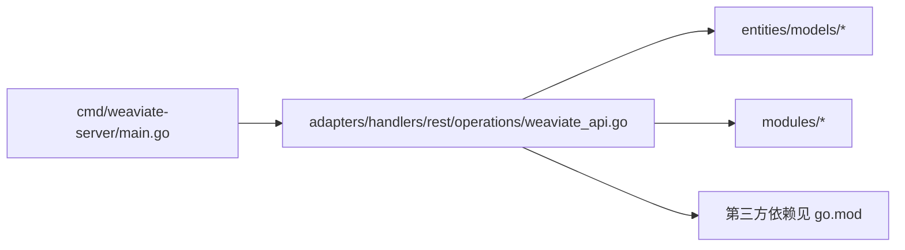

# 项目简介

<cite>
**本文引用的文件**
- [README.md](file://README.md)
- [main.go](file://cmd/weaviate-server/main.go)
- [go.mod](file://go.mod)
- [weaviate_api.go](file://adapters/handlers/rest/operations/weaviate_api.go)
- [class.go](file://entities/models/class.go)
- [vector_config.go](file://entities/models/vector_config.go)
- [module.go](file://modules/text2vec-contextionary/module.go)
</cite>

## 目录
1. [引言](#引言)
2. [项目结构](#项目结构)
3. [核心组件](#核心组件)
4. [架构总览](#架构总览)
5. [详细组件分析](#详细组件分析)
6. [依赖关系分析](#依赖关系分析)
7. [性能考量](#性能考量)
8. [故障排查指南](#故障排查指南)
9. [结论](#结论)
10. [附录](#附录)

## 引言
Weaviate 是一个开源、云原生的向量数据库，专注于在单个系统中融合“向量相似性搜索 + 关键词过滤 + 检索增强生成（RAG）+ 重排序”的能力，从而为大规模语义检索与生成式应用提供统一的查询接口与后端支撑。它支持灵活的向量化方式（内置模型或自定义向量），提供混合搜索、高级过滤、RAG 与重排序等能力，并针对生产环境提供多租户、复制、RBAC 授权与水平扩展等企业级特性。

Weaviate 的核心价值在于：
- 将“语义相似性”与“关键词/结构化过滤”无缝结合，一次调用即可获得高质量检索结果
- 内置 RAG 与重排序能力，降低二次开发与集成成本
- 以 Go 语言构建，强调高性能与高可靠性，适合高并发与海量向量场景
- 提供 REST、GraphQL、gRPC 多种 API，便于多语言客户端接入

**章节来源**
- file://README.md#L10-L12
- file://README.md#L112-L128

## 项目结构
仓库采用分层与模块化组织方式：
- cmd/weaviate-server：服务入口，负责加载 Swagger 规范并启动 REST 服务
- adapters/handlers/rest：REST 层，包含 OpenAPI 规范与各业务模块的路由处理器
- entities/models：数据模型与验证逻辑，用于请求/响应结构的定义与校验
- modules：模块化能力（如 text2vec-*、reranker-*、generative-* 等），按功能拆分
- cluster：Raft、复制、路由、分布式任务等集群与一致性相关组件
- usecases：领域用例层，封装查询、批处理、分类、备份等业务流程
- client：官方多语言客户端（Go、Python、TypeScript 等）
- go.mod：依赖管理与版本约束



**图表来源**
- [main.go](file://cmd/weaviate-server/main.go#L30-L66)
- [weaviate_api.go](file://adapters/handlers/rest/operations/weaviate_api.go#L52-L372)
- [class.go](file://entities/models/class.go#L29-L72)
- [vector_config.go](file://entities/models/vector_config.go#L26-L39)
- [module.go](file://modules/text2vec-contextionary/module.go#L46-L66)

**章节来源**
- file://cmd/weaviate-server/main.go#L30-L66
- file://adapters/handlers/rest/operations/weaviate_api.go#L52-L372
- file://entities/models/class.go#L29-L72
- file://entities/models/vector_config.go#L26-L39
- file://modules/text2vec-contextionary/module.go#L46-L66

## 核心组件
- 服务入口与协议栈
  - 通过 Swagger 规范加载 REST API，注册各模块处理器，启动 HTTP 服务
  - 支持基础认证、API Key、Bearer Token 等鉴权方式
- 数据模型与配置
  - Class 模型定义集合（集合名、描述、属性、倒排索引、复制/分片配置、向量配置等）
  - VectorConfig 支持为每个集合配置独立的向量索引类型与向量化器
- 模块化向量化
  - Contextionary 模块作为文本向量化示例，提供 GraphQL 参数、近似搜索、附加属性与分类器等能力
  - 可扩展至 OpenAI、HuggingFace、Cohere 等外部向量化器

**章节来源**
- file://adapters/handlers/rest/operations/weaviate_api.go#L366-L371
- file://entities/models/class.go#L29-L72
- file://entities/models/vector_config.go#L26-L39
- file://modules/text2vec-contextionary/module.go#L84-L90

## 架构总览
Weaviate 的整体架构围绕“统一查询接口 + 模块化能力 + 企业级特性”展开：
- 查询路径：客户端 → REST/GQL/GRPC → API 层 → 模块（向量化/搜索/重排序）→ 存储/索引
- 数据模型：Class/VectorConfig 定义集合与向量配置；支持多向量命名空间
- 模块化：向量化、生成、重排序、备份等能力以模块形式注入，便于替换与扩展
- 集群与扩展：复制、分片、分布式任务等能力保障生产可用性与可扩展性



**图表来源**
- [main.go](file://cmd/weaviate-server/main.go#L30-L66)
- [weaviate_api.go](file://adapters/handlers/rest/operations/weaviate_api.go#L52-L372)
- [class.go](file://entities/models/class.go#L29-L72)
- [vector_config.go](file://entities/models/vector_config.go#L26-L39)

## 详细组件分析

### 组件一：服务入口与 API 初始化
- 入口文件加载 Swagger 规范，创建 WeaviateAPI 实例，注册命令行参数组与处理器
- 启动 HTTP 服务器，暴露 REST 接口，并支持优雅关闭



**图表来源**
- [main.go](file://cmd/weaviate-server/main.go#L30-L66)
- [weaviate_api.go](file://adapters/handlers/rest/operations/weaviate_api.go#L52-L62)

**章节来源**
- file://cmd/weaviate-server/main.go#L30-L66
- file://adapters/handlers/rest/operations/weaviate_api.go#L52-L62

### 组件二：数据模型与集合配置
- Class 模型包含集合元数据、属性、倒排索引、复制/分片配置、向量配置等字段
- VectorConfig 支持为集合指定向量索引类型与向量化器，亦可启用多向量命名空间



**图表来源**
- [class.go](file://entities/models/class.go#L29-L72)
- [vector_config.go](file://entities/models/vector_config.go#L26-L39)

**章节来源**
- file://entities/models/class.go#L29-L72
- file://entities/models/vector_config.go#L26-L39

### 组件三：模块化向量化（以 Contextionary 为例）
- Contextionary 模块实现 Text2Vec 能力，提供：
  - 向量化对象/输入
  - GraphQL 参数（nearText 等）
  - 搜索器（向量检索）
  - 附加属性（最近邻、投影、语义路径、解释）
  - 分类器
- 通过远程客户端与上下文词典服务交互，支持版本校验与启动等待

```mermaid
classDiagram
class ContextionaryModule {
    +Name() string
    +Type() ModuleType
    +Init(ctx, params) error
    +InitExtension(mods) error
    +RootHandler() http.Handler
    +VectorizeObject(ctx, obj, cfg) []float32, AdditionalProperties, error
    +VectorizeBatch(ctx, objs, skip, cfg) [][]float32, []AdditionalProperties, map[int]error
    +VectorizeInput(ctx, input, cfg) []float32, error
    +Arguments() map[string]GraphQLArgument
    +VectorSearches() map[string]VectorForParams
    +AdditionalProperties() map[string]AdditionalProperty
    +VectorizableProperties(cfg) bool, []string, error
    +Classifiers() []Classifier
    +MetaInfo() map[string]interface{}, error
}
class RemoteClient {
    +WaitForStartupAndValidateVersion(ctx, version, interval) error
}
ContextionaryModule --> RemoteClient : "依赖"
```

**图表来源**
- [module.go](file://modules/text2vec-contextionary/module.go#L46-L66)
- [module.go](file://modules/text2vec-contextionary/module.go#L110-L113)
- [module.go](file://modules/text2vec-contextionary/module.go#L215-L247)

**章节来源**
- file://modules/text2vec-contextionary/module.go#L84-L90
- file://modules/text2vec-contextionary/module.go#L110-L113
- file://modules/text2vec-contextionary/module.go#L215-L247

### 组件四：查询流程（概念与示意）
以下流程图展示一次典型查询的端到端路径（概念性说明，不映射具体源码文件）：



[本图为概念流程，不附“图表来源”]

## 依赖关系分析
- 服务入口依赖 OpenAPI 加载与命令行解析库，启动 HTTP 服务
- API 层依赖各模块能力（向量化、搜索、附加属性、分类等）
- 数据模型依赖 OpenAPI 验证与序列化工具
- 模块通过远程客户端与外部服务交互（如上下文词典）



**图表来源**
- [main.go](file://cmd/weaviate-server/main.go#L16-L25)
- [weaviate_api.go](file://adapters/handlers/rest/operations/weaviate_api.go#L19-L48)
- [go.mod](file://go.mod#L3-L106)

**章节来源**
- file://go.mod#L3-L106

## 性能考量
- 向量索引与检索：支持 HNSW/Flat 等索引类型，结合倒排索引与关键词过滤，兼顾召回与效率
- 并发与吞吐：基于 Go 的高性能实现，适合高并发与大规模向量检索
- 压缩与成本：支持向量压缩与多向量编码，在保证检索质量的同时降低内存占用
- 扩展性：复制、分片与分布式任务等机制，满足生产级水平扩展需求

[本节为通用性能讨论，不附“章节来源”]

## 故障排查指南
- 启动失败
  - 检查 Swagger 规范加载与命令行参数
  - 查看日志输出与错误处理回调
- 认证与授权
  - 确认 BasicAuth/APIKey/Bearer Token 配置
  - 核对 APIAuthorizer 设置
- 模块初始化
  - 确认远程客户端可达与版本校验通过
  - 检查模块初始化扩展链路
- 数据模型校验
  - 根据 Class/VectorConfig 的验证逻辑检查配置项

**章节来源**
- file://adapters/handlers/rest/operations/weaviate_api.go#L366-L371
- file://modules/text2vec-contextionary/module.go#L110-L113

## 结论
Weaviate 通过“向量相似性 + 关键词过滤 + RAG + 重排序”的一体化设计，为现代 AI 应用提供了统一、高效且可扩展的检索与生成后端。其模块化架构与企业级特性使其既能满足快速原型开发，也能胜任生产级大规模部署。结合灵活的向量化策略与多 API 支持，Weaviate 能够覆盖从语义搜索、RAG 到推荐与内容分类等多种应用场景。

[本节为总结性内容，不附“章节来源”]

## 附录
- 快速开始与安装：参考 README 中的安装与入门指南
- 客户端与 API：支持 REST、GraphQL、gRPC，提供多语言客户端
- 功能清单：详见 README 的 Weaviate 功能部分

**章节来源**
- file://README.md#L19-L128