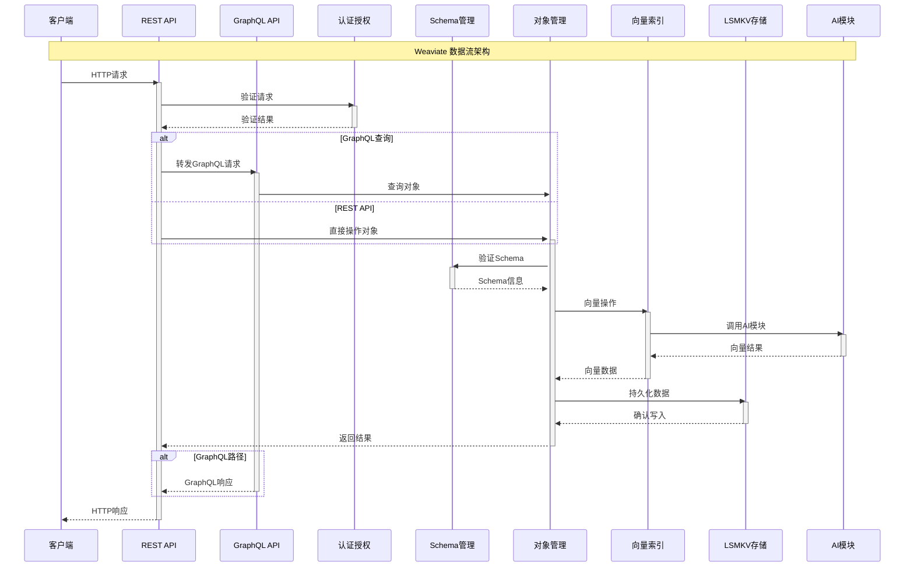

# Weaviate 数据流时序图

> 最后更新时间: 2026-05-07
> 更新说明: 初始版本 - 创建基础数据流时序图模板

## 系统架构概览

本文档维护 Weaviate 项目的核心数据流时序图,展示各组件之间的交互关系和数据流转过程。

## 时序图



## 组件说明

| 组件 | 别名 | 说明 |
|------|------|------|
| 客户端 | Client | 发起请求的应用或用户 |
| REST API | API | RESTful API 接口层 |
| GraphQL API | GraphQL | GraphQL 查询接口 |
| 认证授权 | Auth | RBAC 和身份验证 |
| Schema管理 | Schema | 数据模型和Schema验证 |
| 对象管理 | Objects | 核心对象CRUD操作 |
| 向量索引 | Vector | HNSW向量索引和搜索 |
| LSMKV存储 | Storage | 底层键值存储引擎 |
| AI模块 | Modules | text2vec、reranker等AI模块 |

## 主要数据流

### 1. 数据写入流程
1. 客户端通过 REST/GraphQL API 发送数据
2. 认证层验证请求权限
3. Schema层验证数据结构
4. AI模块生成向量(如配置)
5. 向量索引存储向量数据
6. LSMKV存储持久化对象数据

### 2. 数据查询流程
1. 客户端发起查询请求
2. 认证层验证访问权限
3. 根据查询类型路由到相应处理器
4. 向量索引执行相似度搜索(如需要)
5. LSMKV存储检索对象数据
6. 组装结果并返回

### 3. Schema管理流程
1. 定义或更新Class Schema
2. 验证Schema合法性
3. 同步到集群节点(Raft共识)
4. 更新本地缓存
5. 应用到存储层

## 更新历史

| 日期 | 更新内容 | 操作人 |
|------|----------|--------|
| 2026-05-07 | 初始版本 - 创建基础数据流时序图模板 | AI Assistant |

## 使用说明

### 如何更新此时序图

使用 `sequence-diagram-maintainer` 技能来更新此时序图:

1. **添加新组件**: 提供新组件名称和交互关系
2. **修改现有流程**: 描述需要调整的交互步骤
3. **添加详细子流程**: 指定要展开的具体环节

### 示例更新请求

```
在时序图中添加 Raft 共识层:
- Schema管理 -> Raft共识: 同步Schema变更
- Raft共识 -> 其他节点: 广播变更
- 其他节点 -> Raft共识: 确认接收
- Raft共识 -> Schema管理: 达成共识
```

## 相关文档

- [Weaviate 架构文档](../docs/readme.md)
- [API 文档](https://weaviate.io/developers/weaviate/api/rest)
- [Mermaid 时序图语法](https://mermaid.js.org/syntax/sequenceDiagram.html)

## 注意事项

1. 此时序图展示的是高层抽象,具体实现细节参考源代码
2. 不同部署模式(单机/集群)可能有额外的组件交互
3. AI模块的使用是可选的,取决于Class配置
4. 实际数据流可能包含更多错误处理和重试逻辑
